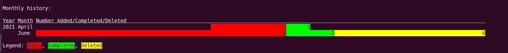
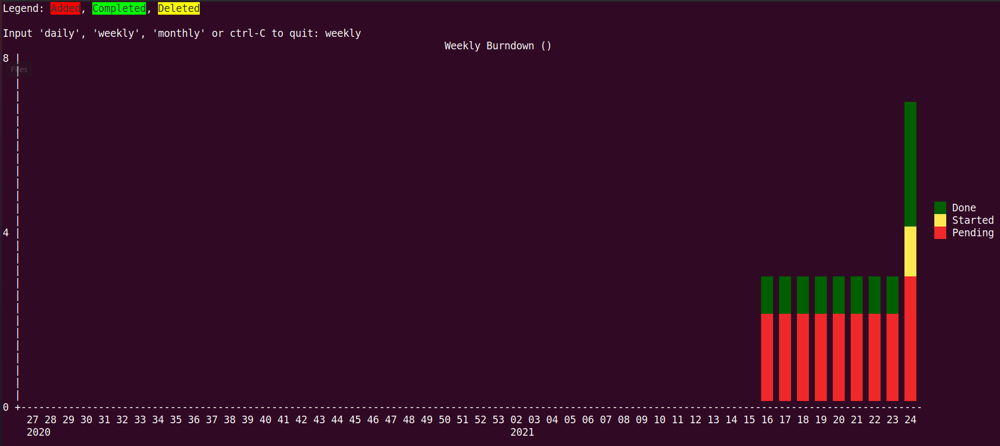

# Task management

* Tools menu

```bash
$  make -f Makefile-tools


 Choose a command run:

task                                     Check task installed in $PATH and its version/help, install if missing
task-add                                 Add task with type and description
task-reports                             Report your task - daily, weekily, monthly, and timesheet format
```

* Install `task` tool

```bash

$  make -f Makefile-tools task

```

<details><summary><b>Show output</b></summary><br>

```
Usage: task                                                   Runs rc.default.command, if specified.
       task <filter> active                                   Active tasks
       task          add <mods>                               Adds a new task
       task <filter> all                                      All tasks
       task <filter> annotate <mods>                          Adds an annotation to an existing task
       task <filter> append <mods>                            Appends text to an existing task description
       task <filter> blocked                                  Blocked tasks
       task <filter> blocking                                 Blocking tasks
       task <filter> burndown.daily                           Shows a graphical burndown chart, by day
       task <filter> burndown.monthly                         Shows a graphical burndown chart, by month
       task <filter> burndown.weekly                          Shows a graphical burndown chart, by week
       task          calc <expression>                        Calculator
       task          calendar [due|<month> <year>|<year>] [y] Shows a calendar, with due tasks marked
       task          colors [sample | legend]                 All colors, a sample, or a legend
       task          columns [substring]                      All supported columns and formatting styles
       task          commands                                 Generates a list of all commands, with behavior details
       task <filter> completed                                Completed tasks
       task          config [name [value | '']]               Change settings in the task configuration
       task          context [<name> | <subcommand>]          Set and define contexts (default filters)
       task <filter> count                                    Counts matching tasks
       task <filter> delete <mods>                            Deletes the specified task
       task <filter> denotate <pattern>                       Deletes an annotation
       task          diagnostics                              Platform, build and environment details
       task <filter> done <mods>                              Marks the specified task as completed
       task <filter> duplicate <mods>                         Duplicates the specified tasks
       task <filter> edit                                     Launches an editor to modify a task directly
       task          execute <external command>               Executes external commands and scripts
       task <filter> export                                   Exports tasks in JSON format
       task <filter> ghistory.annual                          Shows a graphical report of task history, by year
       task <filter> ghistory.monthly                         Shows a graphical report of task history, by month
       task          help ['usage']                           Displays this usage help text
       task <filter> history.annual                           Shows a report of task history, by year
       task <filter> history.monthly                          Shows a report of task history, by month
       task <filter> ids                                      Shows the IDs of matching tasks, as a range
       task          import [<file> ...]                      Imports JSON files
       task <filter> information                              Shows all data and metadata
       task <filter> list                                     Most details of tasks
       task          log <mods>                               Adds a new task that is already completed
       task          logo                                     Displays the Taskwarrior logo
       task <filter> long                                     All details of tasks
       task <filter> ls                                       Few details of tasks
       task <filter> minimal                                  Minimal details of tasks
       task <filter> modify <mods>                            Modifies the existing task with provided arguments.
       task <filter> newest                                   Newest tasks
       task <filter> next                                     Most urgent tasks
       task <filter> oldest                                   Oldest tasks
       task <filter> overdue                                  Overdue tasks
       task <filter> prepend <mods>                           Prepends text to an existing task description
       task <filter> projects                                 Shows all project names used
       task <filter> ready                                    Most urgent actionable tasks
       task <filter> recurring                                Recurring Tasks
       task          reports                                  Lists all supported reports
       task          show [all | substring]                   Shows all configuration variables or subset
       task <filter> start <mods>                             Marks specified task as started
       task <filter> stats                                    Shows task database statistics
       task <filter> stop <mods>                              Removes the 'start' time from a task
       task <filter> summary                                  Shows a report of task status by project
       task          synchronize [initialize]                 Synchronizes data with the Taskserver
       task <filter> tags                                     Shows a list of all tags used
       task          timesheet [weeks]                        Weekly summary of completed and started tasks
       task          udas                                     Shows all the defined UDA details
       task <filter> unblocked                                Unblocked tasks
       task          undo                                     Reverts the most recent change to a task
       task <filter> uuids                                    Shows the UUIDs of matching tasks, as a comma-separated list
       task          version                                  Shows the Taskwarrior version number
       task <filter> waiting                                  Waiting (hidden) tasks
       task          _aliases                                 Generates a list of all aliases, for autocompletion purposes
       task          _columns                                 Displays only a list of supported columns
       task          _commands                                Generates a list of all commands, for autocompletion purposes
       task          _config                                  Lists all supported configuration variables, for completion purposes
       task          _context                                 Lists all supported contexts, for completion purposes
       task          _get <DOM> [<DOM> ...]                   DOM Accessor
       task <filter> _ids                                     Shows the IDs of matching tasks, in the form of a list
       task <filter> _projects                                Shows only a list of all project names used
       task          _show                                    Shows all configuration settings in a machine-readable format
       task <filter> _tags                                    Shows only a list of all tags used, for autocompletion purposes
       task          _udas                                    Shows the defined UDAs for completion purposes
       task <filter> _unique <attribute>                      Generates lists of unique attribute values
       task <filter> _urgency                                 Displays the urgency measure of a task
       task <filter> _uuids                                   Shows the UUIDs of matching tasks, as a list
       task          _version                                 Shows only the Taskwarrior version number
       task          _zshattributes                           Generates a list of all attributes, for zsh autocompletion purposes
       task          _zshcommands                             Generates a list of all commands, for zsh autocompletion purposes
       task <filter> _zshids                                  Shows the IDs and descriptions of matching tasks
       task <filter> _zshuuids                                Shows the UUIDs and descriptions of matching tasks
       burndown                                               Aliased to 'burndown.weekly'
       ghistory                                               Aliased to 'ghistory.monthly'
       history                                                Aliased to 'history.monthly'
       rm                                                     Aliased to 'delete'
       shell                                                  Aliased to 'exec tasksh'

Documentation for Taskwarrior can be found using 'man task', 'man taskrc', 'man task-color', 'man task-sync' or at http://taskwarrior.org

The general form of commands is:
  task [<filter>] <command> [<mods>]

The <filter> consists of zero or more restrictions on which tasks to select, such as:
  task                                      <command> <mods>
  task 28                                   <command> <mods>
  task +weekend                             <command> <mods>
  task project:Home due.before:today        <command> <mods>
  task ebeeab00-ccf8-464b-8b58-f7f2d606edfb <command> <mods>

By default, filter elements are combined with an implicit 'and' operator, but 'or' and 'xor' may also be used, provided parentheses are included:
  task '(/[Cc]at|[Dd]og/ or /[0-9]+/)'      <command> <mods>

A filter may target specific tasks using ID or UUID numbers.  To specify multiple tasks use one of these forms:
  task 1,2,3                                    delete
  task 1-3                                      info
  task 1,2-5,19                                 modify pri:H
  task 4-7 ebeeab00-ccf8-464b-8b58-f7f2d606edfb info

The <mods> consist of zero or more changes to apply to the selected tasks, such as:
  task <filter> <command> project:Home
  task <filter> <command> +weekend +garden due:tomorrow
  task <filter> <command> Description/annotation text
  task <filter> <command> /from/to/     <- replace first match
  task <filter> <command> /from/to/g    <- replace all matches

Tags are arbitrary words, any quantity:
  +tag       The + means add the tag
  -tag       The - means remove the tag

Built-in attributes are:
  description:    Task description text
  status:         Status of task - pending, completed, deleted, waiting
  project:        Project name
  priority:       Priority
  due:            Due date
  recur:          Recurrence frequency
  until:          Expiration date of a task
  limit:          Desired number of rows in report, or 'page'
  wait:           Date until task becomes pending
  entry:          Date task was created
  end:            Date task was completed/deleted
  start:          Date task was started
  scheduled:      Date task is scheduled to start
  modified:       Date task was last modified
  depends:        Other tasks that this task depends upon

Attribute modifiers make filters more precise.  Supported modifiers are:

  Modifiers         Example            Equivalent           Meaning
  ----------------  -----------------  -------------------  -------------------------
                    due:today          due = today          Fuzzy match
  not               due.not:today      due != today         Fuzzy non-match
  before, below     due.before:today   due < tomorrow       Exact date comparison
  after, above      due.after:today    due > tomorrow       Exact date comparison
  none              project.none:      project == ''        Empty
  any               project.any:       project !== ''       Not empty
  is, equals        project.is:x       project == x         Exact match
  isnt              project.isnt:x     project !== x        Exact non-match
  has, contains     desc.has:Hello     desc ~ Hello         Pattern match
  hasnt,            desc.hasnt:Hello   desc !~ Hello        Pattern non-match
  startswith, left  desc.left:Hel      desc ~ '^Hel'        Beginning match
  endswith, right   desc.right:llo     desc ~ 'llo$'        End match
  word              desc.word:Hello    desc ~ '\bHello\b'   Boundaried word match
  noword            desc.noword:Hello  desc !~ '\bHello\b'  Boundaried word non-match

Alternately algebraic expressions support:
  and  or  xor            Logical operators
  <  <=  =  !=  >=  >     Relational operators
  (  )                    Precedence

  task due.before:eom priority.not:L   list
  task '(due < eom or priority != L)'  list

The default .taskrc file can be overridden with:
  task ... rc:<alternate file> ...
  task ... rc:~/.alt_taskrc ...

The values in .taskrc (or alternate) can be overridden with:
  task ... rc.<name>=<value> ...
  task rc.color=off list

Any command or attribute name may be abbreviated if still unique:
  task list project:Home
  task li       pro:Home

Some task descriptions need to be escaped because of the shell:
  task add "quoted ' quote"
  task add escaped \' quote

The argument -- tells Taskwarrior to treat all other args as description, even if they would otherwise be attributes or tags:
  task add -- project:Home needs scheduling

Many characters have special meaning to the shell, including:
  $ ! ' " ( ) ; \ ` * ? { } [ ] < > | & % # ~

```

</details><br>

* Usages and examples

```bash
# Add task
$  make -f Makefile-tools task-add

1) project
2) task
3) tool
4) learn
Input your category to add task in or cltr-C to quit: 4
Input description to add new task into category learn: Build a Web App GUI
Created task 3.
[task next ( learn )]

ID Active Age Description                        Urg
 1 48min  2h  learn:Nodejs - Build a RESTful API    4
 3        -   learn:Build a Web App GUI             0

2 tasks

# Edit task
$  task 3 edit
Launching 'editor "task.ceeb7eaa.task"' now...
Editing complete.
Edits were detected.
Description modified.

$  export EDITOR=vim
$  task 3 edit
Launching 'vim "task.ceeb7eaa.task"' now...
Editing complete.
No edits were detected.

# Add task
$  make -f Makefile-tools task-add

1) project
2) task
3) tool
4) learn
Input your category to add task in or cltr-C to quit: 4
Input description to add new task into category learn: Nodejs - Build a CLI
Created task 4.
[task next ( learn )]

ID Active Age  Description                        Urg
 1 50min  2h   learn:Nodejs - Build a RESTful API    4
 3        2min learn:Nodejs - Build a Web App GUI    0
 4        -    learn:Nodejs - Build a CLI            0

3 tasks

# Show task category "learn"
$  task learn
[task next ( learn )]

ID Active Age  Description                        Urg
 1 50min  2h   learn:Nodejs - Build a RESTful API    4
 3        2min learn:Nodejs - Build a Web App GUI    0
 4        8s   learn:Nodejs - Build a CLI            0

3 tasks

# Edit task
$  task 1 edit
Launching 'vim "task.286dd9ef.task"' now...
Editing complete.
Edits were detected.
Description modified.

# Show task category "learn"
$  task learn
[task next ( learn )]

ID Active Age  Description                                                                                                                           Urg
 1 52min  2h   learn:Nodejs - Build a RESTful API [github repo](https://github.com/JackySo-24x7classroom/projects-staging/tree/main/pirple-projects)    4
 3        3min learn:Nodejs - Build a Web App GUI                                                                                                       0
 4        1min learn:Nodejs - Build a CLI                                                                                                               0

3 tasks

# Report task
$  make -f Makefile-tools task-reports

Timesheet:

2021-06-06 - 2021-06-12
  Completed (2 tasks)
    Project Due Description
                task:Add TIL github repo - https://github.com/JackySo-24x7classroom/today-i-learn
                tool:Add gitui https://github.com/JackySo-24x7classroom/useful-resources/blob/main/devops/makefile/Makefile-tools
                  2021-06-07 2

  Started (1 tasks)
    Project Due Description
                learn:Nodejs - Build a RESTful API [github repo](https://github.com/JackySo-24x7classroom/projects-staging/tree/main/pirple-projects)


Monthly history:
```

```bash
  Net Fix Rate:         -
  Estimated completion: No convergence
 jso  ubunu2004  ~  myob-work  …  useful-resources  devops  makefile  main  2✎  ?  $  task
[task next]

ID Active Age  Description                                                                                                                           Urg
 1 53min  2h   learn:Nodejs - Build a RESTful API [github repo](https://github.com/JackySo-24x7classroom/projects-staging/tree/main/pirple-projects)    4
 2        2h   project:Document Bankfeeds                                                                                                               0
 3        5min learn:Nodejs - Build a Web App GUI                                                                                                       0
 4        3min learn:Nodejs - Build a CLI                                                                                                               0

4 tasks
 jso  ubunu2004  ~  myob-work  …  useful-resources  devops  makefile  main  2✎  ?  $  task history

Year Month   Added Completed Deleted Net
2021 April       3         1       0   2
     June       10         2       6   2
     Average     6         1       3   2

```





```bash
  Net Fix Rate:         -
  Estimated completion: No convergence

# Show active task
$  task
[task next]

ID Active Age  Description                                                                                                                           Urg
 1 53min  2h   learn:Nodejs - Build a RESTful API [github repo](https://github.com/JackySo-24x7classroom/projects-staging/tree/main/pirple-projects)    4
 2        2h   project:Document Bankfeeds                                                                                                               0
 3        5min learn:Nodejs - Build a Web App GUI                                                                                                       0
 4        3min learn:Nodejs - Build a CLI                                                                                                               0

4 tasks

# Show task history
$  task history

Year Month   Added Completed Deleted Net
2021 April       3         1       0   2
     June       10         2       6   2
     Average     6         1       3   2

# Show all tasks including deleted
$  task all

ID St UUID     A Age   Done  P Due        Description                                                                                                                 
 4 P  c8adb3f0   25min                    learn:Nodejs - Build a CLI
 3 P  ceeb7eaa   27min                    learn:Nodejs - Build a Web App GUI                                                                                          
 - D  3a23021f   1h    1h                 tool:Sample tool for testing
 - D  04dc9d8a   1h    1h                 learn:Sample learning                                                                                                       
 - D  c3e68e18   1h    1h                 :Sample project
 - D  4f441f2a   1h    1h                 task:Sample task                                                                                                            
 2 P  00c4546d   2h                       project:Document Bankfeeds
 1 P  286dd9ef * 2h                       learn:Nodejs - Build a RESTful API [github                                                                                  
                                          repo](https://github.com/JackySo-24x7classroom/projects-staging/tree/main/pirple-projects)                                  
 - C  af9937da   2h    1h                 tool:Add gitui https://github.com/JackySo-24x7classroom/useful-resources/blob/main/devops/makefile/Makefile-tools
                                            2021-06-07 2
 - C  3d15e76b   2h    59min              task:Add TIL github repo - https://github.com/JackySo-24x7classroom/today-i-learn                                           
 - D  ff3ae385   7w    2h      2021-04-14 Add TIL - https://github.com/JackySo-24x7classroom/today-i-learn
 - D  99a5e4b5   7w    2h    H            Complete CDK tutorial                                                                                                       
 - C  1441efdb   7w    7w                 Add tools

13 tasks
```

