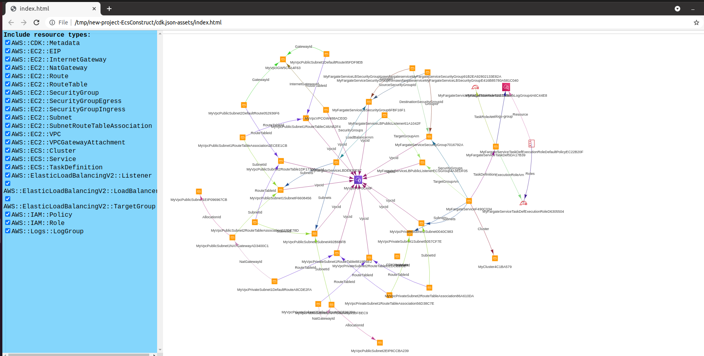
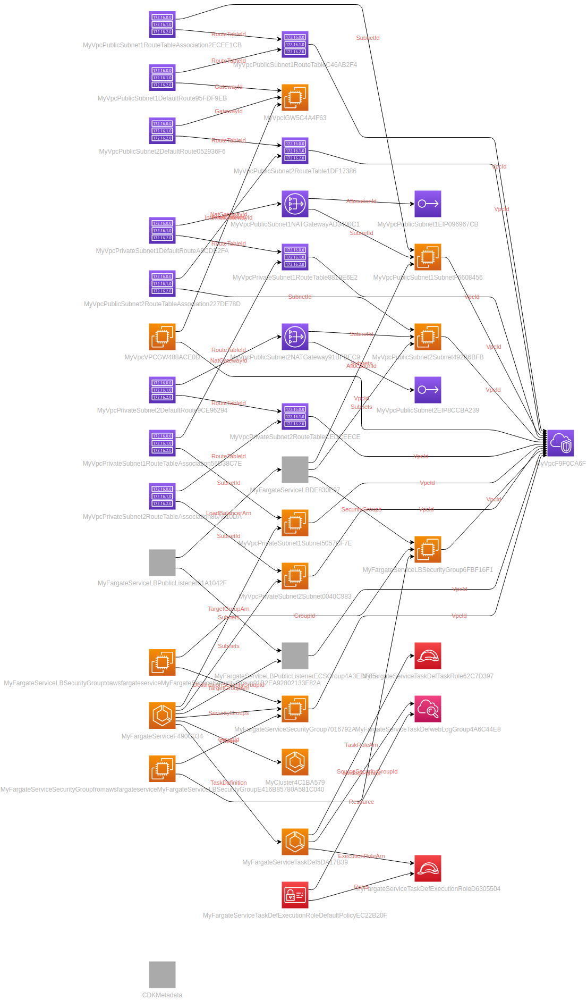

# Devops journey - AWS ECS study

`Table of Content`

<!-- vim-markdown-toc GFM -->

- [Knowledge section](#knowledge-section)
- [CDK section](#cdk-section)

<!-- vim-markdown-toc -->

## Knowledge section

`ECS tasks vs services`

> A Task Definition is a collection of 1 or more container configurations. Some Tasks may need only one container, while other Tasks may need 2 or more potentially linked containers running concurrently. The Task definition allows you to specify which Docker image to use, which ports to expose, how much CPU and memory to allot, how to collect logs, and define environment variables.

<details><summary><i>Click to a task example of webserver</i></summary><br>

```json
{
   "containerDefinitions": [
      {
         "command": [
            "/bin/sh -c \"echo '<html> <head> <title>Amazon ECS Sample App</title> <style>body {margin-top: 40px; background-color: #333;} </style> </head><body> <div style=color:white;text-align:center> <h1>Amazon ECS Sample App</h1> <h2>Congratulations!</h2> <p>Your application is now running on a container in Amazon ECS.</p> </div></body></html>' >  /usr/local/apache2/htdocs/index.html && httpd-foreground\""
         ],
         "entryPoint": [
            "sh",
            "-c"
         ],
         "essential": true,
         "image": "httpd:2.4",
         "logConfiguration": {
            "logDriver": "awslogs",
            "options": {
               "awslogs-group" : "/ecs/fargate-task-definition",
               "awslogs-region": "us-east-1",
               "awslogs-stream-prefix": "ecs"
            }
         },
         "name": "sample-fargate-app",
         "portMappings": [
            {
               "containerPort": 80,
               "hostPort": 80,
               "protocol": "tcp"
            }
         ]
      }
   ],
   "cpu": "256",
   "executionRoleArn": "arn:aws:iam::012345678910:role/ecsTaskExecutionRole",
   "family": "fargate-task-definition",
   "memory": "512",
   "networkMode": "awsvpc",
   "requiresCompatibilities": [
       "FARGATE"
    ]
}
```

</details><br>

> A Task is created when you run a Task directly, which launches container(s) (defined in the task definition) until they are stopped or exit on their own, at which point they are not replaced automatically. Running Tasks directly is ideal for short running jobs, perhaps as an example things that were accomplished via CRON.

* `AWSCLI`

<pre>
aws ecs register-task-definition --cli-input-json file://$HOME/tasks/fargate-task.json

aws ecs list-task-definitions
</pre>

> A Service is used to guarantee that you always have some number of Tasks running at all times. If a Task's container exits due to error, or the underlying EC2 instance fails and is replaced, the ECS Service will replace the failed Task. This is why we create Clusters so that the Service has plenty of resources in terms of CPU, Memory and Network ports to use. To us it doesn't really matter which instance Tasks run on so long as they run. A Service configuration references a Task definition. A Service is responsible for creating Tasks.

> Services are typically used for long running applications like web servers. For example, if I deployed my website powered by Node.JS in Oregon (us-west-2) I would want say at least three Tasks running across the three Availability Zones (AZ) for the sake of High-Availability; if one fails I have another two and the failed one will be replaced (read that as self-healing!). Creating a Service is the way to do this. If I had 6 EC2 instances in my cluster, 2 per AZ, the Service will automatically balance Tasks across zones as best it can while also considering cpu, memory, and network resources.

* `AWSCLI`

	<pre>
	# Create service
	aws ecs create-service --cluster fargate-cluster --service-name fargate-service --task-definition sample-fargate:1 --desired-count 1 --launch-type "FARGATE" --network-configuration "awsvpcConfiguration={subnets=[subnet-abcd1234],securityGroups=[sg-abcd1234]}"
	# List service
	aws ecs list-services --cluster fargate-cluster
	# Describe service
	aws ecs describe-services --cluster fargate-cluster --services fargate-service
	# Delete service 
	aws ecs delete-service --cluster fargate-cluster --service fargate-service --force
	# Delete Fargate cluster
	aws ecs delete-cluster --cluster fargate-cluster
	</pre>

`Note` - Another very important point is that a Service can be configured to use a load balancer, so that as it creates the Tasks—that is it launches containers defined in the Task Defintion—the Service will automatically register the container's EC2 instance with the load balancer. Tasks cannot be configured to use a load balancer, only Services can.

## CDK section

> Use CDK to manage ECS cluster

* Python CDK

1. Initialize AWS CDK in new project

```bash
$ mkdir new-project-EcsConstruct
$ cd new-project-EcsConstruct

$  cdk init --language python
Applying project template app for python

# Welcome to your CDK Python project!

This is a blank project for Python development with CDK.

The `cdk.json` file tells the CDK Toolkit how to execute your app.

This project is set up like a standard Python project.  The initialization
process also creates a virtualenv within this project, stored under the .env
directory.  To create the virtualenv it assumes that there is a `python3`
(or `python` for Windows) executable in your path with access to the `venv`
package. If for any reason the automatic creation of the virtualenv fails,
you can create the virtualenv manually.

To add additional dependencies, for example other CDK libraries, just add
them to your `setup.py` file and rerun the `pip install -r requirements.txt`
command.

## Useful commands

 * `cdk ls`          list all stacks in the app
 * `cdk synth`       emits the synthesized CloudFormation template
 * `cdk deploy`      deploy this stack to your default AWS account/region
 * `cdk diff`        compare deployed stack with current state
 * `cdk docs`        open CDK documentation

Enjoy!

Initializing a new git repository...
Please run 'python3 -m venv .env'!
Executing Creating virtualenv...
✅ All done!
***************************************************
*** Newer version of CDK is available [1.109.0] ***
*** Upgrade recommended                         ***
***************************************************

$  python3 -m venv .env
$  source .env/bin/activate
 .env  $  tree .
.
├── app.py
├── cdk.json
├── cdk.out
├── new_project_ecs_construct
│   ├── __init__.py
│   └── new_project_ecs_construct_stack.py
├── README.md
├── requirements.txt
├── setup.py
└── source.bat

2 directories, 8 files

 .env  $  pip install -r requirements.txt
Obtaining file:///tmp/new-project-EcsConstruct (from -r requirements.txt (line 1))
Collecting aws-cdk.core==1.63.0
  Using cached aws_cdk.core-1.63.0-py3-none-any.whl (1.1 MB)
Collecting aws-cdk.cx-api==1.63.0
  Using cached aws_cdk.cx_api-1.63.0-py3-none-any.whl (119 kB)
Collecting publication>=0.0.3
  Using cached publication-0.0.3-py2.py3-none-any.whl (7.7 kB)
Collecting jsii<2.0.0,>=1.11.0
  Downloading jsii-1.30.0-py3-none-any.whl (286 kB)
     |████████████████████████████████| 286 kB 1.8 MB/s
Collecting aws-cdk.cloud-assembly-schema==1.63.0
  Using cached aws_cdk.cloud_assembly_schema-1.63.0-py3-none-any.whl (116 kB)
Collecting constructs<4.0.0,>=3.0.4
  Downloading constructs-3.3.84-py3-none-any.whl (67 kB)
     |████████████████████████████████| 67 kB 2.5 MB/s
Collecting typing-extensions~=3.7
  Using cached typing_extensions-3.10.0.0-py3-none-any.whl (26 kB)
Collecting cattrs~=1.5.0; python_version >= "3.7"
  Downloading cattrs-1.5.0-py3-none-any.whl (19 kB)
Collecting attrs~=20.1
  Using cached attrs-20.3.0-py2.py3-none-any.whl (49 kB)
Collecting python-dateutil
  Using cached python_dateutil-2.8.1-py2.py3-none-any.whl (227 kB)
Collecting six>=1.5
  Using cached six-1.16.0-py2.py3-none-any.whl (11 kB)
Installing collected packages: publication, typing-extensions, attrs, cattrs, six, python-dateutil, jsii, aws-cdk.cloud-assembly-schema, aws-cdk.cx-api, constructs, aws-cdk.core, new-project-ecs-construct
  Running setup.py develop for new-project-ecs-construct
Successfully installed attrs-20.3.0 aws-cdk.cloud-assembly-schema-1.63.0 aws-cdk.core-1.63.0 aws-cdk.cx-api-1.63.0 cattrs-1.5.0 constructs-3.3.84 jsii-1.30.0 new-project-ecs-construct publication-0.0.3 python-dateutil-2.8.1 six-1.16.0 typing-extensions-3.10.0.0

 .env  $ cdk ls
new-project-ecs-construct

 .env  $  cdk diff
Stack new-project-ecs-construct
Conditions
[+] Condition CDKMetadataAvailable: {"Fn::Or":[{"Fn::Or":[{"Fn::Equals":[{"Ref":"AWS::Region"},"ap-east-1"]},{"Fn::Equals":[{"Ref":"AWS::Region"},"ap-northeast-1"]},{"Fn::Equals":[{"Ref":"AWS::Region"},"ap-northeast-2"]},{"Fn::Equals":[{"Ref":"AWS::Region"},"ap-south-1"]},{"Fn::Equals":[{"Ref":"AWS::Region"},"ap-southeast-1"]},{"Fn::Equals":[{"Ref":"AWS::Region"},"ap-southeast-2"]},{"Fn::Equals":[{"Ref":"AWS::Region"},"ca-central-1"]},{"Fn::Equals":[{"Ref":"AWS::Region"},"cn-north-1"]},{"Fn::Equals":[{"Ref":"AWS::Region"},"cn-northwest-1"]},{"Fn::Equals":[{"Ref":"AWS::Region"},"eu-central-1"]}]},{"Fn::Or":[{"Fn::Equals":[{"Ref":"AWS::Region"},"eu-north-1"]},{"Fn::Equals":[{"Ref":"AWS::Region"},"eu-west-1"]},{"Fn::Equals":[{"Ref":"AWS::Region"},"eu-west-2"]},{"Fn::Equals":[{"Ref":"AWS::Region"},"eu-west-3"]},{"Fn::Equals":[{"Ref":"AWS::Region"},"me-south-1"]},{"Fn::Equals":[{"Ref":"AWS::Region"},"sa-east-1"]},{"Fn::Equals":[{"Ref":"AWS::Region"},"us-east-1"]},{"Fn::Equals":[{"Ref":"AWS::Region"},"us-east-2"]},{"Fn::Equals":[{"Ref":"AWS::Region"},"us-west-1"]},{"Fn::Equals":[{"Ref":"AWS::Region"},"us-west-2"]}]}]}

```

2. Run and create empty stack

```bash
$  cdk synth
Resources:
  CDKMetadata:
    Type: AWS::CDK::Metadata
    Properties:
      Modules: aws-cdk=1.63.0,@aws-cdk/cloud-assembly-schema=1.63.0,@aws-cdk/core=1.63.0,@aws-cdk/cx-api=1.63.0,jsii-runtime=Python/3.8.5
    Condition: CDKMetadataAvailable
Conditions:
  CDKMetadataAvailable:
    Fn::Or:
      - Fn::Or:
          - Fn::Equals:
              - Ref: AWS::Region
              - ap-east-1
          - Fn::Equals:
              - Ref: AWS::Region
              - ap-northeast-1
          - Fn::Equals:
              - Ref: AWS::Region
              - ap-northeast-2
          - Fn::Equals:
              - Ref: AWS::Region
              - ap-south-1
          - Fn::Equals:
              - Ref: AWS::Region
              - ap-southeast-1
          - Fn::Equals:
              - Ref: AWS::Region
              - ap-southeast-2
          - Fn::Equals:
              - Ref: AWS::Region
              - ca-central-1
          - Fn::Equals:
              - Ref: AWS::Region
              - cn-north-1
          - Fn::Equals:
              - Ref: AWS::Region
              - cn-northwest-1
          - Fn::Equals:
              - Ref: AWS::Region
              - eu-central-1
      - Fn::Or:
          - Fn::Equals:
              - Ref: AWS::Region
              - eu-north-1
          - Fn::Equals:
              - Ref: AWS::Region
              - eu-west-1
          - Fn::Equals:
              - Ref: AWS::Region
              - eu-west-2
          - Fn::Equals:
              - Ref: AWS::Region
              - eu-west-3
          - Fn::Equals:
              - Ref: AWS::Region
              - me-south-1
          - Fn::Equals:
              - Ref: AWS::Region
              - sa-east-1
          - Fn::Equals:
              - Ref: AWS::Region
              - us-east-1
          - Fn::Equals:
              - Ref: AWS::Region
              - us-east-2
          - Fn::Equals:
              - Ref: AWS::Region
              - us-west-1
          - Fn::Equals:
              - Ref: AWS::Region
              - us-west-2

```

3. Install construct library modules - EC2 and ECS

```bash
 .env  $  pip install aws_cdk.aws_ec2 aws_cdk.aws_ecs aws_cdk.aws_ecs_patterns
Collecting aws_cdk.aws_ec2
  Downloading aws_cdk.aws_ec2-1.109.0-py3-none-any.whl (1.0 MB)
     |████████████████████████████████| 1.0 MB 1.9 MB/s 
Collecting aws_cdk.aws_ecs
  Downloading aws_cdk.aws_ecs-1.109.0-py3-none-any.whl (528 kB)
     |████████████████████████████████| 528 kB 3.2 MB/s 
Collecting aws_cdk.aws_ecs_patterns
  Downloading aws_cdk.aws_ecs_patterns-1.109.0-py3-none-any.whl (191 kB)
     |████████████████████████████████| 191 kB 4.1 MB/s 
Collecting aws-cdk.aws-iam==1.109.0
  Downloading aws_cdk.aws_iam-1.109.0-py3-none-any.whl (266 kB)
     |████████████████████████████████| 266 kB 5.3 MB/s 
Collecting aws-cdk.core==1.109.0
  Downloading aws_cdk.core-1.109.0-py3-none-any.whl (943 kB)
     |████████████████████████████████| 943 kB 4.7 MB/s 
Collecting aws-cdk.aws-s3-assets==1.109.0
  Downloading aws_cdk.aws_s3_assets-1.109.0-py3-none-any.whl (37 kB)
Collecting aws-cdk.aws-s3==1.109.0
  Downloading aws_cdk.aws_s3-1.109.0-py3-none-any.whl (270 kB)
     |████████████████████████████████| 270 kB 4.4 MB/s 
Collecting aws-cdk.cloud-assembly-schema==1.109.0
  Downloading aws_cdk.cloud_assembly_schema-1.109.0-py3-none-any.whl (129 kB)
     |████████████████████████████████| 129 kB 2.5 MB/s 
Collecting aws-cdk.aws-cloudwatch==1.109.0
  Downloading aws_cdk.aws_cloudwatch-1.109.0-py3-none-any.whl (204 kB)
     |████████████████████████████████| 204 kB 3.5 MB/s 
Collecting aws-cdk.aws-logs==1.109.0
  Downloading aws_cdk.aws_logs-1.109.0-py3-none-any.whl (118 kB)
     |████████████████████████████████| 118 kB 4.9 MB/s 
Collecting aws-cdk.aws-ssm==1.109.0
  Downloading aws_cdk.aws_ssm-1.109.0-py3-none-any.whl (134 kB)
     |████████████████████████████████| 134 kB 5.9 MB/s 
Requirement already satisfied: constructs<4.0.0,>=3.3.69 in ./.env/lib/python3.8/site-packages (from aws_cdk.aws_ec2) (3.3.84)
Collecting aws-cdk.cx-api==1.109.0
  Downloading aws_cdk.cx_api-1.109.0-py3-none-any.whl (131 kB)
     |████████████████████████████████| 131 kB 3.0 MB/s 
Requirement already satisfied: publication>=0.0.3 in ./.env/lib/python3.8/site-packages (from aws_cdk.aws_ec2) (0.0.3)
Requirement already satisfied: jsii<2.0.0,>=1.30.0 in ./.env/lib/python3.8/site-packages (from aws_cdk.aws_ec2) (1.30.0)
Collecting aws-cdk.region-info==1.109.0
  Downloading aws_cdk.region_info-1.109.0-py3-none-any.whl (61 kB)
     |████████████████████████████████| 61 kB 106 kB/s 
Collecting aws-cdk.aws-kms==1.109.0
  Downloading aws_cdk.aws_kms-1.109.0-py3-none-any.whl (80 kB)
     |████████████████████████████████| 80 kB 3.0 MB/s 
Collecting aws-cdk.aws-certificatemanager==1.109.0
  Downloading aws_cdk.aws_certificatemanager-1.109.0-py3-none-any.whl (245 kB)
     |████████████████████████████████| 245 kB 11.3 MB/s 
Collecting aws-cdk.aws-autoscaling-hooktargets==1.109.0
  Downloading aws_cdk.aws_autoscaling_hooktargets-1.109.0-py3-none-any.whl (22 kB)
Collecting aws-cdk.aws-lambda==1.109.0
  Downloading aws_cdk.aws_lambda-1.109.0-py3-none-any.whl (352 kB)
     |████████████████████████████████| 352 kB 6.7 MB/s 
Collecting aws-cdk.aws-elasticloadbalancing==1.109.0
  Downloading aws_cdk.aws_elasticloadbalancing-1.109.0-py3-none-any.whl (68 kB)
     |████████████████████████████████| 68 kB 4.7 MB/s 
Collecting aws-cdk.aws-secretsmanager==1.109.0
  Downloading aws_cdk.aws_secretsmanager-1.109.0-py3-none-any.whl (118 kB)
     |████████████████████████████████| 118 kB 5.3 MB/s 
Collecting aws-cdk.aws-autoscaling==1.109.0
  Downloading aws_cdk.aws_autoscaling-1.109.0-py3-none-any.whl (254 kB)
     |████████████████████████████████| 254 kB 3.0 MB/s 
Collecting aws-cdk.aws-elasticloadbalancingv2==1.109.0
  Downloading aws_cdk.aws_elasticloadbalancingv2-1.109.0-py3-none-any.whl (337 kB)
     |████████████████████████████████| 337 kB 3.2 MB/s 
Collecting aws-cdk.aws-applicationautoscaling==1.109.0
  Downloading aws_cdk.aws_applicationautoscaling-1.109.0-py3-none-any.whl (111 kB)
     |████████████████████████████████| 111 kB 2.2 MB/s 
Collecting aws-cdk.aws-sns==1.109.0
  Downloading aws_cdk.aws_sns-1.109.0-py3-none-any.whl (82 kB)
     |████████████████████████████████| 82 kB 2.9 MB/s 
Collecting aws-cdk.aws-route53==1.109.0
  Downloading aws_cdk.aws_route53-1.109.0-py3-none-any.whl (141 kB)
     |████████████████████████████████| 141 kB 2.9 MB/s 
Collecting aws-cdk.aws-sqs==1.109.0
  Downloading aws_cdk.aws_sqs-1.109.0-py3-none-any.whl (72 kB)
     |████████████████████████████████| 72 kB 1.6 MB/s 
Collecting aws-cdk.aws-ecr-assets==1.109.0
  Downloading aws_cdk.aws_ecr_assets-1.109.0-py3-none-any.whl (52 kB)
     |████████████████████████████████| 52 kB 1.4 MB/s 
Collecting aws-cdk.aws-ecr==1.109.0
  Downloading aws_cdk.aws_ecr-1.109.0-py3-none-any.whl (78 kB)
     |████████████████████████████████| 78 kB 2.9 MB/s 
Collecting aws-cdk.aws-route53-targets==1.109.0
  Downloading aws_cdk.aws_route53_targets-1.109.0-py3-none-any.whl (34 kB)
Collecting aws-cdk.aws-servicediscovery==1.109.0
  Downloading aws_cdk.aws_servicediscovery-1.109.0-py3-none-any.whl (88 kB)
     |████████████████████████████████| 88 kB 3.1 MB/s 
Collecting aws-cdk.aws-events==1.109.0
  Downloading aws_cdk.aws_events-1.109.0-py3-none-any.whl (144 kB)
     |████████████████████████████████| 144 kB 3.5 MB/s 
Collecting aws-cdk.aws-events-targets==1.109.0
  Downloading aws_cdk.aws_events_targets-1.109.0-py3-none-any.whl (95 kB)
     |████████████████████████████████| 95 kB 2.7 MB/s 
Collecting aws-cdk.assets==1.109.0
  Downloading aws_cdk.assets-1.109.0-py3-none-any.whl (22 kB)
Requirement already satisfied: python-dateutil in ./.env/lib/python3.8/site-packages (from jsii<2.0.0,>=1.30.0->aws_cdk.aws_ec2) (2.8.1)
Requirement already satisfied: typing-extensions~=3.7 in ./.env/lib/python3.8/site-packages (from jsii<2.0.0,>=1.30.0->aws_cdk.aws_ec2) (3.10.0.0)
Requirement already satisfied: cattrs~=1.5.0; python_version >= "3.7" in ./.env/lib/python3.8/site-packages (from jsii<2.0.0,>=1.30.0->aws_cdk.aws_ec2) (1.5.0)
Requirement already satisfied: attrs~=20.1 in ./.env/lib/python3.8/site-packages (from jsii<2.0.0,>=1.30.0->aws_cdk.aws_ec2) (20.3.0)
Collecting aws-cdk.aws-sns-subscriptions==1.109.0
  Downloading aws_cdk.aws_sns_subscriptions-1.109.0-py3-none-any.whl (30 kB)
Collecting aws-cdk.aws-efs==1.109.0
  Downloading aws_cdk.aws_efs-1.109.0-py3-none-any.whl (80 kB)
     |████████████████████████████████| 80 kB 2.9 MB/s 
Collecting aws-cdk.aws-signer==1.109.0
  Downloading aws_cdk.aws_signer-1.109.0-py3-none-any.whl (40 kB)
     |████████████████████████████████| 40 kB 3.7 MB/s 
Collecting aws-cdk.aws-codeguruprofiler==1.109.0
  Downloading aws_cdk.aws_codeguruprofiler-1.109.0-py3-none-any.whl (36 kB)
Collecting aws-cdk.aws-sam==1.109.0
  Downloading aws_cdk.aws_sam-1.109.0-py3-none-any.whl (145 kB)
     |████████████████████████████████| 145 kB 3.7 MB/s 
Collecting aws-cdk.aws-autoscaling-common==1.109.0
  Downloading aws_cdk.aws_autoscaling_common-1.109.0-py3-none-any.whl (30 kB)
Collecting aws-cdk.aws-codestarnotifications==1.109.0
  Downloading aws_cdk.aws_codestarnotifications-1.109.0-py3-none-any.whl (41 kB)
     |████████████████████████████████| 41 kB 87 kB/s 
Collecting aws-cdk.custom-resources==1.109.0
  Downloading aws_cdk.custom_resources-1.109.0-py3-none-any.whl (108 kB)
     |████████████████████████████████| 108 kB 3.2 MB/s 
Collecting aws-cdk.aws-apigateway==1.109.0
  Downloading aws_cdk.aws_apigateway-1.109.0-py3-none-any.whl (531 kB)
     |████████████████████████████████| 531 kB 2.6 MB/s 
Collecting aws-cdk.aws-cognito==1.109.0
  Downloading aws_cdk.aws_cognito-1.109.0-py3-none-any.whl (304 kB)
     |████████████████████████████████| 304 kB 4.6 MB/s 
Collecting aws-cdk.aws-globalaccelerator==1.109.0
  Downloading aws_cdk.aws_globalaccelerator-1.109.0-py3-none-any.whl (77 kB)
     |████████████████████████████████| 77 kB 3.5 MB/s 
Collecting aws-cdk.aws-cloudfront==1.109.0
  Downloading aws_cdk.aws_cloudfront-1.109.0-py3-none-any.whl (315 kB)
     |████████████████████████████████| 315 kB 3.9 MB/s 
Collecting aws-cdk.aws-kinesisfirehose==1.109.0
  Downloading aws_cdk.aws_kinesisfirehose-1.109.0-py3-none-any.whl (89 kB)
     |████████████████████████████████| 89 kB 5.4 MB/s 
Collecting aws-cdk.aws-codebuild==1.109.0
  Downloading aws_cdk.aws_codebuild-1.109.0-py3-none-any.whl (387 kB)
     |████████████████████████████████| 387 kB 3.9 MB/s 
Collecting aws-cdk.aws-codepipeline==1.109.0
  Downloading aws_cdk.aws_codepipeline-1.109.0-py3-none-any.whl (168 kB)
     |████████████████████████████████| 168 kB 3.4 MB/s 
Collecting aws-cdk.aws-kinesis==1.109.0
  Downloading aws_cdk.aws_kinesis-1.109.0-py3-none-any.whl (70 kB)
     |████████████████████████████████| 70 kB 2.4 MB/s 
Collecting aws-cdk.aws-stepfunctions==1.109.0
  Downloading aws_cdk.aws_stepfunctions-1.109.0-py3-none-any.whl (221 kB)
     |████████████████████████████████| 221 kB 3.8 MB/s 
Requirement already satisfied: six>=1.5 in ./.env/lib/python3.8/site-packages (from python-dateutil->jsii<2.0.0,>=1.30.0->aws_cdk.aws_ec2) (1.16.0)
Collecting aws-cdk.aws-cloudformation==1.109.0
  Downloading aws_cdk.aws_cloudformation-1.109.0-py3-none-any.whl (82 kB)
     |████████████████████████████████| 82 kB 882 kB/s 
Collecting aws-cdk.aws-codecommit==1.109.0
  Downloading aws_cdk.aws_codecommit-1.109.0-py3-none-any.whl (53 kB)
     |████████████████████████████████| 53 kB 100 kB/s 
ERROR: new-project-ecs-construct 0.0.1 has requirement aws-cdk.core==1.63.0, but you'll have aws-cdk-core 1.109.0 which is incompatible.
Installing collected packages: aws-cdk.cloud-assembly-schema, aws-cdk.cx-api, aws-cdk.region-info, aws-cdk.core, aws-cdk.aws-iam, aws-cdk.aws-events, aws-cdk.aws-kms, aws-cdk.aws-s3, aws-cdk.assets, aws-cdk.aws-s3-assets, aws-cdk.aws-cloudwatch, aws-cdk.aws-logs, aws-cdk.aws-ssm, aws-cdk.aws-ec2, aws-cdk.aws-efs, aws-cdk.aws-autoscaling-common, aws-cdk.aws-applicationautoscaling, aws-cdk.aws-signer, aws-cdk.aws-sqs, aws-cdk.aws-codeguruprofiler, aws-cdk.aws-ecr, aws-cdk.aws-ecr-assets, aws-cdk.aws-lambda, aws-cdk.aws-codestarnotifications, aws-cdk.aws-sns, aws-cdk.aws-cloudformation, aws-cdk.custom-resources, aws-cdk.aws-route53, aws-cdk.aws-certificatemanager, aws-cdk.aws-sns-subscriptions, aws-cdk.aws-elasticloadbalancing, aws-cdk.aws-elasticloadbalancingv2, aws-cdk.aws-autoscaling, aws-cdk.aws-autoscaling-hooktargets, aws-cdk.aws-sam, aws-cdk.aws-secretsmanager, aws-cdk.aws-cognito, aws-cdk.aws-apigateway, aws-cdk.aws-globalaccelerator, aws-cdk.aws-cloudfront, aws-cdk.aws-route53-targets, aws-cdk.aws-servicediscovery, aws-cdk.aws-ecs, aws-cdk.aws-kinesisfirehose, aws-cdk.aws-codecommit, aws-cdk.aws-codebuild, aws-cdk.aws-codepipeline, aws-cdk.aws-kinesis, aws-cdk.aws-stepfunctions, aws-cdk.aws-events-targets, aws-cdk.aws-ecs-patterns
  Attempting uninstall: aws-cdk.cloud-assembly-schema
    Found existing installation: aws-cdk.cloud-assembly-schema 1.63.0
    Uninstalling aws-cdk.cloud-assembly-schema-1.63.0:
      Successfully uninstalled aws-cdk.cloud-assembly-schema-1.63.0
  Attempting uninstall: aws-cdk.cx-api
    Found existing installation: aws-cdk.cx-api 1.63.0
    Uninstalling aws-cdk.cx-api-1.63.0:
      Successfully uninstalled aws-cdk.cx-api-1.63.0
  Attempting uninstall: aws-cdk.core
    Found existing installation: aws-cdk.core 1.63.0
    Uninstalling aws-cdk.core-1.63.0:
      Successfully uninstalled aws-cdk.core-1.63.0
Successfully installed aws-cdk.assets-1.109.0 aws-cdk.aws-apigateway-1.109.0 aws-cdk.aws-applicationautoscaling-1.109.0 aws-cdk.aws-autoscaling-1.109.0 aws-cdk.aws-autoscaling-common-1.109.0 aws-cdk.aws-autoscaling-hooktargets-1.109.0 aws-cdk.aws-certificatemanager-1.109.0 aws-cdk.aws-cloudformation-1.109.0 aws-cdk.aws-cloudfront-1.109.0 aws-cdk.aws-cloudwatch-1.109.0 aws-cdk.aws-codebuild-1.109.0 aws-cdk.aws-codecommit-1.109.0 aws-cdk.aws-codeguruprofiler-1.109.0 aws-cdk.aws-codepipeline-1.109.0 aws-cdk.aws-codestarnotifications-1.109.0 aws-cdk.aws-cognito-1.109.0 aws-cdk.aws-ec2-1.109.0 aws-cdk.aws-ecr-1.109.0 aws-cdk.aws-ecr-assets-1.109.0 aws-cdk.aws-ecs-1.109.0 aws-cdk.aws-ecs-patterns-1.109.0 aws-cdk.aws-efs-1.109.0 aws-cdk.aws-elasticloadbalancing-1.109.0 aws-cdk.aws-elasticloadbalancingv2-1.109.0 aws-cdk.aws-events-1.109.0 aws-cdk.aws-events-targets-1.109.0 aws-cdk.aws-globalaccelerator-1.109.0 aws-cdk.aws-iam-1.109.0 aws-cdk.aws-kinesis-1.109.0 aws-cdk.aws-kinesisfirehose-1.109.0 aws-cdk.aws-kms-1.109.0 aws-cdk.aws-lambda-1.109.0 aws-cdk.aws-logs-1.109.0 aws-cdk.aws-route53-1.109.0 aws-cdk.aws-route53-targets-1.109.0 aws-cdk.aws-s3-1.109.0 aws-cdk.aws-s3-assets-1.109.0 aws-cdk.aws-sam-1.109.0 aws-cdk.aws-secretsmanager-1.109.0 aws-cdk.aws-servicediscovery-1.109.0 aws-cdk.aws-signer-1.109.0 aws-cdk.aws-sns-1.109.0 aws-cdk.aws-sns-subscriptions-1.109.0 aws-cdk.aws-sqs-1.109.0 aws-cdk.aws-ssm-1.109.0 aws-cdk.aws-stepfunctions-1.109.0 aws-cdk.cloud-assembly-schema-1.109.0 aws-cdk.core-1.109.0 aws-cdk.custom-resources-1.109.0 aws-cdk.cx-api-1.109.0 aws-cdk.region-info-1.109.0
```

4. Create `Fargate` service

* new-project-EcsConstruct/ecs_construct_stack.py

```python
from aws_cdk import (core, aws_ec2 as ec2, aws_ecs as ecs,
                     aws_ecs_patterns as ecs_patterns)

vpc = ec2.Vpc(self, "MyVpc", max_azs=3)     # default is all AZs in region

cluster = ecs.Cluster(self, "MyCluster", vpc=vpc)

ecs_patterns.ApplicationLoadBalancedFargateService(self, "MyFargateService",
    cluster=cluster,            # Required
    cpu=512,                    # Default is 256
    desired_count=6,            # Default is 1
    task_image_options=ecs_patterns.ApplicationLoadBalancedTaskImageOptions(
         image=ecs.ContainerImage.from_registry("amazon/amazon-ecs-sample")),
    memory_limit_mib=2048,      # Default is 512
    public_load_balancer=True)  # Default is False
```

4. Create stack clouformation

```bash
$  cdk synth
This CDK CLI is not compatible with the CDK library used by your application. Please upgrade the CLI to the latest version.
(Cloud assembly schema version mismatch: Maximum schema version supported is 5.0.0, but found 12.0.0)

 .env  $  npm install -g aws-cdk@latest

added 180 packages, and audited 181 packages in 7s

found 0 vulnerabilities

```

> Do again in new CDK project and put new construct into app.py

```bash
$  mkdir newer-project-EcsConstruct
$  cd newer-project-EcsConstruct/
$  cdk init --language python
Applying project template app for python

# Welcome to your CDK Python project!

This is a blank project for Python development with CDK.

The `cdk.json` file tells the CDK Toolkit how to execute your app.

This project is set up like a standard Python project.  The initialization
process also creates a virtualenv within this project, stored under the `.venv`
directory.  To create the virtualenv it assumes that there is a `python3`
(or `python` for Windows) executable in your path with access to the `venv`
package. If for any reason the automatic creation of the virtualenv fails,
you can create the virtualenv manually.

To add additional dependencies, for example other CDK libraries, just add
them to your `setup.py` file and rerun the `pip install -r requirements.txt`
command.

## Useful commands

 * `cdk ls`          list all stacks in the app
 * `cdk synth`       emits the synthesized CloudFormation template
 * `cdk deploy`      deploy this stack to your default AWS account/region
 * `cdk diff`        compare deployed stack with current state
 * `cdk docs`        open CDK documentation

Enjoy!

Initializing a new git repository...
Please run 'python3 -m venv .venv'!
Executing Creating virtualenv...
✅ All done!

$  python3 -m venv .env
$  source .env/bin/activate
 .env  $  tree .
.
├── app.py
├── cdk.json
├── README.md
├── requirements.txt
├── setup.py
└── source.bat

1 directory, 8 files

 .env  $  pip install aws_cdk.aws_ec2 aws_cdk.aws_ecs aws_cdk.aws_ecs_patterns
Collecting aws_cdk.aws_ec2
  Using cached aws_cdk.aws_ec2-1.109.0-py3-none-any.whl (1.0 MB)
Collecting aws_cdk.aws_ecs
  Using cached aws_cdk.aws_ecs-1.109.0-py3-none-any.whl (528 kB)
Collecting aws_cdk.aws_ecs_patterns
  Using cached aws_cdk.aws_ecs_patterns-1.109.0-py3-none-any.whl (191 kB)
Requirement already satisfied: aws-cdk.cloud-assembly-schema==1.109.0 in ./.env/lib/python3.8/site-packages (from aws_cdk.aws_ec2) (1.109.0)
Collecting aws-cdk.aws-ssm==1.109.0
  Using cached aws_cdk.aws_ssm-1.109.0-py3-none-any.whl (134 kB)
Requirement already satisfied: aws-cdk.core==1.109.0 in ./.env/lib/python3.8/site-packages (from aws_cdk.aws_ec2) (1.109.0)
Requirement already satisfied: aws-cdk.cx-api==1.109.0 in ./.env/lib/python3.8/site-packages (from aws_cdk.aws_ec2) (1.109.0)
Requirement already satisfied: constructs<4.0.0,>=3.3.69 in ./.env/lib/python3.8/site-packages (from aws_cdk.aws_ec2) (3.3.84)
Collecting aws-cdk.aws-cloudwatch==1.109.0
  Using cached aws_cdk.aws_cloudwatch-1.109.0-py3-none-any.whl (204 kB)
Requirement already satisfied: jsii<2.0.0,>=1.30.0 in ./.env/lib/python3.8/site-packages (from aws_cdk.aws_ec2) (1.30.0)
Collecting aws-cdk.aws-logs==1.109.0
  Using cached aws_cdk.aws_logs-1.109.0-py3-none-any.whl (118 kB)
Requirement already satisfied: aws-cdk.region-info==1.109.0 in ./.env/lib/python3.8/site-packages (from aws_cdk.aws_ec2) (1.109.0)
Collecting aws-cdk.aws-s3==1.109.0
  Using cached aws_cdk.aws_s3-1.109.0-py3-none-any.whl (270 kB)
Collecting aws-cdk.aws-s3-assets==1.109.0
  Using cached aws_cdk.aws_s3_assets-1.109.0-py3-none-any.whl (37 kB)
Requirement already satisfied: publication>=0.0.3 in ./.env/lib/python3.8/site-packages (from aws_cdk.aws_ec2) (0.0.3)
Collecting aws-cdk.aws-iam==1.109.0
  Using cached aws_cdk.aws_iam-1.109.0-py3-none-any.whl (266 kB)
Collecting aws-cdk.aws-kms==1.109.0
  Using cached aws_cdk.aws_kms-1.109.0-py3-none-any.whl (80 kB)
Collecting aws-cdk.aws-applicationautoscaling==1.109.0
  Using cached aws_cdk.aws_applicationautoscaling-1.109.0-py3-none-any.whl (111 kB)
Collecting aws-cdk.aws-servicediscovery==1.109.0
  Using cached aws_cdk.aws_servicediscovery-1.109.0-py3-none-any.whl (88 kB)
Collecting aws-cdk.aws-route53==1.109.0
  Using cached aws_cdk.aws_route53-1.109.0-py3-none-any.whl (141 kB)
Collecting aws-cdk.aws-lambda==1.109.0
  Using cached aws_cdk.aws_lambda-1.109.0-py3-none-any.whl (352 kB)
Collecting aws-cdk.aws-sqs==1.109.0
  Using cached aws_cdk.aws_sqs-1.109.0-py3-none-any.whl (72 kB)
Collecting aws-cdk.aws-ecr-assets==1.109.0
  Using cached aws_cdk.aws_ecr_assets-1.109.0-py3-none-any.whl (52 kB)
Collecting aws-cdk.aws-ecr==1.109.0
  Using cached aws_cdk.aws_ecr-1.109.0-py3-none-any.whl (78 kB)
Collecting aws-cdk.aws-elasticloadbalancing==1.109.0
  Using cached aws_cdk.aws_elasticloadbalancing-1.109.0-py3-none-any.whl (68 kB)
Collecting aws-cdk.aws-certificatemanager==1.109.0
  Using cached aws_cdk.aws_certificatemanager-1.109.0-py3-none-any.whl (245 kB)
Collecting aws-cdk.aws-sns==1.109.0
  Using cached aws_cdk.aws_sns-1.109.0-py3-none-any.whl (82 kB)
Collecting aws-cdk.aws-elasticloadbalancingv2==1.109.0
  Using cached aws_cdk.aws_elasticloadbalancingv2-1.109.0-py3-none-any.whl (337 kB)
Collecting aws-cdk.aws-autoscaling-hooktargets==1.109.0
  Using cached aws_cdk.aws_autoscaling_hooktargets-1.109.0-py3-none-any.whl (22 kB)
Collecting aws-cdk.aws-autoscaling==1.109.0
  Using cached aws_cdk.aws_autoscaling-1.109.0-py3-none-any.whl (254 kB)
Collecting aws-cdk.aws-secretsmanager==1.109.0
  Using cached aws_cdk.aws_secretsmanager-1.109.0-py3-none-any.whl (118 kB)
Collecting aws-cdk.aws-route53-targets==1.109.0
  Using cached aws_cdk.aws_route53_targets-1.109.0-py3-none-any.whl (34 kB)
Collecting aws-cdk.aws-events==1.109.0
  Using cached aws_cdk.aws_events-1.109.0-py3-none-any.whl (144 kB)
Collecting aws-cdk.aws-events-targets==1.109.0
  Using cached aws_cdk.aws_events_targets-1.109.0-py3-none-any.whl (95 kB)
Requirement already satisfied: python-dateutil in ./.env/lib/python3.8/site-packages (from jsii<2.0.0,>=1.30.0->aws_cdk.aws_ec2) (2.8.1)
Requirement already satisfied: cattrs~=1.5.0; python_version >= "3.7" in ./.env/lib/python3.8/site-packages (from jsii<2.0.0,>=1.30.0->aws_cdk.aws_ec2) (1.5.0)
Requirement already satisfied: typing-extensions~=3.7 in ./.env/lib/python3.8/site-packages (from jsii<2.0.0,>=1.30.0->aws_cdk.aws_ec2) (3.10.0.0)
Requirement already satisfied: attrs~=20.1 in ./.env/lib/python3.8/site-packages (from jsii<2.0.0,>=1.30.0->aws_cdk.aws_ec2) (20.3.0)
Collecting aws-cdk.assets==1.109.0
  Using cached aws_cdk.assets-1.109.0-py3-none-any.whl (22 kB)
Collecting aws-cdk.aws-autoscaling-common==1.109.0
  Using cached aws_cdk.aws_autoscaling_common-1.109.0-py3-none-any.whl (30 kB)
Collecting aws-cdk.custom-resources==1.109.0
  Using cached aws_cdk.custom_resources-1.109.0-py3-none-any.whl (108 kB)
Collecting aws-cdk.aws-signer==1.109.0
  Using cached aws_cdk.aws_signer-1.109.0-py3-none-any.whl (40 kB)
Collecting aws-cdk.aws-efs==1.109.0
  Using cached aws_cdk.aws_efs-1.109.0-py3-none-any.whl (80 kB)
Collecting aws-cdk.aws-codeguruprofiler==1.109.0
  Using cached aws_cdk.aws_codeguruprofiler-1.109.0-py3-none-any.whl (36 kB)
Collecting aws-cdk.aws-codestarnotifications==1.109.0
  Using cached aws_cdk.aws_codestarnotifications-1.109.0-py3-none-any.whl (41 kB)
Collecting aws-cdk.aws-sns-subscriptions==1.109.0
  Using cached aws_cdk.aws_sns_subscriptions-1.109.0-py3-none-any.whl (30 kB)
Collecting aws-cdk.aws-sam==1.109.0
  Using cached aws_cdk.aws_sam-1.109.0-py3-none-any.whl (145 kB)
Collecting aws-cdk.aws-apigateway==1.109.0
  Using cached aws_cdk.aws_apigateway-1.109.0-py3-none-any.whl (531 kB)
Collecting aws-cdk.aws-cognito==1.109.0
  Using cached aws_cdk.aws_cognito-1.109.0-py3-none-any.whl (304 kB)
Collecting aws-cdk.aws-cloudfront==1.109.0
  Using cached aws_cdk.aws_cloudfront-1.109.0-py3-none-any.whl (315 kB)
Collecting aws-cdk.aws-globalaccelerator==1.109.0
  Using cached aws_cdk.aws_globalaccelerator-1.109.0-py3-none-any.whl (77 kB)
Collecting aws-cdk.aws-kinesisfirehose==1.109.0
  Using cached aws_cdk.aws_kinesisfirehose-1.109.0-py3-none-any.whl (89 kB)
Collecting aws-cdk.aws-codepipeline==1.109.0
  Using cached aws_cdk.aws_codepipeline-1.109.0-py3-none-any.whl (168 kB)
Collecting aws-cdk.aws-stepfunctions==1.109.0
  Using cached aws_cdk.aws_stepfunctions-1.109.0-py3-none-any.whl (221 kB)
Collecting aws-cdk.aws-kinesis==1.109.0
  Using cached aws_cdk.aws_kinesis-1.109.0-py3-none-any.whl (70 kB)
Collecting aws-cdk.aws-codebuild==1.109.0
  Using cached aws_cdk.aws_codebuild-1.109.0-py3-none-any.whl (387 kB)
Requirement already satisfied: six>=1.5 in ./.env/lib/python3.8/site-packages (from python-dateutil->jsii<2.0.0,>=1.30.0->aws_cdk.aws_ec2) (1.16.0)
Collecting aws-cdk.aws-cloudformation==1.109.0
  Using cached aws_cdk.aws_cloudformation-1.109.0-py3-none-any.whl (82 kB)
Collecting aws-cdk.aws-codecommit==1.109.0
  Using cached aws_cdk.aws_codecommit-1.109.0-py3-none-any.whl (53 kB)
Installing collected packages: aws-cdk.aws-iam, aws-cdk.aws-kms, aws-cdk.aws-ssm, aws-cdk.aws-cloudwatch, aws-cdk.assets, aws-cdk.aws-events, aws-cdk.aws-s3, aws-cdk.aws-s3-assets, aws-cdk.aws-logs, aws-cdk.aws-ec2, aws-cdk.aws-autoscaling-common, aws-cdk.aws-applicationautoscaling, aws-cdk.aws-sqs, aws-cdk.aws-codestarnotifications, aws-cdk.aws-sns, aws-cdk.aws-signer, aws-cdk.aws-ecr, aws-cdk.aws-ecr-assets, aws-cdk.aws-efs, aws-cdk.aws-codeguruprofiler, aws-cdk.aws-lambda, aws-cdk.aws-cloudformation, aws-cdk.custom-resources, aws-cdk.aws-route53, aws-cdk.aws-certificatemanager, aws-cdk.aws-elasticloadbalancingv2, aws-cdk.aws-servicediscovery, aws-cdk.aws-elasticloadbalancing, aws-cdk.aws-autoscaling, aws-cdk.aws-sns-subscriptions, aws-cdk.aws-autoscaling-hooktargets, aws-cdk.aws-sam, aws-cdk.aws-secretsmanager, aws-cdk.aws-cognito, aws-cdk.aws-apigateway, aws-cdk.aws-cloudfront, aws-cdk.aws-globalaccelerator, aws-cdk.aws-route53-targets, aws-cdk.aws-ecs, aws-cdk.aws-kinesisfirehose, aws-cdk.aws-codepipeline, aws-cdk.aws-stepfunctions, aws-cdk.aws-kinesis, aws-cdk.aws-codecommit, aws-cdk.aws-codebuild, aws-cdk.aws-events-targets, aws-cdk.aws-ecs-patterns
Successfully installed aws-cdk.assets-1.109.0 aws-cdk.aws-apigateway-1.109.0 aws-cdk.aws-applicationautoscaling-1.109.0 aws-cdk.aws-autoscaling-1.109.0 aws-cdk.aws-autoscaling-common-1.109.0 aws-cdk.aws-autoscaling-hooktargets-1.109.0 aws-cdk.aws-certificatemanager-1.109.0 aws-cdk.aws-cloudformation-1.109.0 aws-cdk.aws-cloudfront-1.109.0 aws-cdk.aws-cloudwatch-1.109.0 aws-cdk.aws-codebuild-1.109.0 aws-cdk.aws-codecommit-1.109.0 aws-cdk.aws-codeguruprofiler-1.109.0 aws-cdk.aws-codepipeline-1.109.0 aws-cdk.aws-codestarnotifications-1.109.0 aws-cdk.aws-cognito-1.109.0 aws-cdk.aws-ec2-1.109.0 aws-cdk.aws-ecr-1.109.0 aws-cdk.aws-ecr-assets-1.109.0 aws-cdk.aws-ecs-1.109.0 aws-cdk.aws-ecs-patterns-1.109.0 aws-cdk.aws-efs-1.109.0 aws-cdk.aws-elasticloadbalancing-1.109.0 aws-cdk.aws-elasticloadbalancingv2-1.109.0 aws-cdk.aws-events-1.109.0 aws-cdk.aws-events-targets-1.109.0 aws-cdk.aws-globalaccelerator-1.109.0 aws-cdk.aws-iam-1.109.0 aws-cdk.aws-kinesis-1.109.0 aws-cdk.aws-kinesisfirehose-1.109.0 aws-cdk.aws-kms-1.109.0 aws-cdk.aws-lambda-1.109.0 aws-cdk.aws-logs-1.109.0 aws-cdk.aws-route53-1.109.0 aws-cdk.aws-route53-targets-1.109.0 aws-cdk.aws-s3-1.109.0 aws-cdk.aws-s3-assets-1.109.0 aws-cdk.aws-sam-1.109.0 aws-cdk.aws-secretsmanager-1.109.0 aws-cdk.aws-servicediscovery-1.109.0 aws-cdk.aws-signer-1.109.0 aws-cdk.aws-sns-1.109.0 aws-cdk.aws-sns-subscriptions-1.109.0 aws-cdk.aws-sqs-1.109.0 aws-cdk.aws-ssm-1.109.0 aws-cdk.aws-stepfunctions-1.109.0 aws-cdk.custom-resources-1.109.0
WARNING: You are using pip version 20.1.1; however, version 21.1.2 is available.
You should consider upgrading via the '/tmp/newer-project-EcsConstruct/.env/bin/python3 -m pip install --upgrade pip' command.

$ cat app.py

#!/usr/bin/env python3
import os
from aws_cdk import (
    aws_ec2 as ec2,
    aws_ecs as ecs,
    aws_ecs_patterns as ecs_patterns,
    core,
)

class FargateService(core.Stack):

    def __init__(self, scope: core.Construct, id: str, **kwargs) -> None:
        super().__init__(scope, id, **kwargs)

        # Create a cluster
        vpc = ec2.Vpc(
            self, "MyVpc",
            max_azs=2
        )

        cluster = ecs.Cluster(
            self, "MyCluster",
            vpc=vpc
        )

        # Create Fargate Service
        ecs_patterns.ApplicationLoadBalancedFargateService(self, "MyFargateService",
            cluster=cluster,            # Required
            cpu=512,                    # Default is 256
            desired_count=2,            # Default is 1
            task_image_options=ecs_patterns.ApplicationLoadBalancedTaskImageOptions(
                 image=ecs.ContainerImage.from_registry("amazon/amazon-ecs-sample")),
            memory_limit_mib=1024,      # Default is 512
            public_load_balancer=True)  # Default is False

app = core.App()
FargateService(app, "aws-fargate-service")
app.synth()

4 directories, 19 files
 .env  $  cdk synth

 .env  jso  ubunu2004  tmp  new-project-EcsConstruct  master  ✎  $  cdk synth
Resources:
  MyVpcF9F0CA6F:
    Type: AWS::EC2::VPC
    Properties:
      CidrBlock: 10.0.0.0/16
      EnableDnsHostnames: true
      EnableDnsSupport: true
      InstanceTenancy: default
      Tags:
        - Key: Name
          Value: aws-fargate-service/MyVpc
    Metadata:
      aws:cdk:path: aws-fargate-service/MyVpc/Resource
  MyVpcPublicSubnet1SubnetF6608456:
    Type: AWS::EC2::Subnet
    Properties:
      CidrBlock: 10.0.0.0/18
      VpcId:
        Ref: MyVpcF9F0CA6F
      AvailabilityZone:
        Fn::Select:
          - 0
          - Fn::GetAZs: ""
      MapPublicIpOnLaunch: true
      Tags:
        - Key: aws-cdk:subnet-name
          Value: Public
        - Key: aws-cdk:subnet-type
          Value: Public
        - Key: Name
          Value: aws-fargate-service/MyVpc/PublicSubnet1
    Metadata:
      aws:cdk:path: aws-fargate-service/MyVpc/PublicSubnet1/Subnet
  MyVpcPublicSubnet1RouteTableC46AB2F4:
    Type: AWS::EC2::RouteTable
    Properties:
      VpcId:
        Ref: MyVpcF9F0CA6F
      Tags:
        - Key: Name
          Value: aws-fargate-service/MyVpc/PublicSubnet1
    Metadata:
      aws:cdk:path: aws-fargate-service/MyVpc/PublicSubnet1/RouteTable
  MyVpcPublicSubnet1RouteTableAssociation2ECEE1CB:
    Type: AWS::EC2::SubnetRouteTableAssociation
    Properties:
      RouteTableId:
        Ref: MyVpcPublicSubnet1RouteTableC46AB2F4
      SubnetId:
        Ref: MyVpcPublicSubnet1SubnetF6608456
    Metadata:
      aws:cdk:path: aws-fargate-service/MyVpc/PublicSubnet1/RouteTableAssociation
  MyVpcPublicSubnet1DefaultRoute95FDF9EB:
    Type: AWS::EC2::Route
    Properties:
      RouteTableId:
        Ref: MyVpcPublicSubnet1RouteTableC46AB2F4
      DestinationCidrBlock: 0.0.0.0/0
      GatewayId:
        Ref: MyVpcIGW5C4A4F63
    DependsOn:
      - MyVpcVPCGW488ACE0D
    Metadata:
      aws:cdk:path: aws-fargate-service/MyVpc/PublicSubnet1/DefaultRoute
  MyVpcPublicSubnet1EIP096967CB:
    Type: AWS::EC2::EIP
    Properties:
      Domain: vpc
      Tags:
        - Key: Name
          Value: aws-fargate-service/MyVpc/PublicSubnet1
    Metadata:
      aws:cdk:path: aws-fargate-service/MyVpc/PublicSubnet1/EIP
  MyVpcPublicSubnet1NATGatewayAD3400C1:
    Type: AWS::EC2::NatGateway
    Properties:
      SubnetId:
        Ref: MyVpcPublicSubnet1SubnetF6608456
      AllocationId:
        Fn::GetAtt:
          - MyVpcPublicSubnet1EIP096967CB
          - AllocationId
      Tags:
        - Key: Name
          Value: aws-fargate-service/MyVpc/PublicSubnet1
    Metadata:
      aws:cdk:path: aws-fargate-service/MyVpc/PublicSubnet1/NATGateway
  MyVpcPublicSubnet2Subnet492B6BFB:
    Type: AWS::EC2::Subnet
    Properties:
      CidrBlock: 10.0.64.0/18
      VpcId:
        Ref: MyVpcF9F0CA6F
      AvailabilityZone:
        Fn::Select:
          - 1
          - Fn::GetAZs: ""
      MapPublicIpOnLaunch: true
      Tags:
        - Key: aws-cdk:subnet-name
          Value: Public
        - Key: aws-cdk:subnet-type
          Value: Public
        - Key: Name
          Value: aws-fargate-service/MyVpc/PublicSubnet2
    Metadata:
      aws:cdk:path: aws-fargate-service/MyVpc/PublicSubnet2/Subnet
  MyVpcPublicSubnet2RouteTable1DF17386:
    Type: AWS::EC2::RouteTable
    Properties:
      VpcId:
        Ref: MyVpcF9F0CA6F
      Tags:
        - Key: Name
          Value: aws-fargate-service/MyVpc/PublicSubnet2
    Metadata:
      aws:cdk:path: aws-fargate-service/MyVpc/PublicSubnet2/RouteTable
  MyVpcPublicSubnet2RouteTableAssociation227DE78D:
    Type: AWS::EC2::SubnetRouteTableAssociation
    Properties:
      RouteTableId:
        Ref: MyVpcPublicSubnet2RouteTable1DF17386
      SubnetId:
        Ref: MyVpcPublicSubnet2Subnet492B6BFB
    Metadata:
      aws:cdk:path: aws-fargate-service/MyVpc/PublicSubnet2/RouteTableAssociation
  MyVpcPublicSubnet2DefaultRoute052936F6:
    Type: AWS::EC2::Route
    Properties:
      RouteTableId:
        Ref: MyVpcPublicSubnet2RouteTable1DF17386
      DestinationCidrBlock: 0.0.0.0/0
      GatewayId:
        Ref: MyVpcIGW5C4A4F63
    DependsOn:
      - MyVpcVPCGW488ACE0D
    Metadata:
      aws:cdk:path: aws-fargate-service/MyVpc/PublicSubnet2/DefaultRoute
  MyVpcPublicSubnet2EIP8CCBA239:
    Type: AWS::EC2::EIP
    Properties:
      Domain: vpc
      Tags:
        - Key: Name
          Value: aws-fargate-service/MyVpc/PublicSubnet2
    Metadata:
      aws:cdk:path: aws-fargate-service/MyVpc/PublicSubnet2/EIP
  MyVpcPublicSubnet2NATGateway91BFBEC9:
    Type: AWS::EC2::NatGateway
    Properties:
      SubnetId:
        Ref: MyVpcPublicSubnet2Subnet492B6BFB
      AllocationId:
        Fn::GetAtt:
          - MyVpcPublicSubnet2EIP8CCBA239
          - AllocationId
      Tags:
        - Key: Name
          Value: aws-fargate-service/MyVpc/PublicSubnet2
    Metadata:
      aws:cdk:path: aws-fargate-service/MyVpc/PublicSubnet2/NATGateway
  MyVpcPrivateSubnet1Subnet5057CF7E:
    Type: AWS::EC2::Subnet
    Properties:
      CidrBlock: 10.0.128.0/18
      VpcId:
        Ref: MyVpcF9F0CA6F
      AvailabilityZone:
        Fn::Select:
          - 0
          - Fn::GetAZs: ""
      MapPublicIpOnLaunch: false
      Tags:
        - Key: aws-cdk:subnet-name
          Value: Private
        - Key: aws-cdk:subnet-type
          Value: Private
        - Key: Name
          Value: aws-fargate-service/MyVpc/PrivateSubnet1
    Metadata:
      aws:cdk:path: aws-fargate-service/MyVpc/PrivateSubnet1/Subnet
  MyVpcPrivateSubnet1RouteTable8819E6E2:
    Type: AWS::EC2::RouteTable
    Properties:
      VpcId:
        Ref: MyVpcF9F0CA6F
      Tags:
        - Key: Name
          Value: aws-fargate-service/MyVpc/PrivateSubnet1
    Metadata:
      aws:cdk:path: aws-fargate-service/MyVpc/PrivateSubnet1/RouteTable
  MyVpcPrivateSubnet1RouteTableAssociation56D38C7E:
    Type: AWS::EC2::SubnetRouteTableAssociation
    Properties:
      RouteTableId:
        Ref: MyVpcPrivateSubnet1RouteTable8819E6E2
      SubnetId:
        Ref: MyVpcPrivateSubnet1Subnet5057CF7E
    Metadata:
      aws:cdk:path: aws-fargate-service/MyVpc/PrivateSubnet1/RouteTableAssociation
  MyVpcPrivateSubnet1DefaultRouteA8CDE2FA:
    Type: AWS::EC2::Route
    Properties:
      RouteTableId:
        Ref: MyVpcPrivateSubnet1RouteTable8819E6E2
      DestinationCidrBlock: 0.0.0.0/0
      NatGatewayId:
        Ref: MyVpcPublicSubnet1NATGatewayAD3400C1
    Metadata:
      aws:cdk:path: aws-fargate-service/MyVpc/PrivateSubnet1/DefaultRoute
  MyVpcPrivateSubnet2Subnet0040C983:
    Type: AWS::EC2::Subnet
    Properties:
      CidrBlock: 10.0.192.0/18
      VpcId:
        Ref: MyVpcF9F0CA6F
      AvailabilityZone:
        Fn::Select:
          - 1
          - Fn::GetAZs: ""
      MapPublicIpOnLaunch: false
      Tags:
        - Key: aws-cdk:subnet-name
          Value: Private
        - Key: aws-cdk:subnet-type
          Value: Private
        - Key: Name
          Value: aws-fargate-service/MyVpc/PrivateSubnet2
    Metadata:
      aws:cdk:path: aws-fargate-service/MyVpc/PrivateSubnet2/Subnet
  MyVpcPrivateSubnet2RouteTableCEDCEECE:
    Type: AWS::EC2::RouteTable
    Properties:
      VpcId:
        Ref: MyVpcF9F0CA6F
      Tags:
        - Key: Name
          Value: aws-fargate-service/MyVpc/PrivateSubnet2
    Metadata:
      aws:cdk:path: aws-fargate-service/MyVpc/PrivateSubnet2/RouteTable
  MyVpcPrivateSubnet2RouteTableAssociation86A610DA:
    Type: AWS::EC2::SubnetRouteTableAssociation
    Properties:
      RouteTableId:
        Ref: MyVpcPrivateSubnet2RouteTableCEDCEECE
      SubnetId:
        Ref: MyVpcPrivateSubnet2Subnet0040C983
    Metadata:
      aws:cdk:path: aws-fargate-service/MyVpc/PrivateSubnet2/RouteTableAssociation
  MyVpcPrivateSubnet2DefaultRoute9CE96294:
    Type: AWS::EC2::Route
    Properties:
      RouteTableId:
        Ref: MyVpcPrivateSubnet2RouteTableCEDCEECE
      DestinationCidrBlock: 0.0.0.0/0
      NatGatewayId:
        Ref: MyVpcPublicSubnet2NATGateway91BFBEC9
    Metadata:
      aws:cdk:path: aws-fargate-service/MyVpc/PrivateSubnet2/DefaultRoute
  MyVpcIGW5C4A4F63:
    Type: AWS::EC2::InternetGateway
    Properties:
      Tags:
        - Key: Name
          Value: aws-fargate-service/MyVpc
    Metadata:
      aws:cdk:path: aws-fargate-service/MyVpc/IGW
  MyVpcVPCGW488ACE0D:
    Type: AWS::EC2::VPCGatewayAttachment
    Properties:
      VpcId:
        Ref: MyVpcF9F0CA6F
      InternetGatewayId:
        Ref: MyVpcIGW5C4A4F63
    Metadata:
      aws:cdk:path: aws-fargate-service/MyVpc/VPCGW
  MyCluster4C1BA579:
    Type: AWS::ECS::Cluster
    Metadata:
      aws:cdk:path: aws-fargate-service/MyCluster/Resource
  MyFargateServiceLBDE830E97:
    Type: AWS::ElasticLoadBalancingV2::LoadBalancer
    Properties:
      LoadBalancerAttributes:
        - Key: deletion_protection.enabled
          Value: "false"
      Scheme: internet-facing
      SecurityGroups:
        - Fn::GetAtt:
            - MyFargateServiceLBSecurityGroup6FBF16F1
            - GroupId
      Subnets:
        - Ref: MyVpcPublicSubnet1SubnetF6608456
        - Ref: MyVpcPublicSubnet2Subnet492B6BFB
      Type: application
    DependsOn:
      - MyVpcPublicSubnet1DefaultRoute95FDF9EB
      - MyVpcPublicSubnet2DefaultRoute052936F6
    Metadata:
      aws:cdk:path: aws-fargate-service/MyFargateService/LB/Resource
  MyFargateServiceLBSecurityGroup6FBF16F1:
    Type: AWS::EC2::SecurityGroup
    Properties:
      GroupDescription: Automatically created Security Group for ELB awsfargateserviceMyFargateServiceLBBD1C024F
      SecurityGroupIngress:
        - CidrIp: 0.0.0.0/0
          Description: Allow from anyone on port 80
          FromPort: 80
          IpProtocol: tcp
          ToPort: 80
      VpcId:
        Ref: MyVpcF9F0CA6F
    Metadata:
      aws:cdk:path: aws-fargate-service/MyFargateService/LB/SecurityGroup/Resource
  MyFargateServiceLBSecurityGrouptoawsfargateserviceMyFargateServiceSecurityGroup91B2EA92802133E82A:
    Type: AWS::EC2::SecurityGroupEgress
    Properties:
      GroupId:
        Fn::GetAtt:
          - MyFargateServiceLBSecurityGroup6FBF16F1
          - GroupId
      IpProtocol: tcp
      Description: Load balancer to target
      DestinationSecurityGroupId:
        Fn::GetAtt:
          - MyFargateServiceSecurityGroup7016792A
          - GroupId
      FromPort: 80
      ToPort: 80
    Metadata:
      aws:cdk:path: aws-fargate-service/MyFargateService/LB/SecurityGroup/to awsfargateserviceMyFargateServiceSecurityGroup91B2EA92:80
  MyFargateServiceLBPublicListener61A1042F:
    Type: AWS::ElasticLoadBalancingV2::Listener
    Properties:
      DefaultActions:
        - TargetGroupArn:
            Ref: MyFargateServiceLBPublicListenerECSGroup4A3EDF05
          Type: forward
      LoadBalancerArn:
        Ref: MyFargateServiceLBDE830E97
      Port: 80
      Protocol: HTTP
    Metadata:
      aws:cdk:path: aws-fargate-service/MyFargateService/LB/PublicListener/Resource
  MyFargateServiceLBPublicListenerECSGroup4A3EDF05:
    Type: AWS::ElasticLoadBalancingV2::TargetGroup
    Properties:
      Port: 80
      Protocol: HTTP
      TargetType: ip
      VpcId:
        Ref: MyVpcF9F0CA6F
    Metadata:
      aws:cdk:path: aws-fargate-service/MyFargateService/LB/PublicListener/ECSGroup/Resource
  MyFargateServiceTaskDefTaskRole62C7D397:
    Type: AWS::IAM::Role
    Properties:
      AssumeRolePolicyDocument:
        Statement:
          - Action: sts:AssumeRole
            Effect: Allow
            Principal:
              Service: ecs-tasks.amazonaws.com
        Version: "2012-10-17"
    Metadata:
      aws:cdk:path: aws-fargate-service/MyFargateService/TaskDef/TaskRole/Resource
  MyFargateServiceTaskDef5DA17B39:
    Type: AWS::ECS::TaskDefinition
    Properties:
      ContainerDefinitions:
        - Essential: true
          Image: amazon/amazon-ecs-sample
          LogConfiguration:
            LogDriver: awslogs
            Options:
              awslogs-group:
                Ref: MyFargateServiceTaskDefwebLogGroup4A6C44E8
              awslogs-stream-prefix: MyFargateService
              awslogs-region:
                Ref: AWS::Region
          Name: web
          PortMappings:
            - ContainerPort: 80
              Protocol: tcp
      Cpu: "512"
      ExecutionRoleArn:
        Fn::GetAtt:
          - MyFargateServiceTaskDefExecutionRoleD6305504
          - Arn
      Family: awsfargateserviceMyFargateServiceTaskDef32E2E9D4
      Memory: "1024"
      NetworkMode: awsvpc
      RequiresCompatibilities:
        - FARGATE
      TaskRoleArn:
        Fn::GetAtt:
          - MyFargateServiceTaskDefTaskRole62C7D397
          - Arn
    Metadata:
      aws:cdk:path: aws-fargate-service/MyFargateService/TaskDef/Resource
  MyFargateServiceTaskDefwebLogGroup4A6C44E8:
    Type: AWS::Logs::LogGroup
    UpdateReplacePolicy: Retain
    DeletionPolicy: Retain
    Metadata:
      aws:cdk:path: aws-fargate-service/MyFargateService/TaskDef/web/LogGroup/Resource
  MyFargateServiceTaskDefExecutionRoleD6305504:
    Type: AWS::IAM::Role
    Properties:
      AssumeRolePolicyDocument:
        Statement:
          - Action: sts:AssumeRole
            Effect: Allow
            Principal:
              Service: ecs-tasks.amazonaws.com
        Version: "2012-10-17"
    Metadata:
      aws:cdk:path: aws-fargate-service/MyFargateService/TaskDef/ExecutionRole/Resource
  MyFargateServiceTaskDefExecutionRoleDefaultPolicyEC22B20F:
    Type: AWS::IAM::Policy
    Properties:
      PolicyDocument:
        Statement:
          - Action:
              - logs:CreateLogStream
              - logs:PutLogEvents
            Effect: Allow
            Resource:
              Fn::GetAtt:
                - MyFargateServiceTaskDefwebLogGroup4A6C44E8
                - Arn
        Version: "2012-10-17"
      PolicyName: MyFargateServiceTaskDefExecutionRoleDefaultPolicyEC22B20F
      Roles:
        - Ref: MyFargateServiceTaskDefExecutionRoleD6305504
    Metadata:
      aws:cdk:path: aws-fargate-service/MyFargateService/TaskDef/ExecutionRole/DefaultPolicy/Resource
  MyFargateServiceF490C034:
    Type: AWS::ECS::Service
    Properties:
      Cluster:
        Ref: MyCluster4C1BA579
      DeploymentConfiguration:
        MaximumPercent: 200
        MinimumHealthyPercent: 50
      DesiredCount: 2
      EnableECSManagedTags: false
      HealthCheckGracePeriodSeconds: 60
      LaunchType: FARGATE
      LoadBalancers:
        - ContainerName: web
          ContainerPort: 80
          TargetGroupArn:
            Ref: MyFargateServiceLBPublicListenerECSGroup4A3EDF05
      NetworkConfiguration:
        AwsvpcConfiguration:
          AssignPublicIp: DISABLED
          SecurityGroups:
            - Fn::GetAtt:
                - MyFargateServiceSecurityGroup7016792A
                - GroupId
          Subnets:
            - Ref: MyVpcPrivateSubnet1Subnet5057CF7E
            - Ref: MyVpcPrivateSubnet2Subnet0040C983
      TaskDefinition:
        Ref: MyFargateServiceTaskDef5DA17B39
    DependsOn:
      - MyFargateServiceLBPublicListenerECSGroup4A3EDF05
      - MyFargateServiceLBPublicListener61A1042F
    Metadata:
      aws:cdk:path: aws-fargate-service/MyFargateService/Service/Service
  MyFargateServiceSecurityGroup7016792A:
    Type: AWS::EC2::SecurityGroup
    Properties:
      GroupDescription: aws-fargate-service/MyFargateService/Service/SecurityGroup
      SecurityGroupEgress:
        - CidrIp: 0.0.0.0/0
          Description: Allow all outbound traffic by default
          IpProtocol: "-1"
      VpcId:
        Ref: MyVpcF9F0CA6F
    Metadata:
      aws:cdk:path: aws-fargate-service/MyFargateService/Service/SecurityGroup/Resource
  MyFargateServiceSecurityGroupfromawsfargateserviceMyFargateServiceLBSecurityGroupE416B85780A581C040:
    Type: AWS::EC2::SecurityGroupIngress
    Properties:
      IpProtocol: tcp
      Description: Load balancer to target
      FromPort: 80
      GroupId:
        Fn::GetAtt:
          - MyFargateServiceSecurityGroup7016792A
          - GroupId
      SourceSecurityGroupId:
        Fn::GetAtt:
          - MyFargateServiceLBSecurityGroup6FBF16F1
          - GroupId
      ToPort: 80
    Metadata:
      aws:cdk:path: aws-fargate-service/MyFargateService/Service/SecurityGroup/from awsfargateserviceMyFargateServiceLBSecurityGroupE416B857:80
  CDKMetadata:
    Type: AWS::CDK::Metadata
    Properties:
      Analytics: v2:deflate64:H4sIAAAAAAAAA31RXU/CMBT9LbyXghoTfRMnEhKiCxDeu3IZV0a7tLcQsuy/23Ubm2h8uqfnfvWce8fvxs98PHgRZzuU28OokNoAL1Yk5IEtwWpnJLBopz4d5Y5YpJUl4yRVXD/vE1sk1Kpk1awC5D0vNrmscps4YrFLMpQrlygIvR1aakewFkkGHd9xE2u1RFFNvhZXYDqPq/AhaCYIzuLCYoMnD7vBc0VgPG4L6p80rwl5ifsjKGIrkM4gXWZGuzz84V9imhqw9hc9V4EvGUjLiyhz1m8PzjTwXZhUVKrs4Q12qLDVdMtoRQIVmB7X9K7AnLD2u4Fh3TAXVEm1fJLn3uXg1kKL7avIhJKwvWmHTFhCmfmKJFSgSk/+XH93BxE/3v069NpUU9PiXn7tN/sLtEb2niVDceTFUtd3DzHWvi8cqkYly3Tq3Vzo9DqixWVZsvhCe61GD/yJPw6+LOLQOEV4BL6s4zcyRFwx4AIAAA==
    Metadata:
      aws:cdk:path: aws-fargate-service/CDKMetadata/Default
    Condition: CDKMetadataAvailable
Outputs:
  MyFargateServiceLoadBalancerDNS704F6391:
    Value:
      Fn::GetAtt:
        - MyFargateServiceLBDE830E97
        - DNSName
  MyFargateServiceServiceURL4CF8398A:
    Value:
      Fn::Join:
        - ""
        - - http://
          - Fn::GetAtt:
              - MyFargateServiceLBDE830E97
              - DNSName
Conditions:
  CDKMetadataAvailable:
    Fn::Or:
      - Fn::Or:
          - Fn::Equals:
              - Ref: AWS::Region
              - af-south-1
          - Fn::Equals:
              - Ref: AWS::Region
              - ap-east-1
          - Fn::Equals:
              - Ref: AWS::Region
              - ap-northeast-1
          - Fn::Equals:
              - Ref: AWS::Region
              - ap-northeast-2
          - Fn::Equals:
              - Ref: AWS::Region
              - ap-south-1
          - Fn::Equals:
              - Ref: AWS::Region
              - ap-southeast-1
          - Fn::Equals:
              - Ref: AWS::Region
              - ap-southeast-2
          - Fn::Equals:
              - Ref: AWS::Region
              - ca-central-1
          - Fn::Equals:
              - Ref: AWS::Region
              - cn-north-1
          - Fn::Equals:
              - Ref: AWS::Region
              - cn-northwest-1
      - Fn::Or:
          - Fn::Equals:
              - Ref: AWS::Region
              - eu-central-1
          - Fn::Equals:
              - Ref: AWS::Region
              - eu-north-1
          - Fn::Equals:
              - Ref: AWS::Region
              - eu-south-1
          - Fn::Equals:
              - Ref: AWS::Region
              - eu-west-1
          - Fn::Equals:
              - Ref: AWS::Region
              - eu-west-2
          - Fn::Equals:
              - Ref: AWS::Region
              - eu-west-3
          - Fn::Equals:
              - Ref: AWS::Region
              - me-south-1
          - Fn::Equals:
              - Ref: AWS::Region
              - sa-east-1
          - Fn::Equals:
              - Ref: AWS::Region
              - us-east-1
          - Fn::Equals:
              - Ref: AWS::Region
              - us-east-2
      - Fn::Or:
          - Fn::Equals:
              - Ref: AWS::Region
              - us-west-1
          - Fn::Equals:
              - Ref: AWS::Region
              - us-west-2
```

> Visualize the synth output

```bash
$  cfn-dia-html.sh
1) cdk.json
Input your choice to generate or cltr-C to quit: 1
```



```bash
$  cfn-dia-image.sh
1) cdk.json
Input your choice to generate or cltr-C to quit: 1
Diagram will be written to images/cdk.json.drawio
images/cdk.json.drawio -> images/cdk.json.png
1) ./cdk.json-assets/index.html
2) ./images/cdk.json.png
Input your choice or cltr-C to quit: 2
```



5. Deploy stack

```bash
$  cdk deploy
This deployment will make potentially sensitive changes according to your current security approval level (--require-approval broadening).
Please confirm you intend to make the following modifications:

IAM Statement Changes
┌───┬───────────────────────────────────────────────┬────────┬───────────────────────────────────────┬───────────────────────────────────────────────┬───────────┐
│   │ Resource                                      │ Effect │ Action                                │ Principal                                     │ Condition │
├───┼───────────────────────────────────────────────┼────────┼───────────────────────────────────────┼───────────────────────────────────────────────┼───────────┤
│ + │ ${MyFargateService/TaskDef/ExecutionRole.Arn} │ Allow  │ sts:AssumeRole                        │ Service:ecs-tasks.amazonaws.com               │           │
├───┼───────────────────────────────────────────────┼────────┼───────────────────────────────────────┼───────────────────────────────────────────────┼───────────┤
│ + │ ${MyFargateService/TaskDef/TaskRole.Arn}      │ Allow  │ sts:AssumeRole                        │ Service:ecs-tasks.amazonaws.com               │           │
├───┼───────────────────────────────────────────────┼────────┼───────────────────────────────────────┼───────────────────────────────────────────────┼───────────┤
│ + │ ${MyFargateService/TaskDef/web/LogGroup.Arn}  │ Allow  │ logs:CreateLogStream                  │ AWS:${MyFargateService/TaskDef/ExecutionRole} │           │
│   │                                               │        │ logs:PutLogEvents                     │                                               │           │
└───┴───────────────────────────────────────────────┴────────┴───────────────────────────────────────┴───────────────────────────────────────────────┴───────────┘
Security Group Changes
┌───┬───────────────────────────────────────────────────┬─────┬────────────┬───────────────────────────────────────────────────┐
│   │ Group                                             │ Dir │ Protocol   │ Peer                                              │
├───┼───────────────────────────────────────────────────┼─────┼────────────┼───────────────────────────────────────────────────┤
│ + │ ${MyFargateService/LB/SecurityGroup.GroupId}      │ In  │ TCP 80     │ Everyone (IPv4)                                   │
│ + │ ${MyFargateService/LB/SecurityGroup.GroupId}      │ Out │ TCP 80     │ ${MyFargateService/Service/SecurityGroup.GroupId} │
├───┼───────────────────────────────────────────────────┼─────┼────────────┼───────────────────────────────────────────────────┤
│ + │ ${MyFargateService/Service/SecurityGroup.GroupId} │ In  │ TCP 80     │ ${MyFargateService/LB/SecurityGroup.GroupId}      │
│ + │ ${MyFargateService/Service/SecurityGroup.GroupId} │ Out │ Everything │ Everyone (IPv4)                                   │
└───┴───────────────────────────────────────────────────┴─────┴────────────┴───────────────────────────────────────────────────┘
(NOTE: There may be security-related changes not in this list. See https://github.com/aws/aws-cdk/issues/1299)

Do you wish to deploy these changes (y/n)? n
Aborted by user
```

> Try again to deploy this time

```bash
.env  $  cdk deploy
NewerProjectEcsConstructStack: deploying...
NewerProjectEcsConstructStack: creating CloudFormation changeset...

 ✅  NewerProjectEcsConstructStack

Stack ARN:
arn:aws:cloudformation:ap-southeast-2:037675027950:stack/NewerProjectEcsConstructStack/d7c8b740-d234-11eb-a9a8-0a5adb976c5c
```

6. Clean up - remove stack

```bash
 .env  $  cdk destroy
Are you sure you want to delete: NewerProjectEcsConstructStack (y/n)? y
NewerProjectEcsConstructStack: destroying...


 ✅  NewerProjectEcsConstructStack: destroyed

```
