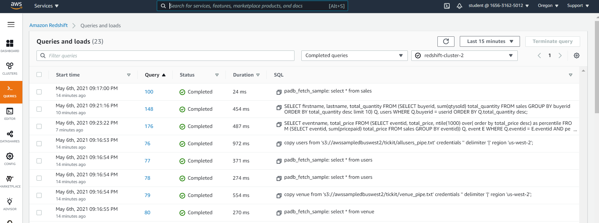
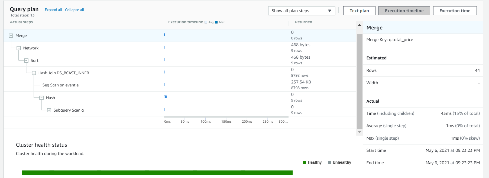
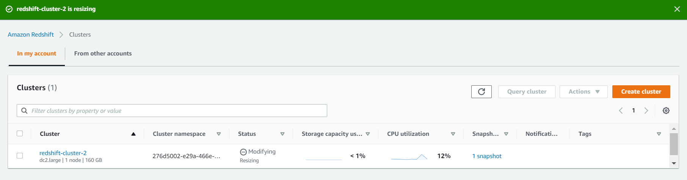
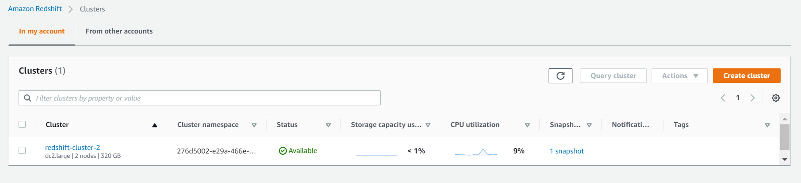
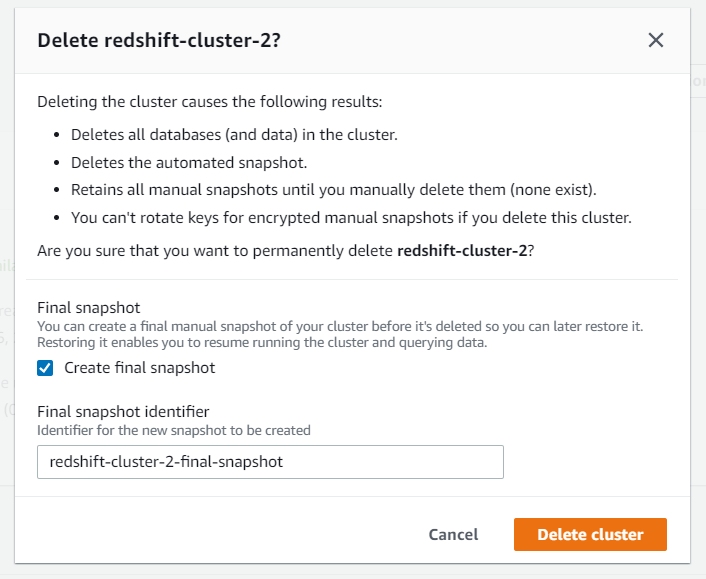

# Getting Started with Amazon Redshift

> Amazon Redshift is based on PostgreSQL. Amazon Redshift and PostgreSQL have a number of very important differences that you must be aware of as you design and develop your data warehouse applications.

> Amazon Redshift is specifically designed for online analytic processing (OLAP) and business intelligence (BI) applications, which require complex queries against large datasets. Because it addresses very different requirements, the specialized data storage schema and query execution engine that Amazon Redshift uses are completely different from the PostgreSQL implementation. For example, where online transaction processing (OLTP) applications typically store data in rows, Amazon Redshift stores data in columns, using specialized data compression encodings for optimum memory usage and disk I/O. Some PostgreSQL features that are suited to smaller-scale OLTP processing, such as secondary indexes and efficient single-row data manipulation operations, have been omitted to improve performance.


<!-- vim-markdown-toc GFM -->

- [Loading data into Redshift](#loading-data-into-redshift)
- [Running sample queries](#running-sample-queries)
- [Resizing the cluster](#resizing-the-cluster)
- [Remove Redshift cluster](#remove-redshift-cluster)
- [Useful commandline](#useful-commandline)

<!-- vim-markdown-toc -->

## Loading data into Redshift

```bash
$ export PGCLIENTENCODING=UTF8

$ psql -h redshift-cluster-1.col5lfys8hby.ap-southeast-2.redshift.amazonaws.com -U abcuser -d abcredshiftdb -p 5439
Password for user abcuser:
psql (9.2.24, server 8.0.2)
WARNING: psql version 9.2, server version 8.0.
         Some psql features might not work.
SSL connection (cipher: ECDHE-RSA-AES256-GCM-SHA384, bits: 256)
Type "help" for help.

abcredshiftdb=# create table users(
abcredshiftdb(#     userid integer not null distkey sortkey,
abcredshiftdb(#     username char(8),
abcredshiftdb(#     firstname varchar(30),
abcredshiftdb(#     lastname varchar(30),
abcredshiftdb(#     city varchar(30),
abcredshiftdb(#     state char(2),
abcredshiftdb(#     email varchar(100),
abcredshiftdb(#     phone char(14),
abcredshiftdb(#     likesports boolean,
abcredshiftdb(#     liketheatre boolean,
abcredshiftdb(#     likeconcerts boolean,
abcredshiftdb(#     likejazz boolean,
abcredshiftdb(#     likeclassical boolean,
abcredshiftdb(#     likeopera boolean,
abcredshiftdb(#     likerock boolean,
abcredshiftdb(#     likevegas boolean,
abcredshiftdb(#     likebroadway boolean,
abcredshiftdb(#     likemusicals boolean);
CREATE TABLE
abcredshiftdb=#
abcredshiftdb=# create table venue(
abcredshiftdb(#     venueid smallint not null distkey sortkey,
abcredshiftdb(#     venuename varchar(100),
abcredshiftdb(#     venuecity varchar(30),
abcredshiftdb(#     venuestate char(2),
abcredshiftdb(#     venueseats integer);
CREATE TABLE
abcredshiftdb=#
abcredshiftdb=# create table category(
abcredshiftdb(#     catid smallint not null distkey sortkey,
abcredshiftdb(#     catgroup varchar(10),
abcredshiftdb(#     catname varchar(10),
abcredshiftdb(#     catdesc varchar(50));
CREATE TABLE
abcredshiftdb=#
abcredshiftdb=# create table date(
abcredshiftdb(#     dateid smallint not null distkey sortkey,
abcredshiftdb(#     caldate date not null,
abcredshiftdb(#     day character(3) not null,
abcredshiftdb(#     week smallint not null,
abcredshiftdb(#     month character(5) not null,
abcredshiftdb(#     qtr character(5) not null,
abcredshiftdb(#     year smallint not null,
abcredshiftdb(#     holiday boolean default('N'));
CREATE TABLE
abcredshiftdb=#
abcredshiftdb=# create table event(
abcredshiftdb(#     eventid integer not null distkey,
abcredshiftdb(#     venueid smallint not null,
abcredshiftdb(#     catid smallint not null,
abcredshiftdb(#     dateid smallint not null sortkey,
abcredshiftdb(#     eventname varchar(200),
abcredshiftdb(#     starttime timestamp);
CREATE TABLE
abcredshiftdb=#
abcredshiftdb=# create table listing(
abcredshiftdb(#     listid integer not null distkey,
abcredshiftdb(#     sellerid integer not null,
abcredshiftdb(#     eventid integer not null,
abcredshiftdb(#     dateid smallint not null  sortkey,
abcredshiftdb(#     numtickets smallint not null,
abcredshiftdb(#     priceperticket decimal(8,2),
abcredshiftdb(#     totalprice decimal(8,2),
abcredshiftdb(#     listtime timestamp);
CREATE TABLE
abcredshiftdb=#
abcredshiftdb=# create table sales(
abcredshiftdb(#     salesid integer not null,
abcredshiftdb(#     listid integer not null distkey,
abcredshiftdb(#     sellerid integer not null,
abcredshiftdb(#     buyerid integer not null,
abcredshiftdb(#     eventid integer not null,
abcredshiftdb(#     dateid smallint not null sortkey,
abcredshiftdb(#     qtysold smallint not null,
abcredshiftdb(#     pricepaid decimal(8,2),
abcredshiftdb(#     commission decimal(8,2),
abcredshiftdb(#     saletime timestamp);
CREATE TABLE

abcredshiftdb=# copy users
abcredshiftdb-# from 's3://awssampledbapsoutheast2/tickit/allusers_pipe.txt'
abcredshiftdb-# credentials 'aws_iam_role=arn:aws:iam::123456789123:role/abcredshiftdb'
abcredshiftdb-# delimiter '|' region 'ap-southeast-2';
INFO:  Load into table 'users' completed, 49990 record(s) loaded successfully.
COPY
abcredshiftdb=#
abcredshiftdb=# copy venue
abcredshiftdb-# from 's3://awssampledbapsoutheast2/tickit/venue_pipe.txt'
abcredshiftdb-# credentials 'aws_iam_role=arn:aws:iam::123456789123:role/abcredshiftdb'
abcredshiftdb-# delimiter '|' region 'ap-southeast-2';
INFO:  Load into table 'venue' completed, 202 record(s) loaded successfully.
COPY
abcredshiftdb=#
abcredshiftdb=# copy category
abcredshiftdb-# from 's3://awssampledbapsoutheast2/tickit/category_pipe.txt'
abcredshiftdb-# credentials 'aws_iam_role=arn:aws:iam::123456789123:role/abcredshiftdb'
abcredshiftdb-# delimiter '|' region 'ap-southeast-2';
INFO:  Load into table 'category' completed, 11 record(s) loaded successfully.
COPY
abcredshiftdb=#
abcredshiftdb=# copy date
abcredshiftdb-# from 's3://awssampledbapsoutheast2/tickit/date2008_pipe.txt'
abcredshiftdb-# credentials 'aws_iam_role=arn:aws:iam::123456789123:role/abcredshiftdb'
abcredshiftdb-# delimiter '|' region 'ap-southeast-2';
INFO:  Load into table 'date' completed, 365 record(s) loaded successfully.
COPY
abcredshiftdb=#
abcredshiftdb=# copy event
abcredshiftdb-# from 's3://awssampledbapsoutheast2/tickit/allevents_pipe.txt'
abcredshiftdb-# credentials 'aws_iam_role=arn:aws:iam::123456789123:role/abcredshiftdb'
abcredshiftdb-# delimiter '|' timeformat 'YYYY-MM-DD HH:MI:SS' region 'ap-southeast-2';
INFO:  Load into table 'event' completed, 8798 record(s) loaded successfully.
COPY
abcredshiftdb=#
abcredshiftdb=# copy listing
abcredshiftdb-# from 's3://awssampledbapsoutheast2/tickit/listings_pipe.txt'
abcredshiftdb-# credentials 'aws_iam_role=arn:aws:iam::123456789123:role/abcredshiftdb'
abcredshiftdb-# delimiter '|' region 'ap-southeast-2';
INFO:  Load into table 'listing' completed, 192497 record(s) loaded successfully.
COPY
abcredshiftdb=#
abcredshiftdb=# copy sales
abcredshiftdb-# from 's3://awssampledbapsoutheast2/tickit/sales_tab.txt'
abcredshiftdb-# credentials 'aws_iam_role=arn:aws:iam::123456789123:role/abcredshiftdb'
abcredshiftdb-# delimiter '\t' timeformat 'MM/DD/YYYY HH:MI:SS' region 'ap-southeast-2';
INFO:  Load into table 'sales' completed, 172456 record(s) loaded successfully.
COPY

```

```sql
create table users(
    userid integer not null distkey sortkey,
    username char(8),
    firstname varchar(30),
    lastname varchar(30),
    city varchar(30),
    state char(2),
    email varchar(100),
    phone char(14),
    likesports boolean,
    liketheatre boolean,
    likeconcerts boolean,
    likejazz boolean,
    likeclassical boolean,
    likeopera boolean,
    likerock boolean,
    likevegas boolean,
    likebroadway boolean,
    likemusicals boolean);

create table venue(
    venueid smallint not null distkey sortkey,
    venuename varchar(100),
    venuecity varchar(30),
    venuestate char(2),
    venueseats integer);

create table category(
    catid smallint not null distkey sortkey,
    catgroup varchar(10),
    catname varchar(10),
    catdesc varchar(50));

create table date(
    dateid smallint not null distkey sortkey,
    caldate date not null,
    day character(3) not null,
    week smallint not null,
    month character(5) not null,
    qtr character(5) not null,
    year smallint not null,
    holiday boolean default('N'));

create table event(
    eventid integer not null distkey,
    venueid smallint not null,
    catid smallint not null,
    dateid smallint not null sortkey,
    eventname varchar(200),
    starttime timestamp);

create table listing(
    listid integer not null distkey,
    sellerid integer not null,
    eventid integer not null,
    dateid smallint not null  sortkey,
    numtickets smallint not null,
    priceperticket decimal(8,2),
    totalprice decimal(8,2),
    listtime timestamp);

create table sales(
    salesid integer not null,
    listid integer not null distkey,
    sellerid integer not null,
    buyerid integer not null,
    eventid integer not null,
    dateid smallint not null sortkey,
    qtysold smallint not null,
    pricepaid decimal(8,2),
    commission decimal(8,2),
    saletime timestamp);
```

```sql
copy users
from 's3://awssampledbapsoutheast2/tickit/allusers_pipe.txt'
credentials 'aws_iam_role=arn:aws:iam::123456789123:role/abcredshiftdb'
delimiter '|' region 'ap-southeast-2';

copy venue
from 's3://awssampledbapsoutheast2/tickit/venue_pipe.txt'
credentials 'aws_iam_role=arn:aws:iam::123456789123:role/abcredshiftdb'
delimiter '|' region 'ap-southeast-2';

copy category
from 's3://awssampledbapsoutheast2/tickit/category_pipe.txt'
credentials 'aws_iam_role=arn:aws:iam::123456789123:role/abcredshiftdb'
delimiter '|' region 'ap-southeast-2';

copy date
from 's3://awssampledbapsoutheast2/tickit/date2008_pipe.txt'
credentials 'aws_iam_role=arn:aws:iam::123456789123:role/abcredshiftdb'
delimiter '|' region 'ap-southeast-2';

copy event
from 's3://awssampledbapsoutheast2/tickit/allevents_pipe.txt'
credentials 'aws_iam_role=arn:aws:iam::123456789123:role/abcredshiftdb'
delimiter '|' timeformat 'YYYY-MM-DD HH:MI:SS' region 'ap-southeast-2';

copy listing
from 's3://awssampledbapsoutheast2/tickit/listings_pipe.txt'
credentials 'aws_iam_role=arn:aws:iam::123456789123:role/abcredshiftdb'
delimiter '|' region 'ap-southeast-2';

copy sales
from 's3://awssampledbapsoutheast2/tickit/sales_tab.txt'
credentials 'aws_iam_role=arn:aws:iam::123456789123:role/abcredshiftdb'
delimiter '\t' timeformat 'MM/DD/YYYY HH:MI:SS' region 'ap-southeast-2';
```

## Running sample queries

***Instructions***

[ ] Enter the following SQL statement at the Redshift command-line prompt:  

```sql
SELECT firstname,
       lastname,
       total_quantity
FROM
  (SELECT buyerid,
          sum(qtysold) total_quantity
   FROM sales
   GROUP BY buyerid
   ORDER BY total_quantity desc
   limit 10) Q,
     users
WHERE Q.buyerid = userid
ORDER BY Q.total_quantity desc;
```
> This query returns a list of the top 10 buyer names by quantity from the data you loaded previously.

| firstname | lastname | total_quantity
|-----------|----------|----------------
| Jerry     | Nichols  |             67
| Kameko    | Bowman   |             64
| Armando   | Lopez    |             64
| Kellie    | Savage   |             63
| Herrod    | Sparks   |             60
| Rhona     | Sweet    |             60
| Kadeem    | Blair    |             60
| Belle     | Foreman  |             60
| Deborah   | Barber   |             60
| Malachi   | Hayden   |             60
(10 rows)

[ ] To query events in the highest percentile measured by gross sales, enter the following SQL statement:

```sql
SELECT eventname,
       total_price
FROM
  (SELECT eventid,
          total_price,
          ntile(1000) over(
                           order by total_price desc) as percentile
   FROM
     (SELECT eventid,
             sum(pricepaid) total_price
      FROM sales
      GROUP BY eventid)) Q,
     event E
WHERE Q.eventid = E.eventid
  AND percentile = 1
ORDER BY total_price desc;
```
You will see results similar to:

|      eventname       | total_price
|----------------------|-------------
| Adriana Lecouvreur   |    51846.00
| Janet Jackson        |    51049.00
| Phantom of the Opera |    50301.00
| The Little Mermaid   |    49956.00
| Citizen Cope         |    49823.00
| Sevendust            |    48020.00
| Electra              |    47883.00
| Mary Poppins         |    46780.00
| Live                 |    46661.00
(9 rows)

[ ] Navigate to the clusters section of the Redshift console.

[ ] Click redshift-cluster-1:

[ ] In the left-hand list of tabs, click Queries:

[ ] To refresh the query list, in the top left of the page, click the refresh icon:

> Please note it may take a minute or two for the latest queries to show up in this list.



[ ] To sort the queries in descending sequential order, click the Query column heading twice:

> Note the black triangle pointing downwards to show that the records are listed in descending order.

[ ] In the Query column, click the number of the latest row.

> You will be taken to a page detailing this query.

> By default, the Query details tab is selected. You will see a section called SQL with the query statement, and you will see an Execution details section showing how long the query took to run.

[ ] To see the plan for this query, click the Query plan tab:

> A query plan is a sequence of steps that a database performs to return results for a query.

> On this page, there are a number of things that help you understand the performance of your query.

[ ] To see a textual representation of the query plan, click Text plan:

> You will see a plan similar to:



> You will also see the number of rows that are returned for each step.

> There are other ways of viewing the plan on this page, including visualizations and charts of the query's CPU utilization and database connections.

> This page can be very useful when running queries that take a long time, you can use this page to debug the query, determine which step is taking a long time and potentially make the query time shorter by taking action to modify the query or the database tables.


***Summary***
> In this exercise step, you ran sample SQL queries on a single-node Redshift cluster. You also viewed query details and metrics to gauge your cluster performance level.

## Resizing the cluster

***Introduction***
> In this lab step, you will resize the cluster by adding an extra node and changing the type to a multi node cluster. You can resize a Redshift cluster up or down by adding or subtracting nodes, or changing the node type, as your storage and performance needs fluctuate.

> Note: In a single node cluster type, one node combines all query functions and communications. Larger clusters have a leader node that receives queries and coordinates query functions, and compute nodes that execute the queries.

***Instructions***

[ ] Navigate to Clusters in the Redshift Management Console.  
[ ] To select your cluster, check the box next to redshift-cluster-1:  
[ ] To begin resizing your cluster, click Actions, and then click Resize:  
> The Resize cluster form will load.

[ ] At the bottom of the page, in the Nodes text-box, enter 2:  
[ ] To resize your cluster, scroll to the bottom and click Resize cluster:  
> The cluster list page will load and you will see a notification that your cluster is resizing:

> You will also see the status of the cluster change to Modifying:

> It may take up to 15 or 20 minutes for the Redshift cluster to resize and finish copying your data. During a resizing operation, Redshift terminates all connections and restarts the original cluster in read-only mode. You may wish to use this time to explore the tabs, performance metrics, and data available in the Clusters section of the Redshift console.



> The resize is complete when the Cluster Status reads available.



> Note: If you successfully run sample queries on the resized Redshift cluster, you may wonder why the queries do not execute twice as fast with two nodes. Redshift's strengths lie in parallelism, columnar data storage, data compression, and query optimization. Redshift can store and query very large amounts of data very quickly, but the number of nodes is not a linear performance indicator.

***Summary***
> In this exercise step, you converted a single-node cluster to a multi-node cluster by completing a resizing operation.

## Remove Redshift cluster

***Introduction***
In this exercise Step you will delete the multi-node Redshift cluster.

***Instructions***

[ ] Navigate to Clusters in the Redshift Management Console.  
[ ] To select your cluster, in the cluster list, check the box next to redshift-cluster-1:  
[ ] In the top right, click Actions and then click Delete:  
[ ] Under Final snapshot, uncheck Create final snapshot:  
[ ] To delete your cluster, click Delete:  



Summary
In this exercise step, you deleted the Redshift cluster used during the lab. For many resource types, Amazon will charge a full hour if the resource is used during even one minute of that hour, so it is a good idea to delete resources when you are done using them. 

## Useful commandline

[Create Redshift cluster](https://docs.aws.amazon.com/cli/latest/reference/redshift/create-cluster.html) - `aws redshift create-cluster --node-type dw.dc2.xlarge --number-of-nodes 2 --master-username <master-username> --master-user-password <password> --cluster-identifier <cluster-name>`
[Describe Redshift cluster](https://docs.aws.amazon.com/cli/latest/reference/redshift/describe-clusters.html) - `aws redshift describe-clusters --region ap-southeast-2 --output json`

[redshift awscli]: https://docs.aws.amazon.com/cli/latest/reference/redshift/index.html
