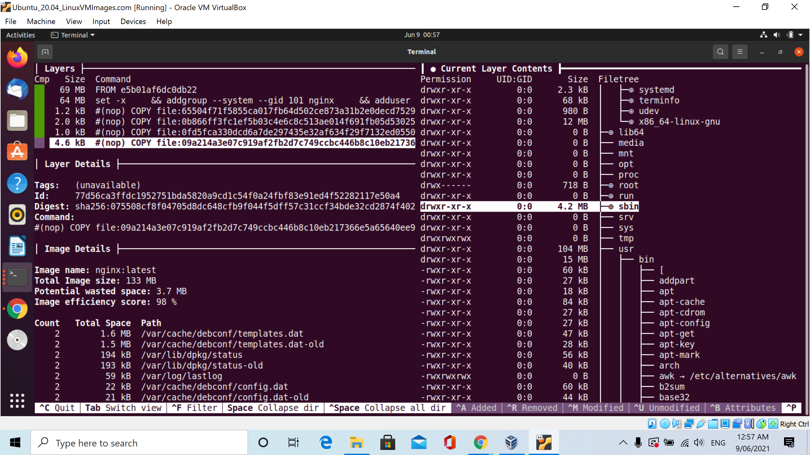
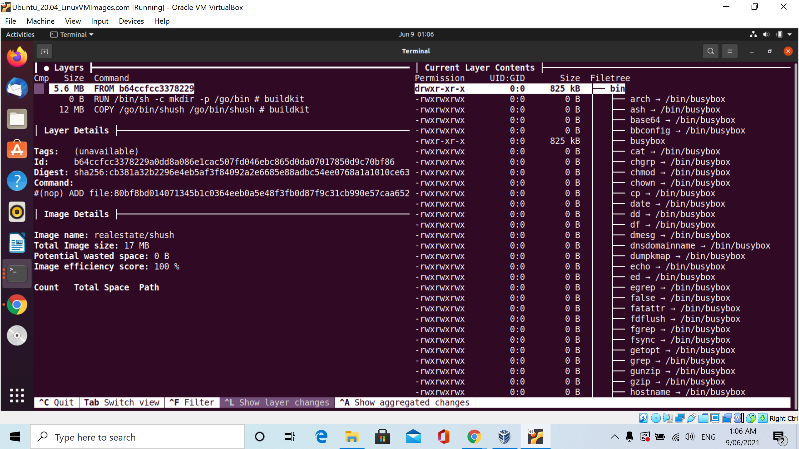

# Generate Dockerfile from images

* Use `alpine/dfimage` docker

```bash
$  alias dfimage="docker run -v /var/run/docker.sock:/var/run/docker.sock --rm alpine/dfimage"
$  dfimage jupyter/datascience-notebook
Unable to find image 'alpine/dfimage:latest' locally
latest: Pulling from alpine/dfimage
df20fa9351a1: Already exists
820dbffe2156: Pull complete
Digest: sha256:4a271e763d51b7f3cca72eac9bf508502c032665dde0e4c8d5fcf6376600f64a
Status: Downloaded newer image for alpine/dfimage:latest
Analyzing jupyter/datascience-notebook
Docker Version:
GraphDriver: overlay2
Environment Variables
|PATH=/opt/conda/bin:/usr/local/sbin:/usr/local/bin:/usr/sbin:/usr/bin:/sbin:/bin
|DEBIAN_FRONTEND=noninteractive
|CONDA_DIR=/opt/conda
|SHELL=/bin/bash
|NB_USER=jovyan
|NB_UID=1000
|NB_GID=100
|LC_ALL=en_US.UTF-8
|LANG=en_US.UTF-8
|LANGUAGE=en_US.UTF-8
|HOME=/home/jovyan
|CONDA_VERSION=4.10.1
|MINIFORGE_VERSION=4.10.1-0
|XDG_CACHE_HOME=/home/jovyan/.cache/
|JULIA_DEPOT_PATH=/opt/julia
|JULIA_PKGDIR=/opt/julia
|JULIA_VERSION=1.6.0

Open Ports
|8888

Image user
|Image is running as User: 1000

Potential secrets:
|Found match opt/conda/etc/jupyter/nbconfig/notebook.d/jupyter-matplotlib.json Jupyter Configuration file jupyter[^ ]*config[^ ]*.json 361d087517975428401cea59d45dd84da7be5a7d92bca68a37ff81f3a194c666/layer.tar
|Found match opt/conda/etc/jupyter/nbconfig/notebook.d/widgetsnbextension.json Jupyter Configuration file jupyter[^ ]*config[^ ]*.json 361d087517975428401cea59d45dd84da7be5a7d92bca68a37ff81f3a194c666/layer.tar
|Found match opt/conda/etc/jupyter/nbconfig/notebook.json Jupyter Configuration file jupyter[^ ]*config[^ ]*.json 361d087517975428401cea59d45dd84da7be5a7d92bca68a37ff81f3a194c666/layer.tar
|Found match opt/conda/share/terminfo/p/p12 Potential cryptographic key bundle .p12$ 4b25d6a374d40987ab9eeb29cfb89195302b7cc35e3d7cea7d0fa5e9237e884f/layer.tar
|Found match opt/julia/packages/MbedTLS/4YY6E/test/clntsrvr/test.key openssl .key, apple .keychain, etc. \.key$ 74a2c6257a9205b15b683549520af54d464ba9a6ab1e0d1c0a3502b0029c6965/layer.tar
|Found match opt/conda/lib/R/library/RCurl/examples/omg.netrc ~/.netrc \.netrc$ 7b4b2dffa496503322989107d86cace093ceb7ba632c9baa7c586193055aa20b/layer.tar
|Found match opt/conda/lib/R/library/RSQLite/db/datasets.sqlite Database file \.sqlite$ 7b4b2dffa496503322989107d86cace093ceb7ba632c9baa7c586193055aa20b/layer.tar
|Found match opt/conda/etc/jupyter/jupyter_notebook_config.d/jupyterlab.json Jupyter Configuration file jupyter[^ ]*config[^ ]*.json be29a8b727e2933af20e6e7ac9213ece76125508abe25b7d2d296a26d5b82ecf/layer.tar
|Found match opt/conda/etc/jupyter/jupyter_server_config.d/jupyterlab.json Jupyter Configuration file jupyter[^ ]*config[^ ]*.json be29a8b727e2933af20e6e7ac9213ece76125508abe25b7d2d296a26d5b82ecf/layer.tar
|Found match opt/conda/etc/jupyter/jupyter_server_config.d/nbclassic.json Jupyter Configuration file jupyter[^ ]*config[^ ]*.json be29a8b727e2933af20e6e7ac9213ece76125508abe25b7d2d296a26d5b82ecf/layer.tar
|Found match opt/conda/lib/python3.9/site-packages/tornado/test/test.key openssl .key, apple .keychain, etc. \.key$ be29a8b727e2933af20e6e7ac9213ece76125508abe25b7d2d296a26d5b82ecf/layer.tar
|Found match opt/conda/share/jupyterhub/static/components/bootstrap/grunt/configBridge.json Jupyter Configuration file jupyter[^ ]*config[^ ]*.json be29a8b727e2933af20e6e7ac9213ece76125508abe25b7d2d296a26d5b82ecf/layer.tar
|Found match opt/julia-1.6.0/share/julia/stdlib/v1.6/LibGit2/test/keys/invalid.pub Possible public key \.pub$ c1a4789c964464a9d96e07be7ea47085094fba75a47fba08a969ce0c259f2884/layer.tar
|Found match opt/julia-1.6.0/share/julia/stdlib/v1.6/LibGit2/test/keys/valid-passphrase.pub Possible public key \.pub$ c1a4789c964464a9d96e07be7ea47085094fba75a47fba08a969ce0c259f2884/layer.tar
|Found match opt/julia-1.6.0/share/julia/stdlib/v1.6/LibGit2/test/keys/valid.pub Possible public key \.pub$ c1a4789c964464a9d96e07be7ea47085094fba75a47fba08a969ce0c259f2884/layer.tar
Dockerfile:
RUN set -xe  \
	&& echo '#!/bin/sh' > /usr/sbin/policy-rc.d  \
	&& echo 'exit 101' >> /usr/sbin/policy-rc.d  \
	&& chmod +x /usr/sbin/policy-rc.d  \
	&& dpkg-divert --local --rename --add /sbin/initctl  \
	&& cp -a /usr/sbin/policy-rc.d /sbin/initctl  \
	&& sed -i 's/^exit.*/exit 0/' /sbin/initctl  \
	&& echo 'force-unsafe-io' > /etc/dpkg/dpkg.cfg.d/docker-apt-speedup  \
	&& echo 'DPkg::Post-Invoke { "rm -f /var/cache/apt/archives/*.deb /var/cache/apt/archives/partial/*.deb /var/cache/apt/*.bin || true"; };' > /etc/apt/apt.conf.d/docker-clean  \
	&& echo 'APT::Update::Post-Invoke { "rm -f /var/cache/apt/archives/*.deb /var/cache/apt/archives/partial/*.deb /var/cache/apt/*.bin || true"; };' >> /etc/apt/apt.conf.d/docker-clean  \
	&& echo 'Dir::Cache::pkgcache ""; Dir::Cache::srcpkgcache "";' >> /etc/apt/apt.conf.d/docker-clean  \
	&& echo 'Acquire::Languages "none";' > /etc/apt/apt.conf.d/docker-no-languages  \
	&& echo 'Acquire::GzipIndexes "true"; Acquire::CompressionTypes::Order:: "gz";' > /etc/apt/apt.conf.d/docker-gzip-indexes  \
	&& echo 'Apt::AutoRemove::SuggestsImportant "false";' > /etc/apt/apt.conf.d/docker-autoremove-suggests
RUN [ -z "$(apt-get indextargets)" ]
RUN mkdir -p /run/systemd  \
	&& echo 'docker' > /run/systemd/container
CMD ["/bin/bash"]
LABEL maintainer=Jupyter Project <jupyter@googlegroups.com>
ARG NB_USER=jovyan
ARG NB_UID=1000
ARG NB_GID=100
SHELL [/bin/bash -o pipefail -c]
USER root
ARG conda_version=4.10.1
ARG miniforge_patch_number=0
ARG miniforge_arch=x86_64
ARG miniforge_python=Mambaforge
ARG miniforge_version=4.10.1-0
ARG miniforge_installer=Mambaforge-4.10.1-0-Linux-x86_64.sh
ARG miniforge_checksum=d4065b376f81b83cfef0c7316f97bb83337e4ae27eb988828363a578226e3a62
ENV DEBIAN_FRONTEND=noninteractive
RUN |10 NB_USER=jovyan NB_UID=1000 NB_GID=100 conda_version=4.10.1 miniforge_patch_number=0 miniforge_arch=x86_64 miniforge_python=Mambaforge miniforge_version=4.10.1-0 miniforge_installer=Mambaforge-4.10.1-0-Linux-x86_64.sh miniforge_checksum=d4065b376f81b83cfef0c7316f97bb83337e4ae27eb988828363a578226e3a62 /bin/bash -o pipefail -c apt-get update --yes  \
	&& apt-get install --yes --no-install-recommends tini wget ca-certificates sudo locales fonts-liberation run-one  \
	&& apt-get clean  \
	&& rm -rf /var/lib/apt/lists/*  \
	&& echo "en_US.UTF-8 UTF-8" > /etc/locale.gen  \
	&& locale-gen # buildkit
ENV CONDA_DIR=/opt/conda SHELL=/bin/bash NB_USER=jovyan NB_UID=1000 NB_GID=100 LC_ALL=en_US.UTF-8 LANG=en_US.UTF-8 LANGUAGE=en_US.UTF-8
ENV PATH=/opt/conda/bin:/usr/local/sbin:/usr/local/bin:/usr/sbin:/usr/bin:/sbin:/bin HOME=/home/jovyan CONDA_VERSION=4.10.1 MINIFORGE_VERSION=4.10.1-0
COPY fix-permissions /usr/local/bin/fix-permissions # buildkit
	usr/
	usr/local/
	usr/local/bin/
	usr/local/bin/fix-permissions

RUN |10 NB_USER=jovyan NB_UID=1000 NB_GID=100 conda_version=4.10.1 miniforge_patch_number=0 miniforge_arch=x86_64 miniforge_python=Mambaforge miniforge_version=4.10.1-0 miniforge_installer=Mambaforge-4.10.1-0-Linux-x86_64.sh miniforge_checksum=d4065b376f81b83cfef0c7316f97bb83337e4ae27eb988828363a578226e3a62 /bin/bash -o pipefail -c chmod a+rx /usr/local/bin/fix-permissions # buildkit
RUN |10 NB_USER=jovyan NB_UID=1000 NB_GID=100 conda_version=4.10.1 miniforge_patch_number=0 miniforge_arch=x86_64 miniforge_python=Mambaforge miniforge_version=4.10.1-0 miniforge_installer=Mambaforge-4.10.1-0-Linux-x86_64.sh miniforge_checksum=d4065b376f81b83cfef0c7316f97bb83337e4ae27eb988828363a578226e3a62 /bin/bash -o pipefail -c sed -i 's/^#force_color_prompt=yes/force_color_prompt=yes/' /etc/skel/.bashrc  \
	&& echo 'eval "$(command conda shell.bash hook 2> /dev/null)"' >> /etc/skel/.bashrc # buildkit
RUN |10 NB_USER=jovyan NB_UID=1000 NB_GID=100 conda_version=4.10.1 miniforge_patch_number=0 miniforge_arch=x86_64 miniforge_python=Mambaforge miniforge_version=4.10.1-0 miniforge_installer=Mambaforge-4.10.1-0-Linux-x86_64.sh miniforge_checksum=d4065b376f81b83cfef0c7316f97bb83337e4ae27eb988828363a578226e3a62 /bin/bash -o pipefail -c echo "auth requisite pam_deny.so" >> /etc/pam.d/su  \
	&& sed -i.bak -e 's/^%admin/#%admin/' /etc/sudoers  \
	&& sed -i.bak -e 's/^%sudo/#%sudo/' /etc/sudoers  \
	&& useradd -l -m -s /bin/bash -N -u "${NB_UID}" "${NB_USER}"  \
	&& mkdir -p "${CONDA_DIR}"  \
	&& chown "${NB_USER}:${NB_GID}" "${CONDA_DIR}"  \
	&& chmod g+w /etc/passwd  \
	&& fix-permissions "${HOME}"  \
	&& fix-permissions "${CONDA_DIR}" # buildkit
USER 1000
ARG PYTHON_VERSION=default
RUN |11 NB_USER=jovyan NB_UID=1000 NB_GID=100 conda_version=4.10.1 miniforge_patch_number=0 miniforge_arch=x86_64 miniforge_python=Mambaforge miniforge_version=4.10.1-0 miniforge_installer=Mambaforge-4.10.1-0-Linux-x86_64.sh miniforge_checksum=d4065b376f81b83cfef0c7316f97bb83337e4ae27eb988828363a578226e3a62 PYTHON_VERSION=default /bin/bash -o pipefail -c mkdir "/home/${NB_USER}/work"  \
	&& fix-permissions "/home/${NB_USER}" # buildkit
WORKDIR /tmp
RUN |11 NB_USER=jovyan NB_UID=1000 NB_GID=100 conda_version=4.10.1 miniforge_patch_number=0 miniforge_arch=x86_64 miniforge_python=Mambaforge miniforge_version=4.10.1-0 miniforge_installer=Mambaforge-4.10.1-0-Linux-x86_64.sh miniforge_checksum=d4065b376f81b83cfef0c7316f97bb83337e4ae27eb988828363a578226e3a62 PYTHON_VERSION=default /bin/bash -o pipefail -c wget --quiet "https://github.com/conda-forge/miniforge/releases/download/${miniforge_version}/${miniforge_installer}"  \
	&& echo "${miniforge_checksum} *${miniforge_installer}" | sha256sum --check  \
	&& /bin/bash "${miniforge_installer}" -f -b -p "${CONDA_DIR}"  \
	&& rm "${miniforge_installer}"  \
	&& echo "conda ${CONDA_VERSION}" >> "${CONDA_DIR}/conda-meta/pinned"  \
	&& conda config --system --set auto_update_conda false  \
	&& conda config --system --set show_channel_urls true  \
	&& if [[ "${PYTHON_VERSION}" != "default" ]]; then conda install --yes python="${PYTHON_VERSION}"; fi  \
	&& conda list python | grep '^python ' | tr -s ' ' | cut -d '.' -f 1,2 | sed 's/$/.*/' >> "${CONDA_DIR}/conda-meta/pinned"  \
	&& conda install --quiet --yes "conda=${CONDA_VERSION}" 'pip'  \
	&& conda update --all --quiet --yes  \
	&& conda clean --all -f -y  \
	&& rm -rf "/home/${NB_USER}/.cache/yarn"  \
	&& fix-permissions "${CONDA_DIR}"  \
	&& fix-permissions "/home/${NB_USER}" # buildkit
RUN |11 NB_USER=jovyan NB_UID=1000 NB_GID=100 conda_version=4.10.1 miniforge_patch_number=0 miniforge_arch=x86_64 miniforge_python=Mambaforge miniforge_version=4.10.1-0 miniforge_installer=Mambaforge-4.10.1-0-Linux-x86_64.sh miniforge_checksum=d4065b376f81b83cfef0c7316f97bb83337e4ae27eb988828363a578226e3a62 PYTHON_VERSION=default /bin/bash -o pipefail -c conda install --quiet --yes 'notebook=6.4.0' 'jupyterhub=1.4.1' 'jupyterlab=3.0.16'  \
	&& conda clean --all -f -y  \
	&& npm cache clean --force  \
	&& jupyter notebook --generate-config  \
	&& jupyter lab clean  \
	&& rm -rf "/home/${NB_USER}/.cache/yarn"  \
	&& fix-permissions "${CONDA_DIR}"  \
	&& fix-permissions "/home/${NB_USER}" # buildkit
EXPOSE map[8888/tcp:{}]
ENTRYPOINT ["tini" "-g" "--"]
CMD ["start-notebook.sh"]
COPY start.sh start-notebook.sh start-singleuser.sh /usr/local/bin/ # buildkit
	usr/
	usr/local/
	usr/local/bin/
	usr/local/bin/start-notebook.sh
	usr/local/bin/start-singleuser.sh
	usr/local/bin/start.sh

COPY jupyter_notebook_config.py /etc/jupyter/ # buildkit
	etc/
	etc/jupyter/
	etc/jupyter/jupyter_notebook_config.py

USER root
RUN |11 NB_USER=jovyan NB_UID=1000 NB_GID=100 conda_version=4.10.1 miniforge_patch_number=0 miniforge_arch=x86_64 miniforge_python=Mambaforge miniforge_version=4.10.1-0 miniforge_installer=Mambaforge-4.10.1-0-Linux-x86_64.sh miniforge_checksum=d4065b376f81b83cfef0c7316f97bb83337e4ae27eb988828363a578226e3a62 PYTHON_VERSION=default /bin/bash -o pipefail -c sed -re "s/c.NotebookApp/c.ServerApp/g" /etc/jupyter/jupyter_notebook_config.py > /etc/jupyter/jupyter_server_config.py  \
	&& fix-permissions /etc/jupyter/ # buildkit
USER 1000
WORKDIR /home/jovyan
LABEL maintainer=Jupyter Project <jupyter@googlegroups.com>
USER root
RUN /bin/bash -o pipefail -c apt-get update --yes  \
	&& apt-get install --yes --no-install-recommends build-essential vim-tiny git inkscape libsm6 libxext-dev libxrender1 lmodern netcat texlive-xetex texlive-fonts-recommended texlive-plain-generic tzdata unzip nano-tiny  \
	&& apt-get clean  \
	&& rm -rf /var/lib/apt/lists/* # buildkit
RUN /bin/bash -o pipefail -c update-alternatives --install /usr/bin/nano nano /bin/nano-tiny 10 # buildkit
USER 1000
LABEL maintainer=Jupyter Project <jupyter@googlegroups.com>
USER root
RUN /bin/bash -o pipefail -c apt-get update --yes  \
	&& apt-get install --yes --no-install-recommends ffmpeg dvipng cm-super  \
	&& apt-get clean  \
	&& rm -rf /var/lib/apt/lists/* # buildkit
USER 1000
RUN /bin/bash -o pipefail -c conda install --quiet --yes 'altair=4.1.*' 'beautifulsoup4=4.9.*' 'bokeh=2.3.*' 'bottleneck=1.3.*' 'cloudpickle=1.6.*' 'conda-forge::blas=*=openblas' 'cython=0.29.*' 'dask=2021.4.*' 'dill=0.3.*' 'h5py=3.2.*' 'ipympl=0.7.*' 'ipywidgets=7.6.*' 'matplotlib-base=3.4.*' 'numba=0.53.*' 'numexpr=2.7.*' 'pandas=1.2.*' 'patsy=0.5.*' 'protobuf=3.15.*' 'pytables=3.6.*' 'scikit-image=0.18.*' 'scikit-learn=0.24.*' 'scipy=1.6.*' 'seaborn=0.11.*' 'sqlalchemy=1.4.*' 'statsmodels=0.12.*' 'sympy=1.8.*' 'widgetsnbextension=3.5.*' 'xlrd=2.0.*'  \
	&& conda clean --all -f -y  \
	&& fix-permissions "${CONDA_DIR}"  \
	&& fix-permissions "/home/${NB_USER}" # buildkit
WORKDIR /tmp
RUN /bin/bash -o pipefail -c git clone https://github.com/PAIR-code/facets.git  \
	&& jupyter nbextension install facets/facets-dist/ --sys-prefix  \
	&& rm -rf /tmp/facets  \
	&& fix-permissions "${CONDA_DIR}"  \
	&& fix-permissions "/home/${NB_USER}" # buildkit
ENV XDG_CACHE_HOME=/home/jovyan/.cache/
RUN /bin/bash -o pipefail -c MPLBACKEND=Agg python -c "import matplotlib.pyplot"  \
	&& fix-permissions "/home/${NB_USER}" # buildkit
USER 1000
WORKDIR /home/jovyan
LABEL maintainer=Jupyter Project <jupyter@googlegroups.com>
SHELL [/bin/bash -o pipefail -c]
USER root
ARG julia_version=1.6.0
ARG julia_checksum=463b71dc70ca7094c0e0fd6d55d130051a7901e8dec5eb44d6002c57d1bd8585
RUN |2 julia_version=1.6.0 julia_checksum=463b71dc70ca7094c0e0fd6d55d130051a7901e8dec5eb44d6002c57d1bd8585 /bin/bash -o pipefail -c apt-get update --yes  \
	&& apt-get install --yes --no-install-recommends fonts-dejavu gfortran gcc  \
	&& apt-get clean  \
	&& rm -rf /var/lib/apt/lists/* # buildkit
ENV JULIA_DEPOT_PATH=/opt/julia JULIA_PKGDIR=/opt/julia JULIA_VERSION=1.6.0
WORKDIR /tmp
RUN |2 julia_version=1.6.0 julia_checksum=463b71dc70ca7094c0e0fd6d55d130051a7901e8dec5eb44d6002c57d1bd8585 /bin/bash -o pipefail -c mkdir "/opt/julia-${JULIA_VERSION}"  \
	&& wget -q https://julialang-s3.julialang.org/bin/linux/x64/$(echo "${JULIA_VERSION}" | cut -d. -f 1,2)"/julia-${JULIA_VERSION}-linux-x86_64.tar.gz"  \
	&& echo "${julia_checksum} *julia-${JULIA_VERSION}-linux-x86_64.tar.gz" | sha256sum -c -  \
	&& tar xzf "julia-${JULIA_VERSION}-linux-x86_64.tar.gz" -C "/opt/julia-${JULIA_VERSION}" --strip-components=1  \
	&& rm "/tmp/julia-${JULIA_VERSION}-linux-x86_64.tar.gz"  \
	&& ln -fs /opt/julia-*/bin/julia /usr/local/bin/julia # buildkit
RUN |2 julia_version=1.6.0 julia_checksum=463b71dc70ca7094c0e0fd6d55d130051a7901e8dec5eb44d6002c57d1bd8585 /bin/bash -o pipefail -c mkdir /etc/julia  \
	&& echo "push!(Libdl.DL_LOAD_PATH, \"${CONDA_DIR}/lib\")" >> /etc/julia/juliarc.jl  \
	&& mkdir "${JULIA_PKGDIR}"  \
	&& chown "${NB_USER}" "${JULIA_PKGDIR}"  \
	&& fix-permissions "${JULIA_PKGDIR}" # buildkit
USER 1000
RUN |2 julia_version=1.6.0 julia_checksum=463b71dc70ca7094c0e0fd6d55d130051a7901e8dec5eb44d6002c57d1bd8585 /bin/bash -o pipefail -c conda install --quiet --yes 'r-base=4.0.3' 'r-caret=6.0*' 'r-crayon=1.4*' 'r-devtools=2.4*' 'r-forecast=8.14*' 'r-hexbin=1.28*' 'r-htmltools=0.5*' 'r-htmlwidgets=1.5*' 'r-irkernel=1.1*' 'r-nycflights13=1.0*' 'r-randomforest=4.6*' 'r-rcurl=1.98*' 'r-rmarkdown=2.7*' 'r-rodbc=1.3*' 'r-rsqlite=2.2*' 'r-shiny=1.6*' 'r-tidymodels=0.1*' 'r-tidyverse=1.3*' 'rpy2=3.4*' 'unixodbc=2.3.*'  \
	&& conda clean --all -f -y  \
	&& fix-permissions "${CONDA_DIR}"  \
	&& fix-permissions "/home/${NB_USER}" # buildkit
RUN |2 julia_version=1.6.0 julia_checksum=463b71dc70ca7094c0e0fd6d55d130051a7901e8dec5eb44d6002c57d1bd8585 /bin/bash -o pipefail -c julia -e 'import Pkg; Pkg.update()'  \
	&& julia -e 'import Pkg; Pkg.add("HDF5")'  \
	&& julia -e 'using Pkg; pkg"add IJulia"; pkg"precompile"'  \
	&& mv "${HOME}/.local/share/jupyter/kernels/julia"* "${CONDA_DIR}/share/jupyter/kernels/"  \
	&& chmod -R go+rx "${CONDA_DIR}/share/jupyter"  \
	&& rm -rf "${HOME}/.local"  \
	&& fix-permissions "${JULIA_PKGDIR}" "${CONDA_DIR}/share/jupyter" # buildkit
WORKDIR /home/jovyan

```

> Try again with option `-sV=1.36`

```bash
 dfimage -sV=1.36 jupyter/datascience-notebook
Analyzing jupyter/datascience-notebook
Docker Version:
GraphDriver: overlay2
Environment Variables
|PATH=/opt/conda/bin:/usr/local/sbin:/usr/local/bin:/usr/sbin:/usr/bin:/sbin:/bin
|DEBIAN_FRONTEND=noninteractive
|CONDA_DIR=/opt/conda
|SHELL=/bin/bash
|NB_USER=jovyan
|NB_UID=1000
|NB_GID=100
|LC_ALL=en_US.UTF-8
|LANG=en_US.UTF-8
|LANGUAGE=en_US.UTF-8
|HOME=/home/jovyan
|CONDA_VERSION=4.10.1
|MINIFORGE_VERSION=4.10.1-0
|XDG_CACHE_HOME=/home/jovyan/.cache/
|JULIA_DEPOT_PATH=/opt/julia
|JULIA_PKGDIR=/opt/julia
|JULIA_VERSION=1.6.0

Open Ports
|8888

Image user
|Image is running as User: 1000

Potential secrets:
|Found match opt/conda/etc/jupyter/nbconfig/notebook.d/jupyter-matplotlib.json Jupyter Configuration file jupyter[^ ]*config[^ ]*.json 361d087517975428401cea59d45dd84da7be5a7d92bca68a37ff81f3a194c666/layer.tar
|Found match opt/conda/etc/jupyter/nbconfig/notebook.d/widgetsnbextension.json Jupyter Configuration file jupyter[^ ]*config[^ ]*.json 361d087517975428401cea59d45dd84da7be5a7d92bca68a37ff81f3a194c666/layer.tar
|Found match opt/conda/etc/jupyter/nbconfig/notebook.json Jupyter Configuration file jupyter[^ ]*config[^ ]*.json 361d087517975428401cea59d45dd84da7be5a7d92bca68a37ff81f3a194c666/layer.tar
|Found match opt/conda/share/terminfo/p/p12 Potential cryptographic key bundle .p12$ 4b25d6a374d40987ab9eeb29cfb89195302b7cc35e3d7cea7d0fa5e9237e884f/layer.tar
|Found match opt/julia/packages/MbedTLS/4YY6E/test/clntsrvr/test.key openssl .key, apple .keychain, etc. \.key$ 74a2c6257a9205b15b683549520af54d464ba9a6ab1e0d1c0a3502b0029c6965/layer.tar
|Found match opt/conda/lib/R/library/RCurl/examples/omg.netrc ~/.netrc \.netrc$ 7b4b2dffa496503322989107d86cace093ceb7ba632c9baa7c586193055aa20b/layer.tar
|Found match opt/conda/lib/R/library/RSQLite/db/datasets.sqlite Database file \.sqlite$ 7b4b2dffa496503322989107d86cace093ceb7ba632c9baa7c586193055aa20b/layer.tar
|Found match opt/conda/etc/jupyter/jupyter_notebook_config.d/jupyterlab.json Jupyter Configuration file jupyter[^ ]*config[^ ]*.json be29a8b727e2933af20e6e7ac9213ece76125508abe25b7d2d296a26d5b82ecf/layer.tar
|Found match opt/conda/etc/jupyter/jupyter_server_config.d/jupyterlab.json Jupyter Configuration file jupyter[^ ]*config[^ ]*.json be29a8b727e2933af20e6e7ac9213ece76125508abe25b7d2d296a26d5b82ecf/layer.tar
|Found match opt/conda/etc/jupyter/jupyter_server_config.d/nbclassic.json Jupyter Configuration file jupyter[^ ]*config[^ ]*.json be29a8b727e2933af20e6e7ac9213ece76125508abe25b7d2d296a26d5b82ecf/layer.tar
|Found match opt/conda/lib/python3.9/site-packages/tornado/test/test.key openssl .key, apple .keychain, etc. \.key$ be29a8b727e2933af20e6e7ac9213ece76125508abe25b7d2d296a26d5b82ecf/layer.tar
|Found match opt/conda/share/jupyterhub/static/components/bootstrap/grunt/configBridge.json Jupyter Configuration file jupyter[^ ]*config[^ ]*.json be29a8b727e2933af20e6e7ac9213ece76125508abe25b7d2d296a26d5b82ecf/layer.tar
|Found match opt/julia-1.6.0/share/julia/stdlib/v1.6/LibGit2/test/keys/invalid.pub Possible public key \.pub$ c1a4789c964464a9d96e07be7ea47085094fba75a47fba08a969ce0c259f2884/layer.tar
|Found match opt/julia-1.6.0/share/julia/stdlib/v1.6/LibGit2/test/keys/valid-passphrase.pub Possible public key \.pub$ c1a4789c964464a9d96e07be7ea47085094fba75a47fba08a969ce0c259f2884/layer.tar
|Found match opt/julia-1.6.0/share/julia/stdlib/v1.6/LibGit2/test/keys/valid.pub Possible public key \.pub$ c1a4789c964464a9d96e07be7ea47085094fba75a47fba08a969ce0c259f2884/layer.tar
Dockerfile:
RUN set -xe  \
	&& echo '#!/bin/sh' > /usr/sbin/policy-rc.d  \
	&& echo 'exit 101' >> /usr/sbin/policy-rc.d  \
	&& chmod +x /usr/sbin/policy-rc.d  \
	&& dpkg-divert --local --rename --add /sbin/initctl  \
	&& cp -a /usr/sbin/policy-rc.d /sbin/initctl  \
	&& sed -i 's/^exit.*/exit 0/' /sbin/initctl  \
	&& echo 'force-unsafe-io' > /etc/dpkg/dpkg.cfg.d/docker-apt-speedup  \
	&& echo 'DPkg::Post-Invoke { "rm -f /var/cache/apt/archives/*.deb /var/cache/apt/archives/partial/*.deb /var/cache/apt/*.bin || true"; };' > /etc/apt/apt.conf.d/docker-clean  \
	&& echo 'APT::Update::Post-Invoke { "rm -f /var/cache/apt/archives/*.deb /var/cache/apt/archives/partial/*.deb /var/cache/apt/*.bin || true"; };' >> /etc/apt/apt.conf.d/docker-clean  \
	&& echo 'Dir::Cache::pkgcache ""; Dir::Cache::srcpkgcache "";' >> /etc/apt/apt.conf.d/docker-clean  \
	&& echo 'Acquire::Languages "none";' > /etc/apt/apt.conf.d/docker-no-languages  \
	&& echo 'Acquire::GzipIndexes "true"; Acquire::CompressionTypes::Order:: "gz";' > /etc/apt/apt.conf.d/docker-gzip-indexes  \
	&& echo 'Apt::AutoRemove::SuggestsImportant "false";' > /etc/apt/apt.conf.d/docker-autoremove-suggests
RUN [ -z "$(apt-get indextargets)" ]
RUN mkdir -p /run/systemd  \
	&& echo 'docker' > /run/systemd/container
CMD ["/bin/bash"]
LABEL maintainer=Jupyter Project <jupyter@googlegroups.com>
ARG NB_USER=jovyan
ARG NB_UID=1000
ARG NB_GID=100
SHELL [/bin/bash -o pipefail -c]
USER root
ARG conda_version=4.10.1
ARG miniforge_patch_number=0
ARG miniforge_arch=x86_64
ARG miniforge_python=Mambaforge
ARG miniforge_version=4.10.1-0
ARG miniforge_installer=Mambaforge-4.10.1-0-Linux-x86_64.sh
ARG miniforge_checksum=d4065b376f81b83cfef0c7316f97bb83337e4ae27eb988828363a578226e3a62
ENV DEBIAN_FRONTEND=noninteractive
RUN |10 NB_USER=jovyan NB_UID=1000 NB_GID=100 conda_version=4.10.1 miniforge_patch_number=0 miniforge_arch=x86_64 miniforge_python=Mambaforge miniforge_version=4.10.1-0 miniforge_installer=Mambaforge-4.10.1-0-Linux-x86_64.sh miniforge_checksum=d4065b376f81b83cfef0c7316f97bb83337e4ae27eb988828363a578226e3a62 /bin/bash -o pipefail -c apt-get update --yes  \
	&& apt-get install --yes --no-install-recommends tini wget ca-certificates sudo locales fonts-liberation run-one  \
	&& apt-get clean  \
	&& rm -rf /var/lib/apt/lists/*  \
	&& echo "en_US.UTF-8 UTF-8" > /etc/locale.gen  \
	&& locale-gen # buildkit
ENV CONDA_DIR=/opt/conda SHELL=/bin/bash NB_USER=jovyan NB_UID=1000 NB_GID=100 LC_ALL=en_US.UTF-8 LANG=en_US.UTF-8 LANGUAGE=en_US.UTF-8
ENV PATH=/opt/conda/bin:/usr/local/sbin:/usr/local/bin:/usr/sbin:/usr/bin:/sbin:/bin HOME=/home/jovyan CONDA_VERSION=4.10.1 MINIFORGE_VERSION=4.10.1-0
COPY fix-permissions /usr/local/bin/fix-permissions # buildkit
	usr/
	usr/local/
	usr/local/bin/
	usr/local/bin/fix-permissions

RUN |10 NB_USER=jovyan NB_UID=1000 NB_GID=100 conda_version=4.10.1 miniforge_patch_number=0 miniforge_arch=x86_64 miniforge_python=Mambaforge miniforge_version=4.10.1-0 miniforge_installer=Mambaforge-4.10.1-0-Linux-x86_64.sh miniforge_checksum=d4065b376f81b83cfef0c7316f97bb83337e4ae27eb988828363a578226e3a62 /bin/bash -o pipefail -c chmod a+rx /usr/local/bin/fix-permissions # buildkit
RUN |10 NB_USER=jovyan NB_UID=1000 NB_GID=100 conda_version=4.10.1 miniforge_patch_number=0 miniforge_arch=x86_64 miniforge_python=Mambaforge miniforge_version=4.10.1-0 miniforge_installer=Mambaforge-4.10.1-0-Linux-x86_64.sh miniforge_checksum=d4065b376f81b83cfef0c7316f97bb83337e4ae27eb988828363a578226e3a62 /bin/bash -o pipefail -c sed -i 's/^#force_color_prompt=yes/force_color_prompt=yes/' /etc/skel/.bashrc  \
	&& echo 'eval "$(command conda shell.bash hook 2> /dev/null)"' >> /etc/skel/.bashrc # buildkit
RUN |10 NB_USER=jovyan NB_UID=1000 NB_GID=100 conda_version=4.10.1 miniforge_patch_number=0 miniforge_arch=x86_64 miniforge_python=Mambaforge miniforge_version=4.10.1-0 miniforge_installer=Mambaforge-4.10.1-0-Linux-x86_64.sh miniforge_checksum=d4065b376f81b83cfef0c7316f97bb83337e4ae27eb988828363a578226e3a62 /bin/bash -o pipefail -c echo "auth requisite pam_deny.so" >> /etc/pam.d/su  \
	&& sed -i.bak -e 's/^%admin/#%admin/' /etc/sudoers  \
	&& sed -i.bak -e 's/^%sudo/#%sudo/' /etc/sudoers  \
	&& useradd -l -m -s /bin/bash -N -u "${NB_UID}" "${NB_USER}"  \
	&& mkdir -p "${CONDA_DIR}"  \
	&& chown "${NB_USER}:${NB_GID}" "${CONDA_DIR}"  \
	&& chmod g+w /etc/passwd  \
	&& fix-permissions "${HOME}"  \
	&& fix-permissions "${CONDA_DIR}" # buildkit
USER 1000
ARG PYTHON_VERSION=default
RUN |11 NB_USER=jovyan NB_UID=1000 NB_GID=100 conda_version=4.10.1 miniforge_patch_number=0 miniforge_arch=x86_64 miniforge_python=Mambaforge miniforge_version=4.10.1-0 miniforge_installer=Mambaforge-4.10.1-0-Linux-x86_64.sh miniforge_checksum=d4065b376f81b83cfef0c7316f97bb83337e4ae27eb988828363a578226e3a62 PYTHON_VERSION=default /bin/bash -o pipefail -c mkdir "/home/${NB_USER}/work"  \
	&& fix-permissions "/home/${NB_USER}" # buildkit
WORKDIR /tmp
RUN |11 NB_USER=jovyan NB_UID=1000 NB_GID=100 conda_version=4.10.1 miniforge_patch_number=0 miniforge_arch=x86_64 miniforge_python=Mambaforge miniforge_version=4.10.1-0 miniforge_installer=Mambaforge-4.10.1-0-Linux-x86_64.sh miniforge_checksum=d4065b376f81b83cfef0c7316f97bb83337e4ae27eb988828363a578226e3a62 PYTHON_VERSION=default /bin/bash -o pipefail -c wget --quiet "https://github.com/conda-forge/miniforge/releases/download/${miniforge_version}/${miniforge_installer}"  \
	&& echo "${miniforge_checksum} *${miniforge_installer}" | sha256sum --check  \
	&& /bin/bash "${miniforge_installer}" -f -b -p "${CONDA_DIR}"  \
	&& rm "${miniforge_installer}"  \
	&& echo "conda ${CONDA_VERSION}" >> "${CONDA_DIR}/conda-meta/pinned"  \
	&& conda config --system --set auto_update_conda false  \
	&& conda config --system --set show_channel_urls true  \
	&& if [[ "${PYTHON_VERSION}" != "default" ]]; then conda install --yes python="${PYTHON_VERSION}"; fi  \
	&& conda list python | grep '^python ' | tr -s ' ' | cut -d '.' -f 1,2 | sed 's/$/.*/' >> "${CONDA_DIR}/conda-meta/pinned"  \
	&& conda install --quiet --yes "conda=${CONDA_VERSION}" 'pip'  \
	&& conda update --all --quiet --yes  \
	&& conda clean --all -f -y  \
	&& rm -rf "/home/${NB_USER}/.cache/yarn"  \
	&& fix-permissions "${CONDA_DIR}"  \
	&& fix-permissions "/home/${NB_USER}" # buildkit
RUN |11 NB_USER=jovyan NB_UID=1000 NB_GID=100 conda_version=4.10.1 miniforge_patch_number=0 miniforge_arch=x86_64 miniforge_python=Mambaforge miniforge_version=4.10.1-0 miniforge_installer=Mambaforge-4.10.1-0-Linux-x86_64.sh miniforge_checksum=d4065b376f81b83cfef0c7316f97bb83337e4ae27eb988828363a578226e3a62 PYTHON_VERSION=default /bin/bash -o pipefail -c conda install --quiet --yes 'notebook=6.4.0' 'jupyterhub=1.4.1' 'jupyterlab=3.0.16'  \
	&& conda clean --all -f -y  \
	&& npm cache clean --force  \
	&& jupyter notebook --generate-config  \
	&& jupyter lab clean  \
	&& rm -rf "/home/${NB_USER}/.cache/yarn"  \
	&& fix-permissions "${CONDA_DIR}"  \
	&& fix-permissions "/home/${NB_USER}" # buildkit
EXPOSE map[8888/tcp:{}]
ENTRYPOINT ["tini" "-g" "--"]
CMD ["start-notebook.sh"]
COPY start.sh start-notebook.sh start-singleuser.sh /usr/local/bin/ # buildkit
	usr/
	usr/local/
	usr/local/bin/
	usr/local/bin/start-notebook.sh
	usr/local/bin/start-singleuser.sh
	usr/local/bin/start.sh

COPY jupyter_notebook_config.py /etc/jupyter/ # buildkit
	etc/
	etc/jupyter/
	etc/jupyter/jupyter_notebook_config.py

USER root
RUN |11 NB_USER=jovyan NB_UID=1000 NB_GID=100 conda_version=4.10.1 miniforge_patch_number=0 miniforge_arch=x86_64 miniforge_python=Mambaforge miniforge_version=4.10.1-0 miniforge_installer=Mambaforge-4.10.1-0-Linux-x86_64.sh miniforge_checksum=d4065b376f81b83cfef0c7316f97bb83337e4ae27eb988828363a578226e3a62 PYTHON_VERSION=default /bin/bash -o pipefail -c sed -re "s/c.NotebookApp/c.ServerApp/g" /etc/jupyter/jupyter_notebook_config.py > /etc/jupyter/jupyter_server_config.py  \
	&& fix-permissions /etc/jupyter/ # buildkit
USER 1000
WORKDIR /home/jovyan
LABEL maintainer=Jupyter Project <jupyter@googlegroups.com>
USER root
RUN /bin/bash -o pipefail -c apt-get update --yes  \
	&& apt-get install --yes --no-install-recommends build-essential vim-tiny git inkscape libsm6 libxext-dev libxrender1 lmodern netcat texlive-xetex texlive-fonts-recommended texlive-plain-generic tzdata unzip nano-tiny  \
	&& apt-get clean  \
	&& rm -rf /var/lib/apt/lists/* # buildkit
RUN /bin/bash -o pipefail -c update-alternatives --install /usr/bin/nano nano /bin/nano-tiny 10 # buildkit
USER 1000
LABEL maintainer=Jupyter Project <jupyter@googlegroups.com>
USER root
RUN /bin/bash -o pipefail -c apt-get update --yes  \
	&& apt-get install --yes --no-install-recommends ffmpeg dvipng cm-super  \
	&& apt-get clean  \
	&& rm -rf /var/lib/apt/lists/* # buildkit
USER 1000
RUN /bin/bash -o pipefail -c conda install --quiet --yes 'altair=4.1.*' 'beautifulsoup4=4.9.*' 'bokeh=2.3.*' 'bottleneck=1.3.*' 'cloudpickle=1.6.*' 'conda-forge::blas=*=openblas' 'cython=0.29.*' 'dask=2021.4.*' 'dill=0.3.*' 'h5py=3.2.*' 'ipympl=0.7.*' 'ipywidgets=7.6.*' 'matplotlib-base=3.4.*' 'numba=0.53.*' 'numexpr=2.7.*' 'pandas=1.2.*' 'patsy=0.5.*' 'protobuf=3.15.*' 'pytables=3.6.*' 'scikit-image=0.18.*' 'scikit-learn=0.24.*' 'scipy=1.6.*' 'seaborn=0.11.*' 'sqlalchemy=1.4.*' 'statsmodels=0.12.*' 'sympy=1.8.*' 'widgetsnbextension=3.5.*' 'xlrd=2.0.*'  \
	&& conda clean --all -f -y  \
	&& fix-permissions "${CONDA_DIR}"  \
	&& fix-permissions "/home/${NB_USER}" # buildkit
WORKDIR /tmp
RUN /bin/bash -o pipefail -c git clone https://github.com/PAIR-code/facets.git  \
	&& jupyter nbextension install facets/facets-dist/ --sys-prefix  \
	&& rm -rf /tmp/facets  \
	&& fix-permissions "${CONDA_DIR}"  \
	&& fix-permissions "/home/${NB_USER}" # buildkit
ENV XDG_CACHE_HOME=/home/jovyan/.cache/
RUN /bin/bash -o pipefail -c MPLBACKEND=Agg python -c "import matplotlib.pyplot"  \
	&& fix-permissions "/home/${NB_USER}" # buildkit
USER 1000
WORKDIR /home/jovyan
LABEL maintainer=Jupyter Project <jupyter@googlegroups.com>
SHELL [/bin/bash -o pipefail -c]
USER root
ARG julia_version=1.6.0
ARG julia_checksum=463b71dc70ca7094c0e0fd6d55d130051a7901e8dec5eb44d6002c57d1bd8585
RUN |2 julia_version=1.6.0 julia_checksum=463b71dc70ca7094c0e0fd6d55d130051a7901e8dec5eb44d6002c57d1bd8585 /bin/bash -o pipefail -c apt-get update --yes  \
	&& apt-get install --yes --no-install-recommends fonts-dejavu gfortran gcc  \
	&& apt-get clean  \
	&& rm -rf /var/lib/apt/lists/* # buildkit
ENV JULIA_DEPOT_PATH=/opt/julia JULIA_PKGDIR=/opt/julia JULIA_VERSION=1.6.0
WORKDIR /tmp
RUN |2 julia_version=1.6.0 julia_checksum=463b71dc70ca7094c0e0fd6d55d130051a7901e8dec5eb44d6002c57d1bd8585 /bin/bash -o pipefail -c mkdir "/opt/julia-${JULIA_VERSION}"  \
	&& wget -q https://julialang-s3.julialang.org/bin/linux/x64/$(echo "${JULIA_VERSION}" | cut -d. -f 1,2)"/julia-${JULIA_VERSION}-linux-x86_64.tar.gz"  \
	&& echo "${julia_checksum} *julia-${JULIA_VERSION}-linux-x86_64.tar.gz" | sha256sum -c -  \
	&& tar xzf "julia-${JULIA_VERSION}-linux-x86_64.tar.gz" -C "/opt/julia-${JULIA_VERSION}" --strip-components=1  \
	&& rm "/tmp/julia-${JULIA_VERSION}-linux-x86_64.tar.gz"  \
	&& ln -fs /opt/julia-*/bin/julia /usr/local/bin/julia # buildkit
RUN |2 julia_version=1.6.0 julia_checksum=463b71dc70ca7094c0e0fd6d55d130051a7901e8dec5eb44d6002c57d1bd8585 /bin/bash -o pipefail -c mkdir /etc/julia  \
	&& echo "push!(Libdl.DL_LOAD_PATH, \"${CONDA_DIR}/lib\")" >> /etc/julia/juliarc.jl  \
	&& mkdir "${JULIA_PKGDIR}"  \
	&& chown "${NB_USER}" "${JULIA_PKGDIR}"  \
	&& fix-permissions "${JULIA_PKGDIR}" # buildkit
USER 1000
RUN |2 julia_version=1.6.0 julia_checksum=463b71dc70ca7094c0e0fd6d55d130051a7901e8dec5eb44d6002c57d1bd8585 /bin/bash -o pipefail -c conda install --quiet --yes 'r-base=4.0.3' 'r-caret=6.0*' 'r-crayon=1.4*' 'r-devtools=2.4*' 'r-forecast=8.14*' 'r-hexbin=1.28*' 'r-htmltools=0.5*' 'r-htmlwidgets=1.5*' 'r-irkernel=1.1*' 'r-nycflights13=1.0*' 'r-randomforest=4.6*' 'r-rcurl=1.98*' 'r-rmarkdown=2.7*' 'r-rodbc=1.3*' 'r-rsqlite=2.2*' 'r-shiny=1.6*' 'r-tidymodels=0.1*' 'r-tidyverse=1.3*' 'rpy2=3.4*' 'unixodbc=2.3.*'  \
	&& conda clean --all -f -y  \
	&& fix-permissions "${CONDA_DIR}"  \
	&& fix-permissions "/home/${NB_USER}" # buildkit
RUN |2 julia_version=1.6.0 julia_checksum=463b71dc70ca7094c0e0fd6d55d130051a7901e8dec5eb44d6002c57d1bd8585 /bin/bash -o pipefail -c julia -e 'import Pkg; Pkg.update()'  \
	&& julia -e 'import Pkg; Pkg.add("HDF5")'  \
	&& julia -e 'using Pkg; pkg"add IJulia"; pkg"precompile"'  \
	&& mv "${HOME}/.local/share/jupyter/kernels/julia"* "${CONDA_DIR}/share/jupyter/kernels/"  \
	&& chmod -R go+rx "${CONDA_DIR}/share/jupyter"  \
	&& rm -rf "${HOME}/.local"  \
	&& fix-permissions "${JULIA_PKGDIR}" "${CONDA_DIR}/share/jupyter" # buildkit
WORKDIR /home/jovyan
```

`Automate it in GNU make`

```
$  make

 Choose a command run:

generate-Dockerfile                      Generate Dockerfile from $(IMAGE)
analysis-docker                          Analysis Dockerfile from $(IMAGE)
```

```bash
$  make generate-Dockerfile
Analyzing nginx:latest
Docker Version: 19.03.12
GraphDriver: overlay2
Environment Variables
|PATH=/usr/local/sbin:/usr/local/bin:/usr/sbin:/usr/bin:/sbin:/bin
|NGINX_VERSION=1.21.0
|NJS_VERSION=0.5.3
|PKG_RELEASE=1~buster

Open Ports
|80

Image user
|User is root

Potential secrets:
Dockerfile:
CMD ["bash"]
LABEL maintainer=NGINX Docker Maintainers <docker-maint@nginx.com>
ENV NGINX_VERSION=1.21.0
ENV NJS_VERSION=0.5.3
ENV PKG_RELEASE=1~buster
RUN set -x  \
	&& addgroup --system --gid 101 nginx  \
	&& adduser --system --disabled-login --ingroup nginx --no-create-home --home /nonexistent --gecos "nginx user" --shell /bin/false --uid 101 nginx  \
	&& apt-get update  \
	&& apt-get install --no-install-recommends --no-install-suggests -y gnupg1 ca-certificates  \
	&& NGINX_GPGKEY=573BFD6B3D8FBC641079A6ABABF5BD827BD9BF62; found=''; for server in ha.pool.sks-keyservers.net hkp://keyserver.ubuntu.com:80 hkp://p80.pool.sks-keyservers.net:80 pgp.mit.edu ; do echo "Fetching GPG key $NGINX_GPGKEY from $server"; apt-key adv --keyserver "$server" --keyserver-options timeout=10 --recv-keys "$NGINX_GPGKEY"  \
	&& found=yes  \
	&& break; done; test -z "$found"  \
	&& echo >&2 "error: failed to fetch GPG key $NGINX_GPGKEY"  \
	&& exit 1; apt-get remove --purge --auto-remove -y gnupg1  \
	&& rm -rf /var/lib/apt/lists/*  \
	&& dpkgArch="$(dpkg --print-architecture)"  \
	&& nginxPackages=" nginx=${NGINX_VERSION}-${PKG_RELEASE} nginx-module-xslt=${NGINX_VERSION}-${PKG_RELEASE} nginx-module-geoip=${NGINX_VERSION}-${PKG_RELEASE} nginx-module-image-filter=${NGINX_VERSION}-${PKG_RELEASE} nginx-module-njs=${NGINX_VERSION}+${NJS_VERSION}-${PKG_RELEASE} "  \
	&& case "$dpkgArch" in amd64|i386|arm64) echo "deb https://nginx.org/packages/mainline/debian/ buster nginx" >> /etc/apt/sources.list.d/nginx.list  \
	&& apt-get update ;; *) echo "deb-src https://nginx.org/packages/mainline/debian/ buster nginx" >> /etc/apt/sources.list.d/nginx.list  \
	&& tempDir="$(mktemp -d)"  \
	&& chmod 777 "$tempDir"  \
	&& savedAptMark="$(apt-mark showmanual)"  \
	&& apt-get update  \
	&& apt-get build-dep -y $nginxPackages  \
	&& ( cd "$tempDir"  \
	&& DEB_BUILD_OPTIONS="nocheck parallel=$(nproc)" apt-get source --compile $nginxPackages )  \
	&& apt-mark showmanual | xargs apt-mark auto > /dev/null  \
	&& { [ -z "$savedAptMark" ] || apt-mark manual $savedAptMark; }  \
	&& ls -lAFh "$tempDir"  \
	&& ( cd "$tempDir"  \
	&& dpkg-scanpackages . > Packages )  \
	&& grep '^Package: ' "$tempDir/Packages"  \
	&& echo "deb [ trusted=yes ] file://$tempDir ./" > /etc/apt/sources.list.d/temp.list  \
	&& apt-get -o Acquire::GzipIndexes=false update ;; esac  \
	&& apt-get install --no-install-recommends --no-install-suggests -y $nginxPackages gettext-base curl  \
	&& apt-get remove --purge --auto-remove -y  \
	&& rm -rf /var/lib/apt/lists/* /etc/apt/sources.list.d/nginx.list  \
	&& if [ -n "$tempDir" ]; then apt-get purge -y --auto-remove  \
	&& rm -rf "$tempDir" /etc/apt/sources.list.d/temp.list; fi  \
	&& ln -sf /dev/stdout /var/log/nginx/access.log  \
	&& ln -sf /dev/stderr /var/log/nginx/error.log  \
	&& mkdir /docker-entrypoint.d
COPY file:65504f71f5855ca017fb64d502ce873a31b2e0decd75297a8fb0a287f97acf92 in /
	docker-entrypoint.sh

COPY file:0b866ff3fc1ef5b03c4e6c8c513ae014f691fb05d530257dfffd07035c1b75da in /docker-entrypoint.d
	docker-entrypoint.d/
	docker-entrypoint.d/10-listen-on-ipv6-by-default.sh

COPY file:0fd5fca330dcd6a7de297435e32af634f29f7132ed0550d342cad9fd20158258 in /docker-entrypoint.d
	docker-entrypoint.d/
	docker-entrypoint.d/20-envsubst-on-templates.sh

COPY file:09a214a3e07c919af2fb2d7c749ccbc446b8c10eb217366e5a65640ee9edcc25 in /docker-entrypoint.d
	docker-entrypoint.d/
	docker-entrypoint.d/30-tune-worker-processes.sh

ENTRYPOINT ["/docker-entrypoint.sh"]
EXPOSE 80
STOPSIGNAL SIGQUIT
CMD ["nginx" "-g" "daemon off;"]

```

```bash
$  make generate-Dockerfile IMAGE="realestate/shush"
Analyzing realestate/shush
Docker Version:
GraphDriver: overlay2
Environment Variables
|PATH=/go/bin:/usr/local/sbin:/usr/local/bin:/usr/sbin:/usr/bin:/sbin:/bin

Image user
|Image is running as User: nobody

Potential secrets:
|Found match etc/apk/keys/alpine-devel@lists.alpinelinux.org-4a6a0840.rsa.pub Possible public key \.pub$ b64ccfcc3378229a0dd8a086e1cac507fd046ebc865d0da07017850d9c70bf86/layer.tar
|Found match etc/apk/keys/alpine-devel@lists.alpinelinux.org-5243ef4b.rsa.pub Possible public key \.pub$ b64ccfcc3378229a0dd8a086e1cac507fd046ebc865d0da07017850d9c70bf86/layer.tar
|Found match etc/apk/keys/alpine-devel@lists.alpinelinux.org-5261cecb.rsa.pub Possible public key \.pub$ b64ccfcc3378229a0dd8a086e1cac507fd046ebc865d0da07017850d9c70bf86/layer.tar
|Found match etc/udhcpd.conf DHCP server configs dhcpd[^ ]*.conf b64ccfcc3378229a0dd8a086e1cac507fd046ebc865d0da07017850d9c70bf86/layer.tar
Dockerfile:
CMD ["/bin/sh"]
RUN RUN mkdir -p /go/bin # buildkit
USER nobody
ENV PATH=/go/bin:/usr/local/sbin:/usr/local/bin:/usr/sbin:/usr/bin:/sbin:/bin
COPY /go/bin/shush /go/bin/shush # buildkit
	go/
	go/bin/
	go/bin/shush

ENTRYPOINT ["/go/bin/shush"]

```

```bash
$  dfimage --help
Usage of ./Whaler:
  -f string
    	File containing images to analyze seperated by line
  -filter
    	Filters filenames that create noise such as node_modules. Check ignore.go file for more details (default true)
  -sV string
    	Set the docker client ID to a specific version -sV=1.36
  -v	Print all details about the image
  -x	Save layers to current directory
```

```bash
$  docker pull centurylink/dockerfile-from-image
Using default tag: latest
latest: Pulling from centurylink/dockerfile-from-image
Image docker.io/centurylink/dockerfile-from-image:latest uses outdated schema1 manifest format. Please upgrade to a schema2 image for better future compatibility. More information at https://docs.docker.com/registry/spec/deprecated-schema-v1/
658bc4dc7069: Pull complete
a3ed95caeb02: Pull complete
c8731c85a15c: Pull complete
1e88cb7af659: Pull complete
Digest: sha256:476388c7b557cd4faeac48557c5a152c80eca01342645be07beadea7540e5fe5
Status: Downloaded newer image for centurylink/dockerfile-from-image:latest
docker.io/centurylink/dockerfile-from-image:latest
$  docker image ls centurylink/dockerfile-from-image
REPOSITORY                          TAG       IMAGE ID       CREATED       SIZE
centurylink/dockerfile-from-image   latest    970eaf375dfd   5 years ago   19.2MB

$  alias dfimage1="docker run -v /var/run/docker.sock:/var/run/docker.sock --rm centurylink/dockerfile-from-image"

$  dfimage1 --help
Usage: dockerfile-from-image.rb [options] <image_id>
    -f, --full-tree                  Generate Dockerfile for all parent layers
    -h, --help                       Show this message
```

* Native way to inspect docker and run in script

```bash
#!/bin/bash
docker history --no-trunc "$1" | \
sed -n -e 's,.*/bin/sh -c #(nop) \(MAINTAINER .*[^ ]\) *0 B,\1,p' | \
head -1
docker inspect --format='{{range $e := .Config.Env}}
ENV {{$e}}
{{end}}{{range $e,$v := .Config.ExposedPorts}}
EXPOSE {{$e}}
{{end}}{{range $e,$v := .Config.Volumes}}
VOLUME {{$e}}
{{end}}{{with .Config.User}}USER {{.}}{{end}}
{{with .Config.WorkingDir}}WORKDIR {{.}}{{end}}
{{with .Config.Entrypoint}}ENTRYPOINT {{json .}}{{end}}
{{with .Config.Cmd}}CMD {{json .}}{{end}}
{{with .Config.OnBuild}}ONBUILD {{json .}}{{end}}' "$1"
```

> Take a try

```bash
$  ./gen-dockerfile.sh alpine/dfimage

ENV PATH=/usr/local/sbin:/usr/local/bin:/usr/sbin:/usr/bin:/sbin:/bin

WORKDIR /root/
ENTRYPOINT ["./Whaler"]


$  ./gen-dockerfile.sh nginx:latest

ENV PATH=/usr/local/sbin:/usr/local/bin:/usr/sbin:/usr/bin:/sbin:/bin

ENV NGINX_VERSION=1.21.0

ENV NJS_VERSION=0.5.3

ENV PKG_RELEASE=1~buster

EXPOSE 80/tcp


ENTRYPOINT ["/docker-entrypoint.sh"]
CMD ["nginx","-g","daemon off;"]
```

* `docker history` way to go

```bash
$  docker history --no-trunc nginx:latest  | tac | tr -s ' ' | cut -d " " -f 5- | sed 's,^/bin/sh -c #(nop) ,,g' | sed 's,^/bin/sh -c,RUN,g' | sed 's, && ,\n  & ,g' | sed 's,\s*[0-9]*[\.]*[0-9]*\s*[kMG]*B\s*$,,g' | head -n -1
ADD file:7362e0e50f30ff45463ea38bb265cb8f6b7cd422eb2d09de7384efa0b59614be in /
CMD ["bash"]
LABEL maintainer=NGINX Docker Maintainers <docker-maint@nginx.com>
ENV NGINX_VERSION=1.21.0
ENV NJS_VERSION=0.5.3
ENV PKG_RELEASE=1~buster
RUN set -x
   &&  addgroup --system --gid 101 nginx
   &&  adduser --system --disabled-login --ingroup nginx --no-create-home --home /nonexistent --gecos "nginx user" --shell /bin/false --uid 101 nginx
   &&  apt-get update
   &&  apt-get install --no-install-recommends --no-install-suggests -y gnupg1 ca-certificates
   &&  NGINX_GPGKEY=573BFD6B3D8FBC641079A6ABABF5BD827BD9BF62; found=''; for server in ha.pool.sks-keyservers.net hkp://keyserver.ubuntu.com:80 hkp://p80.pool.sks-keyservers.net:80 pgp.mit.edu ; do echo "Fetching GPG key $NGINX_GPGKEY from $server"; apt-key adv --keyserver "$server" --keyserver-options timeout=10 --recv-keys "$NGINX_GPGKEY"
   &&  found=yes
   &&  break; done; test -z "$found"
   &&  echo >&2 "error: failed to fetch GPG key $NGINX_GPGKEY"
   &&  exit 1; apt-get remove --purge --auto-remove -y gnupg1
   &&  rm -rf /var/lib/apt/lists/*
   &&  dpkgArch="$(dpkg --print-architecture)"
   &&  nginxPackages=" nginx=${NGINX_VERSION}-${PKG_RELEASE} nginx-module-xslt=${NGINX_VERSION}-${PKG_RELEASE} nginx-module-geoip=${NGINX_VERSION}-${PKG_RELEASE} nginx-module-image-filter=${NGINX_VERSION}-${PKG_RELEASE} nginx-module-njs=${NGINX_VERSION}+${NJS_VERSION}-${PKG_RELEASE} "
   &&  case "$dpkgArch" in amd64|i386|arm64) echo "deb https://nginx.org/packages/mainline/debian/ buster nginx" >> /etc/apt/sources.list.d/nginx.list
   &&  apt-get update ;; *) echo "deb-src https://nginx.org/packages/mainline/debian/ buster nginx" >> /etc/apt/sources.list.d/nginx.list
   &&  tempDir="$(mktemp -d)"
   &&  chmod 777 "$tempDir"
   &&  savedAptMark="$(apt-mark showmanual)"
   &&  apt-get update
   &&  apt-get build-dep -y $nginxPackages
   &&  ( cd "$tempDir"
   &&  DEB_BUILD_OPTIONS="nocheck parallel=$(nproc)" apt-get source --compile $nginxPackages )
   &&  apt-mark showmanual | xargs apt-mark auto > /dev/null
   &&  { [ -z "$savedAptMark" ] || apt-mark manual $savedAptMark; }
   &&  ls -lAFh "$tempDir"
   &&  ( cd "$tempDir"
   &&  dpkg-scanpackages . > Packages )
   &&  grep '^Package: ' "$tempDir/Packages"
   &&  echo "deb [ trusted=yes ] file://$tempDir ./" > /etc/apt/sources.list.d/temp.list
   &&  apt-get -o Acquire::GzipIndexes=false update ;; esac
   &&  apt-get install --no-install-recommends --no-install-suggests -y $nginxPackages gettext-base curl
   &&  apt-get remove --purge --auto-remove -y
   &&  rm -rf /var/lib/apt/lists/* /etc/apt/sources.list.d/nginx.list
   &&  if [ -n "$tempDir" ]; then apt-get purge -y --auto-remove
   &&  rm -rf "$tempDir" /etc/apt/sources.list.d/temp.list; fi
   &&  ln -sf /dev/stdout /var/log/nginx/access.log
   &&  ln -sf /dev/stderr /var/log/nginx/error.log
   &&  mkdir /docker-entrypoint.d
COPY file:65504f71f5855ca017fb64d502ce873a31b2e0decd75297a8fb0a287f97acf92 in /
COPY file:0b866ff3fc1ef5b03c4e6c8c513ae014f691fb05d530257dfffd07035c1b75da in /docker-entrypoint.d
COPY file:0fd5fca330dcd6a7de297435e32af634f29f7132ed0550d342cad9fd20158258 in /docker-entrypoint.d
COPY file:09a214a3e07c919af2fb2d7c749ccbc446b8c10eb217366e5a65640ee9edcc25 in /docker-entrypoint.d
ENTRYPOINT ["/docker-entrypoint.sh"]
EXPOSE 80
STOPSIGNAL SIGQUIT
CMD ["nginx" "-g" "daemon off;"]
```

* Go further 

```bash
$  alias dive="docker run -ti --rm  -v /var/run/docker.sock:/var/run/docker.sock wagoodman/dive"
$  dive nginx:latest
Unable to find image 'wagoodman/dive:latest' locally
latest: Pulling from wagoodman/dive
f84cab65f19f: Pull complete
14620180b192: Pull complete
02371ed5eac5: Pull complete
Digest: sha256:99f1f4aa52ad34310766a53076a6d272be23335febf43ef9c33838f2f2ba481b
Status: Downloaded newer image for wagoodman/dive:latest
Image Source: docker://nginx:latest
Fetching image... (this can take a while for large images)
Analyzing image...
Building cache...
```



> Let's make it into Makefile

```bash
$  docker images
REPOSITORY                          TAG            IMAGE ID       CREATED         SIZE
realestate/shush                    latest         78495ada5f11   2 months ago    17.1MB
wagoodman/dive                      latest         822b23d200a3   3 months ago    82.4MB

4  ~  myob-work  …  projects  JackySo-24x7classroom  Learning-DS-ML-DL-AI  main  2✎  5?  $  make analysis-docker IMAGE=realestate/shush
Image Source: docker://realestate/shush
Fetching image... (this can take a while for large images)
Analyzing image...
Building cache...
```



[Hints]: https://stackoverflow.com/questions/19104847/how-to-generate-a-dockerfile-from-an-image

---
