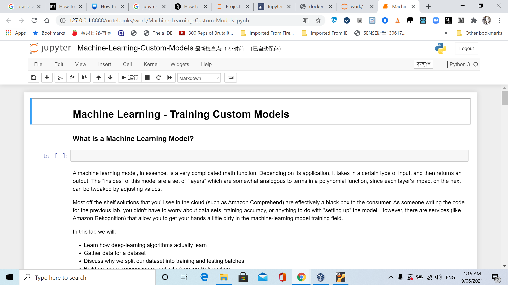
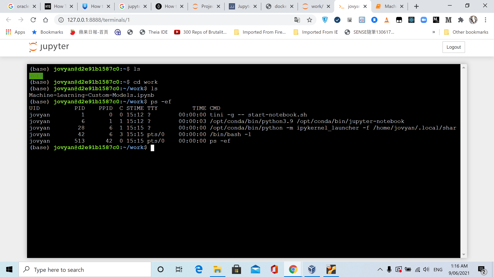

# Build docker of Jupyter Data Science Stack

* `docker-compose.yml`

```yaml
version: "3"
services:
  datascience-notebook:
      image:            jupyter/datascience-notebook
      volumes:
        - ${PWD}:/home/jovyan/work
      ports:
        - 8888:8888
      container_name:   datascience-notebook-container
```

```bash
$  docker-compose up
Creating network "learning-ds-ml-dl-ai_default" with the default driver
Pulling datascience-notebook (jupyter/datascience-notebook:)...
latest: Pulling from jupyter/datascience-notebook
345e3491a907: Pull complete
57671312ef6f: Pull complete
5e9250ddb7d0: Pull complete
e1fadee31091: Pull complete
70fa05f53554: Pull complete
4f4fb700ef54: Pull complete
80d0a768e52d: Pull complete
b8e1ae373de6: Pull complete
c13247cfb65f: Pull complete
eddf77815124: Pull complete
35ffc5e5dc79: Pull complete
97e18716b9a2: Pull complete
cdca71acba1b: Pull complete
c8469b528abe: Pull complete
fa53d08fc996: Pull complete
99cac836faeb: Pull complete
5f8cc05626db: Pull complete
c40336035c20: Pull complete
e03bfd4d9306: Pull complete
24020b1ee2d6: Pull complete
c3cb449385b7: Pull complete
b076937755be: Pull complete
79984f9899a9: Pull complete
8743f31903ec: Pull complete
2f8714978f8d: Pull complete
Digest: sha256:b3481a4592d1ff9ed6900c70b92f7541bd29bd38e4fa2070957696ae8070c458
Status: Downloaded newer image for jupyter/datascience-notebook:latest
Creating datascience-notebook-container ... done
Attaching to datascience-notebook-container
datascience-notebook-container | WARN: Jupyter Notebook deprecation notice https://github.com/jupyter/docker-stacks#jupyter-notebook-deprecation-notice.
datascience-notebook-container | Executing the command: jupyter notebook
datascience-notebook-container | [I 09:27:27.933 NotebookApp] Writing notebook server cookie secret to /home/jovyan/.local/share/jupyter/runtime/notebook_cookie_secret
datascience-notebook-container | [W 2021-06-08 09:27:29.921 LabApp] 'ip' has moved from NotebookApp to ServerApp. This config will be passed to ServerApp. Be sure to update your config before our next release.
datascience-notebook-container | [W 2021-06-08 09:27:29.924 LabApp] 'port' has moved from NotebookApp to ServerApp. This config will be passed to ServerApp. Be sure to update your config before our next release.
datascience-notebook-container | [W 2021-06-08 09:27:29.924 LabApp] 'port' has moved from NotebookApp to ServerApp. This config will be passed to ServerApp. Be sure to update your config before our next release.
datascience-notebook-container | [W 2021-06-08 09:27:29.925 LabApp] 'port' has moved from NotebookApp to ServerApp. This config will be passed to ServerApp. Be sure to update your config before our next release.
datascience-notebook-container | [I 2021-06-08 09:27:29.948 LabApp] JupyterLab extension loaded from /opt/conda/lib/python3.9/site-packages/jupyterlab
datascience-notebook-container | [I 2021-06-08 09:27:29.953 LabApp] JupyterLab application directory is /opt/conda/share/jupyter/lab
datascience-notebook-container | [I 09:27:29.972 NotebookApp] Serving notebooks from local directory: /home/jovyan
datascience-notebook-container | [I 09:27:29.972 NotebookApp] Jupyter Notebook 6.4.0 is running at:
datascience-notebook-container | [I 09:27:29.972 NotebookApp] http://773dbf074bbd:8888/?token=e9da589951b56bee0305ea37e81e53497cf3961fefdb1e1e
datascience-notebook-container | [I 09:27:29.972 NotebookApp]  or http://127.0.0.1:8888/?token=e9da589951b56bee0305ea37e81e53497cf3961fefdb1e1e
datascience-notebook-container | [I 09:27:29.972 NotebookApp] Use Control-C to stop this server and shut down all kernels (twice to skip confirmation).
datascience-notebook-container | [C 09:27:29.983 NotebookApp]
datascience-notebook-container |
datascience-notebook-container |     To access the notebook, open this file in a browser:
datascience-notebook-container |         file:///home/jovyan/.local/share/jupyter/runtime/nbserver-6-open.html
datascience-notebook-container |     Or copy and paste one of these URLs:
datascience-notebook-container |         http://773dbf074bbd:8888/?token=e9da589951b56bee0305ea37e81e53497cf3961fefdb1e1e
datascience-notebook-container |      or http://127.0.0.1:8888/?token=e9da589951b56bee0305ea37e81e53497cf3961fefdb1e1e
datascience-notebook-container | [I 09:28:17.786 NotebookApp] 302 GET /?token=e9da589951b56bee0305ea37e81e53497cf3961fefdb1e1e (172.24.0.1) 0.890000ms
datascience-notebook-container | [I 09:28:33.214 NotebookApp] Writing notebook-signing key to /home/jovyan/.local/share/jupyter/notebook_secret
datascience-notebook-container | [W 09:28:33.216 NotebookApp] Notebook work/Evaluating-Binary-Classification-Lab.ipynb is not trusted
datascience-notebook-container | [W 09:28:34.423 NotebookApp] 403 GET /api/contents/work/Evaluating-Binary-Classification-Lab.ipynb/checkpoints?_=1623144512418 (172.24.0.1): Permission denied: work/.ipynb_checkpoints
datascience-notebook-container | [W 09:28:34.423 NotebookApp] Permission denied: work/.ipynb_checkpoints
datascience-notebook-container | [W 09:28:34.424 NotebookApp] 403 GET /api/contents/work/Evaluating-Binary-Classification-Lab.ipynb/checkpoints?_=1623144512418 (172.24.0.1) 2.310000ms referer=http://127.0.0.1:8888/notebooks/work/Evaluating-Binary-Classification-Lab.ipynb
datascience-notebook-container | [I 09:28:34.684 NotebookApp] Kernel started: 7a474aa0-c226-46f8-85ac-0ff4cd188405, name: python3
```

> Let make it into GNU make to automate operation in menu

```
$  make ipynb-up
 jso  ubunu2004  ~  myob-work  …  projects  JackySo-24x7classroom  Learning-DS-ML-DL-AI  main  2✎  5?  $  Creating network "learning-ds-ml-dl-ai_default" with the default driver
Creating datascience-notebook-container ... done
Attaching to datascience-notebook-container
datascience-notebook-container | WARN: Jupyter Notebook deprecation notice https://github.com/jupyter/docker-stacks#jupyter-notebook-deprecation-notice.
datascience-notebook-container | Executing the command: jupyter notebook
datascience-notebook-container | [I 15:12:37.860 NotebookApp] Writing notebook server cookie secret to /home/jovyan/.local/share/jupyter/runtime/notebook_cookie_secret
datascience-notebook-container | [W 2021-06-08 15:12:39.957 LabApp] 'ip' has moved from NotebookApp to ServerApp. This config will be passed to ServerApp. Be sure to update your config before our next release.
datascience-notebook-container | [W 2021-06-08 15:12:39.958 LabApp] 'port' has moved from NotebookApp to ServerApp. This config will be passed to ServerApp. Be sure to update your config before our next release.
datascience-notebook-container | [W 2021-06-08 15:12:39.958 LabApp] 'port' has moved from NotebookApp to ServerApp. This config will be passed to ServerApp. Be sure to update your config before our next release.
datascience-notebook-container | [W 2021-06-08 15:12:39.959 LabApp] 'port' has moved from NotebookApp to ServerApp. This config will be passed to ServerApp. Be sure to update your config before our next release.
datascience-notebook-container | [I 2021-06-08 15:12:39.982 LabApp] JupyterLab extension loaded from /opt/conda/lib/python3.9/site-packages/jupyterlab
datascience-notebook-container | [I 2021-06-08 15:12:39.982 LabApp] JupyterLab application directory is /opt/conda/share/jupyter/lab
datascience-notebook-container | [I 15:12:40.005 NotebookApp] Serving notebooks from local directory: /home/jovyan
datascience-notebook-container | [I 15:12:40.005 NotebookApp] Jupyter Notebook 6.4.0 is running at:
datascience-notebook-container | [I 15:12:40.005 NotebookApp] http://d2e91b1587c0:8888/?token=8cc738fff46d25e96f436968ccd9359814969616d33e7e40
datascience-notebook-container | [I 15:12:40.005 NotebookApp]  or http://127.0.0.1:8888/?token=8cc738fff46d25e96f436968ccd9359814969616d33e7e40
datascience-notebook-container | [I 15:12:40.006 NotebookApp] Use Control-C to stop this server and shut down all kernels (twice to skip confirmation).
datascience-notebook-container | [C 15:12:40.017 NotebookApp]
datascience-notebook-container |
datascience-notebook-container |     To access the notebook, open this file in a browser:
datascience-notebook-container |         file:///home/jovyan/.local/share/jupyter/runtime/nbserver-6-open.html
datascience-notebook-container |     Or copy and paste one of these URLs:
datascience-notebook-container |         http://d2e91b1587c0:8888/?token=8cc738fff46d25e96f436968ccd9359814969616d33e7e40
datascience-notebook-container |      or http://127.0.0.1:8888/?token=8cc738fff46d25e96f436968ccd9359814969616d33e7e40
```

* Launch a browser and connect to launched Jupyter stack `http://localhost:8888/?token=<TOKEN>`

> Jupyter Notebook



> Terminal



> Stop this docker container

```bash
$  make ipynb-down
Stopping datascience-notebook-container ...
datascience-notebook-container | [C 15:16:55.764 NotebookApp] received signal 15, stopping
datascience-notebook-container | [I 15:16:55.765 NotebookApp] Shutting down 1 kernel
datascience-notebook-container | [I 15:16:56.077 NotebookApp] Kernel shutdown: 5fb929e8-354e-45a3-a89e-cab2c028d996
datascience-notebook-container | [I 15:16:56.078 NotebookApp] Shutting down 1 terminal
datascience-notebook-container | [I 15:16:56.081 NotebookApp] EOF on FD 37; stopping reading
Stopping datascience-notebook-container ... done
datascience-notebook-container exited with code 0
Removing datascience-notebook-container ... done
Removing network learning-ds-ml-dl-ai_default
```

---

