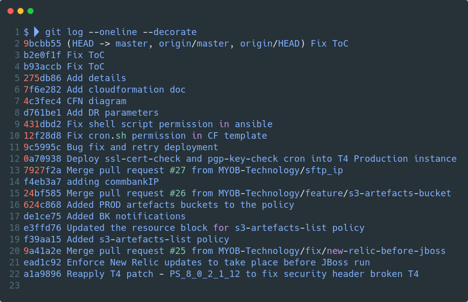

# Analysis code changes in git repository

<p align="center"></p>
---

🔧 **Technologies & Tools:**


> `Last commit`

```diff
$  git show
commit 9bcbb55d9fa4f139507c688d99acb35b6957a21f (HEAD -> master, origin/master, origin/HEAD)
Author: Jacky So <jacky.so@myob.com>
Date:   Thu Apr 8 17:34:44 2021 +1000

    Fix ToC

diff --git a/README.md b/README.md
index 44b3cc3..d677d8b 100644
--- a/README.md
+++ b/README.md
@@ -18,7 +18,7 @@ This repository contains the infrastructure code and automation for the T4 bankf
     - [Parameters](#Parameters)
     - [ELB](#ELB)
     - [Auto Scaling Group & Launch Config](#Auto-Scaling-Group--Launch-Config)
-    - [ALB, Auto Scaling Group & Launch Config](#ALB,-Auto-Scaling-Group--Launch-Config)
+    - [ALB, Auto Scaling Group & Launch Config](#ALB-Auto-Scaling-Group--Launch-Config)
     - [IAM Role & Policy](#IAM-Role--Policy)
     - [Security Groups](#Security-Groups)
   - [Web Stack](#Web-Stack)
```

> `Commit log on file`

```diff
$  git log template.yml
commit d761be1dfb9751118648309ddd60c62c89fb3210
Author: Jacky So <jacky.so@myob.com>
Date:   Thu Mar 25 16:08:07 2021 +1100

    Add DR parameters

commit 12f28d8969c536669f343de49aed777234b5bfc1
Author: Jacky So <jacky.so@myob.com>
Date:   Wed Feb 24 19:22:44 2021 +1100

    Fix cron.sh permission in CF template

commit 9c5995c8065c06a1d03fbb66978d2950096df2e8
Author: Jacky So <jacky.so@myob.com>
Date:   Wed Feb 24 18:44:53 2021 +1100

    Bug fix and retry deployment

commit 0a70938aba82e66a45a2e7b81d47ae8b5252880f
Author: Jacky So <jacky.so@myob.com>
Date:   Wed Feb 24 17:46:03 2021 +1100

    Deploy ssl-cert-check and pgp-key-check cron into T4 Production instance

commit f4eb3a755ddee12077a2b9e7b8b8bec484df831a
Author: Liaquath.Alikhan <Liaquath.Alikhan@myob.com>
Date:   Mon Feb 15 20:45:18 2021 +1100

    adding commbankIP

commit 624c86836b26dcd5e0b3648c35e1017563675508
Author: Tommy Tang <tommy.tang@servian.com>
Date:   Thu Jan 21 21:25:36 2021 +1100

    Added PROD artefacts buckets to the policy
```
> `Last 10 of One-liner commit log`

```
$  git log --oneline template.yml | head -10
d761be1 Add DR parameters
12f28d8 Fix cron.sh permission in CF template
9c5995c Bug fix and retry deployment
0a70938 Deploy ssl-cert-check and pgp-key-check cron into T4 Production instance
f4eb3a7 adding commbankIP
624c868 Added PROD artefacts buckets to the policy
e3ffd76 Updated the resource block for s3-artefacts-list policy
f39aa15 Added s3-artefacts-list policy
ead1c92 Enforce New Relic updates to take place before JBoss run
5c98c5f Disable HTTPS Listener TLSv1.0
```

> `Dig out difference between commit ID of file`

```diff
$  git diff 12f28d d761be1 template.yml
diff --git a/cloudformation/app/template.yml b/cloudformation/app/template.yml
index 18309cd..162d4eb 100755
--- a/cloudformation/app/template.yml
+++ b/cloudformation/app/template.yml
@@ -9,6 +9,7 @@ Parameters:
     AllowedValues:
       - dev
       - prod
+      - dr

   AzCount:
     Description: Number of Availability Zones to deploy
@@ -500,6 +501,9 @@ Resources:
                     elif [ "${ENV}" == "prod" ]
                     then
                     echo '10.60.130.115        aumelbizpci01.myob.myobcorp.net aumelpcibizt01.myob.myobcorp.net' >> /etc/hosts
+                    elif [ "${ENV}" == "dr" ]
+                    then
+                    echo '10.60.130.115        aumelbizpci01.myob.myobcorp.net aumelpcibizt01.myob.myobcorp.net' >> /etc/hosts
                     fi
                     chmod 644 /etc/hosts
                     fi
@@ -520,6 +524,9 @@ Resources:
                     elif [ "${ENV}" == "prod" ]
                     then
                     sed -i 's/app_name: MPS Translator Production/app_name: MPS Translator 4 PROD/' /apps/mps/jboss/newrelic.yml
+                    elif [ "${ENV}" == "dr" ]
+                    then
+                    sed -i 's/app_name: MPS Translator Production/app_name: MPS Translator 4 DR/' /apps/mps/jboss/newrelic.yml
                     fi
                     chmod 644 /apps/mps/jboss/newrelic.yml
                     fi
```

> `Using awk to git diff file between commits`

```diff
$  git log --oneline --decorate template.yml | head -5 | awk '{ print $1 }' | sed ':a;N;$!ba;s/\n/ /g' | awk '{ system("git diff " $3 " " $2 " template.yml") }'
diff --git a/cloudformation/app/template.yml b/cloudformation/app/template.yml
index e25aa16..18309cd 100755
--- a/cloudformation/app/template.yml
+++ b/cloudformation/app/template.yml
@@ -375,7 +375,7 @@ Resources:
                     fi
                     fi
                   - ENV: !Ref Environment
-              mode: '000600'
+              mode: '000750'
               owner: root
               group: root
             /apps/mps/monit.sh:

$  git log --oneline --decorate template.yml | head -5 | awk '{ print $1 }' | sed ':a;N;$!ba;s/\n/ /g' | awk '{ system("git diff " $4 " " $3 " template.yml") }'
diff --git a/cloudformation/app/template.yml b/cloudformation/app/template.yml
index dc08a8e..e25aa16 100755
--- a/cloudformation/app/template.yml
+++ b/cloudformation/app/template.yml
@@ -368,11 +368,11 @@ Resources:
                     #!/bin/bash
                     if [ -f "/var/spool/cron/jboss" ]
                     then
-                        if [ "${ENV}" == "prod" ]
-                        then
-                        sed -i '%#0 10 \* \* 1 \[ -f /usr/local/bin/pgp-key-expiry \] && /usr/local/bin/pgp-key-expiry -a -q -x 60 -e myobex-area51@myob.com%0 10 \* \* 1 \[ -f /usr/local/bin/pgp-key-expiry \] && /usr/local/bin/pgp-key-expiry -a -q -x 60 -e myobex-area51@myob.com%' /var/spool/cron/jboss
-                        sed -i '%#0 10 \* \* 1 \[ -f /usr/local/bin/ssl-cert-expiry \] && /usr/local/bin/ssl-cert-expiry -a -q -x 60 -e myobex-area51@myob.com%0 10 \* \* 1 \[ -f /usr/local/bin/pgp-key-expiry \] && /usr/local/bin/pgp-key-expiry -a -q -x 60 -e myobex-area51@myob.com%' /var/spool/cron/jboss
-                        fi
+                    if [ "${ENV}" == "prod" ]
+                    then
+                    sed -i '%#0 10 \* \* 1 \[ -f /usr/local/bin/pgp-key-expiry \] && /usr/local/bin/pgp-key-expiry -a -q -x 60 -e myobex-area51@myob.com%0 10 \* \* 1 \[ -f /usr/local/bin/pgp-key-expiry \] && /usr/local/bin/pgp-key-expiry -a -q -x 60 -e myobex-area51@myob.com%' /var/spool/cron/jboss
+                    sed -i '%#0 10 \* \* 1 \[ -f /usr/local/bin/ssl-cert-expiry \] && /usr/local/bin/ssl-cert-expiry -a -q -x 60 -e myobex-area51@myob.com%0 10 \* \* 1 \[ -f /usr/local/bin/pgp-key-expiry \] && /usr/local/bin/pgp-key-expiry -a -q -x 60 -e myobex-area51@myob.com%' /var/spool/cron/jboss
+                    fi
                     fi
                   - ENV: !Ref Environment
               mode: '000600'

$  git log --oneline --decorate template.yml | head -5 | awk '{ print $1 }' | sed ':a;N;$!ba;s/\n/ /g' | awk '{ system("git diff " $5 " " $4 " template.yml") }'
diff --git a/cloudformation/app/template.yml b/cloudformation/app/template.yml
index dc0ab72..dc08a8e 100755
--- a/cloudformation/app/template.yml
+++ b/cloudformation/app/template.yml
@@ -358,7 +358,26 @@ Resources:
               command: "/apps/mps/hosts.sh && rm /apps/mps/hosts.sh"
             10_configure_zabbix:
               command: "/apps/mps/zabbix.sh && rm /apps/mps/zabbix.sh"
+            11_configure_cron:
+              command: "/apps/mps/cron.sh && rm /apps/mps/cron.sh"
           files:
+            /apps/mps/cron.sh:
+              content:
+                Fn::Sub:
+                  - |
+                    #!/bin/bash
+                    if [ -f "/var/spool/cron/jboss" ]
+                    then
+                        if [ "${ENV}" == "prod" ]
+                        then
+                        sed -i '%#0 10 \* \* 1 \[ -f /usr/local/bin/pgp-key-expiry \] && /usr/local/bin/pgp-key-expiry -a -q -x 60 -e myobex-area51@myob.com%0 10 \* \* 1 \[ -f /usr/local/bin/pgp-key-expiry \] && /usr/local/bin/pgp-key-expiry -a -q -x 60 -e myobex-area51@myob.com%' /var/spool/cron/jboss
+                        sed -i '%#0 10 \* \* 1 \[ -f /usr/local/bin/ssl-cert-expiry \] && /usr/local/bin/ssl-cert-expiry -a -q -x 60 -e myobex-area51@myob.com%0 10 \* \* 1 \[ -f /usr/local/bin/pgp-key-expiry \] && /usr/local/bin/pgp-key-expiry -a -q -x 60 -e myobex-area51@myob.com%' /var/spool/cron/jboss
+                        fi
+                    fi
+                  - ENV: !Ref Environment
+              mode: '000600'
+              owner: root
+              group: root
             /apps/mps/monit.sh:
               content:
                 Fn::Sub:

```
> `Last 10 commits change of file`

```diff
$  git log --oneline --decorate template.yml | head -10 | awk '{ print $1 }' | sed ':a;N;$!ba;s/\n/ /g' | awk '{ system("git diff " $6 " " $5 " template.yml") }'
diff --git a/cloudformation/app/template.yml b/cloudformation/app/template.yml
index 4ed09a0..dc0ab72 100755
--- a/cloudformation/app/template.yml
+++ b/cloudformation/app/template.yml
@@ -139,6 +139,11 @@ Parameters:
     Default: "140.168.128.42/32"
     Type: String

+  CommbankIp2:
+    Description: Commbank SFTP server IP
+    Default: "140.168.74.77/32"
+    Type: String
+
   CSUCertArn:
     Type: String
     Description: T4 CSU Certificate Arn
@@ -759,7 +764,12 @@ Resources:
           FromPort: 22
           ToPort: 22
           CidrIp: !Ref CommbankIp
-          Description: !Sub "SFTP to securetransfer.commbank.com.au"
+          Description: !Sub "SFTP to securetransfer.commbank.com.au IP1"
+        - IpProtocol: tcp
+          FromPort: 22
+          ToPort: 22
+          CidrIp: !Ref CommbankIp2
+          Description: !Sub "SFTP to securetransfer.commbank.com.au IP2"
         - IpProtocol: tcp
           FromPort: 443
           ToPort: 443
$  git log --oneline --decorate template.yml | head -10 | awk '{ print $1 }' | sed ':a;N;$!ba;s/\n/ /g' | awk '{ system("git diff " $10 " " $1 " template.yml") }'
diff --git a/cloudformation/app/template.yml b/cloudformation/app/template.yml
index 7a91164..162d4eb 100755
--- a/cloudformation/app/template.yml
+++ b/cloudformation/app/template.yml
@@ -9,6 +9,7 @@ Parameters:
     AllowedValues:
       - dev
       - prod
+      - dr

   AzCount:
     Description: Number of Availability Zones to deploy
@@ -139,6 +140,11 @@ Parameters:
     Default: "140.168.128.42/32"
     Type: String

+  CommbankIp2:
+    Description: Commbank SFTP server IP
+    Default: "140.168.74.77/32"
+    Type: String
+
   CSUCertArn:
     Type: String
     Description: T4 CSU Certificate Arn
@@ -339,21 +345,40 @@ Resources:
               command: "mkdir -p /var/awslogs/state"
             03_awslogsd:
               command: "systemctl start awslogsd && systemctl enable awslogsd"
-            04_start_jboss:
-              command: "su -c 'eval /iServices/ps/bin/start_server.sh >>/apps/mps/jboss/start_server.log 2>&1 &' - jboss"
+            04_configure_newrelic:
+              command: "/apps/mps/newrelic.sh && rm /apps/mps/newrelic.sh"
             05_authorized_key:
               command: "/apps/mps/key.sh && rm /apps/mps/key.sh"
-            06_postfix_relayhost:
+            06_start_jboss:
+              command: "su -c 'eval /iServices/ps/bin/start_server.sh >>/apps/mps/jboss/start_server.log 2>&1 &' - jboss"
+            07_postfix_relayhost:
               command: "/apps/mps/smtp.sh && rm /apps/mps/smtp.sh"
-            07_start_monit:
+            08_start_monit:
               command: "/apps/mps/monit.sh && rm /apps/mps/monit.sh"
-            08_configure_newrelic:
-              command: "/apps/mps/newrelic.sh && rm /apps/mps/newrelic.sh"
             09_add_hosts:
               command: "/apps/mps/hosts.sh && rm /apps/mps/hosts.sh"
             10_configure_zabbix:
               command: "/apps/mps/zabbix.sh && rm /apps/mps/zabbix.sh"
+            11_configure_cron:
+              command: "/apps/mps/cron.sh && rm /apps/mps/cron.sh"
           files:
+            /apps/mps/cron.sh:
+              content:
+                Fn::Sub:
+                  - |
+                    #!/bin/bash
+                    if [ -f "/var/spool/cron/jboss" ]
+                    then
+                    if [ "${ENV}" == "prod" ]
+                    then
+                    sed -i '%#0 10 \* \* 1 \[ -f /usr/local/bin/pgp-key-expiry \] && /usr/local/bin/pgp-key-expiry -a -q -x 60 -e myobex-area51@myob.com%0 10 \* \* 1 \[ -f /usr/local/bin/pgp-key-expiry \] && /usr/local/bin/pgp-key-expiry -a -q -x 60 -e myobex-area51@myob.com%' /var/spool/cron/jboss
+                    sed -i '%#0 10 \* \* 1 \[ -f /usr/local/bin/ssl-cert-expiry \] && /usr/local/bin/ssl-cert-expiry -a -q -x 60 -e myobex-area51@myob.com%0 10 \* \* 1 \[ -f /usr/local/bin/pgp-key-expiry \] && /usr/local/bin/pgp-key-expiry -a -q -x 60 -e myobex-area51@myob.com%' /var/spool/cron/jboss
+                    fi
+                    fi
+                  - ENV: !Ref Environment
+              mode: '000750'
+              owner: root
+              group: root
             /apps/mps/monit.sh:
               content:
                 Fn::Sub:
@@ -476,6 +501,9 @@ Resources:
                     elif [ "${ENV}" == "prod" ]
                     then
                     echo '10.60.130.115        aumelbizpci01.myob.myobcorp.net aumelpcibizt01.myob.myobcorp.net' >> /etc/hosts
+                    elif [ "${ENV}" == "dr" ]
+                    then
+                    echo '10.60.130.115        aumelbizpci01.myob.myobcorp.net aumelpcibizt01.myob.myobcorp.net' >> /etc/hosts
                     fi
                     chmod 644 /etc/hosts
                     fi
@@ -496,6 +524,9 @@ Resources:
                     elif [ "${ENV}" == "prod" ]
                     then
                     sed -i 's/app_name: MPS Translator Production/app_name: MPS Translator 4 PROD/' /apps/mps/jboss/newrelic.yml
+                    elif [ "${ENV}" == "dr" ]
+                    then
+                    sed -i 's/app_name: MPS Translator Production/app_name: MPS Translator 4 DR/' /apps/mps/jboss/newrelic.yml
                     fi
                     chmod 644 /apps/mps/jboss/newrelic.yml
                     fi
@@ -653,6 +684,23 @@ Resources:
                   - "elasticfilesystem:DescribeAccessPoints"
                 Resource:
                   - !Sub arn:aws:elasticfilesystem:${AWS::Region}:${AWS::AccountId}:file-system/*
+        - PolicyName: s3-artefacts-list
+          PolicyDocument:
+            Version: "2012-10-17"
+            Statement:
+              - Effect: "Allow"
+                Action:
+                  - "s3:PutObject"
+                  - "s3:GetObject"
+                  - "s3:GetObjectAcl"
+                  - "s3:ListBucket"
+                  - "s3:ListBucketMultipartUploads"
+                  - "s3:ListMultipartUploadParts"
+                Resource:
+                  - "arn:aws:s3:::myob-bankfeeds-696822041448-artefacts-bucket/*"
+                  - "arn:aws:s3:::myob-bankfeeds-696822041448-artefacts-bucket"
+                  - "arn:aws:s3:::myob-bankfeeds-910253531162-artefacts-bucket/*"
+                  - "arn:aws:s3:::myob-bankfeeds-910253531162-artefacts-bucket"

   ReadSSMRole:
     Type: AWS::IAM::Role
@@ -742,7 +790,12 @@ Resources:
           FromPort: 22
           ToPort: 22
           CidrIp: !Ref CommbankIp
-          Description: !Sub "SFTP to securetransfer.commbank.com.au"
+          Description: !Sub "SFTP to securetransfer.commbank.com.au IP1"
+        - IpProtocol: tcp
+          FromPort: 22
+          ToPort: 22
+          CidrIp: !Ref CommbankIp2
+          Description: !Sub "SFTP to securetransfer.commbank.com.au IP2"
         - IpProtocol: tcp
           FromPort: 443
           ToPort: 443
```

> `Last 10 commits of repository and show changes`

```diff
$  git log --oneline --decorate | head -10
9bcbb55 (HEAD -> master, origin/master, origin/HEAD) Fix ToC
b2e0f1f Fix ToC
b93accb Fix ToC
275db86 Add details
7f6e282 Add cloudformation doc
4c3fec4 CFN diagram
d761be1 Add DR parameters
431dbd2 Fix shell script permission in ansible
12f28d8 Fix cron.sh permission in CF template
9c5995c Bug fix and retry deployment

$  git log --oneline --decorate | head -10 | awk '{ print $1 }' | sed ':a;N;$!ba;s/\n/ /g' | awk '{ system("git diff " $10 " " $1) }'
diff --git a/README.md b/README.md
index 169484c..d677d8b 100644
--- a/README.md
+++ b/README.md
@@ -3,11 +3,49 @@
 # Bankfeeds T4 Services
 This repository contains the infrastructure code and automation for the T4 bankfeeds service.

+**Table of content**
+
+- [Architecture](#Architecture)
+  - [Built by Cloudformation](#Built-by-Cloudformation)
+- [Tools](#Tools)
+  - [Packer](#Packer)
+  - [Stackup](#Stackup)
+  - [Shush](#Shush)
+    - [Shush encrypt:](#Shush-encrypt)
+    - [Shush decrypt:](#Shush-decrypt)
+- [Stack Layers](#Stack-Layers)
+  - [Apps Stack](#Apps-Stack)
+    - [Parameters](#Parameters)
+    - [ELB](#ELB)
+    - [Auto Scaling Group & Launch Config](#Auto-Scaling-Group--Launch-Config)
+    - [ALB, Auto Scaling Group & Launch Config](#ALB-Auto-Scaling-Group--Launch-Config)
+    - [IAM Role & Policy](#IAM-Role--Policy)
+    - [Security Groups](#Security-Groups)
+  - [Web Stack](#Web-Stack)
+    - [Elastic IPs](#Elastic-IPs)
+    - [NLBs](#NLBs)
+    - [ALB](#ALB)
+  - [IP Register Lambda Stack](#IP-Register-Lambda-Stack)
+    - [IP register & S3 bucket](#IP-register--S3-bucket)
+- [Automation / Pipeline](#Automation--Pipeline)
+- [Manual Deploy](#Manual-Deploy)
+  - [Test & Deploy](#Test--Deploy)
+    - [Linting & CF Template Validation:](#Linting--CF-Template-Validation:)
+    - [Bake AMI:](#Bake-AMI)
+    - [Deploy:](#Deploy)
+- [Accessing the Instance](#Accessing-the-Instance)
+- [T4 release patching](#T4-release-patching)
+- [Known Issues](#Known-Issues)
+  - [Java installation issue](#Java-installation-issue)
+
 ## Architecture
 Bankfeeds Translator 4 (T4) is a 3 tier application using Apache, JBOSS and Oracle database. However the web layer has been replaced by AWS ELBs for reverse proxy and load balancing. Application servers are now managed by an AWS Auto Scaling Group for optimised performance. Oracle database has been migrated to AWS RDS.

 

+### Built by Cloudformation
+[Architecture built by cloudformation][stack-cloudformation-analysis]
+
 ## Tools
 The following tools are used to instantiate this service:

@@ -75,6 +113,8 @@ The following layers are included in this CF stack:
 ### Apps Stack
 * `bankfeeds-t4-app`: ELB (Elastic Load Balancer), Auto Scaling Group & Launch Configuration, IAM Role & Policy & Security Groups

+> [cloudformation template diaram][stack-cloudformation-analysis]
+
 #### Parameters
   * `DesiredInstances` - The desired number of instances in ASG.
   * `InstanceType` - EC2 instance type
@@ -135,6 +175,8 @@ EC2 instances sit in Auto Scaling Group (ASG) with defined Launch Configs. ASG i
 ### Web Stack
 * `bankfeeds-t4-web`: ELB (Elastic Load Balancer), ALB (Application Load Balancer) & Security Groups

+> [cloudformation template diaram][stack-cloudformation-analysis]
+
 #### Elastic IPs
 Elastic IPs are used for the NLB. They are static IP addresses which can be whitelisted on MYOB firewalls.

@@ -160,6 +202,8 @@ Two NLBs are running in public subnet with Elastic IPs attached. NLBs are listen
 ### IP Register Lambda Stack
 * `bankfeeds-t4-ip-register-lamda`: Lambda

+> [cloudformation template diaram][stack-cloudformation-analysis]
+
 #### IP register & S3 bucket
 Given that ALB can scale vertically based on the load, IP addresses for the ALB can change over time without affecting the end user experience. However NLB can only have static IP addresses registered to its target groups. Therefore a Lambda function has been built to run every minute based on the scheduled rule from EventBridge. The function does a dns lookup of ALB's A record to retrieve the IP addresses which are consequently registered to NLB's target group (if the IP addresses are different from the existing registered targets). The IP register S3 bucket keeps a record of any existing and new IP addresses of Alb. The frequency of invocations can be modified by changing `ScheduleExpression` in `AWS::Events::Rule` resource.

@@ -228,3 +272,5 @@ From the EC2 Console, right click your instance and click `Connect`. In the popu
 1. [shush](https://github.com/realestate-com-au/shush)
 2. [stackup](https://github.com/realestate-com-au/stackup)
 3. [myob-auth](https://github.com/MYOB-Technology/myob-auth)
+
+[stack-cloudformation-analysis]: docs/cloudformation.md
diff --git a/cloudformation/app/template.yml b/cloudformation/app/template.yml
index e25aa16..162d4eb 100755
--- a/cloudformation/app/template.yml
+++ b/cloudformation/app/template.yml
@@ -9,6 +9,7 @@ Parameters:
     AllowedValues:
       - dev
       - prod
+      - dr

   AzCount:
     Description: Number of Availability Zones to deploy
@@ -375,7 +376,7 @@ Resources:
                     fi
                     fi
                   - ENV: !Ref Environment
-              mode: '000600'
+              mode: '000750'
               owner: root
               group: root
             /apps/mps/monit.sh:
@@ -500,6 +501,9 @@ Resources:
                     elif [ "${ENV}" == "prod" ]
                     then
                     echo '10.60.130.115        aumelbizpci01.myob.myobcorp.net aumelpcibizt01.myob.myobcorp.net' >> /etc/hosts
+                    elif [ "${ENV}" == "dr" ]
+                    then
+                    echo '10.60.130.115        aumelbizpci01.myob.myobcorp.net aumelpcibizt01.myob.myobcorp.net' >> /etc/hosts
                     fi
                     chmod 644 /etc/hosts
                     fi
@@ -520,6 +524,9 @@ Resources:
                     elif [ "${ENV}" == "prod" ]
                     then
                     sed -i 's/app_name: MPS Translator Production/app_name: MPS Translator 4 PROD/' /apps/mps/jboss/newrelic.yml
+                    elif [ "${ENV}" == "dr" ]
+                    then
+                    sed -i 's/app_name: MPS Translator Production/app_name: MPS Translator 4 DR/' /apps/mps/jboss/newrelic.yml
                     fi
                     chmod 644 /apps/mps/jboss/newrelic.yml
                     fi
diff --git a/cloudformation/lambda/template.yml b/cloudformation/lambda/template.yml
index e32b849..091cb43 100644
--- a/cloudformation/lambda/template.yml
+++ b/cloudformation/lambda/template.yml
@@ -9,6 +9,7 @@ Parameters:
     AllowedValues:
       - dev
       - prod
+      - dr

   MAXDNSLookupPerInvocation:
     Type: Number
diff --git a/cloudformation/web/template.yml b/cloudformation/web/template.yml
index 99b17a4..2fadf25 100644
--- a/cloudformation/web/template.yml
+++ b/cloudformation/web/template.yml
@@ -8,6 +8,7 @@ Parameters:
     AllowedValues:
       - dev
       - prod
+      - dr

   AzCount:
     Description: Number of Availability Zones to deploy
diff --git a/docs/cloudformation.md b/docs/cloudformation.md
new file mode 100644
index 0000000..de06650
--- /dev/null
+++ b/docs/cloudformation.md
@@ -0,0 +1,13 @@
+# Cloudformation - Bankfeeds T4 build
+
+***T4 Application layer stack***
+
+
+
+***T4 Web layer stack***
+
+
+
+***T4 lambda layer stack***
+
+
diff --git a/docs/diagrams/bankfeeds-t4-app-cfn.png b/docs/diagrams/bankfeeds-t4-app-cfn.png
new file mode 100644
index 0000000..a9c4793
Binary files /dev/null and b/docs/diagrams/bankfeeds-t4-app-cfn.png differ
diff --git a/docs/diagrams/bankfeeds-t4-lambda-cfn.png b/docs/diagrams/bankfeeds-t4-lambda-cfn.png
new file mode 100644
index 0000000..52403ff
Binary files /dev/null and b/docs/diagrams/bankfeeds-t4-lambda-cfn.png differ
diff --git a/docs/diagrams/bankfeeds-t4-web-cfn.png b/docs/diagrams/bankfeeds-t4-web-cfn.png
new file mode 100644
index 0000000..6900fb1
Binary files /dev/null and b/docs/diagrams/bankfeeds-t4-web-cfn.png differ
diff --git a/packer/ansible/os/playbook.yml b/packer/ansible/os/playbook.yml
index 2e66222..bfe82d1 100644
--- a/packer/ansible/os/playbook.yml
+++ b/packer/ansible/os/playbook.yml
@@ -147,6 +147,16 @@
         - pgp-key-expiry
         - ssl-cert-expiry

+    - name: Change mode of downloaded scripts
+      file:
+        path: "/usr/local/bin/{{ item }}"
+        owner: root
+        group: root
+        mode: '0755'
+      with_items:
+        - pgp-key-expiry
+        - ssl-cert-expiry
+
     - name: Change on inet_interfaces = localhost to all
       lineinfile:
         dest: "/etc/postfix/main.cf"
```

## Automation - pick commit ID choice and show diff between ID to current HEAD

> `Last 10 commits of file - eg. CF template.yml`

```bash
$  PS3="Input your commit choice to edit or cltr-C to quit: "; select opt in `git log --oneline template.yml | head -10 | awk -F'"' '{print $1=$2""$1}' | sed 's/ /_/g'`; do git diff `echo $opt | awk -F'_' '{ print $1 }'` HEAD template.yml ; break; done
 1) d761be1_Add_DR_parameters
 2) 12f28d8_Fix_cron.sh_permission_in_CF_template
 3) 9c5995c_Bug_fix_and_retry_deployment
 4) 0a70938_Deploy_ssl-cert-check_and_pgp-key-check_cron_into_T4_Production_instance
 5) f4eb3a7_adding_commbankIP
 6) 624c868_Added_PROD_artefacts_buckets_to_the_policy
 7) e3ffd76_Updated_the_resource_block_for_s3-artefacts-list_policy
 8) f39aa15_Added_s3-artefacts-list_policy
 9) ead1c92_Enforce_New_Relic_updates_to_take_place_before_JBoss_run
10) 5c98c5f_Disable_HTTPS_Listener_TLSv1.0
Input your commit choice to edit or cltr-C to quit: 3
```
<details><summary><i>Show git diff output</i></summary>

```diff
diff --git a/cloudformation/app/template.yml b/cloudformation/app/template.yml
index e25aa16..162d4eb 100755
--- a/cloudformation/app/template.yml
+++ b/cloudformation/app/template.yml
@@ -9,6 +9,7 @@ Parameters:
     AllowedValues:
       - dev
       - prod
+      - dr

   AzCount:
     Description: Number of Availability Zones to deploy
@@ -375,7 +376,7 @@ Resources:
                     fi
                     fi
                   - ENV: !Ref Environment
-              mode: '000600'
+              mode: '000750'
               owner: root
               group: root
             /apps/mps/monit.sh:
@@ -500,6 +501,9 @@ Resources:
                     elif [ "${ENV}" == "prod" ]
                     then
                     echo '10.60.130.115        aumelbizpci01.myob.myobcorp.net aumelpcibizt01.myob.myobcorp.net' >> /etc/hosts
+                    elif [ "${ENV}" == "dr" ]
+                    then
+                    echo '10.60.130.115        aumelbizpci01.myob.myobcorp.net aumelpcibizt01.myob.myobcorp.net' >> /etc/hosts
                     fi
                     chmod 644 /etc/hosts
                     fi
@@ -520,6 +524,9 @@ Resources:
                     elif [ "${ENV}" == "prod" ]
                     then
                     sed -i 's/app_name: MPS Translator Production/app_name: MPS Translator 4 PROD/' /apps/mps/jboss/newrelic.yml
+                    elif [ "${ENV}" == "dr" ]
+                    then
+                    sed -i 's/app_name: MPS Translator Production/app_name: MPS Translator 4 DR/' /apps/mps/jboss/newrelic.yml
                     fi
                     chmod 644 /apps/mps/jboss/newrelic.yml
                     fi
```

</details><br>

> `Last 30 commits of repository`

```bash
 $  PS3="Input your commit choice to edit or cltr-C to quit: "; select opt in `git log --oneline | head -30 | awk -F'"' '{print $1=$2""$1}' | sed 's/ /_/g'`; do git diff `echo $opt | awk -F'_' '{ print $1 }'` HEAD ; break; done
 1) 9bcbb55_Fix_ToC
 2) b2e0f1f_Fix_ToC
 3) b93accb_Fix_ToC
 4) 275db86_Add_details
 5) 7f6e282_Add_cloudformation_doc
 6) 4c3fec4_CFN_diagram
 7) d761be1_Add_DR_parameters
 8) 431dbd2_Fix_shell_script_permission_in_ansible
 9) 12f28d8_Fix_cron.sh_permission_in_CF_template
10) 9c5995c_Bug_fix_and_retry_deployment
11) 0a70938_Deploy_ssl-cert-check_and_pgp-key-check_cron_into_T4_Production_instance
12) 7927f2a_Merge_pull_request_#27_from_MYOB-Technology/sftp_ip
13) f4eb3a7_adding_commbankIP
14) 24bf585_Merge_pull_request_#26_from_MYOB-Technology/feature/s3-artefacts-bucket
15) 624c868_Added_PROD_artefacts_buckets_to_the_policy
16) de1ce75_Added_BK_notifications
17) e3ffd76_Updated_the_resource_block_for_s3-artefacts-list_policy
18) f39aa15_Added_s3-artefacts-list_policy
19) 9a41a2e_Merge_pull_request_#25_from_MYOB-Technology/fix/new-relic-before-jboss
20) ead1c92_Enforce_New_Relic_updates_to_take_place_before_JBoss_run
21) a1a9896_Reapply_T4_patch_-_PS_8_0_2_1_12_to_fix_security_header_broken_T4
22) 462f15f_T4_patch_-_PS_8_0_2_1_12
23) 551a638_Merge_pull_request_#24_from_MYOB-Technology/rmblock
24) d85c35d_remove_the_block_step_for_uat_in_buildkite.yml
25) cec6e0a_Add_redcloak_agent_for_Qualys_scan
26) 5c98c5f_Disable_HTTPS_Listener_TLSv1.0
27) 82379a1_Merge_pull_request_#23_from_MYOB-Technology/ebs
28) 4f47dd9_added_ebs_volume
29) dbf3532_Merge_pull_request_#22_from_MYOB-Technology/fix/diagram-updat4e
30) deb4be3_Updated_the_diagram
Input your commit choice to edit or cltr-C to quit: 6
```

<details><summary><i>Show git diff output</i></summary>

```diff
diff --git a/README.md b/README.md
index 169484c..d677d8b 100644
--- a/README.md
+++ b/README.md
@@ -3,11 +3,49 @@
 # Bankfeeds T4 Services
 This repository contains the infrastructure code and automation for the T4 bankfeeds service.

+**Table of content**
+
+- [Architecture](#Architecture)
+  - [Built by Cloudformation](#Built-by-Cloudformation)
+- [Tools](#Tools)
+  - [Packer](#Packer)
+  - [Stackup](#Stackup)
+  - [Shush](#Shush)
+    - [Shush encrypt:](#Shush-encrypt)
+    - [Shush decrypt:](#Shush-decrypt)
+- [Stack Layers](#Stack-Layers)
+  - [Apps Stack](#Apps-Stack)
+    - [Parameters](#Parameters)
+    - [ELB](#ELB)
+    - [Auto Scaling Group & Launch Config](#Auto-Scaling-Group--Launch-Config)
+    - [ALB, Auto Scaling Group & Launch Config](#ALB-Auto-Scaling-Group--Launch-Config)
+    - [IAM Role & Policy](#IAM-Role--Policy)
+    - [Security Groups](#Security-Groups)
+  - [Web Stack](#Web-Stack)
+    - [Elastic IPs](#Elastic-IPs)
+    - [NLBs](#NLBs)
+    - [ALB](#ALB)
+  - [IP Register Lambda Stack](#IP-Register-Lambda-Stack)
+    - [IP register & S3 bucket](#IP-register--S3-bucket)
+- [Automation / Pipeline](#Automation--Pipeline)
+- [Manual Deploy](#Manual-Deploy)
+  - [Test & Deploy](#Test--Deploy)
+    - [Linting & CF Template Validation:](#Linting--CF-Template-Validation:)
+    - [Bake AMI:](#Bake-AMI)
+    - [Deploy:](#Deploy)
+- [Accessing the Instance](#Accessing-the-Instance)
+- [T4 release patching](#T4-release-patching)
+- [Known Issues](#Known-Issues)
+  - [Java installation issue](#Java-installation-issue)
+
 ## Architecture
 Bankfeeds Translator 4 (T4) is a 3 tier application using Apache, JBOSS and Oracle database. However the web layer has been replaced by AWS ELBs for reverse proxy and load balancing. Application servers are now managed by an AWS Auto Scaling Group for optimised performance. Oracle database has been migrated to AWS RDS.

 

+### Built by Cloudformation
+[Architecture built by cloudformation][stack-cloudformation-analysis]
+
 ## Tools
 The following tools are used to instantiate this service:

@@ -75,6 +113,8 @@ The following layers are included in this CF stack:
 ### Apps Stack
 * `bankfeeds-t4-app`: ELB (Elastic Load Balancer), Auto Scaling Group & Launch Configuration, IAM Role & Policy & Security Groups

+> [cloudformation template diaram][stack-cloudformation-analysis]
+
 #### Parameters
   * `DesiredInstances` - The desired number of instances in ASG.
   * `InstanceType` - EC2 instance type
@@ -135,6 +175,8 @@ EC2 instances sit in Auto Scaling Group (ASG) with defined Launch Configs. ASG i
 ### Web Stack
 * `bankfeeds-t4-web`: ELB (Elastic Load Balancer), ALB (Application Load Balancer) & Security Groups

+> [cloudformation template diaram][stack-cloudformation-analysis]
+
 #### Elastic IPs
 Elastic IPs are used for the NLB. They are static IP addresses which can be whitelisted on MYOB firewalls.

@@ -160,6 +202,8 @@ Two NLBs are running in public subnet with Elastic IPs attached. NLBs are listen
 ### IP Register Lambda Stack
 * `bankfeeds-t4-ip-register-lamda`: Lambda

+> [cloudformation template diaram][stack-cloudformation-analysis]
+
 #### IP register & S3 bucket
 Given that ALB can scale vertically based on the load, IP addresses for the ALB can change over time without affecting the end user experience. However NLB can only have static IP addresses registered to its target groups. Therefore a Lambda function has been built to run every minute based on the scheduled rule from EventBridge. The function does a dns lookup of ALB's A record to retrieve the IP addresses which are consequently registered to NLB's target group (if the IP addresses are different from the existing registered targets). The IP register S3 bucket keeps a record of any existing and new IP addresses of Alb. The frequency of invocations can be modified by changing `ScheduleExpression` in `AWS::Events::Rule` resource.

@@ -228,3 +272,5 @@ From the EC2 Console, right click your instance and click `Connect`. In the popu
 1. [shush](https://github.com/realestate-com-au/shush)
 2. [stackup](https://github.com/realestate-com-au/stackup)
 3. [myob-auth](https://github.com/MYOB-Technology/myob-auth)
+
+[stack-cloudformation-analysis]: docs/cloudformation.md
diff --git a/docs/cloudformation.md b/docs/cloudformation.md
new file mode 100644
index 0000000..de06650
--- /dev/null
+++ b/docs/cloudformation.md
@@ -0,0 +1,13 @@
+# Cloudformation - Bankfeeds T4 build
+
+***T4 Application layer stack***
+
+
+
+***T4 Web layer stack***
+
+
+
+***T4 lambda layer stack***
+
+
```

</details><br>
