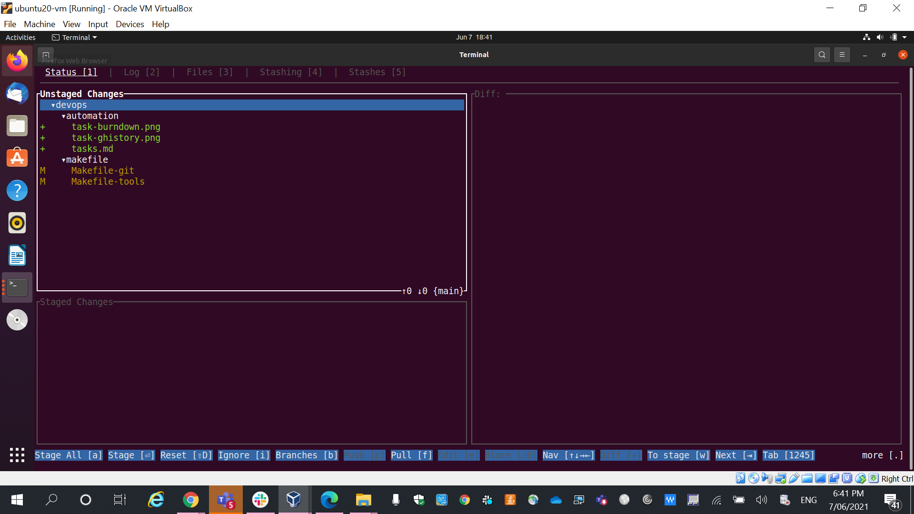
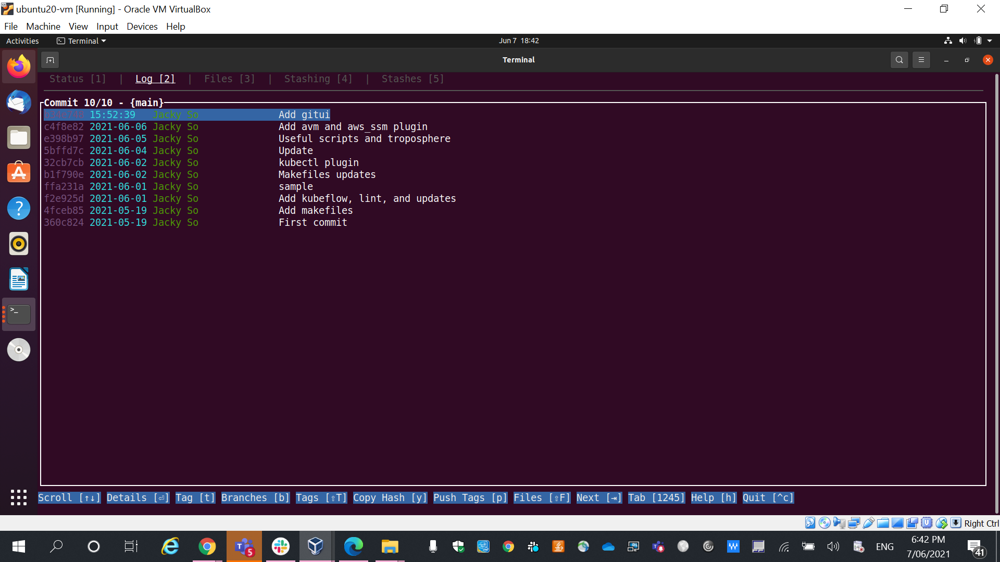
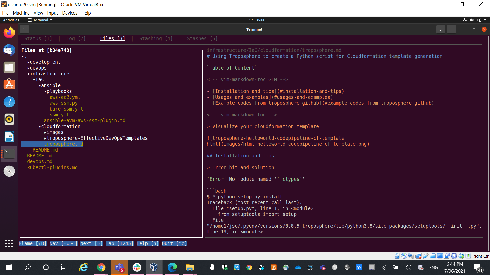
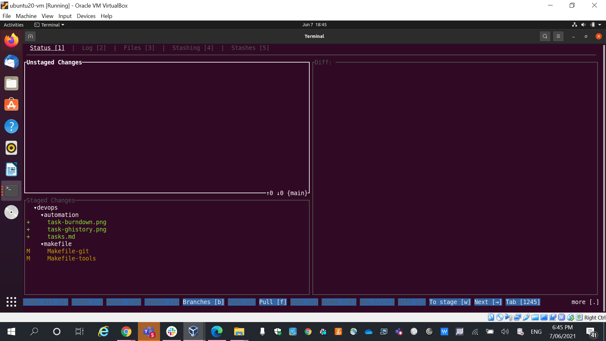
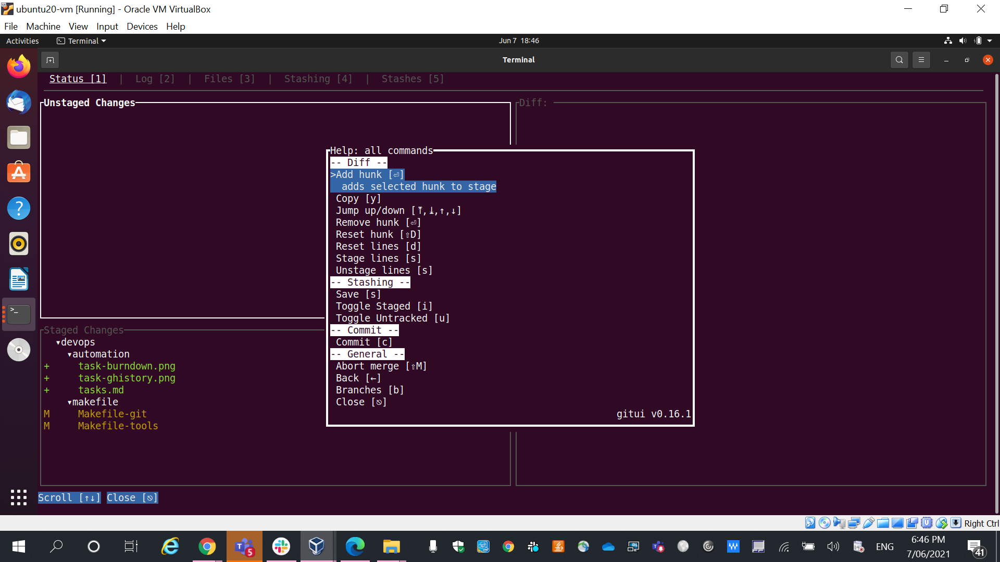
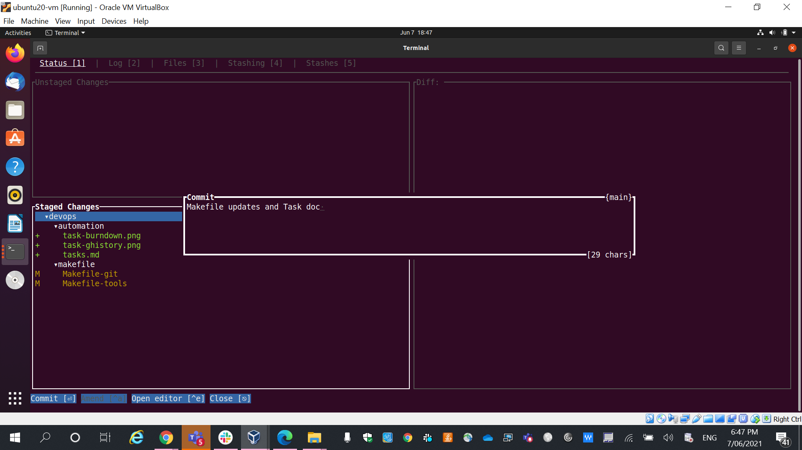

# git operation UI in console mode

* `gitui`'s [github Readme](https://github.com/extrawurst/gitui/blob/master/README.md)

* Install `gitui` through makefile operation menu

```bash
$  make -f Makefile-tools


 Choose a command run:

gitui                                    Check and install gitui when no found

$  make -f Makefile-tools gitui

gitui 0.16.1
```

* `gitui` operation screenshots

	1. `Current git repository status`
	> `gitui`	
	

	2. `Current git log`

	> `command line`	
	```bash
	$  git log
	commit b34e748299a10af90ac010f22c22a641743b5f5d (HEAD -> main, origin/main)
	Author: Jacky So <jacky.so@myob.com>
	Date:   Mon Jun 7 15:52:39 2021 +1000
	
	    Add gitui
	
	commit c4f8e82a940376dcd20d6775f8326913369b5b19
	Author: Jacky So <jacky.so@24x7classroom.com>
	Date:   Sun Jun 6 23:46:01 2021 +1000
	
	    Add avm and aws_ssm plugin
	
	commit e398b97a62d416d51f6bd598a281da3ac7994adb
	Author: Jacky So <jacky.so@24x7classroom.com>
	Date:   Sat Jun 5 21:13:14 2021 +1000
	
	    Useful scripts and troposphere
	```

	> `gitui`	
	

	3. Repository structure

	> `command line`	
	```bash
	$  tree . -L 2
	├── development
	│   └── README.md
	├── devops
	│   ├── automation
	│   ├── cicd
	│   ├── makefile
	│   └── scripts
	├── devops.md
	├── infrastructure
	│   ├── IaC
	│   └── README.md
	├── kubectl-plugins.md
	└── README.md
	```

	> `gitui`	
	

	4. Changed files `added`

	> `gitui`	
	

	5. `Help` in gitui

	> `gitui`	
	

	6. `Commit` staged changes

	> `gitui`	
	


[github]: https://github.com/extrawurst/gitui

[gitui releases]: https://github.com/extrawurst/gitui/releases
