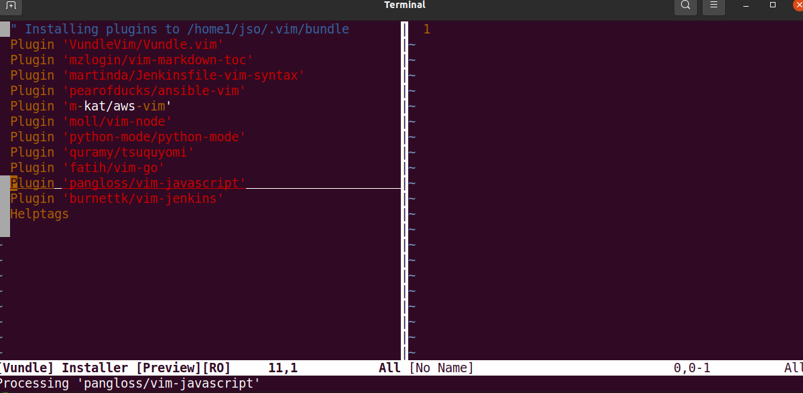

# Install VIM plugin vim-markdown-toc through VIM manager Vundle



***Table of Content***
<!-- vim-markdown-toc GFM -->

- [Setup Vundle](#setup-vundle)
- [Install plugin - `vim-markdown-toc`](#install-plugin---vim-markdown-toc)
- [Add TOC into Markdown](#add-toc-into-markdown)
	- [Automatic update of TOC](#automatic-update-of-toc)

<!-- vim-markdown-toc -->


## Setup Vundle

> Download Vundle from github into ~/.vim/bundle

```bash
git clone https://github.com/VundleVim/Vundle.vim.git ~/.vim/bundle/Vundle.vim
```

> Add the following VIM configuration into ~/.vimrc 
```bash
syntax enable
set tabstop=4
set expandtab
set number
filetype indent on
set autoindent
set nocompatible
filetype off
set rtp+=~/.vim/bundle/Vundle.vim
call vundle#begin()
Plugin 'VundleVim/Vundle.vim'

" Add plugins here which you want to add
call vundle#end()
filetype plugin indent on
" Brief help
" :PluginList       - lists configured plugins
" :PluginInstall    - installs plugins; append `!` to update or just :PluginUpdate
" :PluginSearch foo - searches for foo; append `!` to refresh local cache
" :PluginClean      - confirms removal of unused plugins; append `!` to auto-approve removal
"
" see :h vundle for more details or wiki for FAQ
```

> Install by Launch vim and run `:PluginInstall`

> Or, to install from command line: `vim +PluginInstall +qall`

> Check Install plugin status

> Run command line: `vim +PluginList` or launch vim and run `:PluginList`

```bash
" My Plugins                                                                       |  1 
Plugin 'VundleVim/Vundle.vim'                                                      
```

## Install plugin - `vim-markdown-toc`

> Add the following lines into ~/.vimrc - line before call vundle#end()

```bash
" Install Plugin vim-markdown-toc
 18 Plugin 'mzlogin/vim-markdown-toc'
```

> Run `PluginInstall` by launch VIM or command line

> Check Installed Plugin status `PluginList`, you will see the following

```
" My Plugins
Plugin 'VundleVim/Vundle.vim'
Plugin 'mzlogin/vim-markdown-toc'
2 plugins configured
```
> List installed Vundle plugins in filesystem

```bash
$ tree .vim/bundle -d -L 1
.vim/bundle
├── vim-markdown-toc
└── Vundle.vim
```

## Add TOC into Markdown

> Edit Markdown file and add TOC by run `:GenTocGFM`

### Automatic update of TOC

> By default, it will automatically update TOC when editing save `g:vmt_auto_update_on_save=1` or Use `:RemoveToc` when `g:vmt_auto_update_on_save=0` being configured in .vimrc configuration

[vim-md-toc]: https://github.com/mzlogin/vim-markdown-toc
[Vundle]: https://github.com/VundleVim/Vundle.Vim
[ansible-vim]: https://github.com/pearofducks/ansible-vim
[aws-vim]: https://github.com/m-kat/aws-vim
[python-mode]: https://github.com/python-mode/python-mode
[vim-go]: https://github.com/fatih/vim-go
[vim-javascript]: https://github.com/pangloss/vim-javascript
[vim-jenkins]: https://github.com/burnettk/vim-jenkins
[vim-terraform]: https://github.com/hashivim/vim-terraform
[Jenkinsfile-vim-syntax]: https://github.com/martinda/Jenkinsfile-vim-syntax
