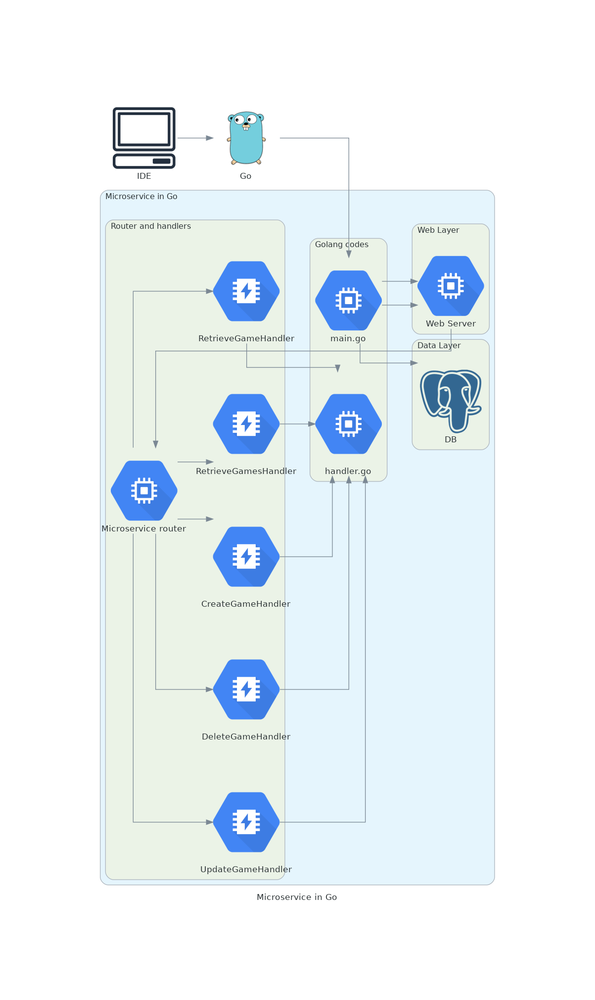

# Diagram as code - Go program to generate diagrams

## Basic

***Write your code***

- [x] Go diagram code - main.go
   - [x] Import go modules
      - [x] github.com/blushft/go-diagrams/diagram
      - [ ] github.com/blushft/go-diagrams/generic
      - [ ] github.com/blushft/go-diagrams/programming
      - [ ] github.com/blushft/go-diagrams/apps
      - [ ] github.com/blushft/go-diagrams/aws
      - [ ] github.com/blushft/go-diagrams/alibabacloud
      - [ ] github.com/blushft/go-diagrams/azure
      - [ ] github.com/blushft/go-diagrams/gcp
      - [ ] github.com/blushft/go-diagrams/elastic
      - [ ] github.com/blushft/go-diagrams/k8s
      - [ ] github.com/blushft/go-diagrams/oci
      - [ ] github.com/blushft/go-diagrams/openstack
      - [ ] github.com/blushft/go-diagrams/outscale
      - [ ] github.com/blushft/go-diagrams/saas
   - [x] main function 
      - [ ] Nodes definition
      - [ ] Group definition
      - [ ] Connectors

***Generate your diagram***

- [x] Run and generate diagram
   - [x] Run program - `go run main.go`
   - [x] Convert dot diagram to png formt - `dot -Tpng <diagram>.dot > <diagram>.png`


<details><summary><i>Click to show all nodes and resources. Note: long tables</i></summary><br>

```
╒════════════════╤═════════════════════════════╤═══════════════════════════╤═══════════════════════════╤══════════════════════════╤══════════════════════════════════════╤════════════════════════════════╤══════════════════════════════╤═══════════════════════════════╤═════════════════════════════╤═══════════════════════════════╤═══════════════════════════╤══════════════════════╤══════════════════════════════╤══════════════════════════════════════════════╤═══════════════════════════════════════════╤════════════════════════════════════╤═════════════════════════════════╤══════════════╤════════════════════════════════════════╤═════════════════════════╤════════════════════════╤════════════════════╤════════════════════════════════╤═════════════════════════╤═══════════╤════════════════╤═══════════════╤══════════════════╤════════════════╤════════════╤═════════════════════════════════╤══════════════════════════╤═════════════════════════╤════════════════════════╤═══════╤═════╤══════════════════════╤══════════════════╤═══════════════╤═════════╤═════════════════════════════╤══════════════════╕
│ analytics.go   │ Analytics                   │ Emr                       │ GlueCrawlers              │ KinesisDataAnalytics     │ KinesisVideoStreams                  │ Kinesis                        │ Quicksight                   │ ElasticsearchService          │ GlueDataCatalog             │ RedshiftDenseStorageNode      │ Redshift                  │ Athena               │ CloudsearchSearchDocuments   │ EmrHdfsCluster                               │ LakeFormation                             │ ManagedStreamingForKafka           │ Cloudsearch                     │ DataPipeline │ EmrCluster                             │ Glue                    │ KinesisDataFirehose    │ KinesisDataStreams │ RedshiftDenseComputeNode       │                         │           │                │               │                  │                │            │                                 │                          │                         │                        │       │     │                      │                  │               │         │                             │                  │
├────────────────┼─────────────────────────────┼───────────────────────────┼───────────────────────────┼──────────────────────────┼──────────────────────────────────────┼────────────────────────────────┼──────────────────────────────┼───────────────────────────────┼─────────────────────────────┼───────────────────────────────┼───────────────────────────┼──────────────────────┼──────────────────────────────┼──────────────────────────────────────────────┼───────────────────────────────────────────┼────────────────────────────────────┼─────────────────────────────────┼──────────────┼────────────────────────────────────────┼─────────────────────────┼────────────────────────┼────────────────────┼────────────────────────────────┼─────────────────────────┼───────────┼────────────────┼───────────────┼──────────────────┼────────────────┼────────────┼─────────────────────────────────┼──────────────────────────┼─────────────────────────┼────────────────────────┼───────┼─────┼──────────────────────┼──────────────────┼───────────────┼─────────┼─────────────────────────────┼──────────────────┤
│ ar.go          │ Sumerian                    │                           │                           │                          │                                      │                                │                              │                               │                             │                               │                           │                      │                              │                                              │                                           │                                    │                                 │              │                                        │                         │                        │                    │                                │                         │           │                │               │                  │                │            │                                 │                          │                         │                        │       │     │                      │                  │               │         │                             │                  │
├────────────────┼─────────────────────────────┼───────────────────────────┼───────────────────────────┼──────────────────────────┼──────────────────────────────────────┼────────────────────────────────┼──────────────────────────────┼───────────────────────────────┼─────────────────────────────┼───────────────────────────────┼───────────────────────────┼──────────────────────┼──────────────────────────────┼──────────────────────────────────────────────┼───────────────────────────────────────────┼────────────────────────────────────┼─────────────────────────────────┼──────────────┼────────────────────────────────────────┼─────────────────────────┼────────────────────────┼────────────────────┼────────────────────────────────┼─────────────────────────┼───────────┼────────────────┼───────────────┼──────────────────┼────────────────┼────────────┼─────────────────────────────────┼──────────────────────────┼─────────────────────────┼────────────────────────┼───────┼─────┼──────────────────────┼──────────────────┼───────────────┼─────────┼─────────────────────────────┼──────────────────┤
│ blockchain.go  │ ManagedBlockchain           │ QuantumLedgerDatabaseQldb │                           │                          │                                      │                                │                              │                               │                             │                               │                           │                      │                              │                                              │                                           │                                    │                                 │              │                                        │                         │                        │                    │                                │                         │           │                │               │                  │                │            │                                 │                          │                         │                        │       │     │                      │                  │               │         │                             │                  │
├────────────────┼─────────────────────────────┼───────────────────────────┼───────────────────────────┼──────────────────────────┼──────────────────────────────────────┼────────────────────────────────┼──────────────────────────────┼───────────────────────────────┼─────────────────────────────┼───────────────────────────────┼───────────────────────────┼──────────────────────┼──────────────────────────────┼──────────────────────────────────────────────┼───────────────────────────────────────────┼────────────────────────────────────┼─────────────────────────────────┼──────────────┼────────────────────────────────────────┼─────────────────────────┼────────────────────────┼────────────────────┼────────────────────────────────┼─────────────────────────┼───────────┼────────────────┼───────────────┼──────────────────┼────────────────┼────────────┼─────────────────────────────────┼──────────────────────────┼─────────────────────────┼────────────────────────┼───────┼─────┼──────────────────────┼──────────────────┼───────────────┼─────────┼─────────────────────────────┼──────────────────┤
│ business.go    │ AlexaForBusiness            │ Chime                     │ Workmail                  │                          │                                      │                                │                              │                               │                             │                               │                           │                      │                              │                                              │                                           │                                    │                                 │              │                                        │                         │                        │                    │                                │                         │           │                │               │                  │                │            │                                 │                          │                         │                        │       │     │                      │                  │               │         │                             │                  │
├────────────────┼─────────────────────────────┼───────────────────────────┼───────────────────────────┼──────────────────────────┼──────────────────────────────────────┼────────────────────────────────┼──────────────────────────────┼───────────────────────────────┼─────────────────────────────┼───────────────────────────────┼───────────────────────────┼──────────────────────┼──────────────────────────────┼──────────────────────────────────────────────┼───────────────────────────────────────────┼────────────────────────────────────┼─────────────────────────────────┼──────────────┼────────────────────────────────────────┼─────────────────────────┼────────────────────────┼────────────────────┼────────────────────────────────┼─────────────────────────┼───────────┼────────────────┼───────────────┼──────────────────┼────────────────┼────────────┼─────────────────────────────────┼──────────────────────────┼─────────────────────────┼────────────────────────┼───────┼─────┼──────────────────────┼──────────────────┼───────────────┼─────────┼─────────────────────────────┼──────────────────┤
│ compute.go     │ OutpostsRounded             │ ThinkboxSequoia           │ ElasticBeanstalk          │ FargateRounded           │ LambdaRounded                        │ ElasticBeanstalkRounded        │ ThinkboxSequoiaRounded       │ ThinkboxStokeRounded          │ ThinkboxXmeshRounded        │ ApplicationAutoScalingRounded │ Ec2ContainerRegistry      │ Fargate              │ Outposts                     │ ThinkboxDraftRounded                         │ VmwareCloudOnAwsRounded                   │ BatchRounded                       │ ElasticKubernetesServiceRounded │ Lambda       │ ServerlessApplicationRepositoryRounded │ ThinkboxDeadlineRounded │ ThinkboxDeadline       │ ThinkboxStoke      │ ElasticContainerServiceRounded │ ElasticContainerService │ Lightsail │ ThinkboxDraft  │ ThinkboxFrost │ VmwareCloudOnAws │ ComputeRounded │ Ec2Rounded │ ServerlessApplicationRepository │ ElasticKubernetesService │ ThinkboxKrakatoaRounded │ ApplicationAutoScaling │ Batch │ Ec2 │ ThinkboxFrostRounded │ ThinkboxKrakatoa │ ThinkboxXmesh │ Compute │ Ec2ContainerRegistryRounded │ LightsailRounded │
├────────────────┼─────────────────────────────┼───────────────────────────┼───────────────────────────┼──────────────────────────┼──────────────────────────────────────┼────────────────────────────────┼──────────────────────────────┼───────────────────────────────┼─────────────────────────────┼───────────────────────────────┼───────────────────────────┼──────────────────────┼──────────────────────────────┼──────────────────────────────────────────────┼───────────────────────────────────────────┼────────────────────────────────────┼─────────────────────────────────┼──────────────┼────────────────────────────────────────┼─────────────────────────┼────────────────────────┼────────────────────┼────────────────────────────────┼─────────────────────────┼───────────┼────────────────┼───────────────┼──────────────────┼────────────────┼────────────┼─────────────────────────────────┼──────────────────────────┼─────────────────────────┼────────────────────────┼───────┼─────┼──────────────────────┼──────────────────┼───────────────┼─────────┼─────────────────────────────┼──────────────────┤
│ cost.go        │ CostAndUsageReport          │ CostExplorer              │ ReservedInstanceReporting │ SavingsPlans             │ Budgets                              │                                │                              │                               │                             │                               │                           │                      │                              │                                              │                                           │                                    │                                 │              │                                        │                         │                        │                    │                                │                         │           │                │               │                  │                │            │                                 │                          │                         │                        │       │     │                      │                  │               │         │                             │                  │
├────────────────┼─────────────────────────────┼───────────────────────────┼───────────────────────────┼──────────────────────────┼──────────────────────────────────────┼────────────────────────────────┼──────────────────────────────┼───────────────────────────────┼─────────────────────────────┼───────────────────────────────┼───────────────────────────┼──────────────────────┼──────────────────────────────┼──────────────────────────────────────────────┼───────────────────────────────────────────┼────────────────────────────────────┼─────────────────────────────────┼──────────────┼────────────────────────────────────────┼─────────────────────────┼────────────────────────┼────────────────────┼────────────────────────────────┼─────────────────────────┼───────────┼────────────────┼───────────────┼──────────────────┼────────────────┼────────────┼─────────────────────────────────┼──────────────────────────┼─────────────────────────┼────────────────────────┼───────┼─────┼──────────────────────┼──────────────────┼───────────────┼─────────┼─────────────────────────────┼──────────────────┤
│ database.go    │ Dynamodb                    │ Neptune                   │ Aurora                    │ DatabaseMigrationService │ Database                             │ DocumentdbMongodbCompatibility │ Elasticache                  │ RdsOnVmware                   │ Timestream                  │ DynamodbDax                   │ QuantumLedgerDatabaseQldb │ Redshift             │ DynamodbGlobalSecondaryIndex │ DynamodbTable                                │ Rds                                       │                                    │                                 │              │                                        │                         │                        │                    │                                │                         │           │                │               │                  │                │            │                                 │                          │                         │                        │       │     │                      │                  │               │         │                             │                  │
├────────────────┼─────────────────────────────┼───────────────────────────┼───────────────────────────┼──────────────────────────┼──────────────────────────────────────┼────────────────────────────────┼──────────────────────────────┼───────────────────────────────┼─────────────────────────────┼───────────────────────────────┼───────────────────────────┼──────────────────────┼──────────────────────────────┼──────────────────────────────────────────────┼───────────────────────────────────────────┼────────────────────────────────────┼─────────────────────────────────┼──────────────┼────────────────────────────────────────┼─────────────────────────┼────────────────────────┼────────────────────┼────────────────────────────────┼─────────────────────────┼───────────┼────────────────┼───────────────┼──────────────────┼────────────────┼────────────┼─────────────────────────────────┼──────────────────────────┼─────────────────────────┼────────────────────────┼───────┼─────┼──────────────────────┼──────────────────┼───────────────┼─────────┼─────────────────────────────┼──────────────────┤
│ devtools.go    │ ToolsAndSdks                │ XRay                      │ CloudDevelopmentKit       │ Cloud9                   │ Codebuild                            │ Codecommit                     │ Codepipeline                 │ Codedeploy                    │ Codestar                    │ CommandLineInterface          │ DeveloperTools            │                      │                              │                                              │                                           │                                    │                                 │              │                                        │                         │                        │                    │                                │                         │           │                │               │                  │                │            │                                 │                          │                         │                        │       │     │                      │                  │               │         │                             │                  │
├────────────────┼─────────────────────────────┼───────────────────────────┼───────────────────────────┼──────────────────────────┼──────────────────────────────────────┼────────────────────────────────┼──────────────────────────────┼───────────────────────────────┼─────────────────────────────┼───────────────────────────────┼───────────────────────────┼──────────────────────┼──────────────────────────────┼──────────────────────────────────────────────┼───────────────────────────────────────────┼────────────────────────────────────┼─────────────────────────────────┼──────────────┼────────────────────────────────────────┼─────────────────────────┼────────────────────────┼────────────────────┼────────────────────────────────┼─────────────────────────┼───────────┼────────────────┼───────────────┼──────────────────┼────────────────┼────────────┼─────────────────────────────────┼──────────────────────────┼─────────────────────────┼────────────────────────┼───────┼─────┼──────────────────────┼──────────────────┼───────────────┼─────────┼─────────────────────────────┼──────────────────┤
│ enablement.go  │ ProfessionalServices        │ Support                   │ Iq                        │ ManagedServices          │                                      │                                │                              │                               │                             │                               │                           │                      │                              │                                              │                                           │                                    │                                 │              │                                        │                         │                        │                    │                                │                         │           │                │               │                  │                │            │                                 │                          │                         │                        │       │     │                      │                  │               │         │                             │                  │
├────────────────┼─────────────────────────────┼───────────────────────────┼───────────────────────────┼──────────────────────────┼──────────────────────────────────────┼────────────────────────────────┼──────────────────────────────┼───────────────────────────────┼─────────────────────────────┼───────────────────────────────┼───────────────────────────┼──────────────────────┼──────────────────────────────┼──────────────────────────────────────────────┼───────────────────────────────────────────┼────────────────────────────────────┼─────────────────────────────────┼──────────────┼────────────────────────────────────────┼─────────────────────────┼────────────────────────┼────────────────────┼────────────────────────────────┼─────────────────────────┼───────────┼────────────────┼───────────────┼──────────────────┼────────────────┼────────────┼─────────────────────────────────┼──────────────────────────┼─────────────────────────┼────────────────────────┼───────┼─────┼──────────────────────┼──────────────────┼───────────────┼─────────┼─────────────────────────────┼──────────────────┤
│ enduser.go     │ Appstream20                 │ Workdocs                  │ Worklink                  │ Workspaces               │                                      │                                │                              │                               │                             │                               │                           │                      │                              │                                              │                                           │                                    │                                 │              │                                        │                         │                        │                    │                                │                         │           │                │               │                  │                │            │                                 │                          │                         │                        │       │     │                      │                  │               │         │                             │                  │
├────────────────┼─────────────────────────────┼───────────────────────────┼───────────────────────────┼──────────────────────────┼──────────────────────────────────────┼────────────────────────────────┼──────────────────────────────┼───────────────────────────────┼─────────────────────────────┼───────────────────────────────┼───────────────────────────┼──────────────────────┼──────────────────────────────┼──────────────────────────────────────────────┼───────────────────────────────────────────┼────────────────────────────────────┼─────────────────────────────────┼──────────────┼────────────────────────────────────────┼─────────────────────────┼────────────────────────┼────────────────────┼────────────────────────────────┼─────────────────────────┼───────────┼────────────────┼───────────────┼──────────────────┼────────────────┼────────────┼─────────────────────────────────┼──────────────────────────┼─────────────────────────┼────────────────────────┼───────┼─────┼──────────────────────┼──────────────────┼───────────────┼─────────┼─────────────────────────────┼──────────────────┤
│ engagement.go  │ Connect                     │ Pinpoint                  │ SimpleEmailServiceSes     │                          │                                      │                                │                              │                               │                             │                               │                           │                      │                              │                                              │                                           │                                    │                                 │              │                                        │                         │                        │                    │                                │                         │           │                │               │                  │                │            │                                 │                          │                         │                        │       │     │                      │                  │               │         │                             │                  │
├────────────────┼─────────────────────────────┼───────────────────────────┼───────────────────────────┼──────────────────────────┼──────────────────────────────────────┼────────────────────────────────┼──────────────────────────────┼───────────────────────────────┼─────────────────────────────┼───────────────────────────────┼───────────────────────────┼──────────────────────┼──────────────────────────────┼──────────────────────────────────────────────┼───────────────────────────────────────────┼────────────────────────────────────┼─────────────────────────────────┼──────────────┼────────────────────────────────────────┼─────────────────────────┼────────────────────────┼────────────────────┼────────────────────────────────┼─────────────────────────┼───────────┼────────────────┼───────────────┼──────────────────┼────────────────┼────────────┼─────────────────────────────────┼──────────────────────────┼─────────────────────────┼────────────────────────┼───────┼─────┼──────────────────────┼──────────────────┼───────────────┼─────────┼─────────────────────────────┼──────────────────┤
│ game.go        │ Gamelift                    │                           │                           │                          │                                      │                                │                              │                               │                             │                               │                           │                      │                              │                                              │                                           │                                    │                                 │              │                                        │                         │                        │                    │                                │                         │           │                │               │                  │                │            │                                 │                          │                         │                        │       │     │                      │                  │               │         │                             │                  │
├────────────────┼─────────────────────────────┼───────────────────────────┼───────────────────────────┼──────────────────────────┼──────────────────────────────────────┼────────────────────────────────┼──────────────────────────────┼───────────────────────────────┼─────────────────────────────┼───────────────────────────────┼───────────────────────────┼──────────────────────┼──────────────────────────────┼──────────────────────────────────────────────┼───────────────────────────────────────────┼────────────────────────────────────┼─────────────────────────────────┼──────────────┼────────────────────────────────────────┼─────────────────────────┼────────────────────────┼────────────────────┼────────────────────────────────┼─────────────────────────┼───────────┼────────────────┼───────────────┼──────────────────┼────────────────┼────────────┼─────────────────────────────────┼──────────────────────────┼─────────────────────────┼────────────────────────┼───────┼─────┼──────────────────────┼──────────────────┼───────────────┼─────────┼─────────────────────────────┼──────────────────┤
│ general.go     │ Disk                        │ General                   │ GenericOfficeBuilding     │ User                     │ GenericDatabase                      │ GenericFirewall                │ GenericSamlToken             │ GenericSdk                    │ Marketplace                 │ TradicionalServer             │ Users                     │                      │                              │                                              │                                           │                                    │                                 │              │                                        │                         │                        │                    │                                │                         │           │                │               │                  │                │            │                                 │                          │                         │                        │       │     │                      │                  │               │         │                             │                  │
├────────────────┼─────────────────────────────┼───────────────────────────┼───────────────────────────┼──────────────────────────┼──────────────────────────────────────┼────────────────────────────────┼──────────────────────────────┼───────────────────────────────┼─────────────────────────────┼───────────────────────────────┼───────────────────────────┼──────────────────────┼──────────────────────────────┼──────────────────────────────────────────────┼───────────────────────────────────────────┼────────────────────────────────────┼─────────────────────────────────┼──────────────┼────────────────────────────────────────┼─────────────────────────┼────────────────────────┼────────────────────┼────────────────────────────────┼─────────────────────────┼───────────┼────────────────┼───────────────┼──────────────────┼────────────────┼────────────┼─────────────────────────────────┼──────────────────────────┼─────────────────────────┼────────────────────────┼───────┼─────┼──────────────────────┼──────────────────┼───────────────┼─────────┼─────────────────────────────┼──────────────────┤
│ integration.go │ Appsync                     │ ConsoleMobileApplication  │ Eventbridge               │ Mq                       │ SimpleNotificationServiceSns         │ SimpleQueueServiceSqs          │ StepFunctions                │ ApplicationIntegration        │                             │                               │                           │                      │                              │                                              │                                           │                                    │                                 │              │                                        │                         │                        │                    │                                │                         │           │                │               │                  │                │            │                                 │                          │                         │                        │       │     │                      │                  │               │         │                             │                  │
├────────────────┼─────────────────────────────┼───────────────────────────┼───────────────────────────┼──────────────────────────┼──────────────────────────────────────┼────────────────────────────────┼──────────────────────────────┼───────────────────────────────┼─────────────────────────────┼───────────────────────────────┼───────────────────────────┼──────────────────────┼──────────────────────────────┼──────────────────────────────────────────────┼───────────────────────────────────────────┼────────────────────────────────────┼─────────────────────────────────┼──────────────┼────────────────────────────────────────┼─────────────────────────┼────────────────────────┼────────────────────┼────────────────────────────────┼─────────────────────────┼───────────┼────────────────┼───────────────┼──────────────────┼────────────────┼────────────┼─────────────────────────────────┼──────────────────────────┼─────────────────────────┼────────────────────────┼───────┼─────┼──────────────────────┼──────────────────┼───────────────┼─────────┼─────────────────────────────┼──────────────────┤
│ iot.go         │ Freertos                    │ IotLambda                 │ IotTopic                  │ IotShadow                │ IotAction                            │ IotAlexaSkill                  │ IotEvents                    │ IotHardwareBoard              │ IotJobs                     │ IotPolicy                     │ IotPolicyEmergency        │ IotSitewise          │ InternetOfThings             │ IotAlexaEcho                                 │ IotCore                                   │ IotDeviceManagement                │ IotGreengrassConnector          │ IotHttp      │ IotAnalytics                           │ IotCamera               │ IotHttp2               │ IotThingsGraph     │ IotDeviceDefender              │ Iot1Click               │ IotButton │ IotCertificate │ IotGreengrass │ IotMqtt          │ IotRule        │            │                                 │                          │                         │                        │       │     │                      │                  │               │         │                             │                  │
├────────────────┼─────────────────────────────┼───────────────────────────┼───────────────────────────┼──────────────────────────┼──────────────────────────────────────┼────────────────────────────────┼──────────────────────────────┼───────────────────────────────┼─────────────────────────────┼───────────────────────────────┼───────────────────────────┼──────────────────────┼──────────────────────────────┼──────────────────────────────────────────────┼───────────────────────────────────────────┼────────────────────────────────────┼─────────────────────────────────┼──────────────┼────────────────────────────────────────┼─────────────────────────┼────────────────────────┼────────────────────┼────────────────────────────────┼─────────────────────────┼───────────┼────────────────┼───────────────┼──────────────────┼────────────────┼────────────┼─────────────────────────────────┼──────────────────────────┼─────────────────────────┼────────────────────────┼───────┼─────┼──────────────────────┼──────────────────┼───────────────┼─────────┼─────────────────────────────┼──────────────────┤
│ management.go  │ Config                      │ ManagementConsole         │ SystemsManager            │ WellArchitectedTool      │ Cloudformation                       │ LicenseManager                 │ ManagedServices              │ ServiceCatalog                │ TrustedAdvisor              │ Cloudtrail                    │ ControlTower              │ Organizations        │ SystemsManagerParameterStore │ AutoScaling                                  │ Cloudwatch                                │ Codeguru                           │ CommandLineInterface            │ Opsworks     │                                        │                         │                        │                    │                                │                         │           │                │               │                  │                │            │                                 │                          │                         │                        │       │     │                      │                  │               │         │                             │                  │
├────────────────┼─────────────────────────────┼───────────────────────────┼───────────────────────────┼──────────────────────────┼──────────────────────────────────────┼────────────────────────────────┼──────────────────────────────┼───────────────────────────────┼─────────────────────────────┼───────────────────────────────┼───────────────────────────┼──────────────────────┼──────────────────────────────┼──────────────────────────────────────────────┼───────────────────────────────────────────┼────────────────────────────────────┼─────────────────────────────────┼──────────────┼────────────────────────────────────────┼─────────────────────────┼────────────────────────┼────────────────────┼────────────────────────────────┼─────────────────────────┼───────────┼────────────────┼───────────────┼──────────────────┼────────────────┼────────────┼─────────────────────────────────┼──────────────────────────┼─────────────────────────┼────────────────────────┼───────┼─────┼──────────────────────┼──────────────────┼───────────────┼─────────┼─────────────────────────────┼──────────────────┤
│ media.go       │ ElasticTranscoder           │ ElementalConductor        │ ElementalMedialive        │ ElementalMediapackage    │ ElementalServer                      │ ElementalDelta                 │ ElementalLive                │ ElementalMediaconnect         │ ElementalMediaconvert       │ ElementalMediastore           │ ElementalMediatailor      │                      │                              │                                              │                                           │                                    │                                 │              │                                        │                         │                        │                    │                                │                         │           │                │               │                  │                │            │                                 │                          │                         │                        │       │     │                      │                  │               │         │                             │                  │
├────────────────┼─────────────────────────────┼───────────────────────────┼───────────────────────────┼──────────────────────────┼──────────────────────────────────────┼────────────────────────────────┼──────────────────────────────┼───────────────────────────────┼─────────────────────────────┼───────────────────────────────┼───────────────────────────┼──────────────────────┼──────────────────────────────┼──────────────────────────────────────────────┼───────────────────────────────────────────┼────────────────────────────────────┼─────────────────────────────────┼──────────────┼────────────────────────────────────────┼─────────────────────────┼────────────────────────┼────────────────────┼────────────────────────────────┼─────────────────────────┼───────────┼────────────────┼───────────────┼──────────────────┼────────────────┼────────────┼─────────────────────────────────┼──────────────────────────┼─────────────────────────┼────────────────────────┼───────┼─────┼──────────────────────┼──────────────────┼───────────────┼─────────┼─────────────────────────────┼──────────────────┤
│ migration.go   │ TransferForSftp             │ Datasync                  │ MigrationAndTransfer      │ Snowball                 │ MigrationHub                         │ ServerMigrationService         │ SnowballEdge                 │ Snowmobile                    │ ApplicationDiscoveryService │ CloudendureMigration          │ DatabaseMigrationService  │                      │                              │                                              │                                           │                                    │                                 │              │                                        │                         │                        │                    │                                │                         │           │                │               │                  │                │            │                                 │                          │                         │                        │       │     │                      │                  │               │         │                             │                  │
├────────────────┼─────────────────────────────┼───────────────────────────┼───────────────────────────┼──────────────────────────┼──────────────────────────────────────┼────────────────────────────────┼──────────────────────────────┼───────────────────────────────┼─────────────────────────────┼───────────────────────────────┼───────────────────────────┼──────────────────────┼──────────────────────────────┼──────────────────────────────────────────────┼───────────────────────────────────────────┼────────────────────────────────────┼─────────────────────────────────┼──────────────┼────────────────────────────────────────┼─────────────────────────┼────────────────────────┼────────────────────┼────────────────────────────────┼─────────────────────────┼───────────┼────────────────┼───────────────┼──────────────────┼────────────────┼────────────┼─────────────────────────────────┼──────────────────────────┼─────────────────────────┼────────────────────────┼───────┼─────┼──────────────────────┼──────────────────┼───────────────┼─────────┼─────────────────────────────┼──────────────────┤
│ ml.go          │ SagemakerTrainingJob        │ Deepracer                 │ SagemakerNotebook         │ ElasticInference         │ Polly                                │ SagemakerModel                 │ Transcribe                   │ ApacheMxnetOnAws              │ DeepLearningAmis            │ Sagemaker                     │ TensorflowOnAws           │ Translate            │ Comprehend                   │ MachineLearning                              │ Forecast                                  │ Lex                                │ Personalize                     │ Rekognition  │ SagemakerGroundTruth                   │ Textract                │ DeepLearningContainers │ Deeplens           │                                │                         │           │                │               │                  │                │            │                                 │                          │                         │                        │       │     │                      │                  │               │         │                             │                  │
├────────────────┼─────────────────────────────┼───────────────────────────┼───────────────────────────┼──────────────────────────┼──────────────────────────────────────┼────────────────────────────────┼──────────────────────────────┼───────────────────────────────┼─────────────────────────────┼───────────────────────────────┼───────────────────────────┼──────────────────────┼──────────────────────────────┼──────────────────────────────────────────────┼───────────────────────────────────────────┼────────────────────────────────────┼─────────────────────────────────┼──────────────┼────────────────────────────────────────┼─────────────────────────┼────────────────────────┼────────────────────┼────────────────────────────────┼─────────────────────────┼───────────┼────────────────┼───────────────┼──────────────────┼────────────────┼────────────┼─────────────────────────────────┼──────────────────────────┼─────────────────────────┼────────────────────────┼───────┼─────┼──────────────────────┼──────────────────┼───────────────┼─────────┼─────────────────────────────┼──────────────────┤
│ mobile.go      │ Amplify                     │ ApiGatewayEndpoint        │ ApiGateway                │ Appsync                  │ DeviceFarm                           │ Pinpoint                       │                              │                               │                             │                               │                           │                      │                              │                                              │                                           │                                    │                                 │              │                                        │                         │                        │                    │                                │                         │           │                │               │                  │                │            │                                 │                          │                         │                        │       │     │                      │                  │               │         │                             │                  │
├────────────────┼─────────────────────────────┼───────────────────────────┼───────────────────────────┼──────────────────────────┼──────────────────────────────────────┼────────────────────────────────┼──────────────────────────────┼───────────────────────────────┼─────────────────────────────┼───────────────────────────────┼───────────────────────────┼──────────────────────┼──────────────────────────────┼──────────────────────────────────────────────┼───────────────────────────────────────────┼────────────────────────────────────┼─────────────────────────────────┼──────────────┼────────────────────────────────────────┼─────────────────────────┼────────────────────────┼────────────────────┼────────────────────────────────┼─────────────────────────┼───────────┼────────────────┼───────────────┼──────────────────┼────────────────┼────────────┼─────────────────────────────────┼──────────────────────────┼─────────────────────────┼────────────────────────┼───────┼─────┼──────────────────────┼──────────────────┼───────────────┼─────────┼─────────────────────────────┼──────────────────┤
│ network.go     │ PrivateSubnet               │ PublicSubnet              │ SiteToSiteVpn             │ ApiGateway               │ NetworkingAndContentDelivery         │ Cloudfront                     │ InternetGateway              │ GlobalAccelerator             │ NatGateway                  │ RouteTable                    │ TransitGateway            │ CloudMap             │ Endpoint                     │ DirectConnect                                │ ElasticLoadBalancing                      │ Nacl                               │ Privatelink                     │ Route53      │ VpcPeering                             │ AppMesh                 │ ClientVpn              │ VpcRouter          │ Vpc                            │                         │           │                │               │                  │                │            │                                 │                          │                         │                        │       │     │                      │                  │               │         │                             │                  │
├────────────────┼─────────────────────────────┼───────────────────────────┼───────────────────────────┼──────────────────────────┼──────────────────────────────────────┼────────────────────────────────┼──────────────────────────────┼───────────────────────────────┼─────────────────────────────┼───────────────────────────────┼───────────────────────────┼──────────────────────┼──────────────────────────────┼──────────────────────────────────────────────┼───────────────────────────────────────────┼────────────────────────────────────┼─────────────────────────────────┼──────────────┼────────────────────────────────────────┼─────────────────────────┼────────────────────────┼────────────────────┼────────────────────────────────┼─────────────────────────┼───────────┼────────────────┼───────────────┼──────────────────┼────────────────┼────────────┼─────────────────────────────────┼──────────────────────────┼─────────────────────────┼────────────────────────┼───────┼─────┼──────────────────────┼──────────────────┼───────────────┼─────────┼─────────────────────────────┼──────────────────┤
│ quantum.go     │ Braket                      │                           │                           │                          │                                      │                                │                              │                               │                             │                               │                           │                      │                              │                                              │                                           │                                    │                                 │              │                                        │                         │                        │                    │                                │                         │           │                │               │                  │                │            │                                 │                          │                         │                        │       │     │                      │                  │               │         │                             │                  │
├────────────────┼─────────────────────────────┼───────────────────────────┼───────────────────────────┼──────────────────────────┼──────────────────────────────────────┼────────────────────────────────┼──────────────────────────────┼───────────────────────────────┼─────────────────────────────┼───────────────────────────────┼───────────────────────────┼──────────────────────┼──────────────────────────────┼──────────────────────────────────────────────┼───────────────────────────────────────────┼────────────────────────────────────┼─────────────────────────────────┼──────────────┼────────────────────────────────────────┼─────────────────────────┼────────────────────────┼────────────────────┼────────────────────────────────┼─────────────────────────┼───────────┼────────────────┼───────────────┼──────────────────┼────────────────┼────────────┼─────────────────────────────────┼──────────────────────────┼─────────────────────────┼────────────────────────┼───────┼─────┼──────────────────────┼──────────────────┼───────────────┼─────────┼─────────────────────────────┼──────────────────┤
│ robotics.go    │ RobomakerSimulator          │ Robomaker                 │ Robotics                  │                          │                                      │                                │                              │                               │                             │                               │                           │                      │                              │                                              │                                           │                                    │                                 │              │                                        │                         │                        │                    │                                │                         │           │                │               │                  │                │            │                                 │                          │                         │                        │       │     │                      │                  │               │         │                             │                  │
├────────────────┼─────────────────────────────┼───────────────────────────┼───────────────────────────┼──────────────────────────┼──────────────────────────────────────┼────────────────────────────────┼──────────────────────────────┼───────────────────────────────┼─────────────────────────────┼───────────────────────────────┼───────────────────────────┼──────────────────────┼──────────────────────────────┼──────────────────────────────────────────────┼───────────────────────────────────────────┼────────────────────────────────────┼─────────────────────────────────┼──────────────┼────────────────────────────────────────┼─────────────────────────┼────────────────────────┼────────────────────┼────────────────────────────────┼─────────────────────────┼───────────┼────────────────┼───────────────┼──────────────────┼────────────────┼────────────┼─────────────────────────────────┼──────────────────────────┼─────────────────────────┼────────────────────────┼───────┼─────┼──────────────────────┼──────────────────┼───────────────┼─────────┼─────────────────────────────┼──────────────────┤
│ satellite.go   │ GroundStation               │                           │                           │                          │                                      │                                │                              │                               │                             │                               │                           │                      │                              │                                              │                                           │                                    │                                 │              │                                        │                         │                        │                    │                                │                         │           │                │               │                  │                │            │                                 │                          │                         │                        │       │     │                      │                  │               │         │                             │                  │
├────────────────┼─────────────────────────────┼───────────────────────────┼───────────────────────────┼──────────────────────────┼──────────────────────────────────────┼────────────────────────────────┼──────────────────────────────┼───────────────────────────────┼─────────────────────────────┼───────────────────────────────┼───────────────────────────┼──────────────────────┼──────────────────────────────┼──────────────────────────────────────────────┼───────────────────────────────────────────┼────────────────────────────────────┼─────────────────────────────────┼──────────────┼────────────────────────────────────────┼─────────────────────────┼────────────────────────┼────────────────────┼────────────────────────────────┼─────────────────────────┼───────────┼────────────────┼───────────────┼──────────────────┼────────────────┼────────────┼─────────────────────────────────┼──────────────────────────┼─────────────────────────┼────────────────────────┼───────┼─────┼──────────────────────┼──────────────────┼───────────────┼─────────┼─────────────────────────────┼──────────────────┤
│ security.go    │ KeyManagementService        │ SingleSignOn              │ CloudDirectory            │ Guardduty                │ IdentityAndAccessManagementIamAwsSts │ IdentityAndAccessManagementIam │ SecretsManager               │ SecurityIdentityAndCompliance │ Shield                      │ Cloudhsm                      │ CertificateManager        │ Cognito              │ DirectoryService             │ IdentityAndAccessManagementIamAccessAnalyzer │ IdentityAndAccessManagementIamPermissions │ IdentityAndAccessManagementIamRole │ ResourceAccessManager           │ Artifact     │ FirewallManager                        │ Inspector               │ Macie                  │ SecurityHub        │ Waf                            │ Detective               │           │                │               │                  │                │            │                                 │                          │                         │                        │       │     │                      │                  │               │         │                             │                  │
├────────────────┼─────────────────────────────┼───────────────────────────┼───────────────────────────┼──────────────────────────┼──────────────────────────────────────┼────────────────────────────────┼──────────────────────────────┼───────────────────────────────┼─────────────────────────────┼───────────────────────────────┼───────────────────────────┼──────────────────────┼──────────────────────────────┼──────────────────────────────────────────────┼───────────────────────────────────────────┼────────────────────────────────────┼─────────────────────────────────┼──────────────┼────────────────────────────────────────┼─────────────────────────┼────────────────────────┼────────────────────┼────────────────────────────────┼─────────────────────────┼───────────┼────────────────┼───────────────┼──────────────────┼────────────────┼────────────┼─────────────────────────────────┼──────────────────────────┼─────────────────────────┼────────────────────────┼───────┼─────┼──────────────────────┼──────────────────┼───────────────┼─────────┼─────────────────────────────┼──────────────────┤
│ storage.go     │ CloudendureDisasterRecovery │ FsxForLustre              │ Fsx                       │ Backup                   │ SimpleStorageServiceS3               │ Snowmobile                     │ EfsInfrequentaccessPrimaryBg │ FsxForWindowsFileServer       │ SnowballEdge                │ StorageGateway                │ Storage                   │ EfsStandardPrimaryBg │ ElasticBlockStoreEbs         │ ElasticFileSystemEfs                         │ S3Glacier                                 │ Snowball                           │                                 │              │                                        │                         │                        │                    │                                │                         │           │                │               │                  │                │            │                                 │                          │                         │                        │       │     │                      │                  │               │         │                             │                  │
╘════════════════╧═════════════════════════════╧═══════════════════════════╧═══════════════════════════╧══════════════════════════╧══════════════════════════════════════╧════════════════════════════════╧══════════════════════════════╧═══════════════════════════════╧═════════════════════════════╧═══════════════════════════════╧═══════════════════════════╧══════════════════════╧══════════════════════════════╧══════════════════════════════════════════════╧═══════════════════════════════════════════╧════════════════════════════════════╧═════════════════════════════════╧══════════════╧════════════════════════════════════════╧═════════════════════════╧════════════════════════╧════════════════════╧════════════════════════════════╧═════════════════════════╧═══════════╧════════════════╧═══════════════╧══════════════════╧════════════════╧════════════╧═════════════════════════════════╧══════════════════════════╧═════════════════════════╧════════════════════════╧═══════╧═════╧══════════════════════╧══════════════════╧═══════════════╧═════════╧═════════════════════════════╧══════════════════╛
```

>In [17]: print(tabulate(alibabacloud,tablefmt='fancy_grid'))
```
╒══════════════════╤═══════════════════════╤═══════════════════════════╤═════════════════════════════╤═════════════════╤═══════════════════════════════╤════════════════════════════╤════════════════════════╤══════════════════════╤═════════════════════════════════╤═══════════════════════════╤══════════════════════════════╤═══════════════════════════╤══════════════════════════╤════════════════════════════════════╤════════════════════════╤════════════════════╤═══════════════════╤════════════════════════╕
│ analytics.go     │ AnalyticDb            │ ClickHouse                │ DataLakeAnalytics           │ ElaticMapReduce │ OpenSearch                    │                            │                        │                      │                                 │                           │                              │                           │                          │                                    │                        │                    │                   │                        │
├──────────────────┼───────────────────────┼───────────────────────────┼─────────────────────────────┼─────────────────┼───────────────────────────────┼────────────────────────────┼────────────────────────┼──────────────────────┼─────────────────────────────────┼───────────────────────────┼──────────────────────────────┼───────────────────────────┼──────────────────────────┼────────────────────────────────────┼────────────────────────┼────────────────────┼───────────────────┼────────────────────────┤
│ application.go   │ Yida                  │ ApiGateway                │ PerformanceTestingService   │ CodePipeline    │ DirectMail                    │ MessageNotificationService │ RdCloud                │ BlockchainAsAService │ CloudCallCenter                 │ NodeJsPerformancePlatform │ OpenSearch                   │ SmartConversationAnalysis │ BeeBot                   │ LogService                         │                        │                    │                   │                        │
├──────────────────┼───────────────────────┼───────────────────────────┼─────────────────────────────┼─────────────────┼───────────────────────────────┼────────────────────────────┼────────────────────────┼──────────────────────┼─────────────────────────────────┼───────────────────────────┼──────────────────────────────┼───────────────────────────┼──────────────────────────┼────────────────────────────────────┼────────────────────────┼────────────────────┼───────────────────┼────────────────────────┤
│ communication.go │ DirectMail            │ MobilePush                │                             │                 │                               │                            │                        │                      │                                 │                           │                              │                           │                          │                                    │                        │                    │                   │                        │
├──────────────────┼───────────────────────┼───────────────────────────┼─────────────────────────────┼─────────────────┼───────────────────────────────┼────────────────────────────┼────────────────────────┼──────────────────────┼─────────────────────────────────┼───────────────────────────┼──────────────────────────────┼───────────────────────────┼──────────────────────────┼────────────────────────────────────┼────────────────────────┼────────────────────┼───────────────────┼────────────────────────┤
│ compute.go       │ AutoScaling           │ ContainerRegistry         │ ElasticComputeService       │ FunctionCompute │ OperationOrchestrationService │ ServerLoadBalancer         │ ServerlessAppEngine    │ ContainerService     │ ElasticHighPerformanceComputing │ ElasticSearch             │ ResourceOrchestrationService │ BatchCompute              │ ElasticContainerInstance │ SimpleApplicationServer            │ WebAppService          │                    │                   │                        │
├──────────────────┼───────────────────────┼───────────────────────────┼─────────────────────────────┼─────────────────┼───────────────────────────────┼────────────────────────────┼────────────────────────┼──────────────────────┼─────────────────────────────────┼───────────────────────────┼──────────────────────────────┼───────────────────────────┼──────────────────────────┼────────────────────────────────────┼────────────────────────┼────────────────────┼───────────────────┼────────────────────────┤
│ database.go      │ DatabaseBackupService │ RelationalDatabaseService │ ApsaradbMongodb             │ ApsaradbRedis   │ DataManagementService         │ DataTransmissionService    │ GraphDatabaseService   │ ApsaradbCassandra    │ ApsaradbHbase                   │ ApsaradbPpas              │ ApsaradbOceanbase            │ ApsaradbPolardb           │ HybriddbForMysql         │ DisributeRelationalDatabaseService │ ApsaradbMemcache       │ ApsaradbPostgresql │ ApsaradbSqlserver │                        │
├──────────────────┼───────────────────────┼───────────────────────────┼─────────────────────────────┼─────────────────┼───────────────────────────────┼────────────────────────────┼────────────────────────┼──────────────────────┼─────────────────────────────────┼───────────────────────────┼──────────────────────────────┼───────────────────────────┼──────────────────────────┼────────────────────────────────────┼────────────────────────┼────────────────────┼───────────────────┼────────────────────────┤
│ iot.go           │ IotInternetDeviceId   │ IotLinkWan                │ IotMobileConnectionPackage  │ IotPlatform     │                               │                            │                        │                      │                                 │                           │                              │                           │                          │                                    │                        │                    │                   │                        │
├──────────────────┼───────────────────────┼───────────────────────────┼─────────────────────────────┼─────────────────┼───────────────────────────────┼────────────────────────────┼────────────────────────┼──────────────────────┼─────────────────────────────────┼───────────────────────────┼──────────────────────────────┼───────────────────────────┼──────────────────────────┼────────────────────────────────────┼────────────────────────┼────────────────────┼───────────────────┼────────────────────────┤
│ network.go       │ ElasticIpAddress      │ ServerLoadBalancer        │ VirtualPrivateCloud         │ VpnGateway      │ SmartAccessGateway            │ Cdn                        │ CloudEnterpriseNetwork │ ExpressConnect       │ NatGateway                      │                           │                              │                           │                          │                                    │                        │                    │                   │                        │
├──────────────────┼───────────────────────┼───────────────────────────┼─────────────────────────────┼─────────────────┼───────────────────────────────┼────────────────────────────┼────────────────────────┼──────────────────────┼─────────────────────────────────┼───────────────────────────┼──────────────────────────────┼───────────────────────────┼──────────────────────────┼────────────────────────────────────┼────────────────────────┼────────────────────┼───────────────────┼────────────────────────┤
│ security.go      │ AntiBotService        │ AntiDdosPro               │ BastionHost                 │ CloudFirewall   │ CrowdsourcedSecurityTesting   │ GameShield                 │ SecurityCenter         │ AntifraudService     │ CloudSecurityScanner            │ ContentModeration         │ DbAudit                      │ AntiDdosBasic             │ DataEncryptionService    │ IdVerification                     │ ManagedSecurityService │ ServerGuard        │ SslCertificates   │ WebApplicationFirewall │
├──────────────────┼───────────────────────┼───────────────────────────┼─────────────────────────────┼─────────────────┼───────────────────────────────┼────────────────────────────┼────────────────────────┼──────────────────────┼─────────────────────────────────┼───────────────────────────┼──────────────────────────────┼───────────────────────────┼──────────────────────────┼────────────────────────────────────┼────────────────────────┼────────────────────┼───────────────────┼────────────────────────┤
│ storage.go       │ FileStorageNas        │ HybridBackupRecovery      │ HybridCloudDisasterRecovery │ Imm             │ ObjectStorageService          │ ObjectTableStore           │ CloudStorageGateway    │ FileStorageHdfs      │                                 │                           │                              │                           │                          │                                    │                        │                    │                   │                        │
├──────────────────┼───────────────────────┼───────────────────────────┼─────────────────────────────┼─────────────────┼───────────────────────────────┼────────────────────────────┼────────────────────────┼──────────────────────┼─────────────────────────────────┼───────────────────────────┼──────────────────────────────┼───────────────────────────┼──────────────────────────┼────────────────────────────────────┼────────────────────────┼────────────────────┼───────────────────┼────────────────────────┤
│ web.go           │ Dns                   │ Domain                    │                             │                 │                               │                            │                        │                      │                                 │                           │                              │                           │                          │                                    │                        │                    │                   │                        │
╘══════════════════╧═══════════════════════╧═══════════════════════════╧═════════════════════════════╧═════════════════╧═══════════════════════════════╧════════════════════════════╧════════════════════════╧══════════════════════╧═════════════════════════════════╧═══════════════════════════╧══════════════════════════════╧═══════════════════════════╧══════════════════════════╧════════════════════════════════════╧════════════════════════╧════════════════════╧═══════════════════╧════════════════════════╛
```

>In [18]: print(tabulate(apps,tablefmt='fancy_grid'))
```
╒═══════════════╤═══════════╤═══════════╤═════════╤════════════════════╤═════════════╤════════════╤══════════╤═════════╤═══════════════╤═══════════╤═════════════╤═════════╤══════════╤═══════╤════════╤════════════╤═══════════╤════════╕
│ analytics.go  │ Dbt       │ Hadoop    │ Hive    │ Metabase           │ Tableau     │ Spark      │ Storm    │ Beam    │ Databricks    │ Flink     │ Norikra     │ Singer  │          │       │        │            │           │        │
├───────────────┼───────────┼───────────┼─────────┼────────────────────┼─────────────┼────────────┼──────────┼─────────┼───────────────┼───────────┼─────────────┼─────────┼──────────┼───────┼────────┼────────────┼───────────┼────────┤
│ cd.go         │ Spinnaker │ TektonCli │ Tekton  │                    │             │            │          │         │               │           │             │         │          │       │        │            │           │        │
├───────────────┼───────────┼───────────┼─────────┼────────────────────┼─────────────┼────────────┼──────────┼─────────┼───────────────┼───────────┼─────────────┼─────────┼──────────┼───────┼────────┼────────────┼───────────┼────────┤
│ ci.go         │ Teamcity  │ Travisci  │ Zuulci  │ Circleci           │ Concourseci │ Droneci    │ Gitlabci │ Jenkins │ Screwdrivercd │           │             │         │          │       │        │            │           │        │
├───────────────┼───────────┼───────────┼─────────┼────────────────────┼─────────────┼────────────┼──────────┼─────────┼───────────────┼───────────┼─────────────┼─────────┼──────────┼───────┼────────┼────────────┼───────────┼────────┤
│ client.go     │ Client    │ User      │ Users   │                    │             │            │          │         │               │           │             │         │          │       │        │            │           │        │
├───────────────┼───────────┼───────────┼─────────┼────────────────────┼─────────────┼────────────┼──────────┼─────────┼───────────────┼───────────┼─────────────┼─────────┼──────────┼───────┼────────┼────────────┼───────────┼────────┤
│ compute.go    │ Nomad     │ Server    │         │                    │             │            │          │         │               │           │             │         │          │       │        │            │           │        │
├───────────────┼───────────┼───────────┼─────────┼────────────────────┼─────────────┼────────────┼──────────┼─────────┼───────────────┼───────────┼─────────────┼─────────┼──────────┼───────┼────────┼────────────┼───────────┼────────┤
│ container.go  │ Docker    │ Rkt       │         │                    │             │            │          │         │               │           │             │         │          │       │        │            │           │        │
├───────────────┼───────────┼───────────┼─────────┼────────────────────┼─────────────┼────────────┼──────────┼─────────┼───────────────┼───────────┼─────────────┼─────────┼──────────┼───────┼────────┼────────────┼───────────┼────────┤
│ database.go   │ Mariadb   │ Mssql     │ Oracle  │ Couchbase          │ Druid       │ Janusgraph │ Mongodb  │ Neo4J   │ Postgresql    │ Cassandra │ Cockroachdb │ Hbase   │ Influxdb │ Mysql │ Scylla │ Clickhouse │ Couchdb   │ Dgraph │
├───────────────┼───────────┼───────────┼─────────┼────────────────────┼─────────────┼────────────┼──────────┼─────────┼───────────────┼───────────┼─────────────┼─────────┼──────────┼───────┼────────┼────────────┼───────────┼────────┤
│ etl.go        │ Embulk    │           │         │                    │             │            │          │         │               │           │             │         │          │       │        │            │           │        │
├───────────────┼───────────┼───────────┼─────────┼────────────────────┼─────────────┼────────────┼──────────┼─────────┼───────────────┼───────────┼─────────────┼─────────┼──────────┼───────┼────────┼────────────┼───────────┼────────┤
│ gitops.go     │ Argocd    │ Flagger   │ Flux    │                    │             │            │          │         │               │           │             │         │          │       │        │            │           │        │
├───────────────┼───────────┼───────────┼─────────┼────────────────────┼─────────────┼────────────┼──────────┼─────────┼───────────────┼───────────┼─────────────┼─────────┼──────────┼───────┼────────┼────────────┼───────────┼────────┤
│ iac.go        │ Ansible   │ Atlantis  │ Awx     │ Terraform          │             │            │          │         │               │           │             │         │          │       │        │            │           │        │
├───────────────┼───────────┼───────────┼─────────┼────────────────────┼─────────────┼────────────┼──────────┼─────────┼───────────────┼───────────┼─────────────┼─────────┼──────────┼───────┼────────┼────────────┼───────────┼────────┤
│ inmemory.go   │ Hazelcast │ Memcached │ Redis   │ Aerospike          │             │            │          │         │               │           │             │         │          │       │        │            │           │        │
├───────────────┼───────────┼───────────┼─────────┼────────────────────┼─────────────┼────────────┼──────────┼─────────┼───────────────┼───────────┼─────────────┼─────────┼──────────┼───────┼────────┼────────────┼───────────┼────────┤
│ logging.go    │ Graylog   │ Loki      │ Rsyslog │ SyslogNg           │ Fluentbit   │ Fluentd    │          │         │               │           │             │         │          │       │        │            │           │        │
├───────────────┼───────────┼───────────┼─────────┼────────────────────┼─────────────┼────────────┼──────────┼─────────┼───────────────┼───────────┼─────────────┼─────────┼──────────┼───────┼────────┼────────────┼───────────┼────────┤
│ mlops.go      │ Polyaxon  │           │         │                    │             │            │          │         │               │           │             │         │          │       │        │            │           │        │
├───────────────┼───────────┼───────────┼─────────┼────────────────────┼─────────────┼────────────┼──────────┼─────────┼───────────────┼───────────┼─────────────┼─────────┼──────────┼───────┼────────┼────────────┼───────────┼────────┤
│ monitoring.go │ Thanos    │ Datadog   │ Grafana │ PrometheusOperator │ Prometheus  │ Sentry     │ Splunk   │         │               │           │             │         │          │       │        │            │           │        │
├───────────────┼───────────┼───────────┼─────────┼────────────────────┼─────────────┼────────────┼──────────┼─────────┼───────────────┼───────────┼─────────────┼─────────┼──────────┼───────┼────────┼────────────┼───────────┼────────┤
│ network.go    │ Internet  │ Istio     │ Linkerd │ Ocelot             │ Tomcat      │ Vyos       │ Envoy    │ Nginx   │ Pfsense       │ Apache    │ Etcd        │ Haproxy │ Pomerium │ Caddy │ Kong   │ Traefik    │ Zookeeper │ Consul │
├───────────────┼───────────┼───────────┼─────────┼────────────────────┼─────────────┼────────────┼──────────┼─────────┼───────────────┼───────────┼─────────────┼─────────┼──────────┼───────┼────────┼────────────┼───────────┼────────┤
│ queue.go      │ Activemq  │ Celery    │ Kafka   │ Rabbitmq           │ Zeromq      │            │          │         │               │           │             │         │          │       │        │            │           │        │
├───────────────┼───────────┼───────────┼─────────┼────────────────────┼─────────────┼────────────┼──────────┼─────────┼───────────────┼───────────┼─────────────┼─────────┼──────────┼───────┼────────┼────────────┼───────────┼────────┤
│ search.go     │ Solr      │           │         │                    │             │            │          │         │               │           │             │         │          │       │        │            │           │        │
├───────────────┼───────────┼───────────┼─────────┼────────────────────┼─────────────┼────────────┼──────────┼─────────┼───────────────┼───────────┼─────────────┼─────────┼──────────┼───────┼────────┼────────────┼───────────┼────────┤
│ security.go   │ Trivy     │ Vault     │         │                    │             │            │          │         │               │           │             │         │          │       │        │            │           │        │
├───────────────┼───────────┼───────────┼─────────┼────────────────────┼─────────────┼────────────┼──────────┼─────────┼───────────────┼───────────┼─────────────┼─────────┼──────────┼───────┼────────┼────────────┼───────────┼────────┤
│ vcs.go        │ Git       │ Github    │ Gitlab  │                    │             │            │          │         │               │           │             │         │          │       │        │            │           │        │
├───────────────┼───────────┼───────────┼─────────┼────────────────────┼─────────────┼────────────┼──────────┼─────────┼───────────────┼───────────┼─────────────┼─────────┼──────────┼───────┼────────┼────────────┼───────────┼────────┤
│ workflow.go   │ Digdag    │ Kubeflow  │ Nifi    │ Airflow            │             │            │          │         │               │           │             │         │          │       │        │            │           │        │
╘═══════════════╧═══════════╧═══════════╧═════════╧════════════════════╧═════════════╧════════════╧══════════╧═════════╧═══════════════╧═══════════╧═════════════╧═════════╧══════════╧═══════╧════════╧════════════╧═══════════╧════════╛
```

>In [19]: print(tabulate(azure,tablefmt='fancy_grid'))
```
╒════════════════╤═════════════════════════════════╤════════════════════════════════╤═══════════════════════════╤════════════════════════════════╤═════════════════════════════════╤══════════════════════════════════╤══════════════════════════════════════╤══════════════════════════════════╤═════════════════════════════════════════════╤══════════════════════════╤═══════════════════════╤══════════════════════════════╤════════════════════════╤═════════════════════════╤═══════════════════════════╤════════════════════════╤═══════════════════════════╤═════════════════════════════════╤════════════════════════════╤══════════════╤════════════════════════╤═════════════════════╤══════════════════╤══════════════════════╤═══════════════════╤════════════════════════════╕
│ analytics.go   │ AnalysisServices                │ DataLakeAnalytics              │ Hdinsightclusters         │ LogAnalyticsWorkspaces         │ StreamAnalyticsJobs             │ DataExplorerClusters             │ DataFactories                        │ DataLakeStoreGen1                │ Databricks                                  │ EventHubClusters         │ EventHubs             │                              │                        │                         │                           │                        │                           │                                 │                            │              │                        │                     │                  │                      │                   │                            │
├────────────────┼─────────────────────────────────┼────────────────────────────────┼───────────────────────────┼────────────────────────────────┼─────────────────────────────────┼──────────────────────────────────┼──────────────────────────────────────┼──────────────────────────────────┼─────────────────────────────────────────────┼──────────────────────────┼───────────────────────┼──────────────────────────────┼────────────────────────┼─────────────────────────┼───────────────────────────┼────────────────────────┼───────────────────────────┼─────────────────────────────────┼────────────────────────────┼──────────────┼────────────────────────┼─────────────────────┼──────────────────┼──────────────────────┼───────────────────┼────────────────────────────┤
│ compute.go     │ SapHanaOnAzure                  │ VmLinux                        │ AvailabilitySets          │ BatchAccounts                  │ CloudServicesClassic            │ ContainerInstances               │ ContainerRegistries                  │ DiskSnapshots                    │ FunctionApps                                │ KubernetesServices       │ ServiceFabricClusters │ VmClassic                    │ VmImages               │ Vm                      │ CloudServices             │ Disks                  │ MeshApplications          │ CitrixVirtualDesktopsEssentials │ CloudsimpleVirtualMachines │ VmWindows    │                        │                     │                  │                      │                   │                            │
├────────────────┼─────────────────────────────────┼────────────────────────────────┼───────────────────────────┼────────────────────────────────┼─────────────────────────────────┼──────────────────────────────────┼──────────────────────────────────────┼──────────────────────────────────┼─────────────────────────────────────────────┼──────────────────────────┼───────────────────────┼──────────────────────────────┼────────────────────────┼─────────────────────────┼───────────────────────────┼────────────────────────┼───────────────────────────┼─────────────────────────────────┼────────────────────────────┼──────────────┼────────────────────────┼─────────────────────┼──────────────────┼──────────────────────┼───────────────────┼────────────────────────────┤
│ database.go    │ BlobStorage                     │ CosmosDb                       │ DatabaseForMariadbServers │ DatabaseForPostgresqlServers   │ SqlServers                      │ DataLake                         │ ElasticDatabasePools                 │ ElasticJobAgents                 │ ManagedDatabases                            │ SqlDatabases             │ VirtualClusters       │ VirtualDatacenter            │ CacheForRedis          │ DatabaseForMysqlServers │ SqlDatawarehouse          │ SqlManagedInstances    │ SqlServerStretchDatabases │                                 │                            │              │                        │                     │                  │                      │                   │                            │
├────────────────┼─────────────────────────────────┼────────────────────────────────┼───────────────────────────┼────────────────────────────────┼─────────────────────────────────┼──────────────────────────────────┼──────────────────────────────────────┼──────────────────────────────────┼─────────────────────────────────────────────┼──────────────────────────┼───────────────────────┼──────────────────────────────┼────────────────────────┼─────────────────────────┼───────────────────────────┼────────────────────────┼───────────────────────────┼─────────────────────────────────┼────────────────────────────┼──────────────┼────────────────────────┼─────────────────────┼──────────────────┼──────────────────────┼───────────────────┼────────────────────────────┤
│ devops.go      │ Devops                          │ DevtestLabs                    │ Pipelines                 │ Repos                          │ TestPlans                       │ ApplicationInsights              │ Artifacts                            │ Boards                           │                                             │                          │                       │                              │                        │                         │                           │                        │                           │                                 │                            │              │                        │                     │                  │                      │                   │                            │
├────────────────┼─────────────────────────────────┼────────────────────────────────┼───────────────────────────┼────────────────────────────────┼─────────────────────────────────┼──────────────────────────────────┼──────────────────────────────────────┼──────────────────────────────────┼─────────────────────────────────────────────┼──────────────────────────┼───────────────────────┼──────────────────────────────┼────────────────────────┼─────────────────────────┼───────────────────────────┼────────────────────────┼───────────────────────────┼─────────────────────────────────┼────────────────────────────┼──────────────┼────────────────────────┼─────────────────────┼──────────────────┼──────────────────────┼───────────────────┼────────────────────────────┤
│ general.go     │ Userprivacy                     │ Allresources                   │ Resource                  │ Tags                           │ Twousericon                     │ Userhealthicon                   │ Supportrequests                      │ Templates                        │ Usericon                                    │ Managementgroups         │ Servicehealth         │ Shareddashboard              │ Subscriptions          │ Support                 │ Userresource              │ Recent                 │ Reservations              │ Whatsnew                        │ Azurehome                  │ Helpsupport  │ Information            │ Marketplace         │ Quickstartcenter │ Developertools       │ Resourcegroups    │ Tag                        │
├────────────────┼─────────────────────────────────┼────────────────────────────────┼───────────────────────────┼────────────────────────────────┼─────────────────────────────────┼──────────────────────────────────┼──────────────────────────────────────┼──────────────────────────────────┼─────────────────────────────────────────────┼──────────────────────────┼───────────────────────┼──────────────────────────────┼────────────────────────┼─────────────────────────┼───────────────────────────┼────────────────────────┼───────────────────────────┼─────────────────────────────────┼────────────────────────────┼──────────────┼────────────────────────┼─────────────────────┼──────────────────┼──────────────────────┼───────────────────┼────────────────────────────┤
│ identity.go    │ ConditionalAccess               │ IdentityGovernance             │ InformationProtection     │ AccessReview                   │ ActiveDirectoryConnectHealth    │ AdDomainServices                 │ AdPrivilegedIdentityManagement       │ AppRegistrations                 │ ManagedIdentities                           │ ActiveDirectory          │ AdB2C                 │ AdIdentityProtection         │ EnterpriseApplications │                         │                           │                        │                           │                                 │                            │              │                        │                     │                  │                      │                   │                            │
├────────────────┼─────────────────────────────────┼────────────────────────────────┼───────────────────────────┼────────────────────────────────┼─────────────────────────────────┼──────────────────────────────────┼──────────────────────────────────────┼──────────────────────────────────┼─────────────────────────────────────────────┼──────────────────────────┼───────────────────────┼──────────────────────────────┼────────────────────────┼─────────────────────────┼───────────────────────────┼────────────────────────┼───────────────────────────┼─────────────────────────────────┼────────────────────────────┼──────────────┼────────────────────────┼─────────────────────┼──────────────────┼──────────────────────┼───────────────────┼────────────────────────────┤
│ integration.go │ LogicApps                       │ IntegrationServiceEnvironments │ ServiceBusRelays          │ AppConfiguration               │ EventGridTopics                 │ IntegrationAccounts              │ SendgridAccounts                     │ ServiceBus                       │ ServiceCatalogManagedApplicationDefinitions │ StorsimpleDeviceManagers │ ApiForFhir            │ ApiManagement                │ DataCatalog            │ SoftwareAsAService      │ EventGridDomains          │ EventGridSubscriptions │ LogicAppsCustomConnector  │                                 │                            │              │                        │                     │                  │                      │                   │                            │
├────────────────┼─────────────────────────────────┼────────────────────────────────┼───────────────────────────┼────────────────────────────────┼─────────────────────────────────┼──────────────────────────────────┼──────────────────────────────────────┼──────────────────────────────────┼─────────────────────────────────────────────┼──────────────────────────┼───────────────────────┼──────────────────────────────┼────────────────────────┼─────────────────────────┼───────────────────────────┼────────────────────────┼───────────────────────────┼─────────────────────────────────┼────────────────────────────┼──────────────┼────────────────────────┼─────────────────────┼──────────────────┼──────────────────────┼───────────────────┼────────────────────────────┤
│ iot.go         │ Windows10IotCoreServices        │ IotHub                         │ Maps                      │ TimeSeriesInsightsEnvironments │ TimeSeriesInsightsEventsSources │ Sphere                           │ DeviceProvisioningServices           │ DigitalTwins                     │ IotCentralApplications                      │ IotHubSecurity           │                       │                              │                        │                         │                           │                        │                           │                                 │                            │              │                        │                     │                  │                      │                   │                            │
├────────────────┼─────────────────────────────────┼────────────────────────────────┼───────────────────────────┼────────────────────────────────┼─────────────────────────────────┼──────────────────────────────────┼──────────────────────────────────────┼──────────────────────────────────┼─────────────────────────────────────────────┼──────────────────────────┼───────────────────────┼──────────────────────────────┼────────────────────────┼─────────────────────────┼───────────────────────────┼────────────────────────┼───────────────────────────┼─────────────────────────────────┼────────────────────────────┼──────────────┼────────────────────────┼─────────────────────┼──────────────────┼──────────────────────┼───────────────────┼────────────────────────────┤
│ migration.go   │ DatabaseMigrationServices       │ MigrationProjects              │ RecoveryServicesVaults    │                                │                                 │                                  │                                      │                                  │                                             │                          │                       │                              │                        │                         │                           │                        │                           │                                 │                            │              │                        │                     │                  │                      │                   │                            │
├────────────────┼─────────────────────────────────┼────────────────────────────────┼───────────────────────────┼────────────────────────────────┼─────────────────────────────────┼──────────────────────────────────┼──────────────────────────────────────┼──────────────────────────────────┼─────────────────────────────────────────────┼──────────────────────────┼───────────────────────┼──────────────────────────────┼────────────────────────┼─────────────────────────┼───────────────────────────┼────────────────────────┼───────────────────────────┼─────────────────────────────────┼────────────────────────────┼──────────────┼────────────────────────┼─────────────────────┼──────────────────┼──────────────────────┼───────────────────┼────────────────────────────┤
│ ml.go          │ MachineLearningStudioWorkspaces │ BatchAi                        │ BotServices               │ CognitiveServices              │ GenomicsAccounts                │ MachineLearningServiceWorkspaces │ MachineLearningStudioWebServicePlans │ MachineLearningStudioWebServices │                                             │                          │                       │                              │                        │                         │                           │                        │                           │                                 │                            │              │                        │                     │                  │                      │                   │                            │
├────────────────┼─────────────────────────────────┼────────────────────────────────┼───────────────────────────┼────────────────────────────────┼─────────────────────────────────┼──────────────────────────────────┼──────────────────────────────────────┼──────────────────────────────────┼─────────────────────────────────────────────┼──────────────────────────┼───────────────────────┼──────────────────────────────┼────────────────────────┼─────────────────────────┼───────────────────────────┼────────────────────────┼───────────────────────────┼─────────────────────────────────┼────────────────────────────┼──────────────┼────────────────────────┼─────────────────────┼──────────────────┼──────────────────────┼───────────────────┼────────────────────────────┤
│ mobile.go      │ AppServiceMobile                │ MobileEngagement               │ NotificationHubs          │                                │                                 │                                  │                                      │                                  │                                             │                          │                       │                              │                        │                         │                           │                        │                           │                                 │                            │              │                        │                     │                  │                      │                   │                            │
├────────────────┼─────────────────────────────────┼────────────────────────────────┼───────────────────────────┼────────────────────────────────┼─────────────────────────────────┼──────────────────────────────────┼──────────────────────────────────────┼──────────────────────────────────┼─────────────────────────────────────────────┼──────────────────────────┼───────────────────────┼──────────────────────────────┼────────────────────────┼─────────────────────────┼───────────────────────────┼────────────────────────┼───────────────────────────┼─────────────────────────────────┼────────────────────────────┼──────────────┼────────────────────────┼─────────────────────┼──────────────────┼──────────────────────┼───────────────────┼────────────────────────────┤
│ network.go     │ VirtualWans                     │ ApplicationGateway             │ FrontDoors                │ LoadBalancers                  │ NetworkInterfaces               │ NetworkWatcher                   │ RouteTables                          │ VirtualNetworkGateways           │ Connections                                 │ DnsPrivateZones          │ DnsZones              │ NetworkSecurityGroupsClassic │ OnPremisesDataGateways │ VirtualNetworks         │ ApplicationSecurityGroups │ CdnProfiles            │ ExpressrouteCircuits      │ ServiceEndpointPolicies         │ VirtualNetworkClassic      │ RouteFilters │ TrafficManagerProfiles │ DdosProtectionPlans │ Firewall         │ LocalNetworkGateways │ PublicIpAddresses │ ReservedIpAddressesClassic │
├────────────────┼─────────────────────────────────┼────────────────────────────────┼───────────────────────────┼────────────────────────────────┼─────────────────────────────────┼──────────────────────────────────┼──────────────────────────────────────┼──────────────────────────────────┼─────────────────────────────────────────────┼──────────────────────────┼───────────────────────┼──────────────────────────────┼────────────────────────┼─────────────────────────┼───────────────────────────┼────────────────────────┼───────────────────────────┼─────────────────────────────────┼────────────────────────────┼──────────────┼────────────────────────┼─────────────────────┼──────────────────┼──────────────────────┼───────────────────┼────────────────────────────┤
│ security.go    │ KeyVaults                       │ SecurityCenter                 │ Sentinel                  │                                │                                 │                                  │                                      │                                  │                                             │                          │                       │                              │                        │                         │                           │                        │                           │                                 │                            │              │                        │                     │                  │                      │                   │                            │
├────────────────┼─────────────────────────────────┼────────────────────────────────┼───────────────────────────┼────────────────────────────────┼─────────────────────────────────┼──────────────────────────────────┼──────────────────────────────────────┼──────────────────────────────────┼─────────────────────────────────────────────┼──────────────────────────┼───────────────────────┼──────────────────────────────┼────────────────────────┼─────────────────────────┼───────────────────────────┼────────────────────────┼───────────────────────────┼─────────────────────────────────┼────────────────────────────┼──────────────┼────────────────────────┼─────────────────────┼──────────────────┼──────────────────────┼───────────────────┼────────────────────────────┤
│ storage.go     │ Azurefxtedgefiler               │ DataBoxEdgeDataBoxGateway      │ NetappFiles               │ TableStorage                   │ StorsimpleDeviceManagers        │ ArchiveStorage                   │ BlobStorage                          │ DataBox                          │ StorageAccountsClassic                      │ StorageAccounts          │ StorageExplorer       │ GeneralStorage               │ QueuesStorage          │ DataLakeStorage         │ StorageSyncServices       │ StorsimpleDataManagers │                           │                                 │                            │              │                        │                     │                  │                      │                   │                            │
├────────────────┼─────────────────────────────────┼────────────────────────────────┼───────────────────────────┼────────────────────────────────┼─────────────────────────────────┼──────────────────────────────────┼──────────────────────────────────────┼──────────────────────────────────┼─────────────────────────────────────────────┼──────────────────────────┼───────────────────────┼──────────────────────────────┼────────────────────────┼─────────────────────────┼───────────────────────────┼────────────────────────┼───────────────────────────┼─────────────────────────────────┼────────────────────────────┼──────────────┼────────────────────────┼─────────────────────┼──────────────────┼──────────────────────┼───────────────────┼────────────────────────────┤
│ web.go         │ NotificationHubNamespaces       │ Search                         │ Signalr                   │ ApiConnections                 │ AppServiceCertificates          │ AppServiceDomains                │ AppServices                          │ AppServiceEnvironments           │ AppServicePlans                             │ MediaServices            │                       │                              │                        │                         │                           │                        │                           │                                 │                            │              │                        │                     │                  │                      │                   │                            │
╘════════════════╧═════════════════════════════════╧════════════════════════════════╧═══════════════════════════╧════════════════════════════════╧═════════════════════════════════╧══════════════════════════════════╧══════════════════════════════════════╧══════════════════════════════════╧═════════════════════════════════════════════╧══════════════════════════╧═══════════════════════╧══════════════════════════════╧════════════════════════╧═════════════════════════╧═══════════════════════════╧════════════════════════╧═══════════════════════════╧═════════════════════════════════╧════════════════════════════╧══════════════╧════════════════════════╧═════════════════════╧══════════════════╧══════════════════════╧═══════════════════╧════════════════════════════╛
```

>In [20]: print(tabulate(elastic,tablefmt='fancy_grid'))
```
╒═════════════════════╤════════════╤══════════════════╤════════════╤═════════════════╤════════╤═══════════════╤══════╤════════╤══════════╤═════════════════╕
│ elasticsearch.go    │ Monitoring │ SecuritySettings │ Sql        │ Alerting        │ Beats  │ Elasticsearch │ Maps │ Kibana │ Logstash │ MachineLearning │
├─────────────────────┼────────────┼──────────────────┼────────────┼─────────────────┼────────┼───────────────┼──────┼────────┼──────────┼─────────────────┤
│ enterprisesearch.go │ AppSearch  │ EnterpriseSearch │ SiteSearch │ WorkplaceSearch │        │               │      │        │          │                 │
├─────────────────────┼────────────┼──────────────────┼────────────┼─────────────────┼────────┼───────────────┼──────┼────────┼──────────┼─────────────────┤
│ observability.go    │ Apm        │ Logs             │ Metrics    │ Observability   │ Uptime │               │      │        │          │                 │
├─────────────────────┼────────────┼──────────────────┼────────────┼─────────────────┼────────┼───────────────┼──────┼────────┼──────────┼─────────────────┤
│ orchestration.go    │ Eck        │ Ece              │            │                 │        │               │      │        │          │                 │
├─────────────────────┼────────────┼──────────────────┼────────────┼─────────────────┼────────┼───────────────┼──────┼────────┼──────────┼─────────────────┤
│ saas.go             │ Cloud      │ Elastic          │            │                 │        │               │      │        │          │                 │
├─────────────────────┼────────────┼──────────────────┼────────────┼─────────────────┼────────┼───────────────┼──────┼────────┼──────────┼─────────────────┤
│ security.go         │ Endpoint   │ Security         │ Siem       │                 │        │               │      │        │          │                 │
╘═════════════════════╧════════════╧══════════════════╧════════════╧═════════════════╧════════╧═══════════════╧══════╧════════╧══════════╧═════════════════╛
```

>In [21]: print(tabulate(gcp,tablefmt='fancy_grid'))
```
╒══════════════╤══════════════════════╤══════════════════════╤════════════════════╤═══════════════════════╤═══════════════════════╤═════════════╤══════════════════════╤═════════════════╤══════════════════════╤════════════╤═════════════════════╤═════════╤══════════════════════╤═══════════════════════════════╤═══════════════════════╤═════════════════════════════╤═════════════════════╤═══════════╤══════════════╤═════════════════════════╤══════════════╕
│ analytics.go │ Composer             │ DataFusion           │ Datalab            │ Dataproc              │ Bigquery              │ DataCatalog │ Dataflow             │ Dataprep        │ Genomics             │ Pubsub     │                     │         │                      │                               │                       │                             │                     │           │              │                         │              │
├──────────────┼──────────────────────┼──────────────────────┼────────────────────┼───────────────────────┼───────────────────────┼─────────────┼──────────────────────┼─────────────────┼──────────────────────┼────────────┼─────────────────────┼─────────┼──────────────────────┼───────────────────────────────┼───────────────────────┼─────────────────────────────┼─────────────────────┼───────────┼──────────────┼─────────────────────────┼──────────────┤
│ api.go       │ Endpoints            │                      │                    │                       │                       │             │                      │                 │                      │            │                     │         │                      │                               │                       │                             │                     │           │              │                         │              │
├──────────────┼──────────────────────┼──────────────────────┼────────────────────┼───────────────────────┼───────────────────────┼─────────────┼──────────────────────┼─────────────────┼──────────────────────┼────────────┼─────────────────────┼─────────┼──────────────────────┼───────────────────────────────┼───────────────────────┼─────────────────────────────┼─────────────────────┼───────────┼──────────────┼─────────────────────────┼──────────────┤
│ compute.go   │ ContainerOptimizedOs │ Functions            │ GkeOnPrem          │ Gpu                   │ KubernetesEngine      │ Run         │ AppEngine            │ ComputeEngine   │                      │            │                     │         │                      │                               │                       │                             │                     │           │              │                         │              │
├──────────────┼──────────────────────┼──────────────────────┼────────────────────┼───────────────────────┼───────────────────────┼─────────────┼──────────────────────┼─────────────────┼──────────────────────┼────────────┼─────────────────────┼─────────┼──────────────────────┼───────────────────────────────┼───────────────────────┼─────────────────────────────┼─────────────────────┼───────────┼──────────────┼─────────────────────────┼──────────────┤
│ database.go  │ Datastore            │ Firestore            │ Memorystore        │ Spanner               │ Sql                   │ Bigtable    │                      │                 │                      │            │                     │         │                      │                               │                       │                             │                     │           │              │                         │              │
├──────────────┼──────────────────────┼──────────────────────┼────────────────────┼───────────────────────┼───────────────────────┼─────────────┼──────────────────────┼─────────────────┼──────────────────────┼────────────┼─────────────────────┼─────────┼──────────────────────┼───────────────────────────────┼───────────────────────┼─────────────────────────────┼─────────────────────┼───────────┼──────────────┼─────────────────────────┼──────────────┤
│ devtools.go  │ ContainerRegistry    │ IdePlugins           │ SourceRepositories │ Code                  │ GradleAppEnginePlugin │ TestLab     │ ToolsForVisualStudio │ CodeForIntellij │ Scheduler            │ Sdk        │ ToolsForPowershell  │ Build   │ MavenAppEnginePlugin │ Tasks                         │ ToolsForEclipse       │                             │                     │           │              │                         │              │
├──────────────┼──────────────────────┼──────────────────────┼────────────────────┼───────────────────────┼───────────────────────┼─────────────┼──────────────────────┼─────────────────┼──────────────────────┼────────────┼─────────────────────┼─────────┼──────────────────────┼───────────────────────────────┼───────────────────────┼─────────────────────────────┼─────────────────────┼───────────┼──────────────┼─────────────────────────┼──────────────┤
│ iot.go       │ IotCore              │                      │                    │                       │                       │             │                      │                 │                      │            │                     │         │                      │                               │                       │                             │                     │           │              │                         │              │
├──────────────┼──────────────────────┼──────────────────────┼────────────────────┼───────────────────────┼───────────────────────┼─────────────┼──────────────────────┼─────────────────┼──────────────────────┼────────────┼─────────────────────┼─────────┼──────────────────────┼───────────────────────────────┼───────────────────────┼─────────────────────────────┼─────────────────────┼───────────┼──────────────┼─────────────────────────┼──────────────┤
│ migration.go │ TransferAppliance    │                      │                    │                       │                       │             │                      │                 │                      │            │                     │         │                      │                               │                       │                             │                     │           │              │                         │              │
├──────────────┼──────────────────────┼──────────────────────┼────────────────────┼───────────────────────┼───────────────────────┼─────────────┼──────────────────────┼─────────────────┼──────────────────────┼────────────┼─────────────────────┼─────────┼──────────────────────┼───────────────────────────────┼───────────────────────┼─────────────────────────────┼─────────────────────┼───────────┼──────────────┼─────────────────────────┼──────────────┤
│ ml.go        │ InferenceApi         │ NaturalLanguageApi   │ RecommendationsAi  │ SpeechToText          │ AdvancedSolutionsLab  │ AiHub       │ Automl               │ Tpu             │ VideoIntelligenceApi │ AiPlatform │ AutomlTranslation   │ JobsApi │ TranslationApi       │ AiPlatformDataLabelingService │ AutomlNaturalLanguage │ DialogFlowEnterpriseEdition │ TextToSpeech        │ VisionApi │ AutomlTables │ AutomlVideoIntelligence │ AutomlVision │
├──────────────┼──────────────────────┼──────────────────────┼────────────────────┼───────────────────────┼───────────────────────┼─────────────┼──────────────────────┼─────────────────┼──────────────────────┼────────────┼─────────────────────┼─────────┼──────────────────────┼───────────────────────────────┼───────────────────────┼─────────────────────────────┼─────────────────────┼───────────┼──────────────┼─────────────────────────┼──────────────┤
│ network.go   │ LoadBalancing        │ TrafficDirector      │ Vpn                │ Cdn                   │ DedicatedInterconnect │ Dns         │ Nat                  │ Network         │ PartnerInterconnect  │ Router     │ StandardNetworkTier │ Armor   │ ExternalIpAddresses  │ FirewallRules                 │ PremiumNetworkTier    │ Routes                      │ VirtualPrivateCloud │           │              │                         │              │
├──────────────┼──────────────────────┼──────────────────────┼────────────────────┼───────────────────────┼───────────────────────┼─────────────┼──────────────────────┼─────────────────┼──────────────────────┼────────────┼─────────────────────┼─────────┼──────────────────────┼───────────────────────────────┼───────────────────────┼─────────────────────────────┼─────────────────────┼───────────┼──────────────┼─────────────────────────┼──────────────┤
│ security.go  │ Iap                  │ KeyManagementService │ ResourceManager    │ SecurityCommandCenter │ SecurityScanner       │ Iam         │                      │                 │                      │            │                     │         │                      │                               │                       │                             │                     │           │              │                         │              │
├──────────────┼──────────────────────┼──────────────────────┼────────────────────┼───────────────────────┼───────────────────────┼─────────────┼──────────────────────┼─────────────────┼──────────────────────┼────────────┼─────────────────────┼─────────┼──────────────────────┼───────────────────────────────┼───────────────────────┼─────────────────────────────┼─────────────────────┼───────────┼──────────────┼─────────────────────────┼──────────────┤
│ storage.go   │ Filestore            │ PersistentDisk       │ Storage            │                       │                       │             │                      │                 │                      │            │                     │         │                      │                               │                       │                             │                     │           │              │                         │              │
╘══════════════╧══════════════════════╧══════════════════════╧════════════════════╧═══════════════════════╧═══════════════════════╧═════════════╧══════════════════════╧═════════════════╧══════════════════════╧════════════╧═════════════════════╧═════════╧══════════════════════╧═══════════════════════════════╧═══════════════════════╧═════════════════════════════╧═════════════════════╧═══════════╧══════════════╧═════════════════════════╧══════════════╛
```

>In [22]: print(tabulate(generic,tablefmt='fancy_grid'))
```
╒═══════════════════╤════════════╤═════════╤═════════╤════════╤═════╤══════════════╤══════╕
│ blank.go          │ Blank      │         │         │        │     │              │      │
├───────────────────┼────────────┼─────────┼─────────┼────────┼─────┼──────────────┼──────┤
│ compute.go        │ Rack       │         │         │        │     │              │      │
├───────────────────┼────────────┼─────────┼─────────┼────────┼─────┼──────────────┼──────┤
│ database.go       │ Sql        │         │         │        │     │              │      │
├───────────────────┼────────────┼─────────┼─────────┼────────┼─────┼──────────────┼──────┤
│ device.go         │ Mobile     │ Tablet  │         │        │     │              │      │
├───────────────────┼────────────┼─────────┼─────────┼────────┼─────┼──────────────┼──────┤
│ network.go        │ Firewall   │ Router  │ Switch  │ Vpn    │     │              │      │
├───────────────────┼────────────┼─────────┼─────────┼────────┼─────┼──────────────┼──────┤
│ os.go             │ Ubuntu     │ Windows │ Android │ Centos │ Ios │ LinuxGeneral │ Suse │
├───────────────────┼────────────┼─────────┼─────────┼────────┼─────┼──────────────┼──────┤
│ place.go          │ Datacenter │         │         │        │     │              │      │
├───────────────────┼────────────┼─────────┼─────────┼────────┼─────┼──────────────┼──────┤
│ storage.go        │ Storage    │         │         │        │     │              │      │
├───────────────────┼────────────┼─────────┼─────────┼────────┼─────┼──────────────┼──────┤
│ virtualization.go │ Virtualbox │ Vmware  │ Xen     │        │     │              │      │
╘═══════════════════╧════════════╧═════════╧═════════╧════════╧═════╧══════════════╧══════╛
```

>In [23]: print(tabulate(k8s,tablefmt='fancy_grid'))
```
╒══════════════════╤═════════╤════════╤═══════════╤════════╤═════════╤═══════╤═════╕
│ clusterconfig.go │ Hpa     │ Limits │ Quota     │        │         │       │     │
├──────────────────┼─────────┼────────┼───────────┼────────┼─────────┼───────┼─────┤
│ compute.go       │ Cronjob │ Deploy │ Ds        │ Job    │ Pod     │ Rs    │ Sts │
├──────────────────┼─────────┼────────┼───────────┼────────┼─────────┼───────┼─────┤
│ controlplane.go  │ Api     │ CCM    │ CM        │ KProxy │ Kubelet │ Sched │     │
├──────────────────┼─────────┼────────┼───────────┼────────┼─────────┼───────┼─────┤
│ ecosystem.go     │ Helm    │ Krew   │ Kustomize │        │         │       │     │
├──────────────────┼─────────┼────────┼───────────┼────────┼─────────┼───────┼─────┤
│ group.go         │ Ns      │        │           │        │         │       │     │
├──────────────────┼─────────┼────────┼───────────┼────────┼─────────┼───────┼─────┤
│ infra.go         │ Etcd    │ Master │ Node      │        │         │       │     │
├──────────────────┼─────────┼────────┼───────────┼────────┼─────────┼───────┼─────┤
│ network.go       │ Ep      │ Ing    │ Netpol    │ Svc    │         │       │     │
├──────────────────┼─────────┼────────┼───────────┼────────┼─────────┼───────┼─────┤
│ others.go        │ Crd     │ Psp    │           │        │         │       │     │
├──────────────────┼─────────┼────────┼───────────┼────────┼─────────┼───────┼─────┤
│ podconfig.go     │ Secret  │ Cm     │           │        │         │       │     │
├──────────────────┼─────────┼────────┼───────────┼────────┼─────────┼───────┼─────┤
│ rbac.go          │ Role    │ Sa     │ User      │ CRole  │ Crb     │ Group │ Rb  │
├──────────────────┼─────────┼────────┼───────────┼────────┼─────────┼───────┼─────┤
│ storage.go       │ Vol     │ Pv     │ Pvc       │ Sc     │         │       │     │
╘══════════════════╧═════════╧════════╧═══════════╧════════╧═════════╧═══════╧═════╛
```

>In [24]: print(tabulate(oci,tablefmt='fancy_grid'))
```
╒═════════════════╤════════════════════════╤══════════════════════╤════════════════════╤═══════════════════════╤══════════════════════╤═════════════════════╤══════════════════╤═════════════════════╤══════════════════╤════════════════════╤═════════════════╤═════════════════════╤═══════════════════╤══════════════════════════╤═════════════════════════╤══════════════════════╤════════════════╤═══════════════╕
│ compute.go      │ Bm                     │ Container            │ Ocir               │ Oke                   │ AutoscaleWhite       │ Autoscale           │ Functions        │ OcirWhite           │ FunctionsWhite   │ InstancePools      │ VmWhite         │ Vm                  │ BmWhite           │ ContainerWhite           │ InstancePoolsWhite      │ OkeWhite             │                │               │
├─────────────────┼────────────────────────┼──────────────────────┼────────────────────┼───────────────────────┼──────────────────────┼─────────────────────┼──────────────────┼─────────────────────┼──────────────────┼────────────────────┼─────────────────┼─────────────────────┼───────────────────┼──────────────────────────┼─────────────────────────┼──────────────────────┼────────────────┼───────────────┤
│ connectivity.go │ Dns                    │ DisconnectedRegions  │ CustomerPremise    │ CustomerDatacntrWhite │ CustomerPremiseWhite │ DnsWhite            │ FastConnectWhite │ NatGateway          │ Vpn              │ CustomerDatacenter │ Backbone        │ CdnWhite            │ Cdn               │ DisconnectedRegionsWhite │ FastConnect             │ NatGatewayWhite      │ VpnWhite       │ BackboneWhite │
├─────────────────┼────────────────────────┼──────────────────────┼────────────────────┼───────────────────────┼──────────────────────┼─────────────────────┼──────────────────┼─────────────────────┼──────────────────┼────────────────────┼─────────────────┼─────────────────────┼───────────────────┼──────────────────────────┼─────────────────────────┼──────────────────────┼────────────────┼───────────────┤
│ database.go     │ DcatWhite              │ DisWhite             │ Dms                │ ScienceWhite          │ StreamWhite          │ BigdataServiceWhite │ Science          │ Stream              │ AutonomousWhite  │ Autonomous         │ DatabaseService │ DataflowApacheWhite │ Dis               │ DmsWhite                 │ BigdataService          │ DatabaseServiceWhite │ DataflowApache │ Dcat          │
├─────────────────┼────────────────────────┼──────────────────────┼────────────────────┼───────────────────────┼──────────────────────┼─────────────────────┼──────────────────┼─────────────────────┼──────────────────┼────────────────────┼─────────────────┼─────────────────────┼───────────────────┼──────────────────────────┼─────────────────────────┼──────────────────────┼────────────────┼───────────────┤
│ devops.go       │ ResourceMgmt           │ ApiGatewayWhite      │ ApiGateway         │ ApiServiceWhite       │ ApiService           │ ResourceMgmtWhite   │                  │                     │                  │                    │                 │                     │                   │                          │                         │                      │                │               │
├─────────────────┼────────────────────────┼──────────────────────┼────────────────────┼───────────────────────┼──────────────────────┼─────────────────────┼──────────────────┼─────────────────────┼──────────────────┼────────────────────┼─────────────────┼─────────────────────┼───────────────────┼──────────────────────────┼─────────────────────────┼──────────────────────┼────────────────┼───────────────┤
│ governance.go   │ Groups                 │ PoliciesWhite        │ Tagging            │ CompartmentsWhite     │ Compartments         │ Ocid                │ Policies         │ TaggingWhite        │ AuditWhite       │ Logging            │ Audit           │ GroupsWhite         │ LoggingWhite      │ OcidWhite                │                         │                      │                │               │
├─────────────────┼────────────────────────┼──────────────────────┼────────────────────┼───────────────────────┼──────────────────────┼─────────────────────┼──────────────────┼─────────────────────┼──────────────────┼────────────────────┼─────────────────┼─────────────────────┼───────────────────┼──────────────────────────┼─────────────────────────┼──────────────────────┼────────────────┼───────────────┤
│ monitoring.go   │ Alarm                  │ EmailWhite           │ NotificationsWhite │ QueueWhite            │ WorkflowWhite        │ HealthCheckWhite    │ Notifications    │ TelemetryWhite      │ AlarmWhite       │ Email              │ EventsWhite     │ SearchWhite         │ Search            │ Telemetry                │ Workflow                │ Events               │ HealthCheck    │ Queue         │
├─────────────────┼────────────────────────┼──────────────────────┼────────────────────┼───────────────────────┼──────────────────────┼─────────────────────┼──────────────────┼─────────────────────┼──────────────────┼────────────────────┼─────────────────┼─────────────────────┼───────────────────┼──────────────────────────┼─────────────────────────┼──────────────────────┼────────────────┼───────────────┤
│ network.go      │ InternetGateway        │ Vcn                  │ FirewallWhite      │ Firewall              │ InternetGatewayWhite │ LoadBalancer        │ SecurityLists    │ ServiceGatewayWhite │ VcnWhite         │ DrgWhite           │ Drg             │ LoadBalancerWhite   │ ServiceGateway    │ RouteTableWhite          │ RouteTable              │ SecurityListsWhite   │                │               │
├─────────────────┼────────────────────────┼──────────────────────┼────────────────────┼───────────────────────┼──────────────────────┼─────────────────────┼──────────────────┼─────────────────────┼──────────────────┼────────────────────┼─────────────────┼─────────────────────┼───────────────────┼──────────────────────────┼─────────────────────────┼──────────────────────┼────────────────┼───────────────┤
│ security.go     │ Encryption             │ MaxSecurityZoneWhite │ CloudGuardWhite    │ DdosWhite             │ EncryptionWhite      │ Waf                 │ CloudGuard       │ Ddos                │ Vault            │ MaxSecurityZone    │ VaultWhite      │ WafWhite            │ IdAccessWhite     │ IdAccess                 │ KeyManagementWhite      │ KeyManagement        │                │               │
├─────────────────┼────────────────────────┼──────────────────────┼────────────────────┼───────────────────────┼──────────────────────┼─────────────────────┼──────────────────┼─────────────────────┼──────────────────┼────────────────────┼─────────────────┼─────────────────────┼───────────────────┼──────────────────────────┼─────────────────────────┼──────────────────────┼────────────────┼───────────────┤
│ storage.go      │ BlockStorageCloneWhite │ BlockStorageWhite    │ BucketsWhite       │ ObjectStorageWhite    │ ObjectStorage        │ StorageGatewayWhite │ BackupRestore    │ DataTransferWhite   │ FileStorageWhite │ FileStorage        │ StorageGateway  │ BackupRestoreWhite  │ BlockStorageClone │ DataTransfer             │ ElasticPerformanceWhite │ ElasticPerformance   │ BlockStorage   │ Buckets       │
╘═════════════════╧════════════════════════╧══════════════════════╧════════════════════╧═══════════════════════╧══════════════════════╧═════════════════════╧══════════════════╧═════════════════════╧══════════════════╧════════════════════╧═════════════════╧═════════════════════╧═══════════════════╧══════════════════════════╧═════════════════════════╧══════════════════════╧════════════════╧═══════════════╛
```

>In [25]: print(tabulate(openstack,tablefmt='fancy_grid'))
```
╒═════════════════════════╤═════════════════╤═══════════╤═════════╤══════════╤═════════════╤══════╕
│ adjacentenablers.go     │                 │           │         │          │             │      │
├─────────────────────────┼─────────────────┼───────────┼─────────┼──────────┼─────────────┼──────┤
│ apiproxies.go           │ Ec2Api          │           │         │          │             │      │
├─────────────────────────┼─────────────────┼───────────┼─────────┼──────────┼─────────────┼──────┤
│ applicationlifecycle.go │ Murano          │ Solum     │ Freezer │ Masakari │             │      │
├─────────────────────────┼─────────────────┼───────────┼─────────┼──────────┼─────────────┼──────┤
│ baremetal.go            │ Cyborg          │ Ironic    │         │          │             │      │
├─────────────────────────┼─────────────────┼───────────┼─────────┼──────────┼─────────────┼──────┤
│ billing.go              │ Cloudkitty      │           │         │          │             │      │
├─────────────────────────┼─────────────────┼───────────┼─────────┼──────────┼─────────────┼──────┤
│ compute.go              │ Qinling         │ Zun       │ Nova    │          │             │      │
├─────────────────────────┼─────────────────┼───────────┼─────────┼──────────┼─────────────┼──────┤
│ containerservices.go    │ Kuryr           │           │         │          │             │      │
├─────────────────────────┼─────────────────┼───────────┼─────────┼──────────┼─────────────┼──────┤
│ deployment.go           │ Kolla           │ Tripleo   │ Ansible │ Charms   │ Chef        │ Helm │
├─────────────────────────┼─────────────────┼───────────┼─────────┼──────────┼─────────────┼──────┤
│ frontend.go             │ Horizon         │           │         │          │             │      │
├─────────────────────────┼─────────────────┼───────────┼─────────┼──────────┼─────────────┼──────┤
│ lifecyclemanagement.go  │                 │           │         │          │             │      │
├─────────────────────────┼─────────────────┼───────────┼─────────┼──────────┼─────────────┼──────┤
│ monitoring.go           │ Monasca         │ Telemetry │         │          │             │      │
├─────────────────────────┼─────────────────┼───────────┼─────────┼──────────┼─────────────┼──────┤
│ multiregion.go          │ Tricircle       │           │         │          │             │      │
├─────────────────────────┼─────────────────┼───────────┼─────────┼──────────┼─────────────┼──────┤
│ networking.go           │ Designate       │ Neutron   │ Octavia │          │             │      │
├─────────────────────────┼─────────────────┼───────────┼─────────┼──────────┼─────────────┼──────┤
│ nfv.go                  │ Tacker          │           │         │          │             │      │
├─────────────────────────┼─────────────────┼───────────┼─────────┼──────────┼─────────────┼──────┤
│ operations.go           │                 │           │         │          │             │      │
├─────────────────────────┼─────────────────┼───────────┼─────────┼──────────┼─────────────┼──────┤
│ optimization.go         │ Congress        │ Rally     │ Vitrage │ Watcher  │             │      │
├─────────────────────────┼─────────────────┼───────────┼─────────┼──────────┼─────────────┼──────┤
│ orchestration.go        │ Zaqar           │ Blazar    │ Heat    │ Mistral  │ Senlin      │      │
├─────────────────────────┼─────────────────┼───────────┼─────────┼──────────┼─────────────┼──────┤
│ packaging.go            │ Puppet          │ Rpm       │ Loci    │          │             │      │
├─────────────────────────┼─────────────────┼───────────┼─────────┼──────────┼─────────────┼──────┤
│ sharedservices.go       │ Barbican        │ Glance    │ Karbor  │ Keystone │ Searchlight │      │
├─────────────────────────┼─────────────────┼───────────┼─────────┼──────────┼─────────────┼──────┤
│ storage.go              │ Cinder          │ Manila    │ Swift   │          │             │      │
├─────────────────────────┼─────────────────┼───────────┼─────────┼──────────┼─────────────┼──────┤
│ user.go                 │ Openstackclient │           │         │          │             │      │
├─────────────────────────┼─────────────────┼───────────┼─────────┼──────────┼─────────────┼──────┤
│ workloadprovisioning.go │ Magnum          │ Sahara    │ Trove   │          │             │      │
╘═════════════════════════╧═════════════════╧═══════════╧═════════╧══════════╧═════════════╧══════╛
```

>In [26]: print(tabulate(outscale,tablefmt='fancy_grid'))
```
╒═════════════╤══════════════════════╤═════════════════════════════╤════════════╤═════╤════════════════╤═══════════╕
│ compute.go  │ Compute              │ DirectConnect               │            │     │                │           │
├─────────────┼──────────────────────┼─────────────────────────────┼────────────┼─────┼────────────────┼───────────┤
│ network.go  │ InternetService      │ LoadBalancer                │ NatService │ Net │ SiteToSiteVpng │ ClientVpn │
├─────────────┼──────────────────────┼─────────────────────────────┼────────────┼─────┼────────────────┼───────────┤
│ security.go │ Firewall             │ IdentityAndAccessManagement │            │     │                │           │
├─────────────┼──────────────────────┼─────────────────────────────┼────────────┼─────┼────────────────┼───────────┤
│ storage.go  │ SimpleStorageService │ Storage                     │            │     │                │           │
╘═════════════╧══════════════════════╧═════════════════════════════╧════════════╧═════╧════════════════╧═══════════╛
```

>In [27]: print(tabulate(programming,tablefmt='fancy_grid'))
```
╒══════════════╤══════════╤════════════╤═════════╤═════════╤════════╤════════════╤═════════╤═══════╤═══════╤═══════╤═══════╤════════╤════════╤═══╤══════╤═══════╤════╤══════╕
│ framework.go │ Backbone │ Django     │ Flutter │ Laravel │ Spring │ Vue        │ Angular │ Flask │ Rails │ React │ Ember │        │        │   │      │       │    │      │
├──────────────┼──────────┼────────────┼─────────┼─────────┼────────┼────────────┼─────────┼───────┼───────┼───────┼───────┼────────┼────────┼───┼──────┼───────┼────┼──────┤
│ language.go  │ Csharp   │ Javascript │ Kotlin  │ Matlab  │ Php    │ Typescript │ Rust    │ Bash  │ C     │ Cpp   │ Dart  │ Nodejs │ Python │ R │ Java │ Swift │ Go │ Ruby │
╘══════════════╧══════════╧════════════╧═════════╧═════════╧════════╧════════════╧═════════╧═══════╧═══════╧═══════╧═══════╧════════╧════════╧═══╧══════╧═══════╧════╧══════╛
```

>In [28]: print(tabulate(saas,tablefmt='fancy_grid'))
```
╒═══════════════════╤════════════╤════════════╕
│ alerting.go       │ Opsgenie   │ Pushover   │
├───────────────────┼────────────┼────────────┤
│ analytics.go      │ Snowflake  │ Stitch     │
├───────────────────┼────────────┼────────────┤
│ cdn.go            │ Cloudflare │            │
├───────────────────┼────────────┼────────────┤
│ chat.go           │ Slack      │ Telegram   │
├───────────────────┼────────────┼────────────┤
│ identity.go       │ Auth0      │ Okta       │
├───────────────────┼────────────┼────────────┤
│ logging.go        │ Datadog    │ Papertrail │
├───────────────────┼────────────┼────────────┤
│ media.go          │ Cloudinary │            │
├───────────────────┼────────────┼────────────┤
│ recommendation.go │ Recombee   │            │
├───────────────────┼────────────┼────────────┤
│ social.go         │ Facebook   │ Twitter    │
╘═══════════════════╧════════════╧════════════╛
```
</details><br>


***Try your first diagram***


```golang
package main

import (
	"log"

	"github.com/blushft/go-diagrams/diagram"
	"github.com/blushft/go-diagrams/nodes/programming"
	"github.com/blushft/go-diagrams/nodes/apps"
)

func main() {
	d, err := diagram.New(diagram.Filename("go-microservice"), diagram.Label("Microservice in Go"), diagram.Direction("LR"))
	if err != nil {
		log.Fatal(err)
	}
	ide := apps.Client.Client().Label("IDE")
	app := programming.Language.Go().Label("Go")
	db := apps.Database.Postgresql().Label("DB")

	d.Connect(ide, app)
	d.Connect(app, db)

	if err := d.Render(); err != nil {
		log.Fatal(err)
	}

}
```

***Microservices in Go***



```golang

package main

import (
	"log"

	"github.com/blushft/go-diagrams/diagram"
	"github.com/blushft/go-diagrams/nodes/gcp"
	"github.com/blushft/go-diagrams/nodes/programming"
        "github.com/blushft/go-diagrams/nodes/apps"
)

func main() {
	d, err := diagram.New(diagram.Filename("go-microservice"), diagram.Label("Microservice in Go"), diagram.Direction("LR"))
	if err != nil {
		log.Fatal(err)
	}

	ide := apps.Client.Client().Label("IDE")
	app := programming.Language.Go().Label("Go")
	db := apps.Database.Postgresql().Label("DB")
	cgh := gcp.Database.Memorystore(diagram.NodeLabel("CreateGameHandler"))
	rgsh := gcp.Database.Memorystore(diagram.NodeLabel("RetrieveGamesHandler"))
	rgh := gcp.Database.Memorystore(diagram.NodeLabel("RetrieveGameHandler"))
	ugh := gcp.Database.Memorystore(diagram.NodeLabel("UpdateGameHandler"))
	dgh := gcp.Database.Memorystore(diagram.NodeLabel("DeleteGameHandler"))
	web := gcp.Compute.ComputeEngine(diagram.NodeLabel("Web Server"))
	router := gcp.Compute.ComputeEngine(diagram.NodeLabel("Microservice router"))
	m := gcp.Compute.ComputeEngine(diagram.NodeLabel("main.go"))
	h := gcp.Compute.ComputeEngine(diagram.NodeLabel("handler.go"))


	dc := diagram.NewGroup("Golang")
	dc.NewGroup("codes").
	    Label("Golang codes").
	    Add(m).
	    ConnectAllFrom(app.ID(), diagram.Forward()).
	    ConnectAllTo(web.ID(), diagram.Forward()).
	    Add(h)

	dc.NewGroup("data").Label("Data Layer").Add(db).ConnectAllFrom(m.ID(), diagram.Forward())

	dc.NewGroup("web service").Label("Web Layer").Add(web).ConnectAllFrom(m.ID(), diagram.Forward()).ConnectAllTo(router.ID(), diagram.Forward())

	dc.NewGroup("microservices").Label("Router and handlers").Add(router, cgh, rgsh, rgh, ugh, dgh).Connect(router, cgh).Connect(router, rgsh).Connect(router, rgh).Connect(router, ugh).Connect(router, dgh)

	d.Connect(ide, app, diagram.Forward()).Group(dc)
	d.Connect(cgh, h).Connect(rgsh, h).Connect(rgh, h).Connect(ugh, h).Connect(dgh, h)

	if err := d.Render(); err != nil {
		log.Fatal(err)
	}
}
```
