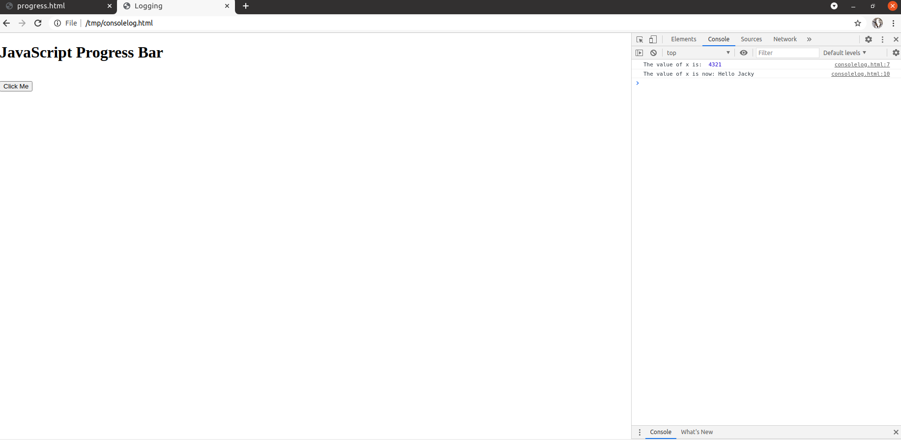
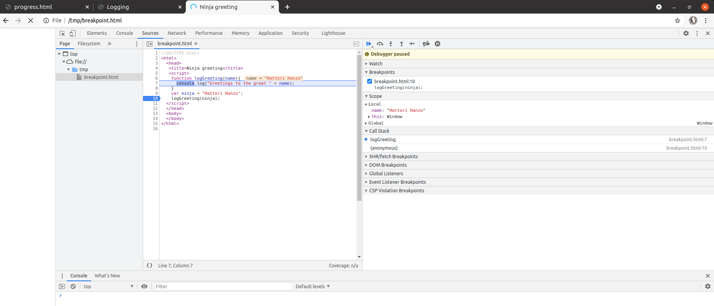
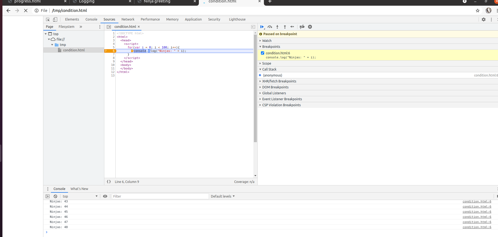
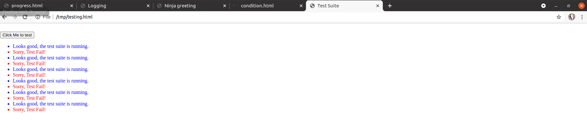
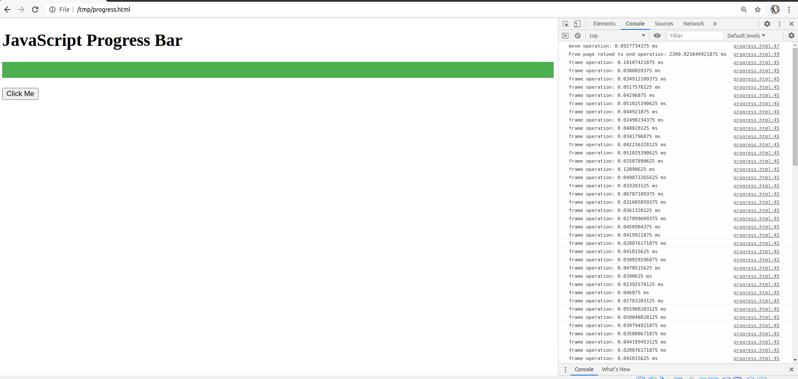

# Learning Javascript - Best practices

- [Practices - Debugging, Testing, and Performance Analysing](#practices---debugging-testing-and-performance-analysing)
	- [`Debugging skills`](#debugging-skills)
		- [Logging](#logging)
		- [Breakpoints](#breakpoints)
	- [`Testing`](#testing)
	- [`Performance analysis`](#performance-analysis)

## Practices - Debugging, Testing, and Performance Analysing

### `Debugging skills`
> A significant portion of time developing software is spent on removing annoying bugs. Although this can sometimes be interesting, almost like solving a whodunit mystery, typically we’ll want our code working correctly and bug-free as soon as possible.

> Debugging JavaScript has two important aspects:

* Logging, which prints out what’s going on as our code is running
* Breakpoints, which allow us to temporarily pause the execution of our code and explore the current state of the application

#### Logging
> Logging statements are used for outputting messages during program execution, without impeding the normal flow of the program. When we add logging statements to our code

> ***Usages***
> By using the console.log method, we benefit from seeing messages in the browser’s console. For example, if we want to know the value of a variable named x at certain points of program execution
```
      var x = 1234;
      console.log("The value of x is: ", x);
```

> ***Example:*** *simple html page to demostrate console.log*

```html
<!DOCTYPE html>
<html>
  <head>
   <title>Logging</title>
   <script>
     var x = 4321;
     console.log("The value of x is: ", x);

     x = "Hello " + "Jacky";
     console.log("The value of x is now:", x);
   </script>
   </head>
   <body>
        <h1>JavaScript Progress Bar</h1>
        <div id="myProgress">
        <div id="myBar"></div>
        </div>
        <br>
        <button onclick="move()">Click Me</button>
   </body>
</html>
```

> **Result:** See console for debugging message  


---

#### Breakpoints
> Using breakpoints can be more complex than logging, but they possess a notable advantage: They halt the execution of a script at a specific line of code, pausing the browser.

> ***Usages***
> Set a breakpoint by using the Chrome DevTools on the annotated line that calls the logGreeting function (by clicking the line number gutter in the Debugger pane) and refresh the page to cause the code to execute. The debugger would then stop the execution at that line

> ***Example:***

```html
<!DOCTYPE html>
<html>
  <head>
   <title>Ninja greeting</title>
   <script>
    function logGreeting(name){
      console.log("Greetings to the great " + name);
    }
    var ninja = "Hattori Hanzo";
    logGreeting(ninja);
  </script>
  </head>
  <body>
  </body>
</html>
```

> **Result:** Execution will be stopped on line `logGreeting(ninja)`


---

> Standard breakpoints cause the debugger to stop the application execution every time a debugger reaches that particular point in program execution, a conditional breakpoints causes the debugger to break only if an expression associated with the conditional breakpoints is satisfied

> You can set a conditional breakpoint by right-clicking in the line-number gutter and choosing Add condition, for example `i === 49`

```html
<!DOCTYPE html>
<html>
  <head>
    <script>
      for(var i = 0; i < 100; i++){
        console.log("Ninjas: " + i);
      }
    </script>
  </head>
  <body>
  </body>
</html>
```

> **Result:** Execution is stopped after the `looping iteration 48`


---

### `Testing`
> The primary tool we’ll use for testing is an assert function, whose purpose is to assert that a premise is either true or false. By specifying assertions, we can check whether the code is behaving as expected.

> ***Usages***

```
assert(condition, message);
```
> Condition is boolean type: true or false

> ***Example:*** *Simple html page with button to test for assertion*

```html
<!DOCTYPE html>
<html>
  <head>
    <title>Test Suite</title>
    <br>
    <button onclick="assert(,)">Click Me to test</button>
    <script>
      function assert(value, desc) {
        var li = document.createElement("li");
        li.className = value ? "pass" : "fail";
        li.appendChild(document.createTextNode(desc));
        document.getElementById("results").appendChild(li);
      }
      window.onclick = function() {
        assert(true, "Looks good, the test suite is running.");
        assert(false, "Sorry, Test Fail!");
      };
    </script>
    <style>
      #results li.pass { color: blue; }
      #results li.fail { color: red; }
    </style>
  </head>
  <body>
    <ul id="results"></ul>
  </body>
</html>
```

> **Result:** The test suite consists of two trivial tests: one that will always succeed, and one that will always fail:


---

### `Performance analysis`
> The JavaScript engines have made astounding strides in the performance of JavaScript, but that’s no excuse for writing sloppy and inefficient code

> Before the operation begins executing, the call to console.time starts a timer with a name (in this case, My operation). Then we run the code in the for loop a certain number of times (in this case, maxCount times). Because a single operation of the code happens much too quickly to measure reliably, we need to perform the code many times to get a measurable value. Frequently, this count can be in the tens of thousands, or even millions, depending on the nature of the code being measured. A little trial and error lets us choose a reasonable value.

> When the operation ends, we call the console.timeEnd method with the same name. This causes the browser to output the time that elapsed since the timer was started.

> ***Usages***
```diff
+ console.time("Operation"); // Timer start
<code>
- console.timeEnd("Operation"); // Timer stop
```

> ***Example:*** *simple html page running javascript to move progress bar*
```html
<!DOCTYPE html>
<html>
<style>
#myProgress {
  width: 100%;
  background-color: #ddd;
}

#myBar {
  width: 1%;
  height: 30px;
  background-color: #4CAF50;
}
</style>
<body>

<h1>JavaScript Progress Bar</h1>

<div id="myProgress">
  <div id="myBar"></div>
</div>

<br>
<button onclick="move()">Click Me</button>

<script>
console.time("From page reload to end operation");
var i = 0;
function move() {
  console.time("move operation");
  if (i == 0) {
    i = 1;
    var elem = document.getElementById("myBar");
    var width = 1;
    var id = setInterval(frame, 10);
    function frame() {
      console.time("frame operation");
      if (width >= 100) {
        clearInterval(id);
        i = 0;
      } else {
        width++;
        elem.style.width = width + "%";
      }
      console.timeEnd("frame operation");
    }
  console.timeEnd("move operation");
  }
console.timeEnd("From page reload to end operation");
}
</script>

</body>
</html>
```
> **Result:** See various timers took in left side javascript console when button clicked


---
