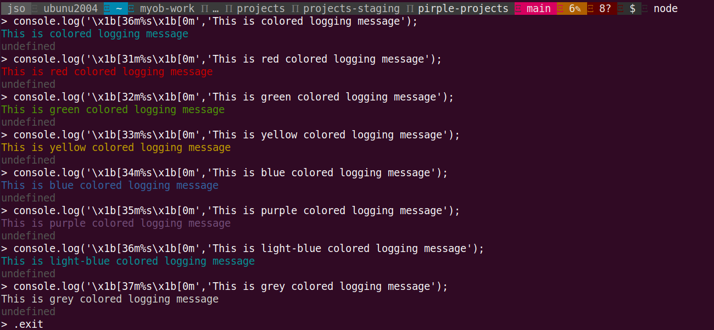
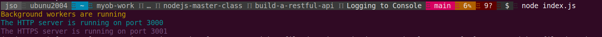
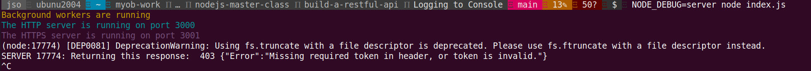
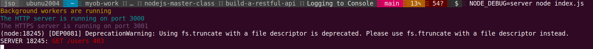

# Nodejs learning - Logging for observability and debugging

`Table of Content`

<!-- vim-markdown-toc GFM -->

- [`console log` - Log output message in running nodejs console](#console-log---log-output-message-in-running-nodejs-console)
- [`NODE_DEBUG` - Enable debug level logging in specific service call](#node_debug---enable-debug-level-logging-in-specific-service-call)

<!-- vim-markdown-toc -->

## `console log` - Log output message in running nodejs console

***Usages***
- [x] console.log

`code`

```javascript
console.log('This is logging message');
```

`Run`

```bash
$  node
> console.log('This is logging message');
This is logging message
> console.log('Bingo, it works');
Bingo, it works
> .exit
```

***Examples***

<pre>
$  tree .
├── https
│   ├── cert.pem
│   ├── keyGeneration.txt
│   └── key.pem
├── index.js
└── lib
    ├── config.js
    ├── data.js
    ├── handlers.js
    ├── helpers.js
    ├── logs.js
    ├── server.js
    └── workers.js

2 directories, 11 files
</pre>

```bash
$  ag "console.log" -G js
lib/workers.js
31:            console.log("Error reading one of the check's data: ",err);
36:      console.log('Error: Could not find any checks to process');
66:    console.log("Error: one of the checks is not properly formatted. Skipping.");
160:        console.log("Check outcome has not changed, no alert needed");
163:      console.log("Error trying to save updates to one of the checks");
173:      console.log("Success: User was alerted to a status change in their check, via sms: ",msg);
175:      console.log("Error: Could not send sms alert to user who had a state change in their check",err);
200:      console.log("Logging to file succeeded");
202:      console.log("Logging to file failed");
229:                console.log("Success truncating logfile");
231:                console.log("Error truncating logfile");
235:            console.log("Error compressing one of the log files.",err);
240:      console.log('Error: Could not find any logs to rotate');

lib/handlers.js
510:        console.log("This is check data",checkData);

lib/server.js
91:         console.log(trimmedPath,statusCode);
109:    console.log('The HTTP server is running on port '+config.httpPort);
114:   console.log('The HTTPS server is running on port '+config.httpsPort);
```

```bash
$  node index.js
The HTTP server is running on port 3000
The HTTPS server is running on port 3001
Success truncating logfile
Logging to file succeeded
Check outcome has not changed, no alert needed
...
```

> Let's make color on console.log message

***Usage***

`Code`

```javascript
console.log('\x1b[36m%s\x1b[0m','This is colored logging message');
```

`Run`



***Examples***

```bash
├── https
│   ├── cert.pem
│   ├── keyGeneration.txt
│   └── key.pem
├── index.js
└── lib
    ├── config.js
    ├── data.js
    ├── handlers.js
    ├── helpers.js
    ├── logs.js
    ├── server.js
    └── workers.js

$  ag console.log -G js
lib/workers.js
258:  console.log('\x1b[33m%s\x1b[0m','Background workers are running');

lib/server.js
117:    console.log('\x1b[36m%s\x1b[0m','The HTTP server is running on port '+config.httpPort);
122:    console.log('\x1b[35m%s\x1b[0m','The HTTPS server is running on port '+config.httpsPort);
```

`Run`



[Back to Top](#nodejs-learning---logging-for-observability-and-debugging)

---

## `NODE_DEBUG` - Enable debug level logging in specific service call

***Usage*** - Turn on Debug logging

- [x] Turn on environment variable `NODE_DEBUG` when run nodejs service

> Let's try to enable debug logging on http/https service

<details><summary><i>Click to view run output</i></summary><br>

```bash
$  NODE_DEBUG=http node index.js
Background workers are running
The HTTP server is running on port 3000
The HTTPS server is running on port 3001
HTTP 15342: call onSocket 0 0
HTTP 15342: createConnection twitter.com:443:::::::::::::::::: { servername: 'twitter.com',
  _defaultAgent:
   Agent {
     _events: [Object: null prototype] { free: [Function] },
     _eventsCount: 1,
     _maxListeners: undefined,
     defaultPort: 443,
     protocol: 'https:',
     options: { path: null },
     requests: {},
     sockets: { 'twitter.com:443::::::::::::::::::': [] },
     freeSockets: {},
     keepAliveMsecs: 1000,
     keepAlive: false,
     maxSockets: Infinity,
     maxFreeSockets: 256,
     maxCachedSessions: 100,
     _sessionCache: { map: {}, list: [] } },
  protocol: 'https:',
  hostname: 'twitter.com',
  method: 'GET',
  path: null,
  timeout: 1000,
  port: 443,
  host: 'twitter.com',
  _agentKey: 'twitter.com:443::::::::::::::::::' }
HTTP 15342: sockets twitter.com:443:::::::::::::::::: 1
HTTP 15342: outgoing message end.
HTTP 15342: call onSocket 0 0
HTTP 15342: createConnection google.com:443:::::::::::::::::: { servername: 'google.com',
  _defaultAgent:
   Agent {
     _events: [Object: null prototype] { free: [Function] },
     _eventsCount: 1,
     _maxListeners: undefined,
     defaultPort: 443,
     protocol: 'https:',
     options: { path: null },
     requests: {},
     sockets:
      { 'twitter.com:443::::::::::::::::::': [Array],
        'google.com:443::::::::::::::::::': [] },
     freeSockets: {},
     keepAliveMsecs: 1000,
     keepAlive: false,
     maxSockets: Infinity,
     maxFreeSockets: 256,
     maxCachedSessions: 100,
     _sessionCache: { map: {}, list: [] } },
  protocol: 'https:',
  hostname: 'google.com',
  method: 'GET',
  path: null,
  timeout: 1000,
  port: 443,
  host: 'google.com',
  _agentKey: 'google.com:443::::::::::::::::::' }
HTTP 15342: sockets google.com:443:::::::::::::::::: 1
HTTP 15342: outgoing message end.
HTTP 15342: call onSocket 0 0
HTTP 15342: createConnection facebook.com:80: { servername: 'facebook.com',
  timeout: 1000,
  path: null,
  method: 'GET',
  hostname: 'facebook.com',
  protocol: 'http:',
  port: 80,
  host: 'facebook.com',
  _agentKey: 'facebook.com:80:' }
HTTP 15342: sockets facebook.com:80: 1
HTTP 15342: outgoing message end.
HTTP 15342: AGENT incoming response!
(node:15342) [DEP0081] DeprecationWarning: Using fs.truncate with a file descriptor is deprecated. Please use fs.ftruncate with a file descriptor instead.
HTTP 15342: CLIENT socket onClose
HTTP 15342: removeSocket facebook.com:80: writable: false
HTTP 15342: HTTP socket close
HTTP 15342: AGENT incoming response!
HTTP 15342: AGENT incoming response!
HTTP 15342: CLIENT socket onClose
HTTP 15342: removeSocket google.com:443:::::::::::::::::: writable: false
HTTP 15342: HTTP socket close
```

</details><br>

***Usage*** - Configure debug logging on selected packages

- [x] Dependencies
  - [x] util
- [x] Declaration of use
  - [x] `debug = util.debuglog(<label>)`
- [x] Logging with debug 
- [x] Run nodejs with `NODE_DEBUG=<label>`


> Let's make it in `lib/workers.js`

```javascript
15:var util = require('util');
16:var debug = util.debuglog('workers');

33:            debug("Error reading one of the check's data: ",err);
38:      debug('Error: Could not find any checks to process');
68:    debug("Error: one of the checks is not properly formatted. Skipping.");
162:        debug("Check outcome has not changed, no alert needed");
165:      debug("Error trying to save updates to one of the checks");
175:      debug("Success: User was alerted to a status change in their check, via sms: ",msg);
177:      debug("Error: Could not send sms alert to user who had a state change in their check",err);
202:      debug("Logging to file succeeded");
204:      debug("Logging to file failed");
231:                debug("Success truncating logfile");
233:                debug("Error truncating logfile");
237:            debug("Error compressing one of the log files.",err);
242:      debug('Error: Could not find any logs to rotate');
```

```bash
$  NODE_DEBUG=workers node index.js
Background workers are running
The HTTP server is running on port 3000
The HTTPS server is running on port 3001
WORKERS 17040: Success truncating logfile
WORKERS 17040: Success truncating logfile
WORKERS 17040: Success truncating logfile
(node:17040) [DEP0081] DeprecationWarning: Using fs.truncate with a file descriptor is deprecated. Please use fs.ftruncate with a file descriptor instead.
WORKERS 17040: Logging to file succeeded
WORKERS 17040: Check outcome has not changed, no alert needed
WORKERS 17040: Logging to file succeeded
WORKERS 17040: Check outcome has not changed, no alert needed
WORKERS 17040: Logging to file succeeded
WORKERS 17040: Check outcome has not changed, no alert needed
```

`Note` - You will now see log messages of lib/workers.js prefixed with `WORKERS <PID>`

> Let's verify what when no NODE_DEBUG specified

```bash
$  node index.js
Background workers are running
The HTTP server is running on port 3000
The HTTPS server is running on port 3001
```

`Note` - Only console.log messages are logged and No debug messages at all.

> Let's make it in `lib/server.js`

```javascript
15:var util = require('util');
16:var debug = util.debuglog('server');

94:// Return response
95:         debug('Returning this response: ',statusCode,payloadString);
```



`Note` - You will now see log messages of lib/server.js prefixed with `SERVER <PID>` when request hits to server

> Let's make debug messages programmable conditionally 

```javascript
15:var util = require('util');
16:var debug = util.debuglog('server');

96:	// If the response is 200, print green, otherwise print red
97:	  if(statusCode == 200){
98:		debug('\x1b[32m%s\x1b[0m',method.toUpperCase()+' /'+trimmedPath+' '+statusCode);
99:	  } else {
100:		debug('\x1b[31m%s\x1b[0m',method.toUpperCase()+' /'+trimmedPath+' '+statusCode);
101:	}
```



`Note` - You will now see log messages of lib/server.js in red colored entry when failed `non status code 200` request hits to server

[Back to Top](#nodejs-learning---logging-for-observability-and-debugging)

---

[Nodejs logging]: https://sematext.com/blog/node-js-logging/

