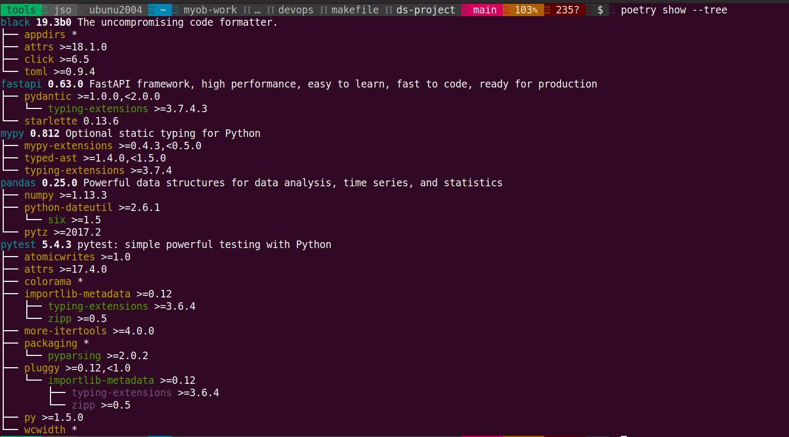
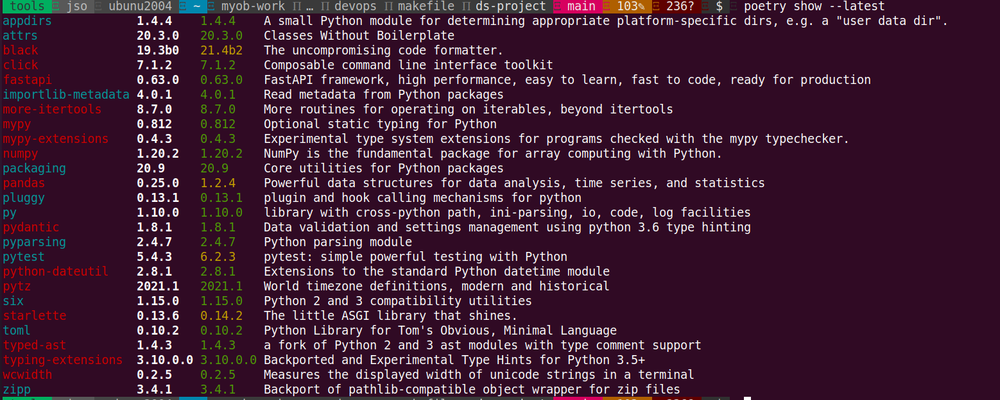

# Python - some useful tools



🔧 **Programming & Tools:**

[](#pyenv)
[](#poetry)
[](#black)
[](#mypy)
[](#pytest)

**ToC**
<!-- vim-markdown-toc GFM -->

- [`pyenv`](#pyenv)
- [`poetry`](#poetry)
- [`black`](#black)
- [`mypy`](#mypy)
- [`pytest`](#pytest)

<!-- vim-markdown-toc -->

## `pyenv`

***Makefile***

```cmake
.PHONY: pyenv pyenv-list pyenv-install pyenv-global pyenv-global-show

pyenv: ## Check pyenv installed in $PATH and its version/help, install if missing
ifeq (, $(shell which pyenv))
        @echo "No $@ installed in $(PATH), Installing now..."
        @curl -s https://pyenv.run | bash && $@ help || true
else
        @$@ help || true
endif

pyenv-list: ## List all available version for pyenv install use
        @pyenv install --list || true

pyenv-global-show: ## Show current pyenv global
        @pyenv global || true

pyenv-global: ## Make $(PYENV_VERSION) as pyenv global
        @pyenv global $(PYENV_VERSION) && $(MAKE) -sf $(MAKEFILE) pyenv-global-show || true

pyenv-install: ## Install version $(PYENV_VERSION) and make it global
        @pyenv install $(PYENV_VERSION) && $(MAKE) -sf $(MAKEFILE) pyenv-global || true
```

***Installation***

```bash
$  make -f Makefile-python

 Choose a command run:

var                                      Show all defined variables
pyenv                                    Check pyenv installed in $PATH and its version/help, install if missing
pyenv-list                               List all available version for pyenv install use
pyenv-global-show                        Show current pyenv global
pyenv-global                             Make $(PYENV_VERSION) as pyenv global
pyenv-install                            Install version $(PYENV_VERSION) and make it global

$  make -f Makefile-python pyenv
No pyenv installed in /usr/local/sbin:/usr/local/bin:/usr/sbin:/usr/bin:/sbin:/bin:/usr/games:/usr/local/games:/snap/bin:.:/home1/jso:/usr/local/go/bin:/home1/jso/.local/bin, Installing now...

Cloning into '/home1/jso/.pyenv'...
remote: Enumerating objects: 751, done.
remote: Counting objects: 100% (751/751), done.
remote: Compressing objects: 100% (505/505), done.
remote: Total 751 (delta 390), reused 344 (delta 151), pack-reused 0
Receiving objects: 100% (751/751), 414.23 KiB | 1.87 MiB/s, done.
Resolving deltas: 100% (390/390), done.
Cloning into '/home1/jso/.pyenv/plugins/pyenv-doctor'...
remote: Enumerating objects: 11, done.
remote: Counting objects: 100% (11/11), done.
remote: Compressing objects: 100% (9/9), done.
remote: Total 11 (delta 1), reused 2 (delta 0), pack-reused 0
Unpacking objects: 100% (11/11), 38.62 KiB | 1.48 MiB/s, done.
Cloning into '/home1/jso/.pyenv/plugins/pyenv-installer'...
remote: Enumerating objects: 16, done.
remote: Counting objects: 100% (16/16), done.
remote: Compressing objects: 100% (13/13), done.
remote: Total 16 (delta 1), reused 8 (delta 0), pack-reused 0
Unpacking objects: 100% (16/16), 5.99 KiB | 1022.00 KiB/s, done.
Cloning into '/home1/jso/.pyenv/plugins/pyenv-update'...
remote: Enumerating objects: 10, done.
remote: Counting objects: 100% (10/10), done.
remote: Compressing objects: 100% (6/6), done.
remote: Total 10 (delta 1), reused 5 (delta 0), pack-reused 0
Unpacking objects: 100% (10/10), 2.77 KiB | 2.77 MiB/s, done.
Cloning into '/home1/jso/.pyenv/plugins/pyenv-virtualenv'...
remote: Enumerating objects: 57, done.
remote: Counting objects: 100% (57/57), done.
remote: Compressing objects: 100% (51/51), done.
remote: Total 57 (delta 11), reused 20 (delta 0), pack-reused 0
Unpacking objects: 100% (57/57), 34.86 KiB | 811.00 KiB/s, done.
Cloning into '/home1/jso/.pyenv/plugins/pyenv-which-ext'...
remote: Enumerating objects: 10, done.
remote: Counting objects: 100% (10/10), done.
remote: Compressing objects: 100% (6/6), done.
remote: Total 10 (delta 1), reused 6 (delta 0), pack-reused 0
Unpacking objects: 100% (10/10), 2.92 KiB | 199.00 KiB/s, done.

WARNING: seems you still have not added 'pyenv' to the load path.

# Load pyenv automatically by adding
# the following to ~/.bashrc:

export PATH="/home1/jso/.pyenv/bin:$PATH"
eval "$(pyenv init -)"
eval "$(pyenv virtualenv-init -)"
```

***Post adding to ~/.bashrc***

```bash
$  make -f Makefile-python pyenv
Unable to locate credentials. You can configure credentials by running "aws configure".
Usage: pyenv <command> [<args>]

Some useful pyenv commands are:
   activate    Activate virtual environment
   commands    List all available pyenv commands
   deactivate   Deactivate virtual environment
   doctor      Verify pyenv installation and development tools to build pythons.
   exec        Run an executable with the selected Python version
   global      Set or show the global Python version(s)
   help        Display help for a command
   hooks       List hook scripts for a given pyenv command
   init        Configure the shell environment for pyenv
   install     Install a Python version using python-build
   local       Set or show the local application-specific Python version(s)
   prefix      Display prefix for a Python version
   rehash      Rehash pyenv shims (run this after installing executables)
   root        Display the root directory where versions and shims are kept
   shell       Set or show the shell-specific Python version
   shims       List existing pyenv shims
   uninstall   Uninstall a specific Python version
   --version   Display the version of pyenv
   version     Show the current Python version(s) and its origin
   version-file   Detect the file that sets the current pyenv version
   version-name   Show the current Python version
   version-origin   Explain how the current Python version is set
   versions    List all Python versions available to pyenv
   virtualenv   Create a Python virtualenv using the pyenv-virtualenv plugin
   virtualenv-delete   Uninstall a specific Python virtualenv
   virtualenv-init   Configure the shell environment for pyenv-virtualenv
   virtualenv-prefix   Display real_prefix for a Python virtualenv version
   virtualenvs   List all Python virtualenvs found in `$PYENV_ROOT/versions/*'.
   whence      List all Python versions that contain the given executable
   which       Display the full path to an executable

See `pyenv help <command>' for information on a specific command.
For full documentation, see: https://github.com/pyenv/pyenv#readme
```

***Usages***

> Install python version and set global

```bash
$  make -f Makefile-python var | grep VERSION
PYENV_VERSION                            3.8.5

$  make -f Makefile-python pyenv-install
Downloading Python-3.8.5.tar.xz...
-> https://www.python.org/ftp/python/3.8.5/Python-3.8.5.tar.xz
Installing Python-3.8.5...
WARNING: The Python bz2 extension was not compiled. Missing the bzip2 lib?
WARNING: The Python readline extension was not compiled. Missing the GNU readline lib?
WARNING: The Python sqlite3 extension was not compiled. Missing the SQLite3 lib?
Installed Python-3.8.5 to /home1/jso/.pyenv/versions/3.8.5

$  make -f Makefile-python pyenv-global-show
3.8.5

$  make -f Makefile-python pyenv-global
3.8.5

$  make -f Makefile-python pyenv-install PYENV_VERSION=3.7.5
Downloading Python-3.7.5.tar.xz...
-> https://www.python.org/ftp/python/3.7.5/Python-3.7.5.tar.xz
Installing Python-3.7.5...
WARNING: The Python bz2 extension was not compiled. Missing the bzip2 lib?
WARNING: The Python readline extension was not compiled. Missing the GNU readline lib?
WARNING: The Python sqlite3 extension was not compiled. Missing the SQLite3 lib?
Installed Python-3.7.5 to /home1/jso/.pyenv/versions/3.7.5

3.7.5

$  make -f Makefile-python pyenv-global-show
3.7.5

$  make -f Makefile-python pyenv-global
3.8.5

$  make -f Makefile-python pyenv-global-show
3.8.5
```

> Remove virtual environment

```bash
$  pyenv virtualenv-delete tools
pyenv-virtualenv: remove /home1/jso/.pyenv/versions/3.7.5/envs/tools? y
```

## `poetry`

> Install poetry tool and switching between various pyenv version

```bash
# Create a virtual environment called tools that is based on 3.7.5
$  pyenv virtualenv 3.7.5 tools
Looking in links: /tmp/tmpleoekepe
Requirement already satisfied: setuptools in /home1/jso/.pyenv/versions/3.7.5/envs/tools/lib/python3.7/site-packages (41.2.0)
Requirement already satisfied: pip in /home1/jso/.pyenv/versions/3.7.5/envs/tools/lib/python3.7/site-packages (19.2.3)

# Install poetry into the tools virtual env
$  pyenv activate tools
pyenv-virtualenv: prompt changing will be removed from future release. configure `export PYENV_VIRTUALENV_DISABLE_PROMPT=1' to simulate the behavior.

$  pip install poetry
Collecting poetry
  Downloading https://files.pythonhosted.org/packages/4e/66/efbdfc155ff624b17714b4ed3b087b9bc80080827155e428807fdc800918/poetry-1.1.6-py2.py3-none-any.whl (172kB)
     |████████████████████████████████| 174kB 2.0MB/s
Collecting shellingham<2.0,>=1.1 (from poetry)
  Downloading https://files.pythonhosted.org/packages/76/94/7a764d57d0f46534e0022e651da6547bc5cfe7b6372e7e0ed1dde6f5cb67/shellingham-1.4.0-py2.py3-none-any.whl
Collecting pkginfo<2.0,>=1.4 (from poetry)
  Downloading https://files.pythonhosted.org/packages/b0/9a/d78e7c299eb5659bc3a036e5a968a399c62bfe0b2aa18baf7d13f43373ba/pkginfo-1.7.0-py2.py3-none-any.whl
Collecting virtualenv<21.0.0,>=20.0.26 (from poetry)
  Downloading https://files.pythonhosted.org/packages/5c/e1/f6a07ac8ce8eb085b2db3db03d23bc07c5b8b4d4b95cc31aad46a706d563/virtualenv-20.4.4-py2.py3-none-any.whl (7.2MB)
     |████████████████████████████████| 7.2MB 3.0MB/s
Collecting cleo<0.9.0,>=0.8.1 (from poetry)
  Downloading https://files.pythonhosted.org/packages/09/46/3577da4237675e90630e8e9ccd2c7dbcd42afd4463712a207eab148dfbc2/cleo-0.8.1-py2.py3-none-any.whl
Collecting keyring<22.0.0,>=21.2.0; python_version >= "3.6" and python_version < "4.0" (from poetry)
  Downloading https://files.pythonhosted.org/packages/d0/a0/20e656cd1e2313af619e382782bd47b5f77a3f33d81992554f3aac56e90d/keyring-21.8.0-py3-none-any.whl
Collecting poetry-core<1.1.0,>=1.0.3 (from poetry)
  Downloading https://files.pythonhosted.org/packages/bf/e1/08c7478df1e93dea47b06c9d9a80dbb54af7421462e1b22c280d063df807/poetry_core-1.0.3-py2.py3-none-any.whl (424kB)
     |████████████████████████████████| 430kB 2.9MB/s
Collecting html5lib<2.0,>=1.0 (from poetry)
  Downloading https://files.pythonhosted.org/packages/6c/dd/a834df6482147d48e225a49515aabc28974ad5a4ca3215c18a882565b028/html5lib-1.1-py2.py3-none-any.whl (112kB)
     |████████████████████████████████| 112kB 2.4MB/s
Collecting pexpect<5.0.0,>=4.7.0 (from poetry)
  Using cached https://files.pythonhosted.org/packages/39/7b/88dbb785881c28a102619d46423cb853b46dbccc70d3ac362d99773a78ce/pexpect-4.8.0-py2.py3-none-any.whl
Collecting cachy<0.4.0,>=0.3.0 (from poetry)
  Downloading https://files.pythonhosted.org/packages/82/e6/badd9af6feee43e76c3445b2621a60d3d99fe0e33fffa8df43590212ea63/cachy-0.3.0-py2.py3-none-any.whl
Collecting cachecontrol[filecache]<0.13.0,>=0.12.4 (from poetry)
  Downloading https://files.pythonhosted.org/packages/18/71/0a9df4206a5dc5ae7609c41efddab2270a2c1ff61d39de7591dc7302ef89/CacheControl-0.12.6-py2.py3-none-any.whl
Collecting crashtest<0.4.0,>=0.3.0; python_version >= "3.6" and python_version < "4.0" (from poetry)
  Downloading https://files.pythonhosted.org/packages/76/97/2a99f020be5e4a5a97ba10bc480e2e6a889b5087103a2c6b952b5f819d27/crashtest-0.3.1-py3-none-any.whl
Collecting clikit<0.7.0,>=0.6.2 (from poetry)
  Downloading https://files.pythonhosted.org/packages/f2/3d/4394c710b9195b83382dc67bdd1040e5ebfc3fc8df90e20fe74341298c57/clikit-0.6.2-py2.py3-none-any.whl (91kB)
     |████████████████████████████████| 92kB 2.4MB/s
Collecting importlib-metadata<2.0.0,>=1.6.0; python_version < "3.8" (from poetry)
  Downloading https://files.pythonhosted.org/packages/8e/58/cdea07eb51fc2b906db0968a94700866fc46249bdc75cac23f9d13168929/importlib_metadata-1.7.0-py2.py3-none-any.whl
Collecting packaging<21.0,>=20.4 (from poetry)
  Using cached https://files.pythonhosted.org/packages/3e/89/7ea760b4daa42653ece2380531c90f64788d979110a2ab51049d92f408af/packaging-20.9-py2.py3-none-any.whl
Collecting requests<3.0,>=2.18 (from poetry)
  Using cached https://files.pythonhosted.org/packages/29/c1/24814557f1d22c56d50280771a17307e6bf87b70727d975fd6b2ce6b014a/requests-2.25.1-py2.py3-none-any.whl
Collecting tomlkit<1.0.0,>=0.7.0 (from poetry)
  Downloading https://files.pythonhosted.org/packages/bc/01/a0ee34fe37dd54f795e8f8a820af57c9a94d7358276acf6cdc21ae8d9533/tomlkit-0.7.0-py2.py3-none-any.whl
Collecting requests-toolbelt<0.10.0,>=0.9.1 (from poetry)
  Downloading https://files.pythonhosted.org/packages/60/ef/7681134338fc097acef8d9b2f8abe0458e4d87559c689a8c306d0957ece5/requests_toolbelt-0.9.1-py2.py3-none-any.whl (54kB)
     |████████████████████████████████| 61kB 3.7MB/s
Collecting distlib<1,>=0.3.1 (from virtualenv<21.0.0,>=20.0.26->poetry)
  Using cached https://files.pythonhosted.org/packages/f5/0a/490fa011d699bb5a5f3a0cf57de82237f52a6db9d40f33c53b2736c9a1f9/distlib-0.3.1-py2.py3-none-any.whl
Collecting appdirs<2,>=1.4.3 (from virtualenv<21.0.0,>=20.0.26->poetry)
  Using cached https://files.pythonhosted.org/packages/3b/00/2344469e2084fb287c2e0b57b72910309874c3245463acd6cf5e3db69324/appdirs-1.4.4-py2.py3-none-any.whl
Collecting six<2,>=1.9.0 (from virtualenv<21.0.0,>=20.0.26->poetry)
  Using cached https://files.pythonhosted.org/packages/ee/ff/48bde5c0f013094d729fe4b0316ba2a24774b3ff1c52d924a8a4cb04078a/six-1.15.0-py2.py3-none-any.whl
Collecting filelock<4,>=3.0.0 (from virtualenv<21.0.0,>=20.0.26->poetry)
  Using cached https://files.pythonhosted.org/packages/93/83/71a2ee6158bb9f39a90c0dea1637f81d5eef866e188e1971a1b1ab01a35a/filelock-3.0.12-py3-none-any.whl
Collecting SecretStorage>=3.2; sys_platform == "linux" (from keyring<22.0.0,>=21.2.0; python_version >= "3.6" and python_version < "4.0"->poetry)
  Downloading https://files.pythonhosted.org/packages/d9/1e/29cd69fdac7391aa51510dfd42aa70b4e6a826c8cd019ee2a8ab9ec0777f/SecretStorage-3.3.1-py3-none-any.whl
Collecting jeepney>=0.4.2; sys_platform == "linux" (from keyring<22.0.0,>=21.2.0; python_version >= "3.6" and python_version < "4.0"->poetry)
  Downloading https://files.pythonhosted.org/packages/51/b0/a6ea72741aaac3f37fb96d195e4ee576a103c4c04e279bc6b446a70960e1/jeepney-0.6.0-py3-none-any.whl (45kB)
     |████████████████████████████████| 51kB 2.8MB/s
Collecting webencodings (from html5lib<2.0,>=1.0->poetry)
  Using cached https://files.pythonhosted.org/packages/f4/24/2a3e3df732393fed8b3ebf2ec078f05546de641fe1b667ee316ec1dcf3b7/webencodings-0.5.1-py2.py3-none-any.whl
Collecting ptyprocess>=0.5 (from pexpect<5.0.0,>=4.7.0->poetry)
  Using cached https://files.pythonhosted.org/packages/22/a6/858897256d0deac81a172289110f31629fc4cee19b6f01283303e18c8db3/ptyprocess-0.7.0-py2.py3-none-any.whl
Collecting msgpack>=0.5.2 (from cachecontrol[filecache]<0.13.0,>=0.12.4->poetry)
  Downloading https://files.pythonhosted.org/packages/b7/88/b0d0c339044360036e51d3afda0d2b0f9503087fddff8867496198b24cda/msgpack-1.0.2-cp37-cp37m-manylinux1_x86_64.whl (273kB)
     |████████████████████████████████| 276kB 3.1MB/s
Collecting lockfile>=0.9; extra == "filecache" (from cachecontrol[filecache]<0.13.0,>=0.12.4->poetry)
  Downloading https://files.pythonhosted.org/packages/c8/22/9460e311f340cb62d26a38c419b1381b8593b0bb6b5d1f056938b086d362/lockfile-0.12.2-py2.py3-none-any.whl
Collecting pylev<2.0,>=1.3 (from clikit<0.7.0,>=0.6.2->poetry)
  Downloading https://files.pythonhosted.org/packages/40/1c/7dff1d242bf1e19f9c6202f0ba4e6fd18cc7ecb8bc85b17b2d16c806e228/pylev-1.3.0-py2.py3-none-any.whl
Collecting pastel<0.3.0,>=0.2.0 (from clikit<0.7.0,>=0.6.2->poetry)
  Downloading https://files.pythonhosted.org/packages/aa/18/a8444036c6dd65ba3624c63b734d3ba95ba63ace513078e1580590075d21/pastel-0.2.1-py2.py3-none-any.whl
Collecting zipp>=0.5 (from importlib-metadata<2.0.0,>=1.6.0; python_version < "3.8"->poetry)
  Downloading https://files.pythonhosted.org/packages/0f/8c/715c54e9e34c0c4820f616a913a7de3337d0cd79074dd1bed4dd840f16ae/zipp-3.4.1-py3-none-any.whl
Collecting pyparsing>=2.0.2 (from packaging<21.0,>=20.4->poetry)
  Using cached https://files.pythonhosted.org/packages/8a/bb/488841f56197b13700afd5658fc279a2025a39e22449b7cf29864669b15d/pyparsing-2.4.7-py2.py3-none-any.whl
Collecting chardet<5,>=3.0.2 (from requests<3.0,>=2.18->poetry)
  Using cached https://files.pythonhosted.org/packages/19/c7/fa589626997dd07bd87d9269342ccb74b1720384a4d739a1872bd84fbe68/chardet-4.0.0-py2.py3-none-any.whl
Collecting idna<3,>=2.5 (from requests<3.0,>=2.18->poetry)
  Using cached https://files.pythonhosted.org/packages/a2/38/928ddce2273eaa564f6f50de919327bf3a00f091b5baba8dfa9460f3a8a8/idna-2.10-py2.py3-none-any.whl
Collecting urllib3<1.27,>=1.21.1 (from requests<3.0,>=2.18->poetry)
  Using cached https://files.pythonhosted.org/packages/09/c6/d3e3abe5b4f4f16cf0dfc9240ab7ce10c2baa0e268989a4e3ec19e90c84e/urllib3-1.26.4-py2.py3-none-any.whl
Collecting certifi>=2017.4.17 (from requests<3.0,>=2.18->poetry)
  Using cached https://files.pythonhosted.org/packages/5e/a0/5f06e1e1d463903cf0c0eebeb751791119ed7a4b3737fdc9a77f1cdfb51f/certifi-2020.12.5-py2.py3-none-any.whl
Collecting cryptography>=2.0 (from SecretStorage>=3.2; sys_platform == "linux"->keyring<22.0.0,>=21.2.0; python_version >= "3.6" and python_version < "4.0"->poetry)
  Downloading https://files.pythonhosted.org/packages/16/9d/aa507ddc5dc630b499d4905000b17448a969f0cdcdb9bbc2fe5e369a5fad/cryptography-3.4.7-cp36-abi3-manylinux2010_x86_64.whl (3.1MB)
     |████████████████████████████████| 3.1MB 3.0MB/s
Collecting cffi>=1.12 (from cryptography>=2.0->SecretStorage>=3.2; sys_platform == "linux"->keyring<22.0.0,>=21.2.0; python_version >= "3.6" and python_version < "4.0"->poetry)
  Downloading https://files.pythonhosted.org/packages/97/2d/cd29c79f2eb1384577d0662f23c89d29621152f14bef8c6b25747785744b/cffi-1.14.5-cp37-cp37m-manylinux1_x86_64.whl (402kB)
     |████████████████████████████████| 409kB 3.0MB/s
Collecting pycparser (from cffi>=1.12->cryptography>=2.0->SecretStorage>=3.2; sys_platform == "linux"->keyring<22.0.0,>=21.2.0; python_version >= "3.6" and python_version < "4.0"->poetry)
  Using cached https://files.pythonhosted.org/packages/ae/e7/d9c3a176ca4b02024debf82342dab36efadfc5776f9c8db077e8f6e71821/pycparser-2.20-py2.py3-none-any.whl
Installing collected packages: shellingham, pkginfo, distlib, appdirs, six, zipp, importlib-metadata, filelock, virtualenv, pylev, crashtest, pastel, clikit, cleo, pycparser, cffi, cryptography, jeepney, SecretStorage, keyring, poetry-core, webencodings, html5lib, ptyprocess, pexpect, cachy, chardet, idna, urllib3, certifi, requests, msgpack, lockfile, cachecontrol, pyparsing, packaging, tomlkit, requests-toolbelt, poetry
Successfully installed SecretStorage-3.3.1 appdirs-1.4.4 cachecontrol-0.12.6 cachy-0.3.0 certifi-2020.12.5 cffi-1.14.5 chardet-4.0.0 cleo-0.8.1 clikit-0.6.2 crashtest-0.3.1 cryptography-3.4.7 distlib-0.3.1 filelock-3.0.12 html5lib-1.1 idna-2.10 importlib-metadata-1.7.0 jeepney-0.6.0 keyring-21.8.0 lockfile-0.12.2 msgpack-1.0.2 packaging-20.9 pastel-0.2.1 pexpect-4.8.0 pkginfo-1.7.0 poetry-1.1.6 poetry-core-1.0.3 ptyprocess-0.7.0 pycparser-2.20 pylev-1.3.0 pyparsing-2.4.7 requests-2.25.1 requests-toolbelt-0.9.1 shellingham-1.4.0 six-1.15.0 tomlkit-0.7.0 urllib3-1.26.4 virtualenv-20.4.4 webencodings-0.5.1 zipp-3.4.1
WARNING: You are using pip version 19.2.3, however version 21.1.1 is available.
You should consider upgrading via the 'pip install --upgrade pip' command.

# Check installed poetry version
$  poetry --version
Poetry version 1.1.6

# Leave the virtual env
$  pyenv deactivate

# This does not work yet
$  poetry --version
pyenv: poetry: command not found

The `poetry' command exists in these Python versions:
  3.7.5/envs/tools
  tools

Note: See 'pyenv help global' for tips on allowing both
      python2 and python3 to be found.

# Add your tools virtual env to the globally available ones
$  pyenv global 3.7.5 tools
$  poetry --version
Poetry version 1.1.6

# Create a virtual environment called tools that is based on 3.8.5
$  pyenv virtualenv 3.8.5 3.8.5-tools
Looking in links: /tmp/tmpevrn9o5_
Requirement already satisfied: setuptools in /home1/jso/.pyenv/versions/3.8.5/envs/3.8.5-tools/lib/python3.8/site-packages (47.1.0)
Requirement already satisfied: pip in /home1/jso/.pyenv/versions/3.8.5/envs/3.8.5-tools/lib/python3.8/site-packages (20.1.1)

$  pyenv activate 3.8.5-tools
pyenv-virtualenv: prompt changing will be removed from future release. configure `export PYENV_VIRTUALENV_DISABLE_PROMPT=1' to simulate the behavior.
 3.8.5-tools  $  poetry --version
pyenv: poetry: command not found

The `poetry' command exists in these Python versions:
  3.7.5/envs/tools
  tools

Note: See 'pyenv help global' for tips on allowing both
      python2 and python3 to be found.
$  pyenv deactivate
```

> Configure poetry - creates your project’s virtual environment in a .venv folder inside the project directory

```bash
4  ~  myob-work  …  resources  devops  makefile  main  103✎  234?  $  poetry --version
Poetry version 1.1.6

4  ~  myob-work  …  resources  devops  makefile  main  103✎  234?  $  poetry config virtualenvs.in-project true

$  poetry config --list
cache-dir = "/home1/jso/.cache/pypoetry"
experimental.new-installer = true
installer.parallel = true
virtualenvs.create = true
virtualenvs.in-project = true
virtualenvs.path = "{cache-dir}/virtualenvs"  # /home1/jso/.cache/pypoetry/virtualenvs
```

> New project

```bash
$  # Initialze a new Data Science project
$  poetry new ds-project
Created package ds_project in ds-project
$  cd ds-project/
$  tree .
.
├── ds_project
│   └── __init__.py
├── pyproject.toml
├── README.rst
└── tests
    ├── __init__.py
    └── test_ds_project.py

2 directories, 5 files

# Add modules and create virtual environment.
$  poetry add pandas=0.25 --extras all
Creating virtualenv ds-project in /home1/jso/myob-work/work/aws-cf/git-repo/project-resources/resources/devops/makefile/ds-project/.venv

Updating dependencies
Resolving dependencies... (23.8s)

Writing lock file

Package operations: 16 installs, 0 updates, 0 removals

  • Installing typing-extensions (3.10.0.0)
  • Installing zipp (3.4.1)
  • Installing importlib-metadata (4.0.1)
  • Installing pyparsing (2.4.7)
  • Installing six (1.15.0)
  • Installing attrs (20.3.0)
  • Installing more-itertools (8.7.0)
  • Installing numpy (1.20.2)
  • Installing packaging (20.9)
  • Installing pluggy (0.13.1)
  • Installing py (1.10.0)
  • Installing python-dateutil (2.8.1)
  • Installing pytz (2021.1)
  • Installing wcwidth (0.2.5)
  • Installing pandas (0.25.0)
  • Installing pytest (5.4.3)

$  poetry add fastapi
Using version ^0.63.0 for fastapi

Updating dependencies
Resolving dependencies... (0.3s)

Writing lock file

Package operations: 3 installs, 0 updates, 1 removal

  • Removing rx (1.6.1)
  • Installing pydantic (1.8.1)
  • Installing starlette (0.13.6)
  • Installing fastapi (0.63.0)

$  tree . -a -L 1
.
├── ds_project
├── poetry.lock
├── pyproject.toml
├── README.rst
├── tests
└── .venv

3 directories, 3 files

$  tree . -a -L 2
.
├── ds_project
│   └── __init__.py
├── poetry.lock
├── pyproject.toml
├── README.rst
├── tests
│   ├── __init__.py
│   └── test_ds_project.py
└── .venv
    ├── bin
    ├── .gitignore
    ├── lib
    └── pyvenv.cfg

5 directories, 8 files

$  poetry show --tree
black 19.3b0 The uncompromising code formatter.
├── appdirs *
├── attrs >=18.1.0
├── click >=6.5
└── toml >=0.9.4
fastapi 0.63.0 FastAPI framework, high performance, easy to learn, fast to code, ready for production
├── pydantic >=1.0.0,<2.0.0
│   └── typing-extensions >=3.7.4.3
└── starlette 0.13.6
mypy 0.812 Optional static typing for Python
├── mypy-extensions >=0.4.3,<0.5.0
├── typed-ast >=1.4.0,<1.5.0
└── typing-extensions >=3.7.4
pandas 0.25.0 Powerful data structures for data analysis, time series, and statistics
├── numpy >=1.13.3
├── python-dateutil >=2.6.1
│   └── six >=1.5
└── pytz >=2017.2
pytest 5.4.3 pytest: simple powerful testing with Python
├── atomicwrites >=1.0
├── attrs >=17.4.0
├── colorama *
├── importlib-metadata >=0.12
│   ├── typing-extensions >=3.6.4
│   └── zipp >=0.5
├── more-itertools >=4.0.0
├── packaging *
│   └── pyparsing >=2.0.2
├── pluggy >=0.12,<1.0
│   └── importlib-metadata >=0.12
│       ├── typing-extensions >=3.6.4
│       └── zipp >=0.5
├── py >=1.5.0
└── wcwidth *

```

> Show running environment information

```bash
$  poetry env info

Virtualenv
Python:         3.7.5
Implementation: CPython
Path:           /home1/jso/.pyenv/versions/3.7.5/envs/tools
Valid:          True

System
Platform: linux
OS:       posix
Python:   /home1/jso/.pyenv/versions/3.7.5

$  poetry env info --path
/home1/jso/.pyenv/versions/3.7.5/envs/tools
```

> Show latest package version `poetry show --latest`



> Update all dependencies

```bash
$  poetry update
Updating dependencies
Resolving dependencies... (0.9s)

Package operations: 15 installs, 2 updates, 0 removals

  • Installing typing-extensions (3.10.0.0)
  • Updating importlib-metadata (1.7.0 -> 4.0.1)
  • Installing click (7.1.2)
  • Installing more-itertools (8.7.0)
  • Installing mypy-extensions (0.4.3)
  • Installing numpy (1.20.2)
  • Installing pydantic (1.8.1): Failed
  • Installing python-dateutil (2.8.1)
  • Installing pytz (2021.1)
  • Installing typed-ast (1.4.3)
  • Installing starlette (0.13.6)
  • Installing wcwidth (0.2.5)
```

> Remove package

```bash
tools  $  poetry remove fastapi
Updating dependencies
Resolving dependencies... (0.2s)

Writing lock file

Package operations: 3 installs, 1 update, 1 removal

  • Removing starlette (0.13.6)
  • Installing black (19.3b0)
  • Installing mypy (0.812)
  • Installing pandas (0.25.0)
  • Updating pytest (6.2.3 -> 5.4.3)

tools  $  poetry remove --dev mypy
Updating dependencies
Resolving dependencies... (0.2s)

Writing lock file

Package operations: 0 installs, 0 updates, 3 removals

  • Removing mypy (0.812)
  • Removing mypy-extensions (0.4.3)
  • Removing typed-ast (1.4.3)

tools  $  poetry remove pandas
Updating dependencies
Resolving dependencies... (0.2s)

Writing lock file

Package operations: 0 installs, 0 updates, 5 removals

  • Removing numpy (1.20.2)
  • Removing pandas (0.25.0)
  • Removing python-dateutil (2.8.1)
  • Removing pytz (2021.1)
  • Removing six (1.15.0)
```

## `black`

> Consistent Formatting and Readability - Black is a tool for python that allows you to focus on what is necessary, the content. It does that by freeing you from manual code formatting through automation.

```bash
# We add black as a development dependency with --dev as we don't need it when it comes to production
$  poetry add --dev black=19.3b0

Updating dependencies
Resolving dependencies... (1.9s)

Writing lock file

Package operations: 4 installs, 0 updates, 0 removals

  • Installing appdirs (1.4.4)
  • Installing click (7.1.2)
  • Installing toml (0.10.2)
  • Installing black (19.3b0)

# Assume we are inside the current project toplevel folder
$  poetry run black .
reformatted /home1/jso/myob-work/work/aws-cf/git-repo/project-resources/resources/devops/makefile/ds-project/ds_project/__init__.py
reformatted /home1/jso/myob-work/work/aws-cf/git-repo/project-resources/resources/devops/makefile/ds-project/tests/test_ds_project.py
All done! ✨ 🍰 ✨
2 files reformatted, 1 file left unchanged.

```

## `mypy`

> Mypy is a static type checker for python code, that finds errors before they appear

```bash
# We add mypy as a development dependency with --dev as we don't need it when it comes to production
$  poetry add --dev mypy
Using version ^0.812 for mypy

Updating dependencies
Resolving dependencies... (9.8s)

Writing lock file

Package operations: 3 installs, 0 updates, 0 removals

  • Installing mypy-extensions (0.4.3)
  • Installing typed-ast (1.4.3)
  • Installing mypy (0.812)

# Assume we are inside the current project toplevel folder
$  poetry run mypy .
Success: no issues found in 3 source files

```

## `pytest`

> Python application testing tool, expects tests to be located in files whose names begin with test_ or end with _test.py

***Installation***

```bash
$  poetry add --dev pytest
The following packages are already present in the pyproject.toml and will be skipped:

  • pytest

If you want to update it to the latest compatible version, you can use `poetry update package`.
If you prefer to upgrade it to the latest available version, you can use `poetry add package@latest`.

Nothing to add.
```

***Usages***

> Run pytest and pick all test candidates

> Broken code and failed pytest case

```python
# test_capitalize.py

def capital_case(x):
    return x.capitalize()

def test_capital_case():
    assert capital_case('semaphore') == 'semaphore'
```

```bash
$  pytest
======================================================================== test session starts =========================================================================
platform linux -- Python 3.8.5, pytest-6.2.2, py-1.10.0, pluggy-0.13.1
rootdir: /home1/jso/myob-work/work/aws-cf/git-repo/project-resources/resources/devops/makefile/testing
plugins: cov-2.11.1
collected 1 item

test_capitialize.py F                                                                                                                                          [100%]

============================================================================== FAILURES ==============================================================================
_________________________________________________________________________ test_capital_case __________________________________________________________________________

    def test_capital_case():
>       assert capital_case('semaphore') == 'semaphore'
E       AssertionError: assert 'Semaphore' == 'semaphore'
E         - semaphore
E         ? ^
E         + Semaphore
E         ? ^

test_capitialize.py:7: AssertionError
====================================================================== short test summary info =======================================================================
FAILED test_capitialize.py::test_capital_case - AssertionError: assert 'Semaphore' == 'semaphore'
========================================================================= 1 failed in 0.15s ==========================================================================
```

> Code fixed and pytest passed case

```python
# test_capitalize.py

def capital_case(x):
    return x.capitalize()

def test_capital_case():
    assert capital_case('semaphore') == 'Semaphore'

# tests/test_ds_project.py
from ds_project import __version__


def test_version():
    assert __version__ == "0.1.0"

```

```bash
$  pytest
======================================================================== test session starts =========================================================================
platform linux -- Python 3.8.5, pytest-6.2.2, py-1.10.0, pluggy-0.13.1
rootdir: /home1/jso/myob-work/work/aws-cf/git-repo/project-resources/resources/devops/makefile/ds-project
plugins: cov-2.11.1
collected 2 items

test_capitalize.py .                                                                                                                                           [ 50%]
tests/test_ds_project.py .                                                                                                                                     [100%]

========================================================================= 2 passed in 0.05s ==========================================================================
```

[How to Setup an Awesome Python Environment]: https://towardsdatascience.com/how-to-setup-an-awesome-python-environment-for-data-science-or-anything-else-35d358cc95d5
[Poetry - an all-in-one tool to manage Python packages]: https://medium.com/analytics-vidhya/poetry-finally-an-all-in-one-tool-to-manage-python-packages-3c4d2538e828
[pytest tutorial]: https://semaphoreci.com/community/tutorials/testing-python-applications-with-pytest
