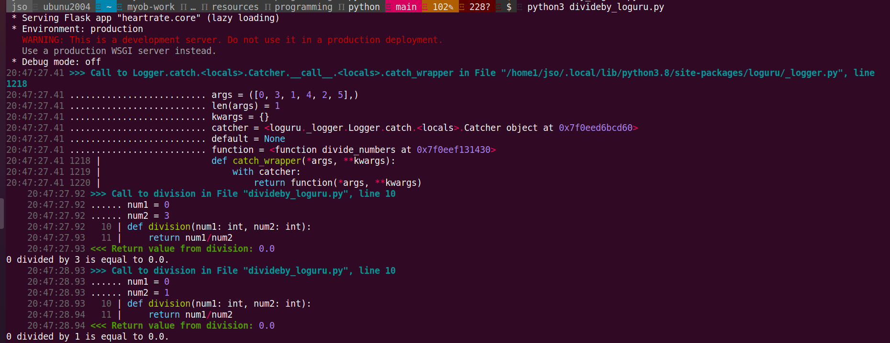

# Track and Visualize the Execution of your Python Code

> This is tutorial to learn 3 useful tools to track python execution from [Medium blog][Medium Blog] - `3 Tools to Track and Visualize the Execution of your Python Code`

🔧 **Technologies & Tools:**


> Let start to taste the following python code and hit some error

`Python code` - Interleave 2 x lists, loop for picking 2 numbers from resulting list and do divsioning from them
```python
from itertools import combinations


def division(num1: int, num2: int):
    return num1/num2


def divide_numbers(num_list: list):
    for comb in combinations(num_list, 2):
        num1, num2 = comb
        res = division(num1, num2)
        print(f"{num1} divided by {num2} is equal to {res}.")


if __name__ == '__main__':
    a = [2, 1, 0]
    b = [3, 4, 5]
    num_list = [val for pair in zip(a, b) for val in pair]
    divide_numbers(num_list)
```

`Python Error` - ZeroDivisionError: division by zero

```bash
$  python3 divideby.py
2 divided by 3 is equal to 0.6666666666666666.
2 divided by 1 is equal to 2.0.
2 divided by 4 is equal to 0.5.
Traceback (most recent call last):
  File "divideby.py", line 19, in <module>
    divide_numbers(num_list)
  File "divideby.py", line 11, in divide_numbers
    res = division(num1, num2)
  File "divideby.py", line 5, in division
    return num1/num2
ZeroDivisionError: division by zero
```

`Tracking tool # 1 snoop` - print the lines of code being executed in a function

***Installation***

```bash
$ pip install snoop

Collecting snoop
  Downloading snoop-0.3.0.tar.gz (33 kB)
Collecting asttokens
  Downloading asttokens-2.0.5-py2.py3-none-any.whl (20 kB)
Collecting cheap_repr>=0.4.0
  Downloading cheap_repr-0.4.5.tar.gz (10.0 kB)
Collecting executing
  Downloading executing-0.6.0-py2.py3-none-any.whl (12 kB)
Requirement already satisfied: pygments in /usr/lib/python3/dist-packages (from snoop) (2.3.1)
Requirement already satisfied: six in /home1/jso/.local/lib/python3.8/site-packages (from snoop) (1.14.0)
Building wheels for collected packages: snoop, cheap-repr
  Building wheel for snoop (setup.py) ... done
  Created wheel for snoop: filename=snoop-0.3.0-py3-none-any.whl size=27306 sha256=fefe55ec5a1c4bd1c888f9da211a17f723ef5f7280d78f75a664add0009ed1c1
  Stored in directory: /home1/jso/.cache/pip/wheels/97/53/31/e89dcf12185afa6845cc99e6096b910ae3d5ae1d391afa379f
  Building wheel for cheap-repr (setup.py) ... done
  Created wheel for cheap-repr: filename=cheap_repr-0.4.5-py3-none-any.whl size=7119 sha256=2ff203f6e86dc06e7d456d84f1f70e4bf74c2ed568862b673334193ff6c6672f
  Stored in directory: /home1/jso/.cache/pip/wheels/69/23/79/df1b03e36940d6bb581c77b9caf53055dff0c44970ff1e7c86
Successfully built snoop cheap-repr
Installing collected packages: asttokens, cheap-repr, executing, snoop
Successfully installed asttokens-2.0.5 cheap-repr-0.4.5 executing-0.6.0 snoop-0.3.0
```

***Usage***

```python
import snoop


@snoop  # Add this to snoop executions
<Code to snoop>
```

***Examples***

```python
from itertools import combinations
import snoop


@snoop  # Add this to snoop executions
def division(num1: int, num2: int):
    return num1/num2


def divide_numbers(num_list: list):
    for comb in combinations(num_list, 2):
        num1, num2 = comb
        res = division(num1, num2)
        print(f"{num1} divided by {num2} is equal to {res}.")


if __name__ == '__main__':
    a = [2, 1, 0]
    b = [3, 4, 5]
    num_list = [val for pair in zip(a, b) for val in pair]
    divide_numbers(num_list)
```


```python
from itertools import combinations
import snoop


def division(num1: int, num2: int):
    return num1/num2


@snoop  # Add this to snoop executions
def divide_numbers(num_list: list):
    for comb in combinations(num_list, 2):
        num1, num2 = comb
        res = division(num1, num2)
        print(f"{num1} divided by {num2} is equal to {res}.")


if __name__ == '__main__':
    a = [2, 1, 0]
    b = [3, 4, 5]
    num_list = [val for pair in zip(a, b) for val in pair]
    divide_numbers(num_list)
```


`Tracking tool # 2 loguru` - print better exceptions

***Installation***

```bash
$ pip install loguru
Collecting loguru
  Downloading loguru-0.5.3-py3-none-any.whl (57 kB)
     |████████████████████████████████| 57 kB 1.4 MB/s
Installing collected packages: loguru
Successfully installed loguru-0.5.3 ``` 
***Usage***

```python
from loguru import logger


@logger.catch  # Add this to track errors
<Code to catch>
```

***Examples***

```python
from loguru import logger
from itertools import combinations


def division(num1: int, num2: int):
    return num1/num2


@logger.catch  # Add this to track errors
def divide_numbers(num_list: list):
    for comb in combinations(num_list, 2):
        # sleep(0.5)
        num1, num2 = comb
        res = division(num1, num2)
        # sleep(0.5)
        print(f"{num1} divided by {num2} is equal to {res}.")


if __name__ == '__main__':
    a = [2, 1, 0]
    b = [3, 4, 5]
    num_list = [val for pair in zip(a, b) for val in pair]
    divide_numbers(num_list)
```


`Tracking tool # 3 heartrate` - visualize the execution of a Python program in real-time

***Installation***

```bash
$ pip install heartrate
Collecting heartrate
  Downloading heartrate-0.2.1.tar.gz (238 kB)
     |████████████████████████████████| 238 kB 1.6 MB/s
Collecting Flask
  Using cached Flask-1.1.2-py2.py3-none-any.whl (94 kB)
Requirement already satisfied: asttokens in /home1/jso/.local/lib/python3.8/site-packages (from heartrate) (2.0.5)
Requirement already satisfied: executing in /home1/jso/.local/lib/python3.8/site-packages (from heartrate) (0.6.0)
Requirement already satisfied: pygments in /usr/lib/python3/dist-packages (from heartrate) (2.3.1)
Collecting Werkzeug>=0.15
  Using cached Werkzeug-1.0.1-py2.py3-none-any.whl (298 kB)
Collecting itsdangerous>=0.24
  Using cached itsdangerous-1.1.0-py2.py3-none-any.whl (16 kB)
Requirement already satisfied: click>=5.1 in /home1/jso/.local/lib/python3.8/site-packages (from Flask->heartrate) (7.0)
Requirement already satisfied: Jinja2>=2.10.1 in /home1/jso/.local/lib/python3.8/site-packages (from Flask->heartrate) (2.11.3)
Requirement already satisfied: six in /home1/jso/.local/lib/python3.8/site-packages (from asttokens->heartrate) (1.14.0)
Requirement already satisfied: MarkupSafe>=0.23 in /home1/jso/.local/lib/python3.8/site-packages (from Jinja2>=2.10.1->Flask->heartrate) (1.1.1)
Building wheels for collected packages: heartrate
  Building wheel for heartrate (setup.py) ... done
  Created wheel for heartrate: filename=heartrate-0.2.1-py3-none-any.whl size=235972 sha256=6d0899cb22bc5263e947e1939214200131976a991a869885e213c887193b479a
  Stored in directory: /home1/jso/.cache/pip/wheels/3e/93/a3/15618781edc8ac418bc83fe5e0ef53b370139ec014d7fcc581
Successfully built heartrate
Installing collected packages: Werkzeug, itsdangerous, Flask, heartrate
Successfully installed Flask-1.1.2 Werkzeug-1.0.1 heartrate-0.2.1 itsdangerous-1.1.0
```

***Usage***

```python
import heartrate                                                              
heartrate.trace(browser=True)           
```

***Examples***

```python
from itertools import combinations
import heartrate
heartrate.trace(browser=True)


def division(num1: int, num2: int):
    return num1/num2


def divide_numbers(num_list: list):
    for comb in combinations(num_list, 2):
        num1, num2 = comb
        res = division(num1, num2)
        print(f"{num1} divided by {num2} is equal to {res}.")


if __name__ == '__main__':
    a = [2, 1, 0]
    b = [3, 4, 5]
    num_list = [val for pair in zip(a, b) for val in pair]
    divide_numbers(num_list)
```


`Add sleep routine in function` to view visually the executions

```python
from itertools import combinations
import heartrate
heartrate.trace(browser=True)
from time import sleep


def division(num1: int, num2: int):
    return num1/num2


def divide_numbers(num_list: list):
    for comb in combinations(num_list, 2):
        sleep(0.5)
        num1, num2 = comb
        res = division(num1, num2)
        sleep(0.5)
        print(f"{num1} divided by {num2} is equal to {res}.")


if __name__ == '__main__':
    a = [2, 1, 0]
    b = [3, 4, 5]
    num_list = [val for pair in zip(a, b) for val in pair]
    divide_numbers(num_list)
```

> You will see the sleep(0.5) execution and jumping between 1st and 2nd sleep code


***Fix the code and tracking by all-in-one with 3 tools***

```python
from loguru import logger
from itertools import combinations
import snoop
from time import sleep
import heartrate
heartrate.trace(browser=True)


@snoop  # Add this to snoop executions
def division(num1: int, num2: int):
    return num1/num2


 @snoop  # Add this to snoop executions
 @logger.catch  # Add this to track errors
def divide_numbers(num_list: list):
    for comb in combinations(num_list, 2):
        sleep(0.5)
        num1, num2 = comb
        res = division(num1, num2)
        sleep(0.5)
        print(f"{num1} divided by {num2} is equal to {res}.")


if __name__ == '__main__':
    a = [0, 1, 2]
    b = [3, 4, 5]
    num_list = [val for pair in zip(a, b) for val in pair]
    divide_numbers(num_list)
```




[Medium Blog]: https://towardsdatascience.com/3-tools-to-track-and-visualize-the-execution-of-your-python-code-666a153e435e
[12 Python snippets]: https://python.plainenglish.io/python-snippets-7e8dcbeae26e
