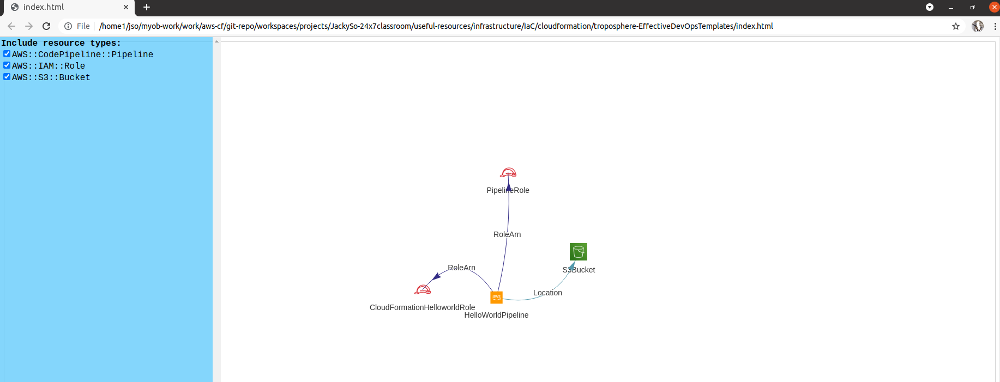
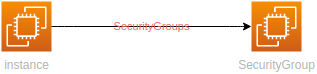
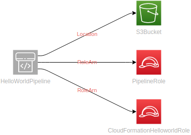

# Using Troposphere to create a Python script for Cloudformation template generation

`Table of Content`

<!-- vim-markdown-toc GFM -->

- [Installation and tips](#installation-and-tips)
- [Usages and examples](#usages-and-examples)

<!-- vim-markdown-toc -->

> Visualize your cloudformation template



## Installation and tips

> Error hit and solution

`Error` No module named '`_ctypes`'

```bash
$  python setup.py install
Traceback (most recent call last):
  File "setup.py", line 1, in <module>
    from setuptools import setup
  File "/home1/jso/.pyenv/versions/3.8.5-troposphere/lib/python3.8/site-packages/setuptools/__init__.py", line 19, in <module>
    from setuptools.dist import Distribution
  File "/home1/jso/.pyenv/versions/3.8.5-troposphere/lib/python3.8/site-packages/setuptools/dist.py", line 34, in <module>
    from setuptools import windows_support
  File "/home1/jso/.pyenv/versions/3.8.5-troposphere/lib/python3.8/site-packages/setuptools/windows_support.py", line 2, in <module>
    import ctypes
  File "/home1/jso/.pyenv/versions/3.8.5/lib/python3.8/ctypes/__init__.py", line 7, in <module>
    from _ctypes import Union, Structure, Array
ModuleNotFoundError: No module named '`_`ctypes'
```

`Solution`

> Install `libffi-dev`

```bash
$  sudo apt-get install libffi-dev
Reading package lists... Done
Building dependency tree
Reading state information... Done
The following packages were automatically installed and are no longer required:
  distro-info libfprint-2-tod1 libllvm10 libllvm9
Use 'sudo apt autoremove' to remove them.
The following NEW packages will be installed:
  libffi-dev
0 upgraded, 1 newly installed, 0 to remove and 24 not upgraded.
Need to get 57.0 kB of archives.
After this operation, 312 kB of additional disk space will be used.
Get:1 http://in.archive.ubuntu.com/ubuntu focal/main amd64 libffi-dev amd64 3.3-4 [57.0 kB]
Fetched 57.0 kB in 3s (21.3 kB/s)
Selecting previously unselected package libffi-dev:amd64.
(Reading database ... 363179 files and directories currently installed.)
Preparing to unpack .../libffi-dev_3.3-4_amd64.deb ...
Unpacking libffi-dev:amd64 (3.3-4) ...
Setting up libffi-dev:amd64 (3.3-4) ...
Processing triggers for install-info (6.7.0.dfsg.2-5) ...
Processing triggers for man-db (2.9.1-1) ...
```

> Install troposphere from github code

* Clone github code into your local workspace

	```bash
	$  make -f Makefile-python github-clone
	Unable to locate credentials. You can configure credentials by running "aws configure".
	1) Effective-devops-templates
	2) troposphere
	Input your choice to pick or cltr-C to quit: 2
	Cloning into 'troposphere'...
	remote: Enumerating objects: 11606, done.
	remote: Counting objects: 100% (1012/1012), done.
	remote: Compressing objects: 100% (603/603), done.
	remote: Total 11606 (delta 616), reused 599 (delta 402), pack-reused 10594
	Receiving objects: 100% (11606/11606), 3.15 MiB | 3.26 MiB/s, done.
	Resolving deltas: 100% (8241/8241), done.
	```

* Install `troposphere`

	```bash
	$  python setup.py install
	running install
	running bdist_egg
	running egg_info
	creating troposphere.egg-info
	writing troposphere.egg-info/PKG-INFO
	writing dependency_links to troposphere.egg-info/dependency_links.txt
	writing requirements to troposphere.egg-info/requires.txt
	writing top-level names to troposphere.egg-info/top_level.txt
	writing manifest file 'troposphere.egg-info/SOURCES.txt'
	reading manifest file 'troposphere.egg-info/SOURCES.txt'
	reading manifest template 'MANIFEST.in'
	writing manifest file 'troposphere.egg-info/SOURCES.txt'
	installing library code to build/bdist.linux-x8	_	4/egg
	running install_lib
	running build_py
	creating build
	creating build/lib
	creating build/lib/troposphere
	copying troposphere/greengrassv2.py -> build/lib/troposphere
	copying troposphere/iot1click.py -> build/lib/troposphere
	copying troposphere/managedblockchain.py -> build/lib/troposphere
	copying troposphere/servicecatalog.py -> build/lib/troposphere
	copying troposphere/redshift.py -> build/lib/troposphere
	copying troposphere/timestream.py -> build/lib/troposphere
	copying troposphere/ecr.py -> build/lib/troposphere
	copying troposphere/iotwireless.py -> build/lib/troposphere
	copying troposphere/codestarnotifications.py -> build/lib/troposphere
	copying troposphere/budgets.py -> build/lib/troposphere
	copying troposphere/mediaconvert.py -> build/lib/troposphere
	copying troposphere/cloudformation.py -> build/lib/troposphere
	copying troposphere/opsworks.py -> build/lib/troposphere
	copying troposphere/quicksight.py -> build/lib/troposphere
	creating build/bdist.linux-x8	_	4/egg/EGG-INFO
	installing scripts to build/bdist.linux-x8	_	4/egg/EGG-INFO/scripts
	running install_scripts
	running build_scripts
	creating build/scripts-3.8
	copying and adjusting scripts/cfn -> build/scripts-3.8
	copying and adjusting scripts/cfn2py -> build/scripts-3.8
	changing mode of build/scripts-3.8/cfn from 		4 to 775
	changing mode of build/scripts-3.8/cfn2py from 		4 to 775
	creating build/bdist.linux-x8	_	4/egg/EGG-INFO/scripts
	copying build/scripts-3.8/cfn2py -> build/bdist.linux-x8	_	4/egg/EGG-INFO/scripts
	copying build/scripts-3.8/cfn -> build/bdist.linux-x8	_	4/egg/EGG-INFO/scripts
	changing mode of build/bdist.linux-x8	_	4/egg/EGG-INFO/scripts/cfn2py to 775
	changing mode of build/bdist.linux-x8	_	4/egg/EGG-INFO/scripts/cfn to 775
	copying troposphere.egg-info/PKG-INFO -> build/bdist.linux-x8	_	4/egg/EGG-INFO
	copying troposphere.egg-info/SOURCES.txt -> build/bdist.linux-x8	_	4/egg/EGG-INFO
	copying troposphere.egg-info/dependency_links.txt -> build/bdist.linux-x8	_	4/egg/EGG-INFO
	copying troposphere.egg-info/not-zip-safe -> build/bdist.linux-x8	_	4/egg/EGG-INFO
	copying troposphere.egg-info/requires.txt -> build/bdist.linux-x8	_	4/egg/EGG-INFO
	copying troposphere.egg-info/top_level.txt -> build/bdist.linux-x8	_	4/egg/EGG-INFO
	creating dist
	creating 'dist/troposphere-3.0.0-py3.8.egg' and adding 'build/bdist.linux-x8	_	4/egg' to it
	removing 'build/bdist.linux-x8	_	4/egg' (and everything under it)
	Processing troposphere-3.0.0-py3.8.egg
	creating /home1/jso/.pyenv/versions/3.8.5/lib/python3.8/site-packages/troposphere-3.0.0-py3.8.egg
	Extracting troposphere-3.0.0-py3.8.egg to /home1/jso/.pyenv/versions/3.8.5/lib/python3.8/site-packages
	Adding troposphere 3.0.0 to easy-install.pth file
	Installing cfn2py script to /home1/jso/.pyenv/versions/3.8.5/bin
	Installing cfn script to /home1/jso/.pyenv/versions/3.8.5/bin
	
	Installed /home1/jso/.pyenv/versions/3.8.5/lib/python3.8/site-packages/troposphere-3.0.0-py3.8.egg
	Processing dependencies for troposphere==3.0.0
	Finished processing dependencies for troposphere==3.0.0
	```

* Install troposphere with `pyenv` and virtual environment

	```bash
	# Install python version
	$  make -f Makefile-python pyenv-install
	 1) 2.1.3		      95) 3.6.6			  189) anaconda3-5.0.1	       283) miniconda3-4.2.12	    377) pypy2.7-5.9.0-src
	 2) 2.2.3		      96) 3.6.7			  190) anaconda3-5.1.0	       284) miniconda3-4.3.11	    378) pypy2.7-5.9.0
	 3) 2.3.7		      97) 3.6.8			  191) anaconda3-5.2.0	       285) miniconda3-4.3.14	    379) pypy2.7-5.10.0-src
	 4) 2.4.0		      98) 3.6.9			  192) anaconda3-5.3.0	       286) miniconda3-4.3.21	    380) pypy2.7-5.10.0
	 5) 2.4.1		      99) 3.6.10		  193) anaconda3-5.3.1	       287) miniconda3-4.3.27	    381) pypy2.7-6.0.0-src
	 6) 2.4.2		     100) 3.6.11		  194) anaconda3-2018.12       288) miniconda3-4.3.30	    382) pypy2.7-6.0.0
	 7) 2.4.3		     101) 3.6.12		  195) anaconda3-2019.03       289) miniconda3-4.3.31	    383) pypy2.7-7.0.0-src
	 8) 2.4.4		     102) 3.6.13		  196) anaconda3-2019.07       290) miniconda3-4.4.10	    384) pypy2.7-7.0.0
	 9) 2.4.5		     103) 3.7.0			  197) anaconda3-2019.10       291) miniconda3-4.5.1	    385) pypy2.7-7.1.0-src
	10) 2.4.6		     104) 3.7-dev		  198) anaconda3-2020.02       292) miniconda3-4.5.4	    386) pypy2.7-7.1.0
	11) 2.5.0		     105) 3.7.1			  199) anaconda3-2020.07       293) miniconda3-4.5.11	    387) pypy2.7-7.1.1-src
	12) 2.5.1		     106) 3.7.2			  200) anaconda3-2020.11       294) miniconda3-4.5.12	    388) pypy2.7-7.1.1
	13) 2.5.2		     107) 3.7.3			  201) graalpython-20.1.0      295) miniconda3-4.6.14	    389) pypy2.7-7.2.0-src
	14) 2.5.3		     108) 3.7.4			  202) graalpython-20.2.0      296) miniconda3-4.7.10	    390) pypy2.7-7.2.0
	15) 2.5.4		     109) 3.7.5			  203) graalpython-20.3.0      297) miniconda3-4.7.12	    391) pypy2.7-7.3.0-src
	16) 2.5.5		     110) 3.7.6			  204) graalpython-21.0.0      298) miniforge3-4.9.2	    392) pypy2.7-7.3.0
	17) 2.5.6		     111) 3.7.7			  205) graalpython-21.1.0      299) miniforge3-4.10	    393) pypy2.7-7.3.1-src
	18) 2.6.6		     112) 3.7.8			  206) ironpython-dev	       300) pypy-c-jit-latest	    394) pypy2.7-7.3.1
	19) 2.6.7		     113) 3.7.9			  207) ironpython-2.7.4	       301) pypy-dev		    395) pypy3-2.3.1-src
	20) 2.6.8		     114) 3.7.10		  208) ironpython-2.7.5	       302) pypy-stm-2.3	    396) pypy3-2.3.1
	21) 2.6.9		     115) 3.8.0			  209) ironpython-2.7.6.3      303) pypy-stm-2.5.1	    397) pypy3-2.4.0-src
	22) 2.7.0		     116) 3.8-dev		  210) ironpython-2.7.7	       304) pypy-1.5-src	    398) pypy3-2.4.0
	23) 2.7-dev		     117) 3.8.1			  211) jython-dev	       305) pypy-1.6		    399) pypy3.3-5.2-alpha1-src
	24) 2.7.1		     118) 3.8.2			  212) jython-2.5.0	       306) pypy-1.7		    400) pypy3.3-5.2-alpha1
	25) 2.7.2		     119) 3.8.3			  213) jython-2.5-dev	       307) pypy-1.8		    401) pypy3.3-5.5-alpha-src
	26) 2.7.3		     120) 3.8.4			  214) jython-2.5.1	       308) pypy-1.9		    402) pypy3.3-5.5-alpha
	27) 2.7.4		     121) 3.8.5			  215) jython-2.5.2	       309) pypy-2.0-src	    403) pypy3.5-c-jit-latest
	28) 2.7.5		     122) 3.8.6			  216) jython-2.5.3	       310) pypy-2.0		    404) pypy3.5-5.7-beta-src
	29) 2.7.6		     123) 3.8.7			  217) jython-2.5.4-rc1	       311) pypy-2.0.1-src	    405) pypy3.5-5.7-beta
	30) 2.7.7		     124) 3.8.8			  218) jython-2.7.0	       312) pypy-2.0.1		    406) pypy3.5-5.7.1-beta-src
	31) 2.7.8		     125) 3.8.9			  219) jython-2.7.1	       313) pypy-2.0.2-src	    407) pypy3.5-5.7.1-beta
	32) 2.7.9		     126) 3.9.0			  220) jython-2.7.2	       314) pypy-2.0.2		    408) pypy3.5-5.8.0-src
	33) 2.7.10		     127) 3.9-dev		  221) micropython-dev	       315) pypy-2.1-src	    409) pypy3.5-5.8.0
	34) 2.7.11		     128) 3.9.1			  222) micropython-1.9.3       316) pypy-2.1		    410) pypy3.5-5.9.0-src
	35) 2.7.12		     129) 3.9.2			  223) micropython-1.9.4       317) pypy-2.2-src	    411) pypy3.5-5.9.0
	36) 2.7.13		     130) 3.9.3			  224) micropython-1.10	       318) pypy-2.2		    412) pypy3.5-5.10.0-src
	37) 2.7.14		     131) 3.9.4			  225) micropython-1.11	       319) pypy-2.2.1-src	    413) pypy3.5-5.10.0
	38) 2.7.15		     132) 3.10.0a7		  226) micropython-1.12	       320) pypy-2.2.1		    414) pypy3.5-5.10.1-src
	39) 2.7.16		     133) 3.10-dev		  227) micropython-1.13	       321) pypy-2.3-src	    415) pypy3.5-5.10.1
	40) 2.7.17		     134) activepython-2.7.14	  228) micropython-1.14	       322) pypy-2.3		    416) pypy3.5-6.0.0-src
	41) 2.7.18		     135) activepython-3.5.4	  229) miniconda-latest	       323) pypy-2.3.1-src	    417) pypy3.5-6.0.0
	42) 3.0.1		     136) activepython-3.6.0	  230) miniconda-2.2.2	       324) pypy-2.3.1		    418) pypy3.5-7.0.0-src
	43) 3.1.0		     137) anaconda-1.4.0	  231) miniconda-3.0.0	       325) pypy-2.4.0-src	    419) pypy3.5-7.0.0
	44) 3.1.1		     138) anaconda-1.5.0	  232) miniconda-3.0.4	       326) pypy-2.4.0		    420) pypy3.6-7.0.0-src
	45) 3.1.2		     139) anaconda-1.5.1	  233) miniconda-3.0.5	       327) pypy-2.5.0-src	    421) pypy3.6-7.0.0
	46) 3.1.3		     140) anaconda-1.6.0	  234) miniconda-3.3.0	       328) pypy-2.5.0		    422) pypy3.6-7.1.0-src
	47) 3.1.4		     141) anaconda-1.6.1	  235) miniconda-3.4.2	       329) pypy-2.5.1-src	    423) pypy3.6-7.1.0
	48) 3.1.5		     142) anaconda-1.7.0	  236) miniconda-3.7.0	       330) pypy-2.5.1		    424) pypy3.6-7.1.1-src
	49) 3.2.0		     143) anaconda-1.8.0	  237) miniconda-3.8.3	       331) pypy-2.6.0-src	    425) pypy3.6-7.1.1
	50) 3.2.1		     144) anaconda-1.9.0	  238) miniconda-3.9.1	       332) pypy-2.6.0		    426) pypy3.6-7.2.0-src
	51) 3.2.2		     145) anaconda-1.9.1	  239) miniconda-3.10.1	       333) pypy-2.6.1-src	    427) pypy3.6-7.2.0
	52) 3.2.3		     146) anaconda-1.9.2	  240) miniconda-3.16.0	       334) pypy-2.6.1		    428) pypy3.6-7.3.0-src
	53) 3.2.4		     147) anaconda-2.0.0	  241) miniconda-3.18.3	       335) pypy-4.0.0-src	    429) pypy3.6-7.3.0
	54) 3.2.5		     148) anaconda-2.0.1	  242) miniconda2-latest       336) pypy-4.0.0		    430) pypy3.6-7.3.1-src
	55) 3.2.6		     149) anaconda-2.1.0	  243) miniconda2-3.18.3       337) pypy-4.0.1-src	    431) pypy3.6-7.3.1
	56) 3.3.0		     150) anaconda-2.2.0	  244) miniconda2-3.19.0       338) pypy-4.0.1		    432) pypy3.6-7.3.2-src
	57) 3.3.1		     151) anaconda-2.3.0	  245) miniconda2-4.0.5	       339) pypy-5.0.0-src	    433) pypy3.6-7.3.2
	58) 3.3.2		     152) anaconda-2.4.0	  246) miniconda2-4.1.11       340) pypy-5.0.0		    434) pypy3.6-7.3.3-src
	59) 3.3.3		     153) anaconda-4.0.0	  247) miniconda2-4.3.14       341) pypy-5.0.1-src	    435) pypy3.6-7.3.3
	60) 3.3.4		     154) anaconda2-2.4.0	  248) miniconda2-4.3.21       342) pypy-5.0.1		    436) pypy3.7-c-jit-latest
	61) 3.3.5		     155) anaconda2-2.4.1	  249) miniconda2-4.3.27       343) pypy-5.1-src	    437) pypy3.7-7.3.2-src
	62) 3.3.6		     156) anaconda2-2.5.0	  250) miniconda2-4.3.30       344) pypy-5.1		    438) pypy3.7-7.3.2
	63) 3.3.7		     157) anaconda2-4.0.0	  251) miniconda2-4.3.31       345) pypy-5.1.1-src	    439) pypy3.7-7.3.3-src
	64) 3.4.0		     158) anaconda2-4.1.0	  252) miniconda2-4.4.10       346) pypy-5.1.1		    440) pypy3.7-7.3.3
	65) 3.4-dev		     159) anaconda2-4.1.1	  253) miniconda2-4.5.1	       347) pypy-5.3-src	    441) pypy3.7-7.3.4
	66) 3.4.1		     160) anaconda2-4.2.0	  254) miniconda2-4.5.4	       348) pypy-5.3		    442) pyston-0.5.1
	67) 3.4.2		     161) anaconda2-4.3.0	  255) miniconda2-4.5.11       349) pypy-5.3.1-src	    443) pyston-0.6.0
	68) 3.4.3		     162) anaconda2-4.3.1	  256) miniconda2-4.5.12       350) pypy-5.3.1		    444) pyston-0.6.1
	69) 3.4.4		     163) anaconda2-4.4.0	  257) miniconda2-4.6.14       351) pypy-5.4-src	    445) stackless-dev
	70) 3.4.5		     164) anaconda2-5.0.0	  258) miniconda2-4.7.10       352) pypy-5.4		    446) stackless-2.7-dev
	71) 3.4.6		     165) anaconda2-5.0.1	  259) miniconda2-4.7.12       353) pypy-5.4.1-src	    447) stackless-2.7.2
	72) 3.4.7		     166) anaconda2-5.1.0	  260) miniconda3-latest       354) pypy-5.4.1		    448) stackless-2.7.3
	73) 3.4.8		     167) anaconda2-5.2.0	  261) miniconda3-2.2.2	       355) pypy-5.6.0-src	    449) stackless-2.7.4
	74) 3.4.9		     168) anaconda2-5.3.0	  262) miniconda3-3.0.0	       356) pypy-5.6.0		    450) stackless-2.7.5
	75) 3.4.10		     169) anaconda2-5.3.1	  263) miniconda3-3.0.4	       357) pypy-5.7.0-src	    451) stackless-2.7.6
	76) 3.5.0		     170) anaconda2-2018.12	  264) miniconda3-3.0.5	       358) pypy-5.7.0		    452) stackless-2.7.7
	77) 3.5-dev		     171) anaconda2-2019.03	  265) miniconda3-3.3.0	       359) pypy-5.7.1-src	    453) stackless-2.7.8
	78) 3.5.1		     172) anaconda2-2019.07	  266) miniconda3-3.4.2	       360) pypy-5.7.1		    454) stackless-2.7.9
	79) 3.5.2		     173) anaconda3-2.0.0	  267) miniconda3-3.7.0	       361) pypy2-5.3-src	    455) stackless-2.7.10
	80) 3.5.3		     174) anaconda3-2.0.1	  268) miniconda3-3.7-4.8.2    362) pypy2-5.3		    456) stackless-2.7.11
	81) 3.5.4		     175) anaconda3-2.1.0	  269) miniconda3-3.7-4.8.3    363) pypy2-5.3.1-src	    457) stackless-2.7.12
	82) 3.5.5		     176) anaconda3-2.2.0	  270) miniconda3-3.7-4.9.2    364) pypy2-5.3.1		    458) stackless-2.7.14
	83) 3.5.6		     177) anaconda3-2.3.0	  271) miniconda3-3.8.3	       365) pypy2-5.4-src	    459) stackless-3.2.2
	84) 3.5.7		     178) anaconda3-2.4.0	  272) miniconda3-3.8-4.8.2    366) pypy2-5.4		    460) stackless-3.2.5
	85) 3.5.8		     179) anaconda3-2.4.1	  273) miniconda3-3.8-4.8.3    367) pypy2-5.4.1-src	    461) stackless-3.3.5
	86) 3.5.9		     180) anaconda3-2.5.0	  274) miniconda3-3.8-4.9.2    368) pypy2-5.4.1		    462) stackless-3.3.7
	87) 3.5.10		     181) anaconda3-4.0.0	  275) miniconda3-3.9.1	       369) pypy2-5.6.0-src	    463) stackless-3.4-dev
	88) 3.6.0		     182) anaconda3-4.1.0	  276) miniconda3-3.9-4.9.2    370) pypy2-5.6.0		    464) stackless-3.4.2
	89) 3.6-dev		     183) anaconda3-4.1.1	  277) miniconda3-3.10.1       371) pypy2-5.7.0-src	    465) stackless-3.4.7
	90) 3.6.1		     184) anaconda3-4.2.0	  278) miniconda3-3.16.0       372) pypy2-5.7.0		    466) stackless-3.5.4
	91) 3.6.2		     185) anaconda3-4.3.0	  279) miniconda3-3.18.3       373) pypy2-5.7.1-src	    467) stackless-3.7.5
	92) 3.6.3		     186) anaconda3-4.3.1	  280) miniconda3-3.19.0       374) pypy2-5.7.1
	93) 3.6.4		     187) anaconda3-4.4.0	  281) miniconda3-4.0.5	       375) pypy2.7-5.8.0-src
	94) 3.6.5		     188) anaconda3-5.0.0	  282) miniconda3-4.1.11       376) pypy2.7-5.8.0
	Input your choice to install or cltr-C to quit: 41
	Downloading Python-2.7.18.tar.xz...
	-> https://www.python.org/ftp/python/2.7.18/Python-2.7.18.tar.xz
	Installing Python-2.7.18...
	WARNING: The Python readline extension was not compiled. Missing the GNU readline lib?
	WARNING: The Python bz2 extension was not compiled. Missing the bzip2 lib?
	WARNING: The Python sqlite3 extension was not compiled. Missing the SQLite3 lib?
	Installed Python-2.7.18 to /home1/jso/.pyenv/versions/2.7.18
	
	# Setup python virtualenv
	$  pyenv virtualenv 2.7.18 testing
	DEPRECATION: Python 2.7 will reach the end of its life on January 1st, 2020. Please upgrade your Python as Python 2.7 won't be maintained after that date. A future version of pip will drop support for Python 2.7. More details about Python 2 support in pip, can be found at https://pip.pypa.io/en/latest/development/release-process/#python-2-support
	Collecting virtualenv
	  Downloading https://files.pythonhosted.org/packages/03/08/f819421002e85a71d58368f7bffbe0b1921325e0e8ca7857cb5fb0e1f7c1/virtualenv-20.4.7-py2.py3-none-any.whl (7.2MB)
	     |████████████████████████████████| 7.2MB 1.8MB/s
	Collecting six<2,>=1.9.0 (from virtualenv)
	  Using cached https://files.pythonhosted.org/packages/d9/5a/e7c31adbe875f2abbb91bd84cf2dc52d792b5a01506781dbcf25c91daf11/six-1.16.0-py2.py3-none-any.whl
	Collecting importlib-metadata>=0.12; python_version < "3.8" (from virtualenv)
	  Downloading https://files.pythonhosted.org/packages/98/b8/8ec57a8ef46fbe7f185318c7ff7df9a06c9df451d9a59a067bfa851bb828/importlib_metadata-2.1.1-py2.py3-none-any.whl
	Collecting appdirs<2,>=1.4.3 (from virtualenv)
	  Using cached https://files.pythonhosted.org/packages/3b/00/2344469e2084fb287c2e0b57b72910309874c3245463acd6cf5e3db69324/appdirs-1.4.4-py2.py3-none-any.whl
	Collecting distlib<1,>=0.3.1 (from virtualenv)
	  Downloading https://files.pythonhosted.org/packages/87/26/f6a23dd3e578132cf924e0dd5d4e055af0cd4ab43e2a9f10b7568bfb39d9/distlib-0.3.2-py2.py3-none-any.whl (338kB)
	     |████████████████████████████████| 348kB 3.4MB/s
	Collecting importlib-resources>=1.0; python_version < "3.7" (from virtualenv)
	  Downloading https://files.pythonhosted.org/packages/8d/94/2f6ceee0c4e63bff0177c07e68d27c937a19f6bc77c4739755b49f5adb04/importlib_resources-3.3.1-py2.py3-none-any.whl
	Collecting filelock<4,>=3.0.0 (from virtualenv)
	  Downloading https://files.pythonhosted.org/packages/14/ec/6ee2168387ce0154632f856d5cc5592328e9cf93127c5c9aeca92c8c16cb/filelock-3.0.12.tar.gz
	Collecting pathlib2<3,>=2.3.3; python_version < "3.4" and sys_platform != "win32" (from virtualenv)
	  Downloading https://files.pythonhosted.org/packages/e9/45/9c82d3666af4ef9f221cbb954e1d77ddbb513faf552aea6df5f37f1a4859/pathlib2-2.3.5-py2.py3-none-any.whl
	Collecting zipp>=0.5 (from importlib-metadata>=0.12; python_version < "3.8"->virtualenv)
	  Downloading https://files.pythonhosted.org/packages/96/0a/67556e9b7782df7118c1f49bdc494da5e5e429c93aa77965f33e81287c8c/zipp-1.2.0-py2.py3-none-any.whl
	Collecting configparser>=3.5; python_version < "3" (from importlib-metadata>=0.12; python_version < "3.8"->virtualenv)
	  Downloading https://files.pythonhosted.org/packages/7a/2a/95ed0501cf5d8709490b1d3a3f9b5cf340da6c433f896bbe9ce08dbe6785/configparser-4.0.2-py2.py3-none-any.whl
	Collecting contextlib2; python_version < "3" (from importlib-metadata>=0.12; python_version < "3.8"->virtualenv)
	  Downloading https://files.pythonhosted.org/packages/85/60/370352f7ef6aa96c52fb001831622f50f923c1d575427d021b8ab3311236/contextlib2-0.6.0.post1-py2.py3-none-any.whl
	Collecting typing; python_version < "3.5" (from importlib-resources>=1.0; python_version < "3.7"->virtualenv)
	  Downloading https://files.pythonhosted.org/packages/0b/cb/da856e81731833b94da70a08712f658416266a5fb2a9d9e426c8061becef/typing-3.10.0.0-py2-none-any.whl
	Collecting singledispatch; python_version < "3.4" (from importlib-resources>=1.0; python_version < "3.7"->virtualenv)
	  Downloading https://files.pythonhosted.org/packages/cd/d1/6a9e922826e03f5af7bf348cfb75bcb0bc4c67e19c36805c2545f34427e5/singledispatch-3.6.2-py2.py3-none-any.whl
	Collecting scandir; python_version < "3.5" (from pathlib2<3,>=2.3.3; python_version < "3.4" and sys_platform != "win32"->virtualenv)
	Installing collected packages: six, contextlib2, zipp, configparser, scandir, pathlib2, importlib-metadata, appdirs, distlib, typing, singledispatch, importlib-resources, filelock, virtualenv
	  Running setup.py install for filelock ... done
	Successfully installed appdirs-1.4.4 configparser-4.0.2 contextlib2-0.6.0.post1 distlib-0.3.2 filelock-3.0.12 importlib-metadata-2.1.1 importlib-resources-3.3.1 pathlib2-2.3.5 scandir-1.10.0 singledispatch-3.6.2 six-1.16.0 typing-3.10.0.0 virtualenv-20.4.7 zipp-1.2.0
	WARNING: You are using pip version 19.2.3, however version 20.3.4 is available.
	You should consider upgrading via the 'pip install --upgrade pip' command.
	created virtual environment CPython2.7.18.final.0-64 in 894ms
	  creator CPython2Posix(dest=/home1/jso/.pyenv/versions/2.7.18/envs/testing, clear=False, no_vcs_ignore=False, global=False)
	  seeder FromAppData(download=False, pip=bundle, wheel=bundle, setuptools=bundle, via=copy, app_data_dir=/home1/jso/.local/share/virtualenv)
	    added seed packages: pip==20.3.4, setuptools==44.1.1, wheel==0.36.2
	  activators PythonActivator,CShellActivator,FishActivator,PowerShellActivator,BashActivator
	Looking in links: /tmp/tmpJxiiCd
	Requirement already satisfied: setuptools in /home1/jso/.pyenv/versions/2.7.18/envs/testing/lib/python2.7/site-packages (44.1.1)
	Requirement already satisfied: pip in /home1/jso/.pyenv/versions/2.7.18/envs/testing/lib/python2.7/site-packages (20.3.4)
	
	# Activate virtualenv
	$  pyenv activate testing
	pyenv-virtualenv: prompt changing will be removed from future release. configure `export PYENV_VIRTUALENV_DISABLE_PROMPT=1' to simulate the behavior.
	
	testing $  make -f Makefile-python
	
	 Choose a command run:
	
	var                                      Show all defined variables
	github-readme                            Lookup github repo from list $(github-repo)
	github-clone                             Clone github repo from list $(github-repo)
	pyenv                                    Check pyenv installed in $PATH and its version/help, install if missing
	poetry                                   Check poetry installed in $PATH and its version/help, install if missing
	pip-poetry                               Install poetry using pip manager
	pyenv-list                               List all available version for pyenv install use
	pyenv-global-show                        Show current pyenv global
	pyenv-global                             Make $(PYENV_VERSION) as pyenv global
	pyenv-install                            Install version from list
	testing                                  Testing - show all AWS regions
	python3-version                          Check and print Python version
	install-virtualenv                       Install Virtualenv thr pip
	create-virtualenv                        Create Virtualenv
	activate-virtualenv                      How to activiate Virtualenv
	deactivate-virtualenv                    How to deactivate Virtualenv
	install-virtualenv-wrapper               Install Virtualenv wrapper thru pip
	run-virtualenv-wrapper                   Install Virtualenv wrapper and how to run it
	mkvirtualenv-aws                         Make Virtual env with variable ENV=<namespace>
	troposphere                              Install troposphere - Generate Cloudformation template from python script
	awacs                                    Install awacs - Create AWS Access Policy json from python script
	py-lint                                  Lint python codes with flake8, black, pycodestyle, anybadge pylint
	
	# Install troposphere
	testing $  make -f Makefile-python troposphere
	Collecting troposphere
	  Using cached troposphere-2.7.1.tar.gz (205 kB)
	Collecting cfn_flip>=1.0.2
	  Using cached cfn_flip-1.2.3.tar.gz (10 kB)
	Collecting Click
	  Using cached click-7.1.2-py2.py3-none-any.whl (82 kB)
	Collecting PyYAML>=4.1
	  Downloading PyYAML-5.4.1-cp27-cp27mu-manylinux1_x86_64.whl (574 kB)
	     |████████████████████████████████| 574 kB 1.8 MB/s
	Collecting six
	  Using cached six-1.16.0-py2.py3-none-any.whl (11 kB)
	Building wheels for collected packages: troposphere, cfn-flip
	  Building wheel for troposphere (setup.py) ... done
	  Created wheel for troposphere: filename=troposphere-2.7.1-py2-none-any.whl size=218909 sha256=c2a20283198b2599f5b1fbac0e3acb61c37a00c561027b10a7c4024eee1249de
	  Stored in directory: /home1/jso/.cache/pip/wheels/9c/5e/93/f2910027123dc740c8cb5160547c83edc9c9ee4806b72ee95b
	  Building wheel for cfn-flip (setup.py) ... done
	  Created wheel for cfn-flip: filename=cfn_flip-1.2.3-py2-none-any.whl size=15151 sha256=71aba72749e4139155101225cb143ca17c2ca301741f1cd7f98ebd8869e2100b
	  Stored in directory: /home1/jso/.cache/pip/wheels/90/e5/58/8b459ee1522f7f63372d296f8653a44f21962da9160faa36b9
	Successfully built troposphere cfn-flip
	Installing collected packages: Click, PyYAML, six, cfn-flip, troposphere
	Successfully installed Click-7.1.2 PyYAML-5.4.1 cfn-flip-1.2.3 six-1.16.0 troposphere-2.7.1
	Requirement already satisfied: troposphere[policy] in /home1/jso/.pyenv/versions/2.7.18/envs/testing/lib/python2.7/site-packages (2.7.1)
	Requirement already satisfied: cfn-flip>=1.0.2 in /home1/jso/.pyenv/versions/2.7.18/envs/testing/lib/python2.7/site-packages (from troposphere[policy]) (1.2.3)
	Collecting awacs>=0.8; extra == "policy"
	  Using cached awacs-1.0.4.tar.gz (110 kB)
	Requirement already satisfied: Click in /home1/jso/.pyenv/versions/2.7.18/envs/testing/lib/python2.7/site-packages (from cfn-flip>=1.0.2->troposphere[policy]) (7.1.2)
	Requirement already satisfied: six in /home1/jso/.pyenv/versions/2.7.18/envs/testing/lib/python2.7/site-packages (from cfn-flip>=1.0.2->troposphere[policy]) (1.16.0)
	Requirement already satisfied: PyYAML>=4.1 in /home1/jso/.pyenv/versions/2.7.18/envs/testing/lib/python2.7/site-packages (from cfn-flip>=1.0.2->troposphere[policy]) (5.4.1)
	Building wheels for collected packages: awacs
	  Building wheel for awacs (setup.py) ... done
	  Created wheel for awacs: filename=awacs-1.0.4-py2-none-any.whl size=227489 sha256=9be81d12619647b0e02d9a4227dfe31849686dc02c7ba0df75fabde9be3926c1
	  Stored in directory: /home1/jso/.cache/pip/wheels/55/3d/b2/58cf7acc0c44630cced135402f1d1420171b2d55f949a44fa8
	Successfully built awacs
	Installing collected packages: awacs
	Successfully installed awacs-1.0.4
	```

## Usages and examples

> Some python scripts with troposphere declared resources

<pre>
├── ansiblebase-cf-template.py
├── ecr-repository-cf-template.py
├── ecs-cluster-cf-template.py
├── <a href="troposphere-EffectiveDevOpsTemplates/helloworld-cf-template.py">helloworld-cf-template.py</a>
├── <a href="troposphere-EffectiveDevOpsTemplates/helloworld-codebuild-cf-template.py">helloworld-codebuild-cf-template.py</a>
├── helloworld-codepipeline-cf-template.py
├── helloworld-ecs-alb-cf-template.py
├── helloworld-ecs-service-cf-template.py
├── jenkins-cf-template.py
├── nodeserver-cf-template.py
</pre>

<details><summary><b>Show python code</b></summary><br>

* `troposphere-EffectiveDevOpsTemplates/helloworld-cf-template.py`

```python
"""Generating CloudFormation template."""
from ipaddress import ip_network

from ipify import get_ip

from troposphere import (
    Base64,
    ec2,
    GetAtt,
    Join,
    Output,
    Parameter,
    Ref,
    Template,
)

ApplicationPort = "3000"
PublicCidrIp = str(ip_network(get_ip()))

t = Template()

t.add_description("Effective DevOps in AWS: HelloWorld web application")

t.add_parameter(Parameter(
    "KeyPair",
    Description="Name of an existing EC2 KeyPair to SSH",
    Type="AWS::EC2::KeyPair::KeyName",
    ConstraintDescription="must be the name of an existing EC2 KeyPair.",
))

t.add_resource(ec2.SecurityGroup(
    "SecurityGroup",
    GroupDescription="Allow SSH and TCP/{} access".format(ApplicationPort),
    SecurityGroupIngress=[
        ec2.SecurityGroupRule(
            IpProtocol="tcp",
            FromPort="22",
            ToPort="22",
            CidrIp=PublicCidrIp,
        ),
        ec2.SecurityGroupRule(
            IpProtocol="tcp",
            FromPort=ApplicationPort,
            ToPort=ApplicationPort,
            CidrIp="0.0.0.0/0",
        ),
    ],
))

ud = Base64(Join('\n', [
    "#!/bin/bash",
    "sudo yum install --enablerepo=epel -y nodejs",
    "wget http://bit.ly/2vESNuc -O /home/ec2-user/helloworld.js",
    "wget http://bit.ly/2vVvT18 -O /etc/init/helloworld.conf",
    "start helloworld"
]))

t.add_resource(ec2.Instance(
    "instance",
    ImageId="ami-cfe4b2b0",
    InstanceType="t2.micro",
    SecurityGroups=[Ref("SecurityGroup")],
    KeyName=Ref("KeyPair"),
    UserData=ud,
))

t.add_output(Output(
    "InstancePublicIp",
    Description="Public IP of our instance.",
    Value=GetAtt("instance", "PublicIp"),
))

t.add_output(Output(
    "WebUrl",
    Description="Application endpoint",
    Value=Join("", [
        "http://", GetAtt("instance", "PublicDnsName"),
        ":", ApplicationPort
    ]),
))

print t.to_json()
```

* `troposphere-EffectiveDevOpsTemplates/helloworld-codebuild-cf-template.py`

```python
"""Generating CloudFormation template."""

from awacs.aws import (
    Allow,
    Policy,
    Principal,
    Statement
)

from awacs.sts import AssumeRole

from troposphere import (
    Join,
    Ref,
    Template
)

from troposphere.codebuild import (
    Artifacts,
    Environment,
    Project,
    Source
)
from troposphere.iam import Role

t = Template()

t.add_description("Effective DevOps in AWS: CodeBuild - Helloworld container")

t.add_resource(Role(
    "ServiceRole",
    AssumeRolePolicyDocument=Policy(
        Statement=[
            Statement(
                Effect=Allow,
                Action=[AssumeRole],
                Principal=Principal("Service", ["codebuild.amazonaws.com"])
            )
        ]
    ),
    Path="/",
    ManagedPolicyArns=[
        'arn:aws:iam::aws:policy/AWSCodePipelineReadOnlyAccess',
        'arn:aws:iam::aws:policy/AWSCodeBuildDeveloperAccess',
        'arn:aws:iam::aws:policy/AmazonEC2ContainerRegistryPowerUser',
        'arn:aws:iam::aws:policy/AmazonS3FullAccess',
        'arn:aws:iam::aws:policy/CloudWatchLogsFullAccess'
    ]
))

environment = Environment(
    ComputeType='BUILD_GENERAL1_SMALL',
    Image='aws/codebuild/docker:1.12.1',
    Type='LINUX_CONTAINER',
    EnvironmentVariables=[
        {'Name': 'REPOSITORY_NAME', 'Value': 'helloworld'},
        {'Name': 'REPOSITORY_URI',
            'Value': Join("", [
                Ref("AWS::AccountId"),
                ".dkr.ecr.",
                Ref("AWS::Region"),
                ".amazonaws.com",
                "/",
                "helloworld"])},
    ],
)

buildspec = """version: 0.1
phases:
  pre_build:
    commands:
      - aws codepipeline get-pipeline-state --name "${CODEBUILD_INITIATOR##*/}" --query stageStates[?actionStates[0].latestExecution.externalExecutionId==\`$CODEBUILD_BUILD_ID\`].latestExecution.pipelineExecutionId --output=text > /tmp/execution_id.txt
      - aws codepipeline get-pipeline-execution --pipeline-name "${CODEBUILD_INITIATOR##*/}" --pipeline-execution-id $(cat /tmp/execution_id.txt) --query 'pipelineExecution.artifactRevisions[0].revisionId' --output=text > /tmp/tag.txt
      - printf "%s:%s" "$REPOSITORY_URI" "$(cat /tmp/tag.txt)" > /tmp/build_tag.txt
      - printf '{"tag":"%s"}' "$(cat /tmp/tag.txt)" > /tmp/build.json
      - $(aws ecr get-login --no-include-email)
  build:
    commands:
      - docker build -t "$(cat /tmp/build_tag.txt)" .
  post_build:
    commands:
      - docker push "$(cat /tmp/build_tag.txt)"
      - aws ecr batch-get-image --repository-name $REPOSITORY_NAME --image-ids imageTag="$(cat /tmp/tag.txt)" --query 'images[].imageManifest' --output text | tee /tmp/latest_manifest.json
      - aws ecr put-image --repository-name $REPOSITORY_NAME --image-tag latest --image-manifest "$(cat /tmp/latest_manifest.json)"

artifacts:
  files: /tmp/build.json
  discard-paths: yes
"""

t.add_resource(Project(
    "CodeBuild",
    Name='HelloWorldContainer',
    Environment=environment,
    ServiceRole=Ref("ServiceRole"),
    Source=Source(
        Type="CODEPIPELINE",
        BuildSpec=buildspec
    ),
    Artifacts=Artifacts(
        Type="CODEPIPELINE",
        Name="output"
    ),
))

print(t.to_json())
```

</details><br>

> Generate Cloudformation template

```bash
testing $  grep import helloworld-cf-template.py
from ipaddress import ip_network
from ipify import get_ip
from troposphere import (

testing $  python --version
Python 2.7.18

# Install requirements
testing $  pip install ipaddress ipify
Collecting ipaddress
  Using cached ipaddress-1.0.23-py2.py3-none-any.whl (18 kB)
Collecting ipify
  Using cached ipify-1.0.0-py2.py3-none-any.whl (8.9 kB)
Collecting backoff>=1.0.7
  Using cached backoff-1.10.0-py2.py3-none-any.whl (31 kB)
Collecting requests>=2.7.0
  Using cached requests-2.25.1-py2.py3-none-any.whl (61 kB)
Collecting chardet<5,>=3.0.2
  Using cached chardet-4.0.0-py2.py3-none-any.whl (178 kB)
Collecting urllib3<1.27,>=1.21.1
  Using cached urllib3-1.26.5-py2.py3-none-any.whl (138 kB)
Collecting idna<3,>=2.5
  Using cached idna-2.10-py2.py3-none-any.whl (58 kB)
Collecting certifi>=2017.4.17
  Using cached certifi-2021.5.30-py2.py3-none-any.whl (145 kB)
Installing collected packages: ipaddress, backoff, chardet, urllib3, idna, certifi, requests, ipify
Successfully installed backoff-1.10.0 certifi-2021.5.30 chardet-4.0.0 idna-2.10 ipaddress-1.0.23 ipify-1.0.0 requests-2.25.1 urllib3-1.26.5

# Generate Cloudformation template from python code
testing $  python helloworld-cf-template.py > helloworld-cf-template.json
```

> Cloudformation template generated

```json
{
    "Description": "Effective DevOps in AWS: HelloWorld web application",
    "Outputs": {
        "InstancePublicIp": {
            "Description": "Public IP of our instance.",
            "Value": {
                "Fn::GetAtt": [
                    "instance",
                    "PublicIp"
                ]
            }
        },
        "WebUrl": {
            "Description": "Application endpoint",
            "Value": {
                "Fn::Join": [
                    "",
                    [
                        "http://",
                        {
                            "Fn::GetAtt": [
                                "instance",
                                "PublicDnsName"
                            ]
                        },
                        ":",
                        "3000"
                    ]
                ]
            }
        }
    },
    "Parameters": {
        "KeyPair": {
            "ConstraintDescription": "must be the name of an existing EC2 KeyPair.",
            "Description": "Name of an existing EC2 KeyPair to SSH",
            "Type": "AWS::EC2::KeyPair::KeyName"
        }
    },
    "Resources": {
        "SecurityGroup": {
            "Properties": {
                "GroupDescription": "Allow SSH and TCP/3000 access",
                "SecurityGroupIngress": [
                    {
                        "CidrIp": "49.184.231.74/32",
                        "FromPort": "22",
                        "IpProtocol": "tcp",
                        "ToPort": "22"
                    },
                    {
                        "CidrIp": "0.0.0.0/0",
                        "FromPort": "3000",
                        "IpProtocol": "tcp",
                        "ToPort": "3000"
                    }
                ]
            },
            "Type": "AWS::EC2::SecurityGroup"
        },
        "instance": {
            "Properties": {
                "ImageId": "ami-cfe4b2b0",
                "InstanceType": "t2.micro",
                "KeyName": {
                    "Ref": "KeyPair"
                },
                "SecurityGroups": [
                    {
                        "Ref": "SecurityGroup"
                    }
                ],
                "UserData": {
                    "Fn::Base64": {
                        "Fn::Join": [
                            "\n",
                            [
                                "#!/bin/bash",
                                "sudo yum install --enablerepo=epel -y nodejs",
                                "wget http://bit.ly/2vESNuc -O /home/ec2-user/helloworld.js",
                                "wget http://bit.ly/2vVvT18 -O /etc/init/helloworld.conf",
                                "start helloworld"
                            ]
                        ]
                    }
                }
            },
            "Type": "AWS::EC2::Instance"
        }
    }
}
```

> Generate diagram from Cloudformation template

```bash
$  make -f Makefile-diagram-as-code cloudformation-diagram-image

Input cloudformation template path to run or ctrl-C to quit: /home1/jso/myob-work/work/aws-cf/git-repo/workspaces/projects/JackySo-24x7classroom/useful-resources/infrastructure/IaC/cloudformation/troposphere-EffectiveDevOpsTemplates/helloworld-cf-template.json
Diagram will be written to /tmp/diagram.drawio
/tmp/diagram.drawio -> /tmp/diagram.drawio.png
Input enter to browse generated image /tmp/diagram.drawio.png or ctrl-C to quit:
Input filename to store this image in /home1/jso/myob-work/work/aws-cf/git-repo/project-resources/images or ctrl-C to quit: troposphere.png
```



> Another python script - `helloworld-codebuild-cf-template.py`

```bash
$  python helloworld-codepipeline-cf-template.py > helloworld-codepipeline-cf-template.json
```

```
$  make -f Makefile-diagram-as-code cloudformation-diagram-image

Input cloudformation template path to run or ctrl-C to quit: /home1/jso/myob-work/work/aws-cf/git-repo/workspaces/projects/JackySo-24x7classroom/useful-resources/infrastructure/IaC/cloudformation/troposphere-EffectiveDevOpsTemplates/helloworld-codepipeline-cf-template.json
Diagram will be written to /tmp/diagram.drawio
/tmp/diagram.drawio -> /tmp/diagram.drawio.png
Input enter to browse generated image /tmp/diagram.drawio.png or ctrl-C to quit:
Input filename to store this image in /home1/jso/myob-work/work/aws-cf/git-repo/project-resources/images or ctrl-C to quit: helloworld-codepipeline-cf-template.png
```



> Generate diagram from Cloudformation template in browser format and style

```bash
$  cfn-dia html -t helloworld-codepipeline-cf-template.json -o assets

assets
├── data.js
├── icons.js
└── index.html

0 directories, 3 files

$   google-chrome --incognito assets/index.html
```

[Click to see browser](#using-troposphere-to-create-a-python-script-for-cloudformation-template-generation)

---

